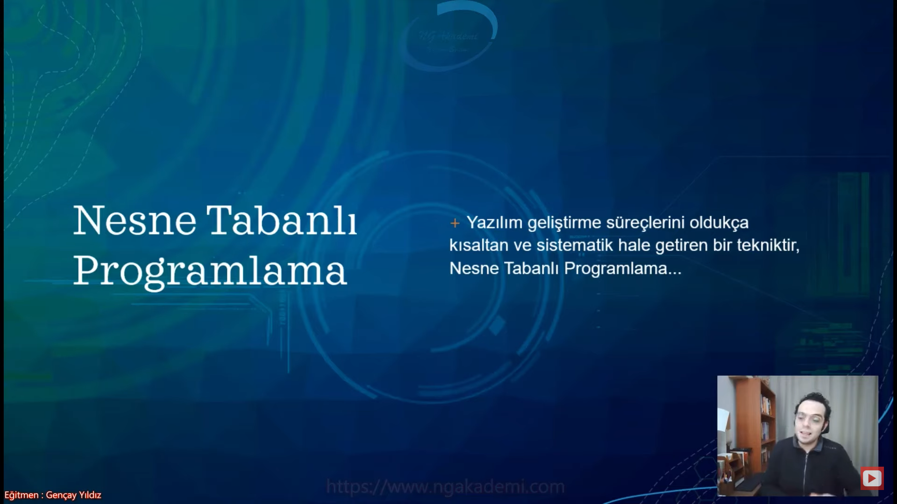
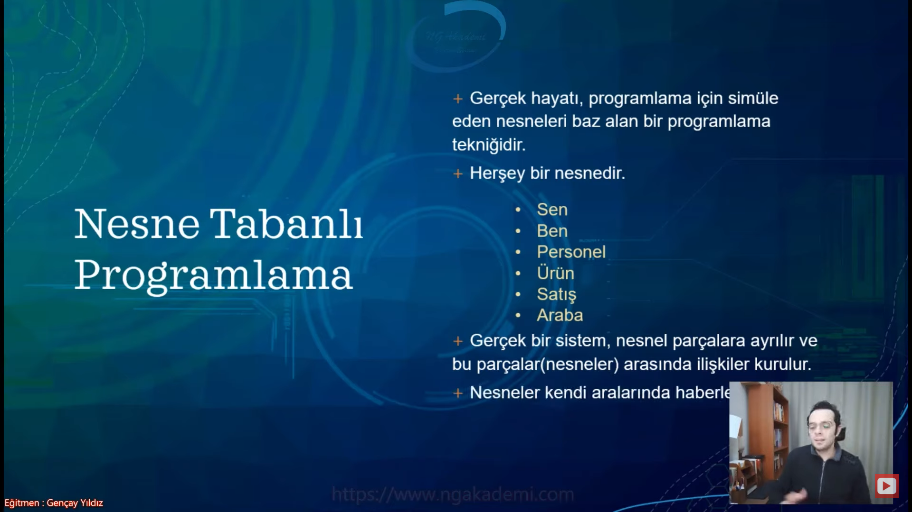
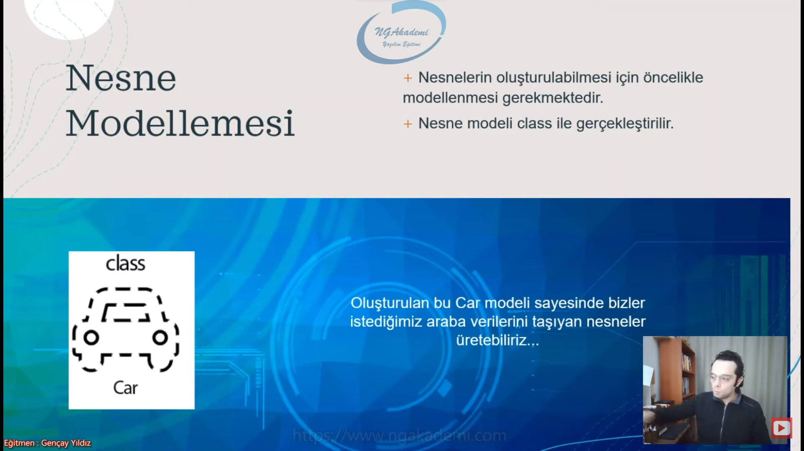

***
# Nesne Tabanlı Programlama #1 - Nesne Anatomisi - Referans Türlü Değişkenler

- Günümüzde nesne tabanlı programlama birçok modern dil tarafından desteklenir haldedir.

- Nesne tabanlı programlama esasında bir programlama dili ya da bir teknolojisi değil bir yaklaşımdır. 

- Hangi mesleği yaparsan yap bırak yazılımı bir kenara örneğin ben duvar ören bir adam olayım. Şimdi duvar örme sanatında bile hangi yaklaşıma göre duvar örüyorsam benim yaklaşımım odur. Yani oradaki yaklaşım işi yapma ahlakındır. İşi yapma/düzenleme işin matematiği hangi formülle yapıldığıdır.

- Yaklaşım bir yapıya/olguya/inşaya yaklaşma biçimimizdir. 

- Yaklaşım dediğimiz olay senin o işi/olguyu hangi felsefeyle ele aldığını anlatır sana.

- Object Oriented dediğimiz olay yazılım geliştirme mesleğinde senin yazılımı geliştirme yaklaşoımını ortaya koyar. Sen diyorsun ki ben yazılım geliştiriyorum fonksiyonel yazılımla geliştiriyorum. Ahmet/Mehmet yaklaşımıyla geliştiriyorum. Nesne tabanlı programlama yaklaşımıyla geliştiriyorum. Bu yaklaşımı bilenler senin geliştirmiş olduğun koda bu yaklaşımın mantığıyla bakıp yorumlayabilirler.

- Nesne tabanlı programlama bir programlama dili değildir. Bir teknoloji değildir. Bir yapı değildir. Bir kütüphane değildir. Bir yaklaşımdır.

- Yazılım geliştirme süreçlerini oldukça kısaltan ve sistematik hale getiren bir tekniktir, Nesne Tabanlı Programlama...

- Sen şimdi bir kod inşa ediyorsun inşa ettiğin koda sanatsal açıdan bakarsan tabi üstünde her şeyi yapabilirsin belki ama eski usüllerle yapılan kod inşa etme süreçleri inanılmaz derecede maliyetli oluyor. Niye? Yani eski usüller/50 yıllık 60 yıllık yazılım geleneğinin ciddi manada ilk başlarında ortaya çıkan büyük bir maliyet vardı. Basit işlemleri yaparken her bir işleme özel diller geliştirilmiş bu diller üzerinde o dillerin kendilerine göre yaklaşımları var. Bir yaklaşım diğer opersayonu tutmuyor. Bir operasyonda inşa etmiş olduğun mantık bambaşka bir operasyonda çok fazla eşlik edemiyor vs. Demişler ki ya kardeşim biz bu kod yazma işlemlerinde kodun yazılım geliştirme sürecini kısaltalım ve sistematik hale getirelim burada ne yapabiliriz? Yaklaşımlar daha farklı yaklaşımlar ortaya koymuşlar Nesne tabanlı programlama da kodu sistematik hale getiren ve kodun inşa sürecini kompleks dillerdeki yaklaşımlardan daha da sistematik daha da kısa hale getiren bir yaklaşımdır.

- Gayet güzel sistematik kod yazmanı sağlayan bir yaklaşımdır.

- Gerçek hayatı, programlama için simüle eden nesneleri baz alan bir programlama tekniğidir.

- Herşey bir nesnedir.
    * Sen
    * Ben
    * Personel
    * Ürün
    * Satış
    * Araba
    * ve diğerleri aklına ne geliyorsa bunların hepsi nesne tabanlı programlamayla yazılan kodun içerisine bir nesne olarak tarif edilebilir. Yani sen nesne tabanlı programlama kodunu inşa ediyorsan herşeyi bir olgu olarak bir nesne olarak göreceksin. Ama herşeyi.

- Gerçek bir sistem, nesnel parçalara ayrılır ve bu parçalar(nesneler) arasında ilişkiler kurulur.

- Nesneler kendi aralarında haberleşebilirler.

- Örneğin ben kendim kod yazacam. Yazacağım kodun içerisinde bir işlem yapmam lazım ve bu işlem kitaplar üzerine olacak değil mi? işte ben programlamanın içerisinde yani kodun içerisinde kitabı nesne olarak temsil edebilecek bir yapı ortaya koyabiliyorum. Gerçek hayattaki kitap olgusunu programlamanın içerisine kitap olarak yerleştirebiliyorum. Peki bunu nasıl yapabiliyorum? Nesne tabanlı programlamadaki nesne kavramıyla. 

- Buradaki nesne kavramı gerçek hayattaki bütün olguları/nesneleri aklına ne geliyorsa her birini yazılımda simüle edebilmeni sağlayan nesne dediğimiz yapılarla programa yazmanı sağlayan bir yaklaşımdır nesne tabanlı programlama.

- Herşey nesneden ibaret diyelim o felsefeden yola çıktığında herşey nesneden ibaretse eğer yazılımda nesne tabanlı programlama bu felsefenin üzerine kurulmuş oturtulmuş bir yaklaşımdır diyebiliriz. Herşey ama herşeyi nesneden ibaret gören bir programlama yaklaşımıdır Object Oriented Programming...

- Nesne tabanlı programlama, programlama dillerinin içerisinde kullanılan bir yaklaşım ve bu yaklaşımdaki temel esas herşeyin bir nesne olarak görülmesi.

## Nesnenin Anatomisi
- Nesnenin anatomisinde merkezde nesne var.

- Nesne tabanlı programlamada en küçük esas parça nesne/obje/object'tir.
    * Farklı isimlerde diyeceğiz instance gibi.

- Nesneler içerisinde veri tutabilecekleri alanlar barındırırlar. Biz bu alanlara field diyeceğiz.

- Nesneler içerisinde field'larda ki değerleri işleyebilmesi için fonksiyonlar mevcuttur. Bu fonksiyonlar ileride göreceğimiz metotlar, propertyler yahut indexer yapılanmaları olabilmektedir.

- Tüm nesneler esasında bir sınıf modellemesinin örneğidir.

- Temelde esasta bir tane nesne var. Bu nesne günlük hayatta olabilecek herhangi bir olguya karşılık gelebilir. Personel olabilir araba tekerleği olabilir ürün olabilir telefon olabilir satış olabilir kişi olabilir adres olabilir şehir olabilir yani herşey olabilir yeter ki sen onu nesne olarak kafanda kodla.

- Şimdi bu nesne dediğimiz temeldeki merkezdeki yapılanmanın belirli parçaları var.

- Senin en küçük temel küçük esas parçan nesne bu nesnenin içerisinde veriler tutabiliyorsun ve bu verileri içerisine alacak alanlar barındırabiliyorsun veri tutabileceğin bu alanlara biz field diyoruz.

- Nesne içerisinde veri tutabilecekleri alanlar barındırıyor. Burada `boolean` `char` herhangi bir türde değer tutabilirsiniz. Nesnenin içinde alanlar var ve bu alanların sınırı yok istediğiniz kadar alan koyabilirsiniz.

- Nesneler içerisinde operasyonel işlemler yapmamızı sağlayan metotlar/function'lar barındırılır.

- Nesnenin içinde bir nesneye dair içinde elemanlar barındıran alanlar var ve bu elemanları/değerleri barındıran alanlardaki değerleri işleyebilmek için içinde kendine göre eylemsel fonksiyonlar var. Bu fonksiyonlar aracılığıyla biz nesnenin içerisindeki değerleri işleyerek sonuçlar üretebiliyor farklı değerler ortaya koyabiliyoruz. Yani nesne tek başına bir ekosisteme sahip. Biz bu funciton'lara ileride metotlar, property'ler, indexer'lar diyeceğiz. Bunların her birinin içerisinde nesnenin içerisindeki o fieldlardaki değerleri tek tek alıp ya da lazım olanları alıp operasyonlara/işlemlere tabi tutabiliyoruz.

- Prosedürel programlamada bir sınıftaki bütüm öğrencilerin yaşlarını tutacaksam eğer ben bu sınıftaki bütün öğrencilere dair tek tek yaşları değişkenlere atıyorum. Şimdi tamam eyvallah peki hangi öğrencinin yaşı nedir sorusunu sorduğumda yapmam gereken işlem ne burada? İşte bu sorunun cevabını prosedürel programlamada vermek çok zor. Niye? İlk önce bir değişken tanımlayacaksın `string` adını yazacaksın öğrencinin ardından bir değişken daha tanımlayacaksın `int` yaşını tutacaksın. Şimdi her yer değişken kaynayacak kodun içinde hangi değişken hangi öğrencinin değerini tutuyor bunu orada ayarlayabilmen arap saçı gibi bir durum.                                    Halbuki sen şunu yapsan; Bir sınıftaki her bir öğrenciyi nesne olarak tanımlasan ve bu öğrencilerin bir adı alanı fieldı olsa birde yaşı field'ı olsa şimdi bana ait olan benim için oluşturulmuş olan nesne içindeki bir field'da benim adımı tutsa bir başka field'da da yaşımı tutsa bu nesne hangi öğrencinin hangi yaşını tuttuğuna dair somut bir bilgi verecektir sana ekstradan bir işlem yapmana gerek yok. Başkasının nesnesini aldığın zaman o nesnedeki adına bakarsın örneğin Hilmi kaç yaşındaymış ona bakarsın ve dersin ki bu Hilmi kesinlikle şu yaştadır dersin. Çünkü karışma ihtimali yok. 

- Kodu nesnel hale getirmek artık daha sistematik kod inşası oluşturmamızı sağlıyor ve yorumlanabilme açısından da olay daha da sistematik hale geliyor.

- OOP dillerinde nesneyi inşa edebilmek için öncelikle bu nesneyi modellememiz gerekiyor. Senin bu nesneyi oluşturabilmen için senin bir `class`/sınıf oluşturman gerekecektir. Nesne = `class` Nesne diyorsak aklına sadece `class` gelecek.

- Nesne `class`ın bir ürünüdür. Başka bişeyin değil. OOP'deki objeyi oluşturmak istiyorsan kesinlikle kod yazarken görmüş olduğunu o `class` yapıları varya kesinlikle onunla çalışmanız lazım. Başka bişeyle nesne oluşturmana müsaade etmez. Bir tek `class`la oluşturabilirsin.

- Bir `class`tan istediğin kadar nesne üretebilirsin. Bir `class`tan birden fazla nesne üreterek modelleme yapabilirsiniz. 
    * Örneğin Türkiye Cumhuriyet'inin TC Kimlik kartımız var değil mi her vatandaşa TC kimlik kartı veriyor. Şimdi bu kartın bir modeli vardır `class` modeli bir de 80 milyonda olan nesnesi vardır. Tabiki de birden fazla nesne üretebiliyoruz.

- Bir tane `class` modelim var. Yani bir objenin/nesnenin/somut yapının nasıl olması gerektiğine dair bir tane tanımlama yapıyorsun modelleme bir tane tanımlamadır ve bu tanımlamadan istediğin kadar n adet sınırsız nesne üretebiliyorsun. Tabiki de buradaki sınırın senin belleğindeki sınıra kadar. Belleğini doldurana kadar nesne üretebiliyorsun.

- Yani nesnenin anatomisi bu şekildedir. İçerisine birden fazla istediğiniz kadar değerleri tutabilecek alanları tanımlayabiliyorsunuz ve bu alanlardaki değerleri işleyebilmek için fonksiyonlar tanımlayabiliyorsunuz oluyor sana bir nesne kendi ekosistemine sahip başlı başına bir yapıdan ibaret ve bu yapı esasında bir `class`ın modellemesi neticesinde üretilebiliyor. `class` oluşturman gerekiyor ardından nesnelerini üretebiliyorsun.

## Nesne Kavramı
- Nesne nesnellik felsefesine dayanan bir kavramdır. Kainattaki her bir şeyi nesne olarak görmek ve o şekilde yorumlamak fikrine dayanır.

-  Nesne, gerçek hayatta elle tutulur, gözle görülür objelerdir. Dolayısıyla programlamada da nesnelerimiz günlük hayattaki nesnelerin muadilidir.

- Gerçek hayattaki herhangi bir olguyu, nesneyi, objeyi, programlama dünyasında tarif ederkende onu bir nesne olarak tarif edecek ve o şekilde modelleyeceğiz.

- Yazılımda diyelim ki sen OOP'de kafayı bozdun artık böyle elin ayağın titriyor her şeyi nesne olarak görüyorsun buradaki psikiyatrist'e gittin adam sana diyecek ki demek ki sen OOP hsatalığına bulaşmışsın. Her gördüğünü nesne olarak algılıyorsun. Böyle algılayacaksın ki koda nesne olarak nasıl yerleştirebileceğinin modellemesini zihinen yapabilesin.

- Örneğin kolonya. Bu kolonyayı ben gerçek hayatta görebiliyorum somut bir nesne programlama yazmış olduğum kodun içerisinde ben nesne tabanlı programlama yaklaşımını klullanıyorsam eğer bu yaklaşımda ben kolonyayı aynen gerçek hayattaki somutluğuyla modellemem lazım. Bunu kodun içerisinde modellerken anatomiyi kullanıyorum. Field yapılanması metotlar propertyler indexer'lar yapılanmaları vs. Bunları kullanarak kodun içerisinde kolonyayı modelliyorum. Daha sonra o model üzerinden kodun içerisinde üretmiş olduğum nesneler kolonyanın karşılığı oluyor. Yani koddaki o dünyadaki/simülasyondaki bunun karşılığı olan nesneler olmuş oluyor diyebiliriz.

- Nesne tabanlı programlama bize yazılım simülasyonunda sana gerçek hayatın ta kendisini/karşılığını sunuyor.

## Nesne Modellemesi
- Nesnelerin oluşturulabilmesi için öncelikle modellenmesi gerekmektedir.

- Nesne modeli `class` ile gerçekleştirilir.

- Oluşturulan bu Car modeli sayesinde bizler istediğimiz araba verilerini taşıyan nesneler üretebiliriz...

- Nesnenin ilk önce kullanılabilmesi için yani kodun içerisinde senin bir kitabı bir ürünü bir personeli bir kolonyayı herhangi bir şeyi nesne olarak oluşturabilmen için öncelikle o nesneyi kodun içerisinde modellemen lazım. Modelledikten sonra o modelden nesne oluşturabiliyorsun.

- Elimizde bir araba modeli olsun. Şimdi ben kodun içerisinde arabalarla ilgili işlem yapacam. Araba nesnelerine ihtiyacım var. İlk önce yapmam gereken kodun içerisinde Araba `class`ı oluşturmak. Bu `class` ta bir arabada olabilecek bütün ortak noktaları tanımlamak işte bu ortak noktalar tanımlanmış bu `class`la bir nesne modeli ortaya koyuyorum. Artık ben ihtiyacım doğrultusunda bu arabadan istediğim herhangi bir araba nesnesi üretip ona değer atfedebiliyorum.

- Bu araba modelinden ister Audi üret ister Volvo/Mercedes/Hacı Murat yani istediğin hepsini üretebilirsin. Buradaki nesnelerin her biri bir Car nesnesidir. Amma velakin her biri birbirinden farklı nesnedir. günlük hayatta da böyle değil mi ? Mercedes'i görüyorsun araba diyorsun Tofaşı görüyorsun araba diyorsun. Ama Mercedes Mercedes'dir Tofaştan farklıdır. Tofaş Tofaştır Mercedes'ten farklıdır. Ama her ikisi de yine Arabadır. Yani günlük hayatta devletin ya da üst otoritelerin gözünde Araba modeli vardır. Sana bir ruhsat verir der ki bu arabanın markası ne? Her bir arabada marka var değil mi oraya yazar. Km alanı vardır. Araba dediğimiz yapılanmalarda günlük hayatta ortak değerler vardır. Ortak terminolojiyle konuşuruz.

- Değişkenlikler nesneler üzerinde olur ama ortak tanımlama yani o nesnenin modeli her daim üst model olarak kalacaktır.

- Biz kodun içerisine bir tane `class` yani Car isminde bir `class` oluşturuyoruz. O Car'dan `class`tan oluşturulan nesneler bizim için birbirinden bağımsız birbirleriyle haberleşebilme yeteneğine sahip sadece o olguyu tarif eden nesneler olmuş olur.

- Devletimizde TC Kimlik kartı dediğimiz bir olay var. Şimdi bu TC Kimlik kartının kendine has bir modeli vardır. Diyor ki ya kardeşim bu kartın üzerinde TC Kimlik No,Fotoğraf,Doğum Tarihin vs. olacak. Yani burada belirli değerlerin olacak bu modelde. Ardından bir tane modele karşılık 80 milyondaki her bir bireye karşılık yeni bir kimlik üretiyor ve her bireyin değerleri adı soyadı kendine göre o modelde işleniyor. Her kişinin cebinde bir kimlik kartı vardır. Koordinat olarakta piksel olarakta  TC Kimlik No,Ad,Soyad her kişide aynı yerdedir. Çünkü model aynı ortak modelden benim nesnem bana ait üretilen nesne bu iken ortak modelden sana ait üretilen nesne senin kimlik kartın. Nesne tabanlı programlamanın günlük hayattaki karşılığı. Biz bunu yazılımda da yapıyoruz. Günlük hayatta bunu Devlet kullanıyor şirketler kullanıyor sen kullanıyorsun herkes kullanıyor. Bırakta yazılımda kullansın.

## Nesneler Hangi Türdendir?
- Nesneler Referans türlü değerlerdir...

- Yazılımda tür dediğimiz yapılar var. Şimdiye kadar değer türlü yapılanmaları biliyorduk hasbelkaderde referans türlü değerleri biliyorduk. Şimdi değer türlü değişkenlerimiz var referans türlü değişkenlerimiz var.

- Nesneler Referans türlü değerlerdir. Nesneleri tutan değişkenler referans türlü değişkenlerdir.

## Referans Türlü Değerler Nelerdir? Değer Türlü Değerlerle Mukayese
- RAM'de STACK ve HEAP alanları vardır.

- STACK 
    * Değer türlü değişkenler ve değerleri tutulur. 
    * Aynı şekilde referanslarda burada tutulur.

- HEAP
    * Sadece nesneler tutulur.

- Kod yazarken STACK'teki bu değişkenlere isimleri üzerinden erişebilmekteyiz. Örneğin; a dediğimizde 5 değerini elde edebilmekteyiz.

- Normal şartlarda biz developer'ların STACK'e direkt erişim hakkı vardır. lakin HEAP'e erişim hakkımız bulunmamaktadır. 

- HEAP'te ki nesnelere biz direkt erişemesekte STACK'teki referanslar erişebilmektedir. Bizde, STACK'te HEAP'teki nesneleri işaret eden referanslar tanımlarız. Haliyle STACK'te ki referans erişebilir ve dolaylı olarak o referans aracılığıyla HEAP'te ki nesneye erişmiş oluruz.

- Nesne içerisinde bir veya birden daha fazla değer barındıran bir değerler bütünü. Nesne ben Gençay olarak benim adım olan Gençay nesne değil bir değer. Ama adım olan Gençay soyadım Yıldız işte yaşım/boyum/kilom/burcum/ten rengim/diş sayım/göz rengim/görme oranım bütün özelliklerimle ortaya çıkan ben bir nesneyim. Bu değerlerimi barındıran örneğin yaşım bendeki bir field denilen alanda tutuluyor. Yaş bir değerken esasında bir değer türlüyken komple bunlardan meydana gelen ben bir nesneyim. HEAP'te tutuluyorum.
 
- Developer kodun içinde bellekteki STACK'e/STACK'teki değişkenlere erişebilir. Ama HEAP'e direkt erişemeyiz. Yani ben STACK'ten şunu getir diyebiliyorum çünkü erişme hakkına sahibim ama HEAP'e erişme hakkına sahip olmadığımdan dolayı HEAP'teki herhangi nesneye gel gardaşım diyemiyorum mesela.

- HEAP'teki nesnelere biz direkt erişemiyoruz. Lakin ben STACK'e erişebiliyorum. STACK'te HEAP'e erişebiliyor. STACK'te tanımlamış olduğumuz referanslar/değişkenler bunlar istediğimiz an HEAP'e erişebilmektedirler. Dolayısıyla biz STACK'te HEAP'teki nesneleri işaret eden referanslar tanımlıyoruz. Haliyle STACK'teki referanslara ben erişiyorum o referansta kendisi zaten HEAP'teki nesneye eriştiği için dolaylı yoldan biz HEAP'teki herhangi bir nesneye işaretlemiş/erişmiş oluyoruz.

- Uzakta olan birşey referans edilir.

- Developer olarak bana lazım olan nesnelere ben gidipte direkt HEAP'ten erişemiyorum. STACK'teki bu nesnelerin referans gösteren değişkenler üzerinden erişiyorum.

## Sınıf(Class) Kavramı
- Sınıf Object Oriented'ın temelidir. 
 
- Object Oriented'da esas merkezde olan şey nesnedir. Merkezde olan bu nesnenin fıtratı `class`tır. 

- `class`la biz nesneyi oluşturuyoruz. Yani sen `class`la bir nesne modeli oluşturuyorsun ardından onunla ürettiğin şey nesne oluyor.

