***
# Nesne Tabanlı Programlama #20 - Polimorfizm Nedir? Derinlemesine İnceleme - 1. Bölüm
- Bir nesnenin birden fazla türle/referansla işaretlenebilme mevzusu.

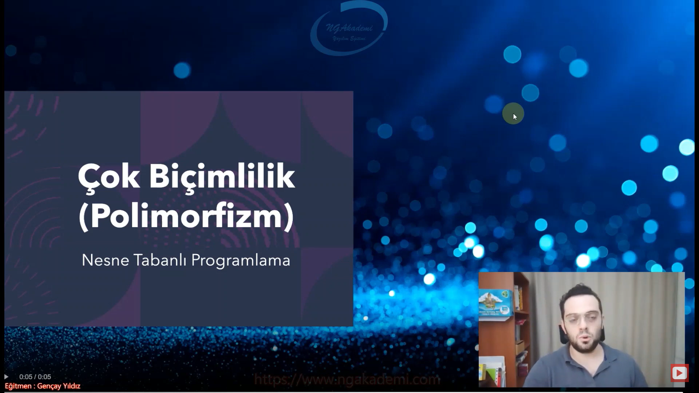

## Polimorfizm Nedir?
- Polimorfizm esasında kalıtım gibi bir biyolojik terimdir.

- Polimorfizm biyolojide iki veya daha fazla farklı fenotipin aynı tür popülasyonunda bulunmasıdır.

- Nesne tabanlı programlama dediğimiz yapılanma özünde diğer disiplenlerden özellikle biyoloji'den terminolojik açıdan beslenen ve oradan mantıksal belirli aktarımlarda/davranışlarda bulunan yani biyolojiyi baz biyolojik mantığı baz alan bir yaklaşımdır.

- Polimorfizm'de bir biyolojik terimdir özünde.

- Polimorfizm yazılımda iki veya daha fazla farklı nesnenin aynı tür `class`lardan/referanslardan referans almasıdır/işaretlenebilmesidir.

- Çok biçimlilik demek bir olguyu br nesneyi birden fazla tarifle/formla tarif edebilmektir. Ben Musa'yım bir yandan insanım bende bile çok biçimlilik var.

- Mümkün mertebe olabilecek/olmuş olan hani doğrulanabilir bir biçimlilik söz konusu olması gerekiyor. Çok biçimliliğin olabilmesi için o forma uygun fıtratına uygun bir form yakıştırmanız gerekiyor.

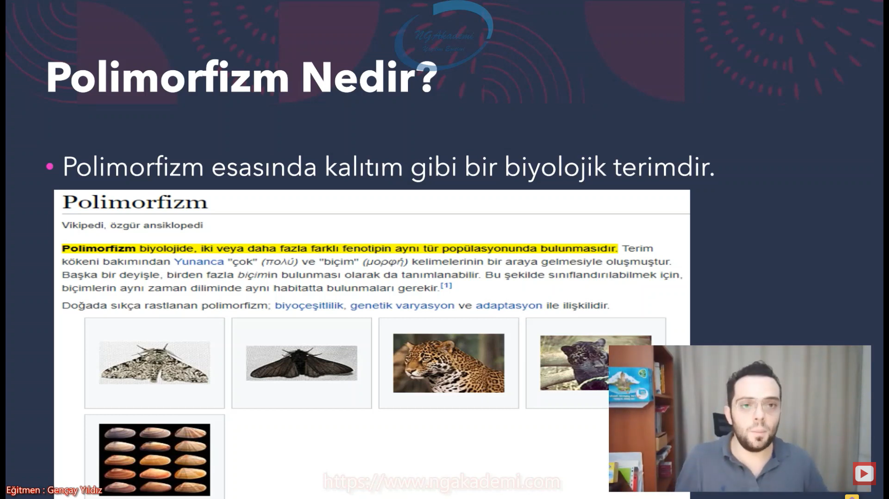

- OOP'de ise polimorfizm'e:
  * İki ya da daha fazla nesnenin aynı tür sınıf tarafından karşılanabilmesidir/referans edilebilmesidir.
- diyebiliriz.

- Bir başka deyişle:
  * Bir nesne birden fazla farklı türdeki referans tarafından işaretlenebilmesi polimorfizm'dir.

- Yazılımsal açıdan elimde bir fare nesnesi olsun bu fare nesnesi bir yandan da ürün sınıfından kalıtım alıyorsa eğer yani elimde bir fare `class`ı var bu fare `class`ı ürün sınıfından da kalıtım alıyorsa eğer bu fare bir yandan da üründür. Farenin fare olması bu 1. biçimi. Bir yandan da ürün olmasından dolayı yani bu fare nesnesi hem fare referansı tarafından hem de ürün referansı tarafından referans edilebilmesi durumu ki edilebilir buna biz polimorfizm diyoruz.

- Bir nesne kalıtımsal açıdan ataları neyse atalarının referansıyla işaretlenebilir.

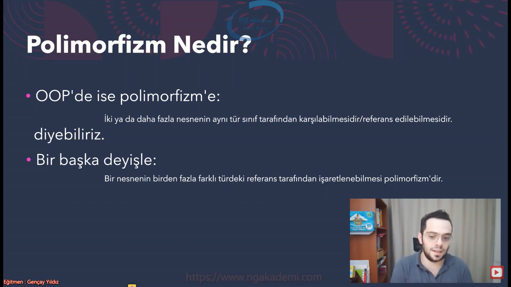

- Polimorfizm bir nesnenin kalıtımsal olarak ilişkisi olan diğer nesnelerin referanslarıyla işaretlenebilmesini sağlar.

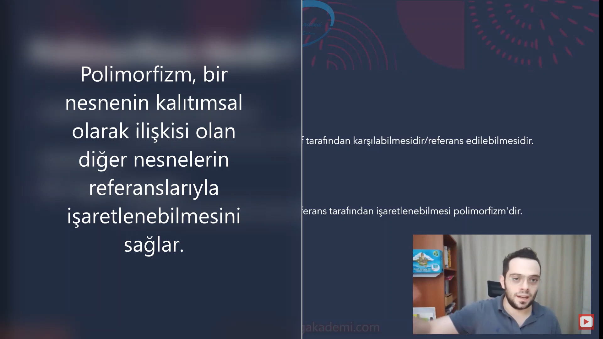
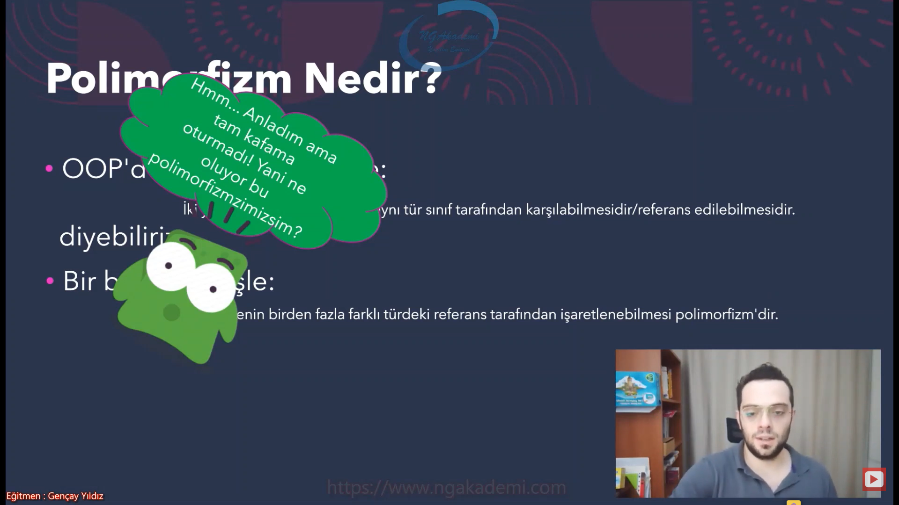

- Polimorfizm, OOP tasarımlarında geliştirilen koda daha manevrasal bir şekilde nitelik kazandıran ve yaklaşım sergilememizi sağlayan bir özelliktir.

- Polimorfizm, programlamada ki temel prensip olan 'Sol/Sağ Prensibi'ni; aşıp eldeki nesnenin birden fazla referansla işaretlenebilmesini sağlar.

- Elinde bir nesnem var bu nesneyi biz sadece o nesnenin türünden herhangi bir referansla işaretleyebiliyorduk.

- Polimorfizmin dışında elindeki herhangi bir nesneyi sadece o nesnenin referansıyla işaretleyebiliyorsun. Amma velakin polimorfizm sayesinde elindeki bir nesneyi o nesnenin türünün dışındaki referanslarla da işaretleyebilirsin. İşte bu nesneye farklı türlerdeki referanslarla işaretleyebilme niteliğini kazandıran yapılanmaya biz polimorfizm diyoruz.

- Bir nesnenin birden fazla referansla işaretlenmesi o nesnenin birden fazla türün davranışını sergilemesini/gösterebilmesini sağlar.

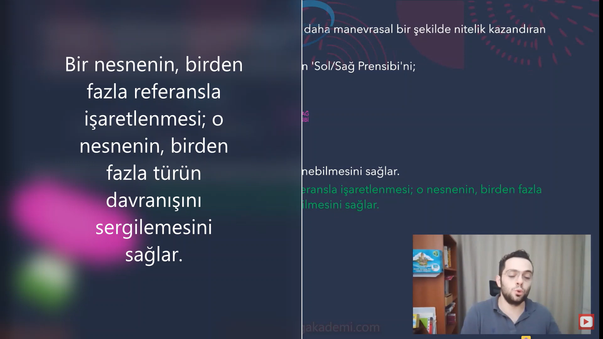

- Bir nesneyi/objeyi birden fazla farklı türle işaretleyebiliyorsanız eğer o nesnenin o türlerin davranışını sergileyebilmesini sağlıyorsunuz.

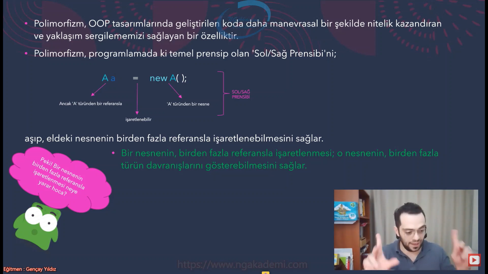


## Polimorfizm Felsefesi - 1


- Bir şeyi sen başka birşeyle tarif edebiliyorsan bu çok biçimliliktir.


- Yani bir olguyu çoklu(poli) form(morfizmos) olarak tarif edebilmektir.

- Bir şey/olgu/yapı/nesne/varlık birden fazla form olarak tarif edilebiliyorsa bu çok biçimliliktir.


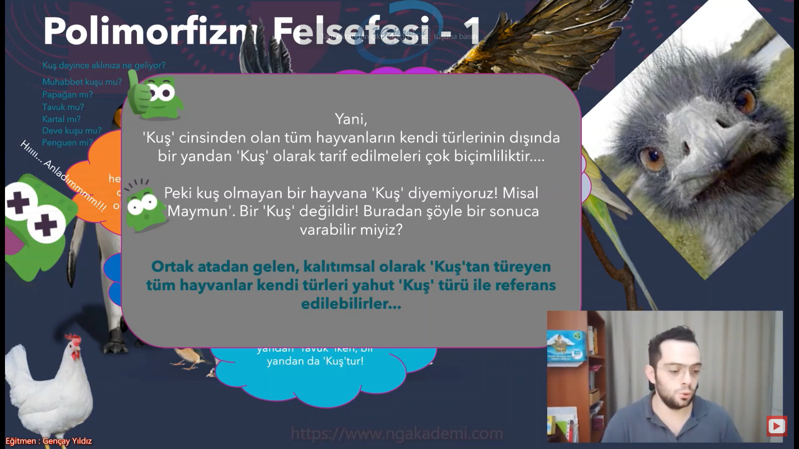

- Buradan da şunu anlıyoruz ki, yazılımsal açıdan çok biçimliliğin söz konusu olabilmesi için teknik olarak 'Kalıtım' olması gerekmektedir...

- Bir nesnenin farklı bir `class` referansıyla işaretlenebilmesi için o `class`tan türüyor olması gerekir. Aksi taktirde polimorfizm kuralları geçerli olmayacaktır.

- Bir nesnenin polimorfizm kuralları çerçevesinde olabilmesi için yani başka nesnelerle polimorfizm çok bir şekilde biçimlendirilebilmesi form olarak tarif edilebilmesi için o sınıflarla kalıtımsal ilişkiye girmesi gerekecektir.

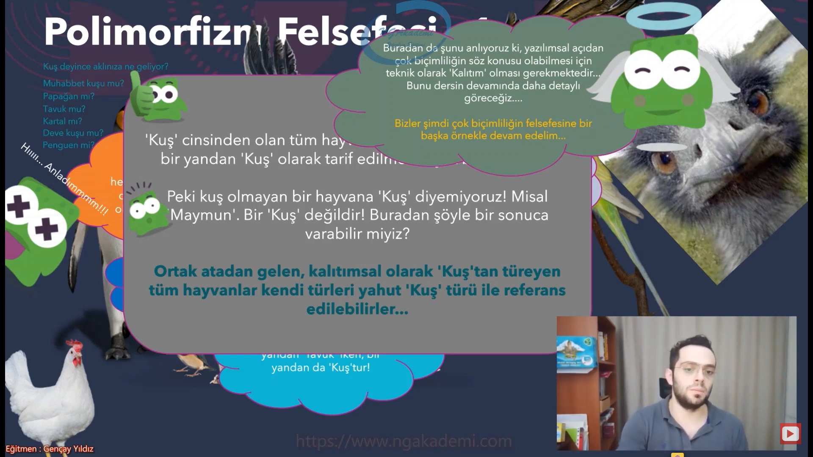

## Polimorfizm Felsefesi - 2
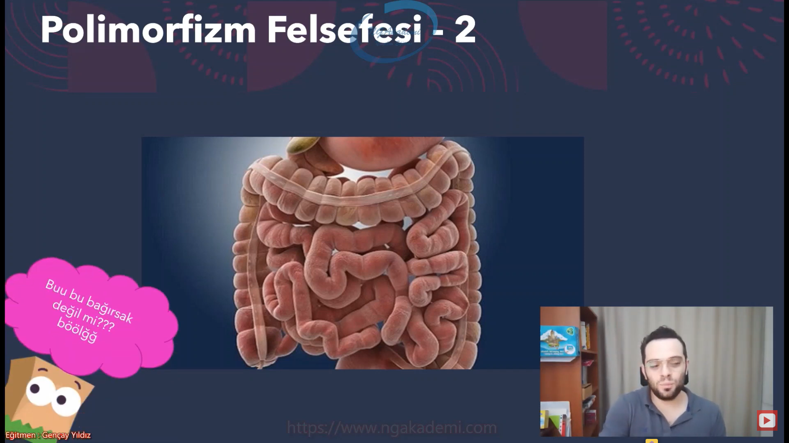
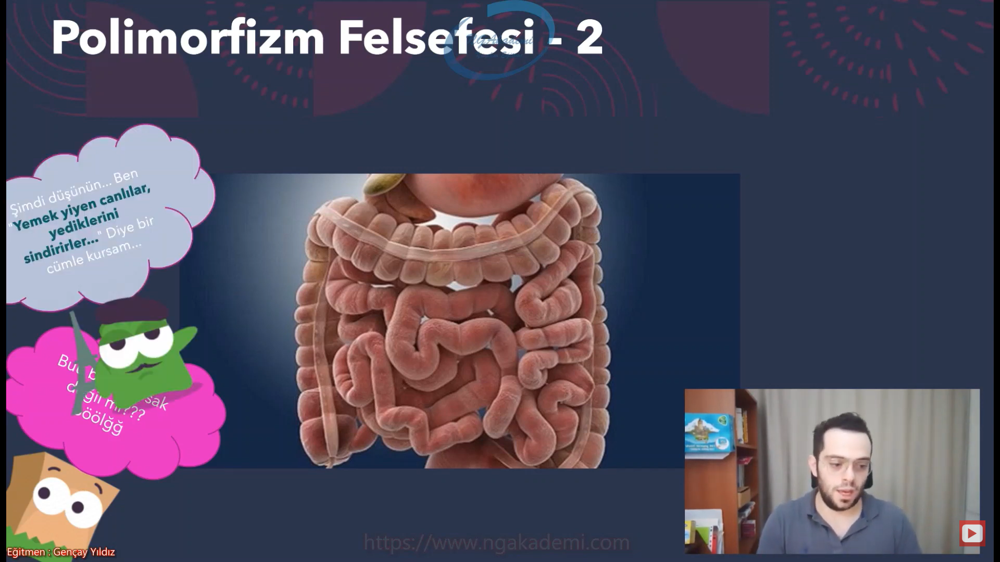

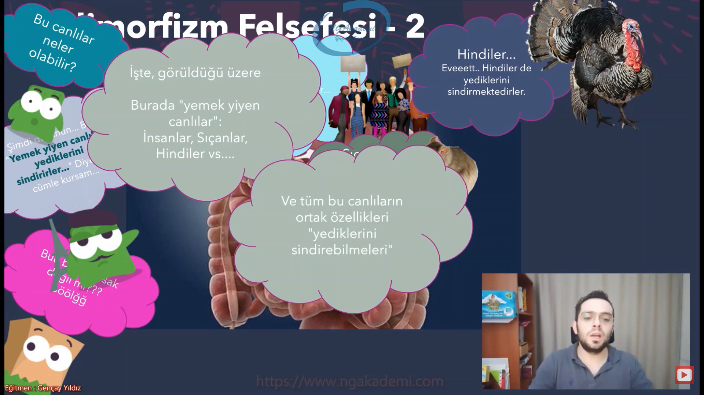


## Polimorfizm Felsefesi - 3
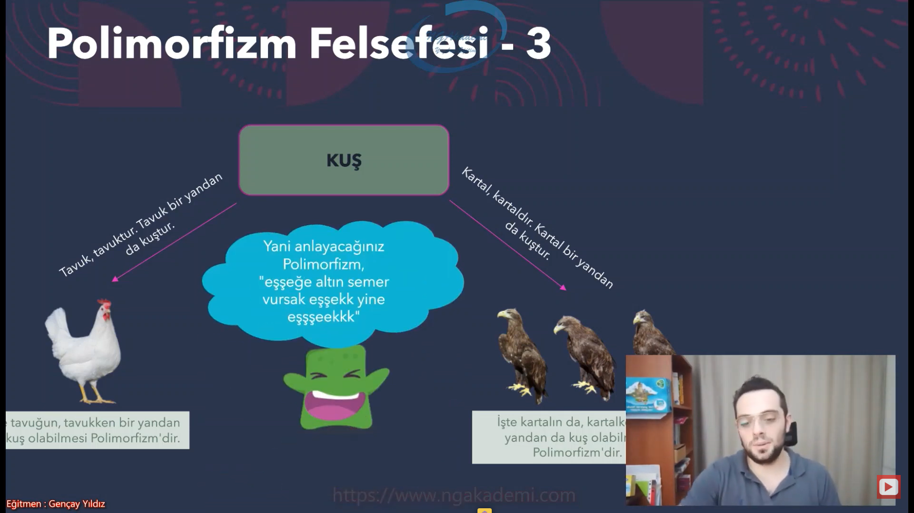


## Peki Programlamada Polimorfizm Neden Nerede Kullanılmaktadır?
- Programlama da polimorfizm esasında taa en temelden beri kullanılmaktadır.

- Misal olarak;
  * Elimizdeki herhangi bir `byte` türündeki veriyi ister `byte` istersekte `byte`tan büyük olan herhangi bir türde tutmak çok biçimliliktir.

- Ya da `object` türünün herhangi bir türdeki değeri alabilmesi yahut bir başka deyişle `object` türüne herhangi bir türdeki veriyi atayabilmek polimorfizm'dir.

- Bütün sınıflar `object`ten türediğinden dolayı doğal olarak zaten bir polimorfizm söz konusu olacaktır.

- Bütün sınıflar `object`ten türüyorsa eğer `object` bize bu sınıfları referans edebilme niteliği kazandırıyor yani bir polimorfizm var.

- `object` referansıyla işaretleyebilmemizin altında yatan sebep kalıtımın bize getirmiş olduğu polimorfizm özelliğidir.


- `interface` `abstract class`lar da kullanırız. İleride design patternların %99'u polimorfizm üzerine kuruludur.


- Normal şartlarda bir nesne kendi sınıfının referansı dışında başka bir sınıfın referansıyla İŞARETLENEMEZ!

- Bir nesnenin başka bir nesne ile işaretlenebilmesi/referans edilebilmesi için kesinlikle arada kalıtımsal bir ilişki olması gerekmektedir.

- Yani bir başka deyişle, Nesne Tabanlı Programlama'da Polimorfizm uygulamak istiyorsanız türler arasında kalıtım uygulanmış olmalıdır.

- Ya da bam başka bir deyişle; Nesne Tabanlı Programlama'da Polimorfizm aralarında kalıtımsal ilişki olan sınıflarda uygulanabilir. Aksisi mümkün değildir!

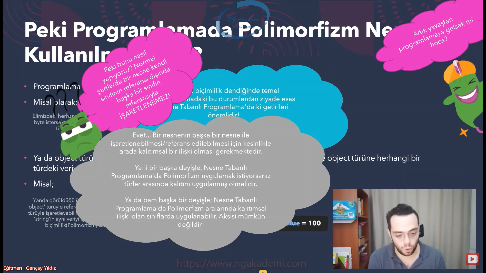

- Bir nesneyi başka bir türden referansla işaretleyemezsin. İşte böyle bir durumun gerçekleşmesi için polimorfizmin olması gerekmektedir. Polimorfizm'in olabilmesi içinde bu `class`lar arasında kalıtımsal ilişkinin olması lazım. Buradaki referans mantığı ise şöyledir;
  * Ben Cumhurbaşkanını referans edemem ama Cumhurbaşkanı beni referans edebilir. Çünkü o benden daha üstte daha atalarda/büyüğümüz öyle düşün. Bu durumda referans eden referans ettiği nesnenin atası olmalıdır.

```C#
MyClass2 m = new MyClass();

public class MyClass : MyClass2
{
    
}
public class MyClass2 
{
    
}
```

## Polimorfizm Kalıtım İlişkisi
- Bir nesneyi kendi türünün dışındaki bir tür ile/referansla işaretleyebilmek için kesinlikle ilgili nesne, o türden türemiş olması gerekmektedir.

- Bir nesne ancak ve ancak kendisinden olan bir türle referans edilebilir/işaretlenebilir. Artık tanımı genişletiyoruz ya da atalarından olan bir referansla da işaretlenebilir.

- 
- 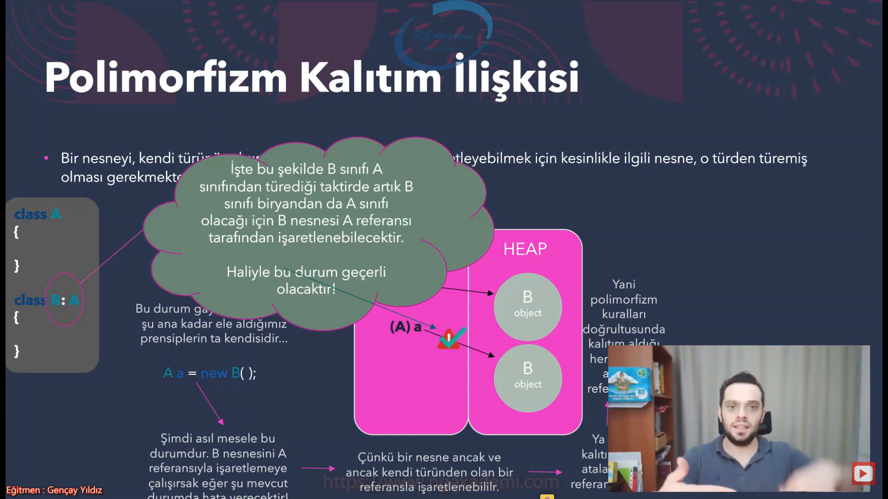
- 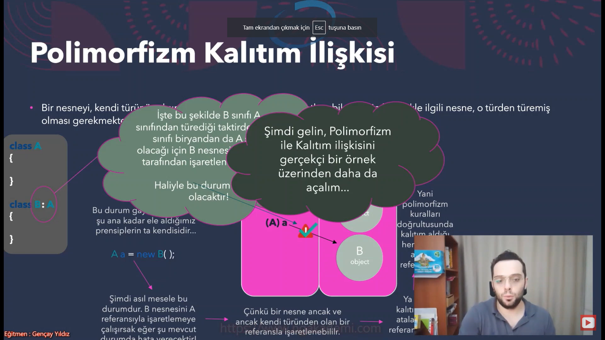

## Pratik Örnek
- Bir `class` sade ve sadece tek bir `class`tan türeyebilir. Yatay düzlemde türeme yoktur. Dikey türeme yapabilirsiniz.

- Birden fazla türle farklı bir türdeki nesneyi referans etmeye çok biçimlilik/polimorfizm diyoruz.

```C#
A a = new B();
B b = new B();
C c = new B();

class A : C
{

}


class B : A
{

}
class C 
{

}

```

## Teorik Örnek


```C#
Erkek e = new Erkek();
Insan i = new Erkek();
Kadın k = new Kadın();
Insan i2 = new Kadın();

class Insan
{

}
class Erkek : Insan
{

}
class Kadın : Insan
{

}
```

## Peki, Polimorfizm Bir Nesne Yönetiminde Neye Yarar?
- Daha önceden de söylediğimiz gibi, Bir nesnenin birden fazla referansla işaretlenmesi; o nesnenin, birden fazla türün davranışlarını gösterebilmesini sağlar.

- Referansın sana erişebileceğin sınırları/davranışları getiriyor. Sınırlandırarak filtreleyerek getiriyor.

- Bu şekilde bir eleme/filtreleme sadece davranışları sergileyebilme getiren bu polimorfizm yapılanması elbetteki bir işe/naneye yaramaktadır. İşte bu naneler bize ileride sağlam tasarımlar ortaya koymamızı sağlayacak.

- Polimorfizm bir nesnenin kendi türünün dışında bir veya birden fazla türle işaretlenebilmesidir/referans edilebilmesidir. Ve bunun bize getirmiş olduğu farklı davranışları sergileyebilme niteliğidir.


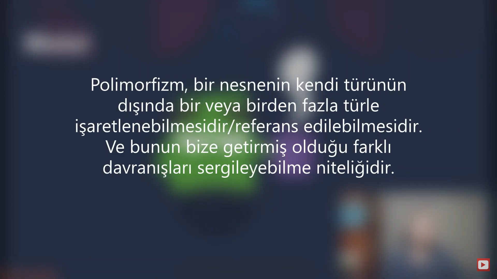

```C#
C c = new C();
B b = new C();
A a = new C();

class A
{
    public void X() { }
}


class B : A
{
    public void Y() { }
}
class C : B
{
    public void Z() { }
}
```

## C# Examples
```C#
namespace polimorfizm;
class Program
{
    static void Main(string[] args)
    {
        MyClass2 m = new MyClass();

        // A a = new B();
        // B b = new B();
        // C c = new B();

        Erkek e = new Erkek();
        Insan i = new Erkek();

        Kadın k = new Kadın();
        Insan i2 = new Kadın();


        C c = new C();
        B b = new C();
        A a = new C();
        
        


    }
}
#region Örnek 1
public class MyClass : MyClass2
{

}
public class MyClass2
{

}
#endregion

#region Örnek 2
// class A : C
// {

// }


// class B : A
// {

// }
// class C
// {

// }
#endregion

#region Örnek 3
class Insan
{

}
class Erkek : Insan
{

}
class Kadın : Insan
{

}
#endregion

#region Örnek 4
class A
{
    public void X() { }
}


class B : A
{
    public void Y() { }
}
class C : B
{
    public void Z() { }
}
#endregion
```

***
# Nesne Tabanlı Programlama #21 - Polimorfizm Türleri ve Tür Dönüşüm Operatörleri - 2. Bölüm
- Bir nesnenin birden fazla türdeki referans tarafından işaretlenebilmesine polimorfizm diyoruz.

- Polimorfizm OOP'nin neredeyse temelini teşkil etmektedir. Polimorfizmi bilmeden OOP kodu yazmak neredeyse mümkün değil hele hele ileride göreceğiz design pattern yapılanmaları vs hep zaten bu yaklaşımlar/felsefeler üzerine kurulu.


## Polimorfizm Türleri
- Statik Polimorfizm

- Dinamik Polimorfizm

- Polimorfizm'de iş sahasında dillendirilmeyen iki tür vardır.
  * Statik Polimorfizm
  * Dinamik Polimorfizm

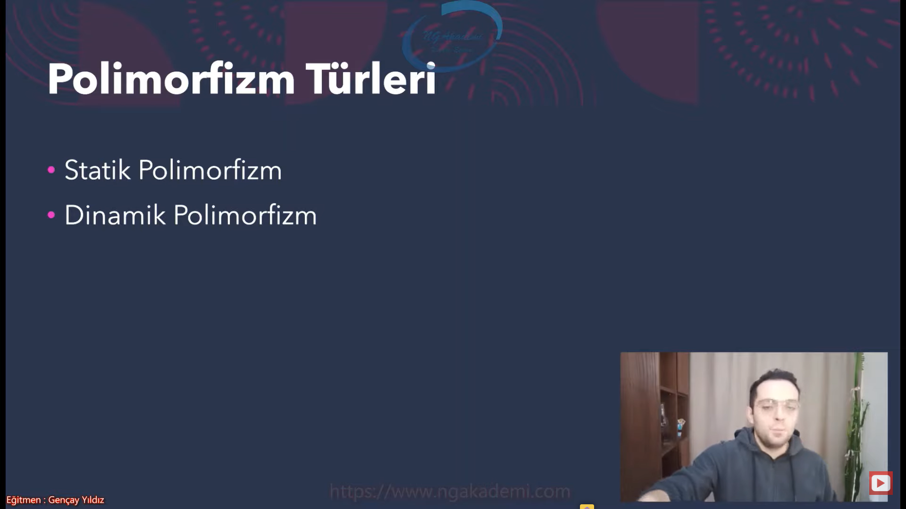

## Polimorfizm Türleri - Static Polimorfizm
- Static, ileride göreceğimiz bir kavramdır.

- Şimdilik sadece Polimorfizm çerçevesinde Static Polimorfizm'i değerlendireceğiz.

- Static polimorfizm; derleme zamanında sergilenen polimorfizm'dir. Hangi fonksiyonun çağrılacağına derleme zamanında karar verilir.

- C#'da static polimorfizm deyince aklımıza `Metot Overloading` terimi gelmelidir.

- `Metot Overloading`; aynı isimde birbirinden farklı imzalara sahip olan metotların tanımlanmasıdır. Ya da başka deyişle bir isme birden fazla farklı türde metot yüklemektir. Haliyle burada bir metodun birden fazla formunun olması `polimorfizm'ken`, bunlardan kullanılacak olanın derleme zamanında bilinmesi `statik polimorfizm` olarak nitelendirilmektedir.

- Bir sınıfta aynı isimde birden fazla metot tanımlamaya metot overloading diyoruz.

- Metotlarda birden fazla form söz konusu olduğunda buna da polimorfizm denmektedir ve hangi metodun kullanılacağı ancak ve ancak derleme zamanında bilinebileceğinden dolayı buna statik polimorfiz deniliyor.

- Overload edilmiş metotlardan derleme zamanında kullanılması durumuna biz statik polimorfizm diyoruz.

- Metot overloading durumundaki overload edilmiş metotlardan hangisinin kullanılacağının derleme sürecinde bilinebilmesine `statik polimorfizm` deriz.

```C#
Matematik m = new Matematik();
m.Topla(40,50);

class Matematik
{
    public long Topla(int s1, int s2)
        => s1 + s2;

    public long Topla(int s1, int s2, int s3)
        => s1 + s2 + s3;

    public long Topla(int s1, int s2, int s3, int s4)
        => s1 + s2 + s3 + s4;

}
```

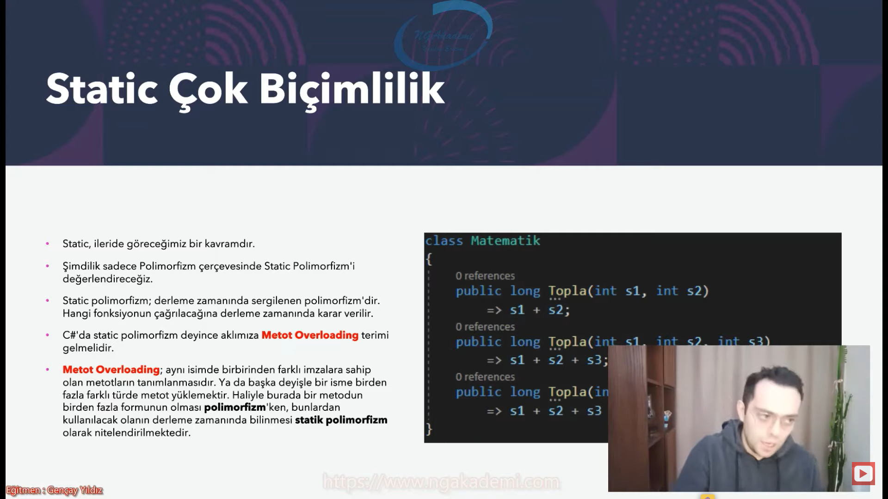

## Polimorfizm Türleri - Dynamic Polimorfizm
- Dinamik polimorfizm; çalışma zamanında sergilenen polimorfizm'dir. Yani hangi fonksiyonun çalışacağına run time'da karar verilir.

- C#'da dinamik polimorfizm deyince akla `Metot Override` gelmektedir.

- `Metot Override`; base class'ta virtual olarak işaretlenmiş metotların derived class'ta override edilerek ezilmesi/yeniden yazılması işlemidir. Haliyle burada aynı isimde birden fazla forma sahip fonksiyonun olması `polimorfizm`'ken, bunlardan hangisinin kullanılacağının çalışma zamanında bilinmesi `dinamik polimorfizm` olarak nitelendirilmektedir

- Statik anlam olarak sabite karşılık gelir yani belli ne olduğu belli ama dinamik değişkenlik gösterebilir yani çalışma zamanı çalışma zamanında her an herşey olabilir önceden belli değil o anda verilen kararlar bir sonraki verilenler önceki verilenlerle benzerlik göstermeyebilir haliyle buna dinamik çok biçimlilik deniliyor.

- Eğer ki derleme zamanında bir işlem yapıyorsan polimorfizm açısından bu statik çok biçimlilikken runtime'da yani çalışma zamanında sergilenen polimorfizm'e dinamik çok biçimlilik deniliyor. 

- Statik polimorfizmde hangi fonksiyonun çalışacağına derleme zamanında karar veriyoruz. Ama dinamik çok biçimlilikte hangi fonksiyonun çalışacağına runtime'da yani o anda çalışma sürecinde karar veriliyor.

- Yukarıdan base `class`tan gelen metotları eziyorsan eğer o ezme durumları runtime'da gerçekleştiriliyor.

- Base `class`larda tanımlanmış olan herhangi bir `virtual` yani sanal yapılanma derived `class`ta ezilip ezilmediğinin durumu çalışma zamanında bakılıyor.

- Base `class`lardaki sanal bir yapılanmanın derived `class`larda ezilip ezilmediğini yani `override` edilip edilmediğinin kararı runtime'da veriliyor işte biz buna dinamik çok biçimlilik deriz.

```C#
Arac a = new Arac();
a.Calistir();
Taksi t = new Taksi();
t.Calistir();
Taksi t2 = new Taksi();
t2.Calistir();

public class Arac
{
    public virtual void Calistir()
        => System.Console.WriteLine("Araç Çalıştı...");
}
public class Taksi : Arac
{
    public override void Calistir()
        => System.Console.WriteLine("Taksi Çalıştı...");
}
```


## Polimorfizm Durumlarında Tür Dönüşümleri
- Polimorfizm OOP'de bir nesnenin kalıtımsal açıdan ataları olan referanslar tarafından işaretlenebilmesidir. Haliyle ilgili nesne, by ataları olan referans türlerine göre dönüştürülebilmektedir.

- Dikkat edersen eğer Polimorfizm durumlarında kalıtımsal açıdan üst bir referans ile işaretlenebilmiş herhangi bir nesneyi kendi türünden işaretleyebilmek için Cast operatörünü kullanarak object türüne özel olan UnBoxing'e benzer bir hamlede bulunmuş oluyoruz... Buradan anlıyoruz ki, object türünde gerçekleştirilen UnBoxing durumu esasında object türü ile gerçekleştirilebilen Polimorfizm'in bir sonucudur...

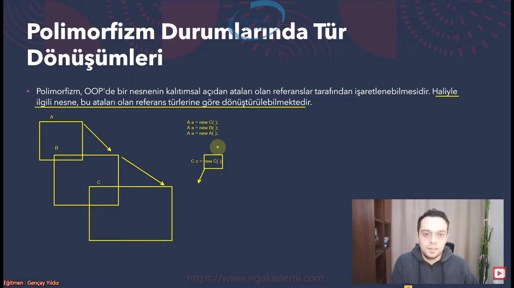


- Birden fazla farklı türdeki nesneleri tek bir referans üzerinden işaratleyebiliyorduk ya da bir nesneyi birden fazla referansla da işaretleyebiliyorduk.

- Alt türler üst türün referansını karşılayamaz!!

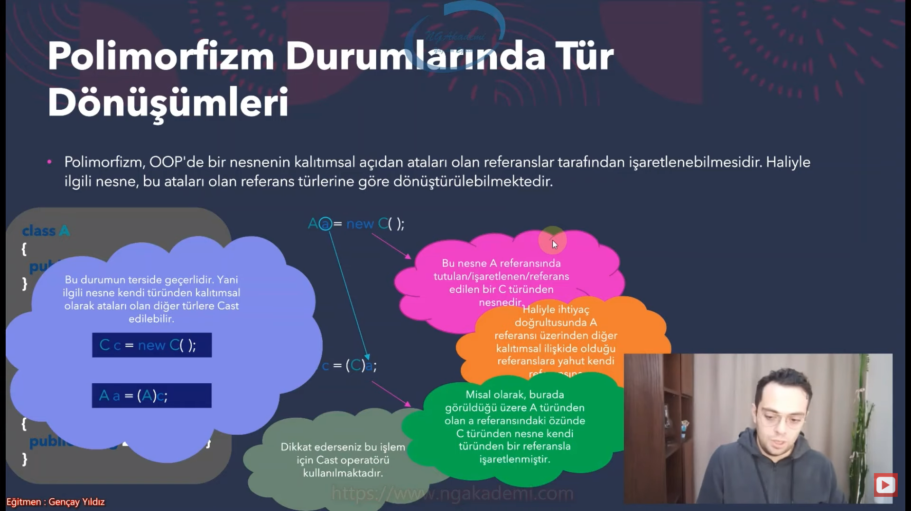

- `object` zaten bir `class` değil mi bir nesne adı üzerinde obje haliyle bu obje durumunda da tür dönüşümü yaparken özünde biz zaten Polimorfizm'de buradaki yapılanmayı kullanıyoruz. Eğer ki sen bunu `object`te yapıyorsan buna boxing unboxing diyoruz.

- `object` bütün türlerin atası olduğundan dolayı altındaki herhangi bir türü kendi özünde elde edebilmek için cast operatörünü kullanıyorduk. Haliyle polimorfizm'de de bu kural geçerlidir.

## object Türündeki Boxing/Unboxing Davranışının Polimorfizm Açısından Değerlendirmesi
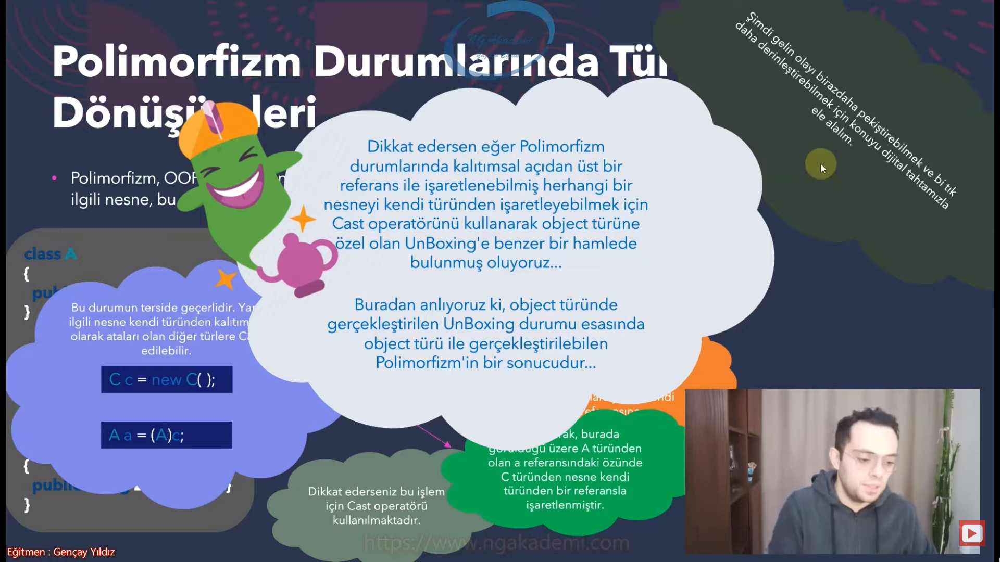

- `object` C#'ta bütün türlerin atasıdır. Bütün türler otomatik olarak `object` türüne girer. `object` .Net'te temel ademi bir sınıftır.

- `object`te bir değer atama işlemine boxing derken `object`in içerisinden o değeri kendi türünde elde etme operasyonuna unboxing diyorduk.

- Boxing unboxing dediğimiz kavram özünde nesne tabanlı programlamadaki nesnelerin davranışıyla alakalı bir durum ve bu polimorfizm olmadığı sürece bir anlam ifade etmez. `object` ata en üst sınıf olduğundan dolayı direkt mevzusunu yaptığımız bir yapı ama sen bunu alt sınıflarada kendi oluşturmuş olduğun bu sınıflara da indirgeyebilirsin.

- Boxing unboxing dediğimiz yapılanma nesne tabanlı programlamada tüm nesneler arasında geçişlerde sağlanabilmektedir. 

- Boxing herhangi bir Stack'teki veriyi nesne olmayan veriyi nesneye dönüştürebilmek Stack'teki herhangi bir türü Heap'e alabilmek için yapılan bir uygulamadır. Bunun dışında da birçok yerde kullanılır. Aslında bu polimorfizm'in getirmiş olduğu bir özellik. `object`ten türediği için bütün türler `object` buradaki manevrayı kullanabilir. Haliyle bu manevrayı biz kendi sınıflarımızda da kullanabiliyoruz.


## Cast Operatörü İle Tür Dönüşümü
- Polimorfizm durumlarında tür dönüşümünü gerçekleştirebilmek için Cast ya da as operatörleri kullanılabilir.

- Misal;
  * Üst türden alt türe kalıtımsal ilişkide dönüşüm sağlar.
  * Eğer ki, kalıtımsal ilişki olmayan herhangi bir türe dönüştürülmeye çalışılırsa derleyici hatası verecektir.
  * Yok eğer kalıtımsal ilişkide olup fiziksel nesnenin hiyerarşik altında olan bir türe dönüştürülmeye çalışılırsa run time hatası verecektir.
  * Tersine olarak, kalıtımsal ilişkide alt türden üst türe cast operatörü ile de bir dönüşüm sağlamaktadır.
  * Burada da yine kalıtımsal ilişki gerekmekte aksi taktirde derleyici hatası ile karşılaşılabilmektedir.

- Misal; D türü A'dan kalıtım almıyorsa eğer hiyerarşide yer edinmeyeceğinden dolayı bu durumda derleyici hatası verecektir. Yok eğer kalıtımsal olarak C'nin altında A'nın torunu ise fiziksel C nesnesinin kendisinden küçük olan D referansıyla işaretlenmesi Polimorfizm mantığı gereği mümkün olamayacağı için run time hatası verecektir.

- Tersine olarak, kalıtımsal ilişkide alt türden üst türe cast operatörü ile de bir dönüşüm sağlamaktadır.

- Burada da yine kalıtımsal ilişki gerekmekte aksi taktirde derleyici hatası ile karşılaşılabilmektedir.

- Kalıtımsal ilişki olmadığı taktirde cast operatörü alenen hata verecektir.

```C#
A a2 = new C();
C c = (C)a2;
D d = (D)a2;
object o = 123;
int i = (int)o;

public class A { }
public class B : A { }
public class C : B { }
public class D { }
```

- Bir nesneyi kendisi ve üzerindeki sınıflar yani hiyerarşik olarak üstlerindeki sınıfların referansları işaretleyebilir.


## as Operatörü İle Tür Dönüşümü
- Cast gibi kalıtımsal ilişki olan türler arasında referans dönüşümü yapabilmemizi sağlayan operatördür.

- Dönüşüm esnasında hiyerarşik olarak tüm türlere dönüşüm sağlar. Lakin kalıtımsal ilişkide olunmayan türlerde derleyici hatası verecektir.

- Ya da kalıtımsal ilişkide olup fiziksel nesnenin türünden daha alt hiyerarşide olan nesnelere dönüştürülmeye çalışıldığında Polimorfizm mantığı gereği ilgili referans o nesneyi karşılayamayacağından `run time hatası VERMEYECEK!` geriye `null` dönecektir.

- Cast operatörünün as operatöründen farkı; biri dönüşüm sağlanamıyorsa hata fırlatırken(Cast), diğeri `null` dönmektedir(`as`)

```C#
A a2 = new C();
// D d = (D)a2;//Hata
D d = a2 as D;//Null

public class A { }
public class B : A { }
public class C : B { }
public class D : C { }
```

- `as` operatörü uygulamayı patlatmaz dönüşüm başarılıysa belirtilen türü eğer başarısızsa `null` değerini döner.


## is Operatörü İle Tür Kontrolü
- `is` operatörü kalıtımsal ilişkiye sahip nesnelerin Polimorfizm özelliğine nazaran fiziksel olarak hangi türde olduğunu veren bir operatördür.

- Haliyle dikkat ederseniz fiziksel nesnenin kalıtım hiyerarşisine uygun olan türlere 'true' olmayan türlere ise `false` sonucunu döndürmektedir. Kalıtımsal ilişki olmayan sınıflarla yapılacak kontrolde de beklenildiği gibi 'false' değeri döndürecektir.

- Haliyle çok biçimlilik uygulanmış bir nesnenin ihtiyaçdoğrultusunda (uygun olan) farklı bir türedönüştürülebilmesi için işi garantiye alabilmek adına önce `is` kontrolü ardından `Cast` ya da `as` operasyonu sağlanması kafiidir.

- Türle ilgili bilgi edinebilmemizi sağlayan bir operatördür.

- Bir derived `class`'tan nesne oluşturma talebinde bulunulduğunda kalıtımsal ilişkide compiler bu ilgili talep gönderen `class`a sorar senin base `class`ın var mı? Varsa eğer ilk önce ona gider. Daha bu `class`ın nesnesi oluşturulmadı. Haliyle bundan nesne oluşturacak buna da sorar senin base `class`ın var mı? Bu şekilde silsile ile en baştaki ataya kadar gidecektir. İlk başta en baştaki atadan nesne oluşturmaya başlayacak daha sonra sırasıyla nesneleri oluşturduktan sonra en son talep edilen nesne oluşturulacaktır.

- Üst sınıflardan miras edilecek memberlara ihtiyacımız var bu memberların miras edilebilmesi için o memberların bulunduğu sınıfların nesnelerinin önceden oluşturulmuş olması gerekiyorki en sona bana ait olacak yani bana gelecek bu nesneler en son bende toplanmalı. Yani en son ben oluşturulmalıyım. özetle benim büyük büyük dedem doğmuş olmalı ki sonra dedem doğmalı sonra babam en sonda ben doğayım. Kiminin saçını aldım kiminin göz rengini aldım vs. Yani burada bunların hepsini alabilmem için önce onların varolması lazım ki bana gelmeli. Haliyle burada da aynı mantık biyolojik mantık burada da geçerli.

- Hiyerarşik olarak ilgili nesnenin altında kalıyorsa yine `false` değerini döndürecektir.

```C#
A a3 = new C();
if (a3 is D)
{
    D d2 = a3 as D;
}
else if (a3 is C)
{
    C c = a3 as C;
}
```


## C# Examples
```C#
namespace polimorfizm;
class Program
{
    static void Main(string[] args)
    {
        #region Statik Polimorfizm
        Matematik m = new Matematik();
        m.Topla(40, 50);
        #endregion
        #region Dinamik Polimorfizm
        Arac a = new Arac();
        a.Calistir();

        Taksi t = new Taksi();
        t.Calistir();

        Taksi t2 = new Taksi();
        t.Calistir();
        #endregion
        #region Cast
        // A a2 = new C();

        // C c = (C)a2;

        // D d = (D)a2;

        // object o = 123;
        // int i = (int)o;
        #endregion
        #region As
        A a2 = new C();
        // D d = (D)a2;//Hata
        D d = a2 as D;//Null
        #endregion
        #region is
        A a3 = new C();
        if (a3 is D)
        {
            D d2 = a3 as D;
        }
        else if (a3 is C)
        {
            C c = a3 as C;
        }
        #endregion
    }
}
#region Statik Polimorfizm
class Matematik
{
    public long Topla(int s1, int s2)
        => s1 + s2;

    public long Topla(int s1, int s2, int s3)
        => s1 + s2 + s3;

    public long Topla(int s1, int s2, int s3, int s4)
        => s1 + s2 + s3 + s4;

}
#endregion

#region Dinamik Polimorfizm
public class Arac
{
    public virtual void Calistir()
        => System.Console.WriteLine("Araç Çalıştı...");
}
public class Taksi : Arac
{
    public override void Calistir()
        => System.Console.WriteLine("Taksi Çalıştı...");
}
#endregion

#region Cast
// public class A { }
// public class B : A { }
// public class C : B { }
// public class D : C { }
#endregion
#region As
public class A { }
public class B : A { }
public class C : B { }
public class D : C { }
#endregion
```