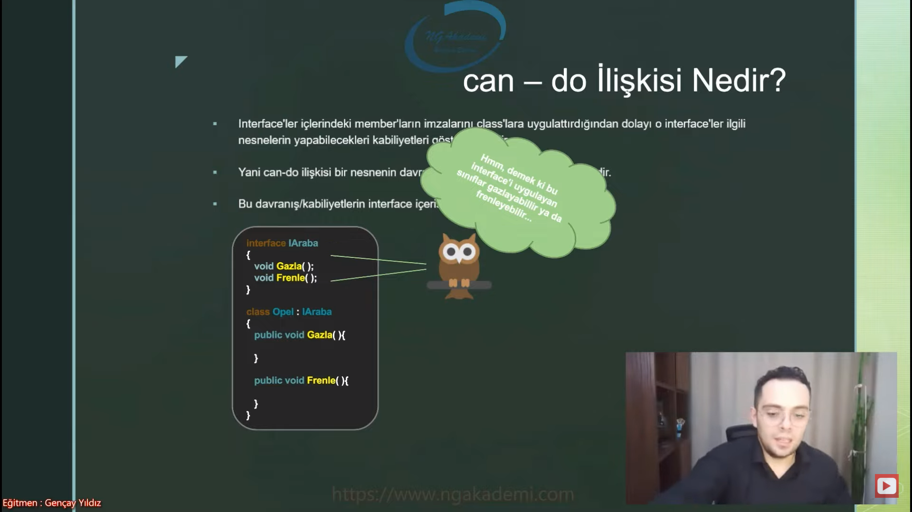
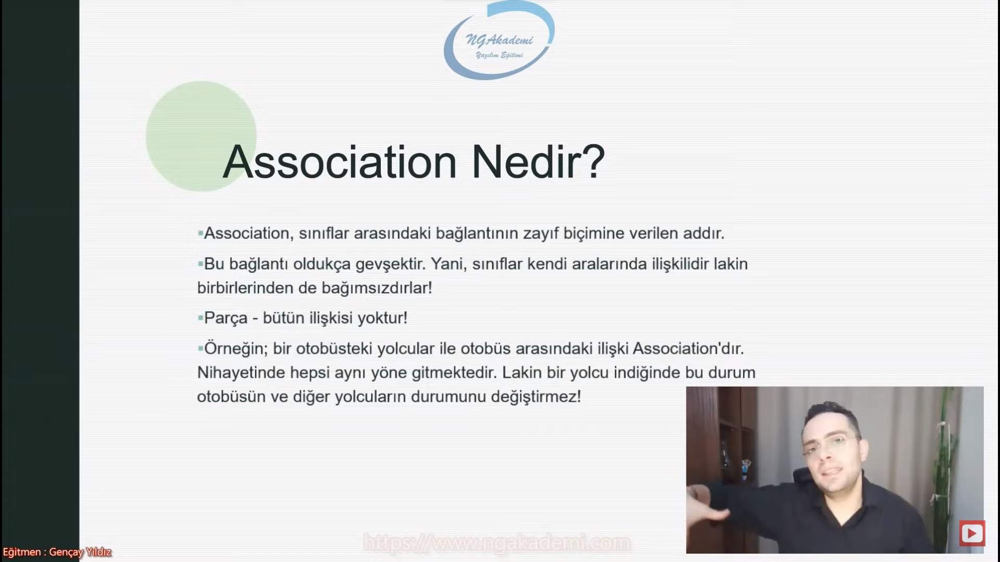
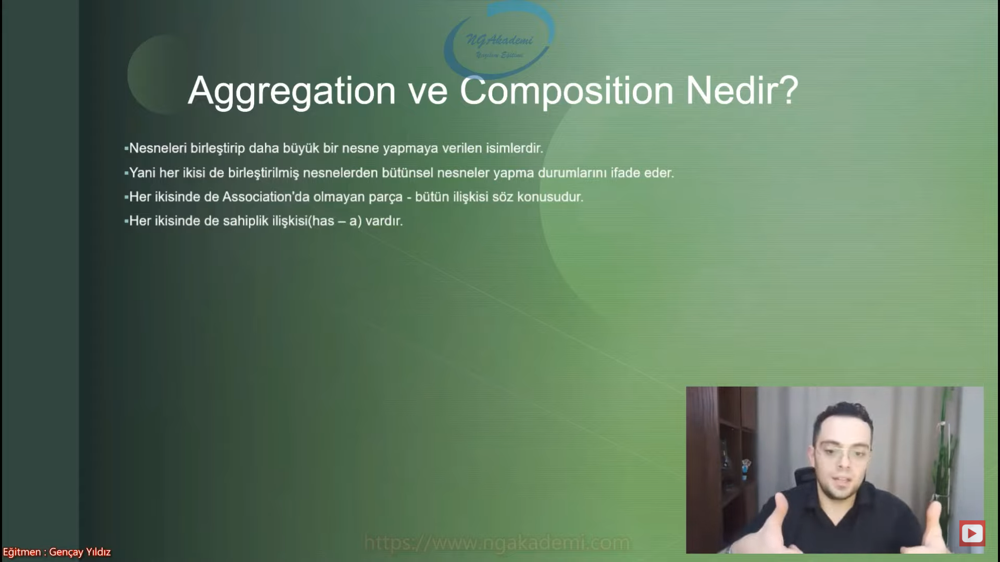
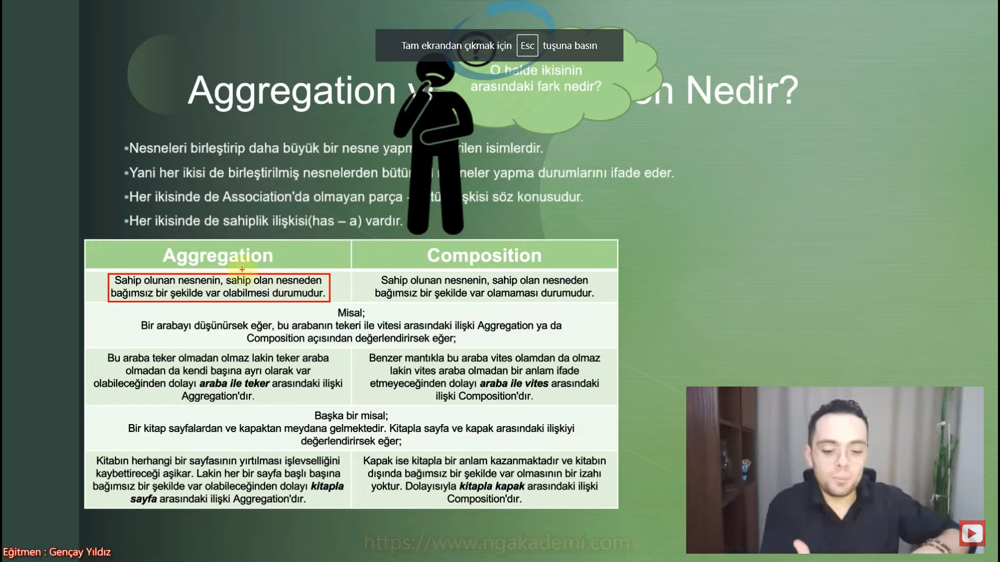

***
# Nesne Tabanlı Programlama #22 - Nesneler Arası İlişki Türleri (Association-Aggregation-Composition)

- Nesne dediğin bir işleme odaklı bütün yapıları bütün memberları kendi içerisinde barındıran tek başına bişeye yetebilen bir yapılanmaydı. İçinde metot/property/field vardı bunların üzerinde yapılan işlemlerle nesne bir amaca bir işleme dönük operasyonlar üstlenebilen bir canlı organizmaydı.

- Biz yazmış olduğumuz kodlarda bir iş yapıyorsak genellikle bu işi tek bir nesne üzerinde yapmamaya çalışırız. O nesne doğrudan ya da dolaylı olarak farklı nesnelerle bağlantılar kurarak bu işe dağınık bir şekilde odaklanmayı sever.
  * Bir veritabanı bağlantısı yapıp veritabanının üzerinden bu bağlantı üzerinde sorgulamalar yapacaksak eğer veritabanı bağlantısını sağlayan nesne farklı nesneyken bu sorgulama işlemlerini yapan nesneler farklı nesneler olabilir. Dikkat ederseniz bu nesnelerin kendi aralarında bir bağları vardır. Yani bir ilişki türleri vardır.

- Nesneler doğrudan ya da dolaylı olarak farklı türlerde birbirleriyle bağ kurabilmektedirler.

- Yazmış olduğun kodlarda nesneler kendi aralarında iletişim bir bağ kuruyorlar. Bu bağların farklı türleri olabiliyor.

## Nesneler Arası İlişki Türleri
- Nesneler arasında terminolojik olarak nitelendirilebilir ilişki türleri mevcuttur. Bu ilişkiler; kalıtım, referans yahut soyutlama gibi durumların getirisi olan mantıksal izahatlerdir.

- Nesneler arası ilişki türleri :
  * is – a ilişkisi
  * has – a ilişkisi
  * can – do ilişkisi
  
- Nesneler kendi aralarında kalıtımsal ilişkiye sahip olabilirler ya da bir nesne bir başka nesneye referans vermiştir bu da bir ilişki türüdür. Yahut sonraki derslerimizde göreceğimiz abstraction dediğimiz soyutlama diye bir teknik vardır. Bu da nesneler arasındaki bir ilişki türüdür.

## is - a İlişkisi Nedir?
- is – a ilişkisi tamamıyle kalıtımla alakalıdır. C# programlama dilinde, iki sınıf arasında `:` operatörü ile gerçekleştirilen kalıtım neticesinde ortaya bir is – a ilişkisi çıkmaktadır.

- Bir yerde kalıtım varsa orada is - a ilişkisi vardır. 
  * her kuş bir hayvandır. Burada kuş hayvandan türediğini düşünürsen sen haliyle is - a ilişkisi ortaya çıkmaktadır.

- Günlük hayatta inek bir hayvandır eee o zaman is - a ilişkisi vardır. Eyvallah günlük dünya düzleminde bu zaten böyle. Ama sen bunu yazılımsal dünyada diyebilmek istiyorsan arada kesinlikle fiziksel bir kalıtımın olması gerekir.

## has - a İlişkisi Nedir?
- Bir sınıfın başka bir sınıfın nesnesine dair sahiplik ifadesinde bulunan ilişkidir. Bir yandan kompozisyon/composition ilişkisi de denmektedir.

- Aggregation ve Composition'da kullandığımız bir ilişki türüdür aslında.

- Bir nesnenin içerisinde diğer nesnenin referansı varsa eğer bu has - a ilişkisidir. Sahiplik anlamı barındırır.

- Bir sınıf farklı bir sınıfın referansını kendi içerisinde barındırıyorsa biz buna has - a ilişkisi diyoruz. Yani sahiplik durumunu ifade ediyor.

- .Net'te herhangi bir hazır yazılmış sınıfın içerisine girin o sınıfın içerisinde farklı sınıfların referansları mevcuttur. İşte o sınıfla o sınıflar arasında has - a ilişkisi vardır.

## can - do İlişkisi Nedir?
- Sonraki derslerimizde göreceğimiz interface yapılanmasının getirisi olan bir ilişki türüdür.

-  Tabi ki de can – do ilişkisini anlayabilmek için öncelikle interface yapılanması hakkında fikir sahibi olunması gerekmektedir.

- Kısaca interface; bir sınıfın imzasıdır. Yani bir sınıfın içerisinde olacak olan tüm member'ların şablonunu/arayüzünü oluşturduğumuz bir kontrattır. Herhangi bir interface'i uygulayan class o interface içerisinde tanımlanmış member imzalarını kendisinde oluşturmak zorundadır. Aksi taktirde compiler hata verecektir. Velhasıl tüm bunları a'dan z'ye ilgili konuya ait dersimizde tam teferruatlı incelemiş olacağız.

- `interface` yapılanmasının getirmiş olduğu bir ilişki türüdür can - do ilişkisi.

- Elimde bir sınıf var bir de `interface` denilen bişey var. Bu `interface`, bu sınıfın içerisinde hangi metotların property'lerin bulunması gerektiğini ben zoraki olarak bulunması gerekenleri `interface`de bildireceğim. Bu `interface`'de bildirilen/tanımlanmış olan bu imzalar(çünkü `interface`lerde sadece imzalar bildirilir!?) bu sınıfta zoraki olarak uygulatılacaktır. Bu sınıf tabiki de `interface`i implemente etmesi uygulaması gerekecek. Uyguladığı zaman içindeki imzalar zoraki uygulatılmış olacaktır. Yani bir arayüz bir kontrat bir şablon niteliğinde yapıdır `interface`.

- `interface`'i uygulayan `class` `interface` içerisinde tanımlanan imzaları uygulamak zorundadır uygulamazsa eğer compiler hatası/derleme zamanı hatası verecektir. İmzaların gövdelerini oluşturmak zorundasın.

- Bir sınıfta bulunması gereken memberları içerisinde imza olarak tutan ve o sınıf tarafından uygulandığı taktirde zoraki fiilen o sınıfın içerisinde o memberları uygulattıran bir yapıdır.

- Interface'ler içlerindeki member'ların imzalarını class'lara uygulattırdığından dolayı o interface'ler ilgili nesnelerin yapabilecekleri kabiliyetleri göstermektedir.

- Yani can-do ilişkisi bir nesnenin davranışlarını/kabiliyetlerini belirtmektedir.

- Bu davranış/kabiliyetlerin interface içerisinde tanımlanmaktadır.

- Genel kullanım olarak `interface`de sadece imzalar barındırılır.

- Bir `class`ın ne yapabileceğini `interface` üzerinden anlamaya/okuyabilmeye can - do ilişkisi diyoruz 

## Association Nedir?
- Association, sınıflar arasındaki bağlantının zayıf biçimine verilen addır.

- Bu bağlantı oldukça gevşektir. Yani, sınıflar kendi aralarında ilişkilidir lakin birbirlerinden de bağımsızdırlar!

- Parça - bütün ilişkisi yoktur!

- Örneğin; bir otobüsteki yolcular ile otobüs arasındaki ilişki Association'dır. Nihayetinde hepsi aynı yöne gitmektedir. Lakin bir yolcu indiğinde bu durum otobüsün ve diğer yolcuların durumunu değiştirmez!

- Bir bağ var bu bağ o kadar zayıf ki herhangi bir parça herhangi bir nesne eksildiğinde bu bütünde bir bozukluğa sebep olmuyor.

- Parça bütün ilişkisi yok yani bir araya gelmişler serseri bir düzen oluşturmuşlar ama aradan elenenler olduğu zaman bu bütünde herhangi bir aksaklık herhangi bir eksiklik ortaya çıkmıyor. İşte bu tarz durumlara Association diyoruz.

## Aggregation ve Composition Nedir?
- Nesneleri birleştirip daha büyük bir nesne yapmaya verilen isimlerdir.

- Yani her ikisi de birleştirilmiş nesnelerden bütünsel nesneler yapma durumlarını ifade eder.

- Her ikisinde de Association'da olmayan parça - bütün ilişkisi söz konusudur.

- Her ikisinde de sahiplik ilişkisi(has – a) vardır.

- Birden fazla nesne bir araya geliyor ortaya daha büyük daha anlamlı bir bütün ortaya koyuyorlar. Aggregation da Composition da bunu yapıyor.

- Bütünü ortaya getiren küçük nesnelerin parçaların herhangi birinde bir eksiklik olduğu zaman bütünde de bir problem ortaya çıkıyor. Yani genel anlamda tutarsızlık meydana geliyor. Bütünün insicamı bozuluyor. İşte Aggregation ve Composition küçük parçaların bir araya getirdiği kusursuz bir bütün olması gerekiyor. Bu parçalardan herhangi birine bişey olduğu zaman o bütünde bir yamukluk oluşuyor.

- has - a ilişkisi Composition ve Aggregation'ının karşılığıdır.

|Aggregation|Composition|
|-----------|-----------|
|Sahip olunan nesnenin, sahip olan nesneden bağımsız bir şekilde var olabilmesi durumudur.|Sahip olunan nesnenin, sahip olan nesneden bağımsız bir şekilde var olamaması durumudur.|

***
- Misal; Bir arabayı düşünürsek eğer, bu arabanın tekeri ile vitesi arasındaki ilişki Aggregation ya da Composition açısından değerlendirirsek eğer;||
|-----------|-----------|
|Bu araba teker olmadan olmaz lakin teker araba olmadan da kendi başına ayrı olarak var olabileceğinden dolayı araba ile teker arasındaki ilişki Aggregation'dır.|Benzer mantıkla bu araba vites olamdan da olmaz lakin vites araba olmadan bir anlam ifade etmeyeceğinden dolayı araba ile vites arasındaki ilişki Composition'dır.|
***
- Başka bir misal; Bir kitap sayfalardan ve kapaktan meydana gelmektedir. Kitapla sayfa ve kapak arasındaki ilişkiyi değerlendirirsek eğer;||
|-----------|-----------|
|Kitabın herhangi bir sayfasının yırtılması işlevselliğini kaybettireceği aşikar. Lakin her bir sayfa başlı başına bağımsız bir şekilde var olabileceğinden dolayı kitapla sayfa arasındaki ilişki Aggregation'dır|Kapak ise kitapla bir anlam kazanmaktadır ve kitabın dışında bağımsız bir şekilde var olmasının bir izahı yoktur. Dolayısıyla kitapla kapak arasındaki ilişki Composition'dır.|

- Alt parça nesnelerinin birleştirilen nesnelerin üst nesneden bağımsız bir şekilde varolabilme durumu söz konusuysa biz buna Aggregation diyeceğiz. Alt nesnelerin/parçacıkların sahip olan nesneden yani ana/üst/bütünsel nesneden bağımsız bir şekilde var olamama durumu söz konusuysa tek başlarına bir anlam ifade etmiyorlarsa buna da Composition diyeceğiz.

## Aggregation vs Composition(Duvar - Tuğla - Çimento - Usta Örneği)
- İnşa edilen bir duvarda; tuğlalar, çimento ve usta ile duvar arasında nasıl bir ilişki vardır?

- Duvarla tuğla arasındaki ilişki;
  * Duvar, tuğlalardan örülmektedir. Yani tuğlaların bir araya gelmesiyle oluşur. Haliyle tuğla olmadan duvar olmaz! Amma velakin, tuğla tek başına bir anlam ifade edebilmektedir. Nihayetinde bir tuğlayı duvar örmenin dışında farklı noktalarda da kullanabiliriz. O yüzden duvarla tuğla arasındaki ilişki Aggregation'dır.

- Duvarla çimento arasındaki ilişki;
  * Duvar, çimento olmadan örülemez. Lakin çimento da duvar örmenin dışında tek başına bir anlam ifade etmez!(öyle kabul edelim) Bu sebepten dolayı duvarla çimento arasındaki ilişki Composition'dır.

- Duvarla usta arasındaki ilişki;
  * Duvar ile usta arasında parça - bütün ilişkisi yoktur. Duvarı herhangi bir usta örebilir. Haliyle duvar ile usta arasındaki ilişki de sıkı bağlılık olmadığından dolayı Association'dır.

## Aggregation vs Composition(Araba - Araba Gövdesi - Motor Örneği)

