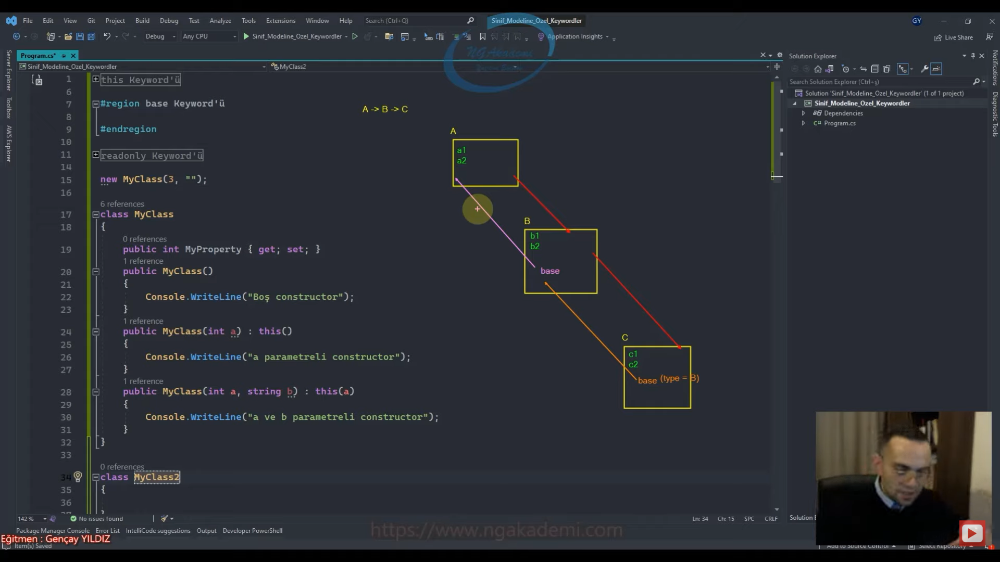

***
# Nesne Tabanlı Programlama #23 - Sınıf Modeline Özel Keyword'ler  this  base  readonly
## this Keyword'ü
- Bir sınıfın, uygulamanın herhangi bir noktasında üretilmiş olan instancle'larını/object'lerini/nesnelerini sınıf içerisinde temsil etmemizi sağlayan bir keyword'dür.

- `this` keywordü, bir sınıf içerisinde bulunan birden fazla constructor overload'ı arasında zıplamamızı yahut atlamamızı sağlayan bir keyworddür.

- Herhangi bir sınıfın üretilmiş olan nesnesini sınıf içerisinde temsil etmemizi sağlayan bir keyworddür.

- Üretilen nesneyi sınıf içinde temsil etmek istiyorsam eğer sınıfın içerisindeki herhangi bir member'da(çünkü `this` keywordü operatif bir keyworddür. yani direkt bunu sınıf içerisinde çağıramazsınız. Bunu illa ki bir sınıfın içerisindeki herhangi bir memberda çağırıyor olacaksınız.) `this` keywordünü çağırmalıyız.

- Yapısal olarak bir sınıfın içerisindeki constructor'lar arasında zıplamamızı/atlamamızı/geçiş yapmamızı sağlayan bir keyworddür.

- `this` keywordü hangi nesnedeysek o nesneyi temsil edecektir.

- Bu sınıf bir modeldi yani bir taslak. Bu taslaktan üretilen her bir nesnenin içerisindeki `this` kendini temsil edecektir. Haliyle sen bunu modelin içerisinde `this`le temsil etmiş oluyorsun.

- `this` hangi sınıfta kullanıyorsanız o sınıftın türünden bir keyworddür. Çünkü `this` yapısal olarak bulunduğu sınıfın üretilmi olduğu instance'larını temsil edecekse eğer o instance türünden yani o sınıfın referansı türünden olmak zorundadır.

- `this` keywordü bir sınıfın o anki nesnesinin sınıf içerisinde/sınıf modeli içerisinde temsil etmemizi sağlayan bir keyworddür.


- Sınıf modeli içerisinde `this` keywordünü kullanarak ilgili instance'ın memberlarına erişebiliyoruz amma velakin siz `this` keywordünü kullanmadan sınıfın memberlarına erişmeye çalışırsanız compiler arka planda `this` keywordünü hani otomatik bir şekilde kendisi kullanmış olacaktır. `this` keywordünü kullanmak mecburi değildir. Ondan dolayı biz C# programlama dilinde herhangi bir sınıfın içerisindeki property'e `this` keywordünü kullanmaksızın erişebiliyoruz. Tabiki de başka bir member içerisinde erişebiliyoruz. Ama compiler sen ne kadar `this` yazmasanda bu member'ın bu sınıfın içerisinde bir eleman olduğunu biliyor ve yine biz bu elemana bu sınıfın içerisindeki başka bir eleman içerisinde erişemeye çalıştığımızın farkında olduğu için arka planda `this` keywordünü kendisi eklemiş oluyor. Kalıtımsal durumlarda base `class`tan aynı isimde bir member miras aktarılabilir. İşte böyle bir durumda iki member'ın arasındaki farkı kesinlikle `this` ya da `base` keywordleriyle ayırt edebiliyoruz.

```C#
#region this Keyword'ü
//Bir sınıfın, uygulamanın herhangi bir noktasında üretilmiş olan instancle'larını/object'lerini/nesnelerini sınıf içerisinde temsil etmemizi sağlayan bir keyword'dür.

//this keywordü, bir sınıf içerisinde bulunan birden fazla constructor overload'ı arasında zıplamamızı yahut atlamamızı sağlayan bir keyworddür.
#endregion

new MyClass(3, "");
// new MyClass();
// new MyClass();

class MyClass
{
    public int MyProperty { get; set; }
    public MyClass()
    {
        System.Console.WriteLine("Boş constructor");
    }
    public MyClass(int a) : this()
    {
        System.Console.WriteLine("a parametreli constructor");
    }
    public MyClass(int a, string b) : this(a)
    {
        System.Console.WriteLine("a ve b parametreli constructor");
    }
}
```
 
## base Keyword'ü
- `base` keywordü bir instance'ın base `class`ını sınıf modeli içerisinde temsil eden bir keyworddür.

- `base` keyword'ü base `class`daki constructor'lardan seçim yapmamızı sağlar.

- `base` keywordü base `class`ı temsil eden base `class`ın instance'ını temsil eden bir keyworddür.

- Bir sınıfın base `class`ı sadece tek bir sınıf olabilir. 



- `base` keywordü ile base class'taki herhangi bir member'a direkt erişebiliriz.

- base `class` yoksa eğer bir `class` default olarak `Object`ten türemektedir.

- `this` keywordü nasıl ki bir sınıfın constructor'ları arasında zıplamamızı sağlıyordu `base` keywordü de bir sınıftan instance oluşturulurken base `class`taki constructorlar overload'larından hangisi üzerinden instance oluşturulmasını istiyorsak onu belirlememizi sağlıyor.

- `this` keywordünde olduğu gibi `base` keywordünü de her daim kullanmak zorunda değiliz. Ama hem base `class`ta hem de derived `class`ta bulunan property isimleri birbirleri ile aynıysa Burada nereden geldiğin kararını verebilmek için `this` ya da `base` keywordlerini kullanıyoruz.

```C#
new MyClass(3, "");

class MyClass
{
    public int MyProperty { get; set; }
    public MyClass()
    {
        System.Console.WriteLine("Boş constructor");
    }
    public MyClass(int a) : this()
    {
        System.Console.WriteLine("a parametreli constructor");
    }
    public MyClass(int a, string b) : this(a)
    {
        System.Console.WriteLine("a ve b parametreli constructor");
    }
}

class MyClass2 : MyClass
{
    public MyClass2() : base(3,"")
    {
        System.Console.WriteLine("Son constructor");
    }
}
```

## readonly Keyword'ü
- Bir `class` içerisinde tanımlanmış olan değişkenin yahut referansın sadece okunabilir olmasını sağlayan bir keyword'dür.

- `readonly` keyword'ü ile işaretlenmiş olan referansların değerleri ya tanımlama noktasında ya da constructor'da verilebilir.

- `const` yapılanmalar, `readonly` ile karıştırılabilir. Aralarındaki fark şöyledir;
  * `const` tanımlandığı yerde değeri verilmelidir. Ve constructor içerisinde bile değer ataması gerçekleştirilemez! Lakin `readonly`'de ister tanımlama noktasında isterseniz de constructor içerisinde değer ataması gerçekleştirilebilir. İkisi arasındaki temel farklardan birisi de budur.

- Herhangi bir sınıf içerisinde tanımlanmş olan bir değişkenin sadece okunabilir olmasını sağlayan bir keyworddür.

- Constant yapılanmalarda yani sabitlerde herhangi bir referansın değerini tanımlama noktasında verebilirsin. Constructor'da veremezsin.

- Constant yapılanmada ilk değer tanımlandığı yerde atanmak zorundadır. Constant yapılanma esasında bir `static` yapılanmadır.

```C#
class MyClass3
{
    readonly object x = 5;
    const string y = "";
    public MyClass3()
    {
        x = 15;
        y = "";
    }

    public void X()
    {
        x = 155;
    }
}
```

## C# Examples
```C#
#region this Keyword'ü
//Bir sınıfın, uygulamanın herhangi bir noktasında üretilmiş olan instancle'larını/object'lerini/nesnelerini sınıf içerisinde temsil etmemizi sağlayan bir keyword'dür.

//this keyword'ü, bir sınıf içerisinde bulunan birden fazla constructor overload'ı arasında zıplamamızı yahut atlamamızı sağlayan bir keyworddür.
#endregion

#region base Keyword'ü
//base keyword'ü bir instance'ın base `class`ını sınıf modeli içerisinde temsil eden bir keyworddür.

//`base` keyword'ü base `class`daki constructor'lardan seçim yapmamızı sağlar.
#endregion

#region readonly Keyword'ü
//Bir `class` içerisinde tanımlanmış olan değişkenin yahut referansın sadece okunabilir olmasını sağlayan bir keyword'dür.

//`readonly` keyword'ü ile işaretlenmiş olan referansların değerleri ya tanımlama noktasında ya da constructor'da verilebilir.

//const yapılanmalar, readonly ile karıştırılabilir. Aralarındaki fark şöyledir;
//const tanımlandığı yerde değeri verilmelidir. Ve constructor içerisinde bile değer ataması gerçekleştirilemez! Lakin readonly'de ister tanımlama noktasında isterseniz de constructor içerisinde değer ataması gerçekleştirilebilir. İkisi arasındaki temel farklardan birisi de budur.
#endregion

new MyClass(3, "");
// new MyClass();
// new MyClass();

new MyClass2();

class MyClass
{
    public int MyProperty { get; set; }
    public MyClass()
    {
        System.Console.WriteLine("Boş constructor");
    }
    public MyClass(int a) : this()
    {
        System.Console.WriteLine("a parametreli constructor");
    }
    public MyClass(int a, string b) : this(a)
    {
        System.Console.WriteLine("a ve b parametreli constructor");
    }
}

class MyClass2 : MyClass
{
    public MyClass2() : base(3, "")
    {
        System.Console.WriteLine("Son constructor");
    }
}

class MyClass3
{
    readonly object x = 5;
    const string y = "";
    public MyClass3()
    {
        x = 15;
        y = "";
    }

    public void X()
    {
        x = 155;
    }
}
```
