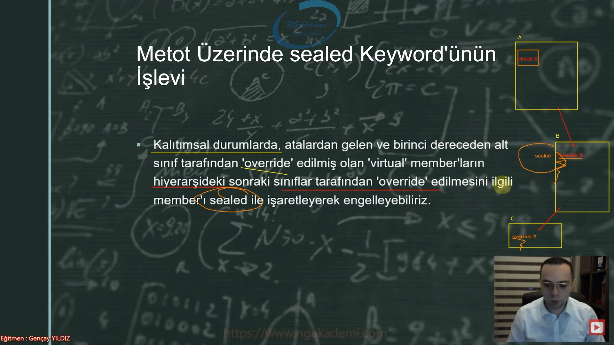
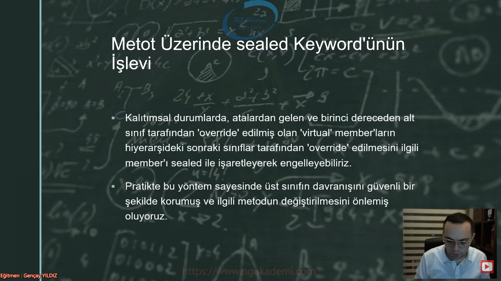

# Nesne Tabanlı Programlama #24 - sealed Keyword'ü Nedir? Ne Amaca Hizmet Etmektedir?


## sealed Keyword'ü Nedir?
- Bir sınıfın miras vermesini yahut bir başka deyişle başka bir sınıf tarafından miras alınmasını engelleyen bir keyworddür.

- Sadece sınıflarda ve sadece `override` edilmiş metotlarda kullanılabilir.

- Oluşturduğun bir tane sınıfın başka bir sınıf tarafından kalıtımsal olarak ilişkiye tabi tutulmasını istemiyorsan eğer `sealed` keywordünü kullanırız.

- Oluşturduğumuz bir sınıfın uygulama çapında herhangi bir noktada ya da bu uygulamanın dışında .dll olarak referans edilmiş olabilir farklı uygulamalarda kalıtımsal ilişkiye tabii tutulmasını istemiyorsak eğer böyle bir durumda bu sınıfı `sealed` keywordüyle işaretliyoruz.

- Yani bir sınıf `sealed` keywordüyle işaretleniyorsa o sınıf kalıtımsal ilişkiye tabii tutulmaz.

- Bir sınıfın kalıtımsal ilişki sürecinde miras vermesini engelleyen bir keyworddür.

```C#
sealed class A
{

}

class B : A
{

}
```


## Class Üzerinde sealed Keyword'ünün İşlevi Nedir?
- Bir `class`ı `sealed` keywordüyle işaretlerseniz o `class`tan tövbe bir daha miras alınamaz.

- Yapacağın bir çalışmada oluşturmuş olduğun sınıftan kesinlikle miras alınmasını engellemek istiyorsan `sealed` keywordüyle o sınıfı işaretleyeceksin.

- `record`ın da yapısı/fıtratı bir sınıf olacağı için `sealed` keywordünü kullanabiliyoruz.

- Sınıf ve sınıf fıtratında olan bir yapılanmada kullanabileceğimiz bir keyworddür.


## Metot Üzerinde sealed Keyword'ünün İşlevi Nedir?
- Kalıtımsal durumlarda atalardan gelen ve birinci dereceden alt sınıf tarafından `override` edilmiş olan `virtual` memberların hiyerarşideki sonraki sınıflar tarafından `override` edilmesini ilgili member'ı `sealed` ile işaretleyerek engelleyebiliriz.

- Pratikte bu yöntem sayesinde üst sınıfın davranışını güvenli bir şekilde kormuş ve ilgili metodun değiştirilmesini önlemiş oluyoruz.

- Birinci dereceden alt sınıfın dışında diğer torunların buradaki davranışı değiştirmesini istemiyorsan eğer `override` edilmiş member'ı `sealed` keywordüyle işaretleyip alt sınıflarında bunun `override` edilmesini engelleyebilirsiniz.



- `virtual` ile işaretli olan bir member'ı biz derived `class`'ta ezebiliriz.

- Atalardan `virtual` olarak gelen bir member'ı hiyerarşide zincirleme olarak `override` edebiliriz.



## sealed Keyword'ü Hangi Durumlarda Kullanılır?
- Sınıfların Davranışlarını Korumak İstediğimizde;
    * Kalıtımsal hiyerarşide üst sınıfların özel metotları/davranışları varsa ve bu metotlardaki davranışların alt sınıflar tarafından değiştirilebilir olmasını istemediğimiz durumlarda, o metodu `sealed` olarak işaretleyebiliriz.

- Performans İyileştirmesi İstendiğinde;
    * Mikro seviyede yapılan bir optimizasyon neticesinde C#'ta bir sınıf `sealed` işe işaretlendiğinde `sealed` olmayan bir sınıfa göre ufak çapta bir performans artışı gösterdiği anlaşılmıştır. Bunun nedeni, derleyicinin `sealed` ile işaretlenmiş sınıfın miras alınamayacağını bilerek daha hızlı derleme yapmasıdır. 

- Singleton Design Pattern;
    * Singleton Design Pattern'da bir sınıfın uygulama çapında tekli bir instance'ının olması amaçlanmaktadır. Haliyle ilgili sınıf `sealed` ile işaretlenerek, bu sınıftan herhangi bir kalıtımsal ilişkinin yaratılmasını engelleyebilir ve tek instance üretimini daha da garanti hale getirmiş oluruz.

- Bir sınıfın miras vermesini engellemek istiyorsak başka bir deyişle bir sınıftan miras alınmasını engellemek istiyorsak `sealed` keywordünü kullanabiliriz. O sınıfı `sealed` ile işaretlediğimizde tövbe bir daha miras alınamaz.

- `override` metotlarda da kullanabiliriz davranışı koruyabilmek için.


## Java'cılara Özel Son Söz :)
- Java'da `final` keywordü C#'ta ki `sealed` keyword'ünün muadilidir.


## C# Examples
```C#
C c = new();


class A
{
    public virtual void X()
    {
        System.Console.WriteLine("Merbaha A");
    }
}

class B : A
{
    sealed public override void X()
    {
        System.Console.WriteLine("Merbaha B");
    }
}
class C : B
{
    
}
```
