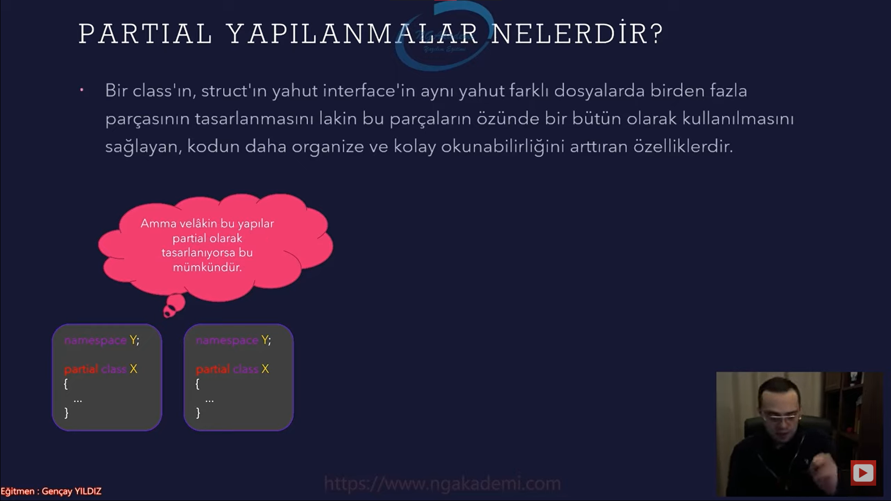
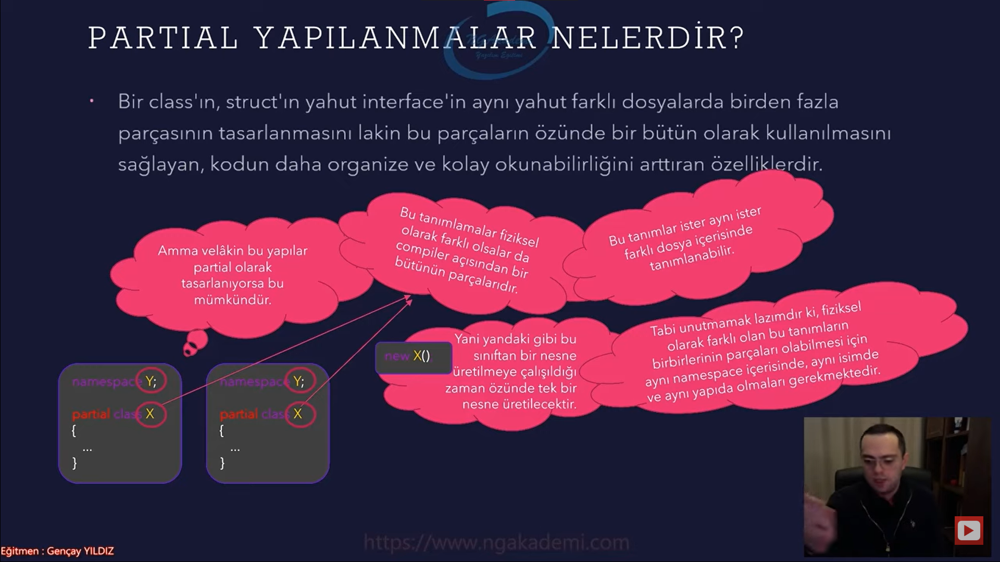
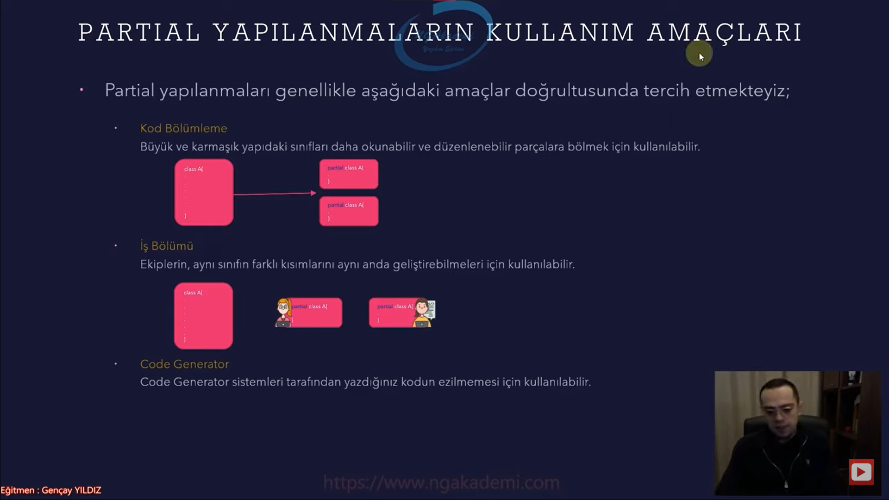
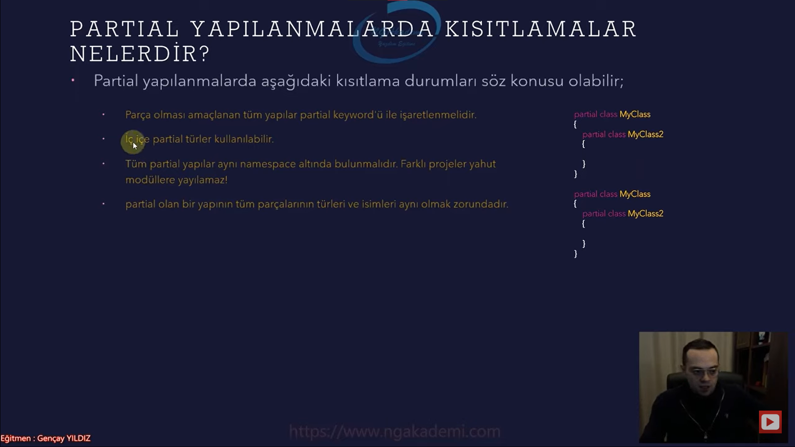
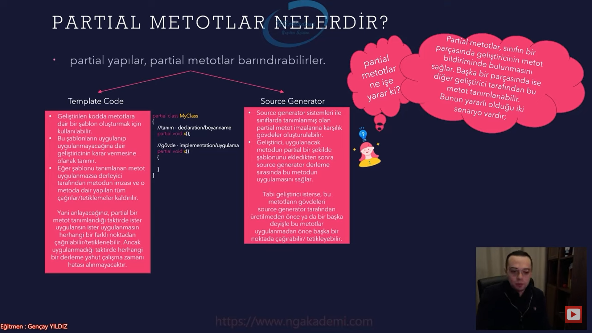

# Nesne Tabanlı Programlama #25 - Partial Yapıları İnceleyelim


## Partial Yapılanmalar Nelerdir?
- Bir `class`ın, `struct`ın yahut `interface`in aynı yahut farklı dosyalarda birden fazla parçasının tasarlanmasını lakin bu parçaların özünde bir bütün olarak kullanılmasını sağlayan, kodun daha organize ve kolay okunabilirliğini arttıran özelliklerdir.

- `partial` adı üstünde parça nesne tabanlı programlamada belirli yapılarımızı parçalamamızı sağlayan bir niteliktir. 
 
- Bir şeyi parçalayıp onu bir bütün olarak yönetmek genel anlamda yazılımın zaten mantığında vardır. Dolayısıyla `partial`ların da kodlama sürecinde bizlere bu mantıkta bir desteği olduğunu bilmeliyiz.

- Yani sen bir kod yazıyorsun yazmış olduğun kod esasında bütün bir kod ama sen bunu daha rahat yazabilmek istiyorsan daha okunabilir yazmak istiyorsan daha kullanılabilir yönetilebilir bir hale getirmek istiyorsan bunu fiziksel olarak farklı definiton'larda parçalayabilir ama compiler seviyesinde bir bütün olarak kullanabilirsin.

- Bir sınıf oluşturuyorsun sınıftan bin tane fonksiyonun var. Şimdi bu sınıfı yönetmek kolay mıdır? değildir değil mi nerede ne var yok belli değil bir metodu aradığın zaman hani farklı bir kullanmış olduğun editörün farklı nitelikleriyle o metoda gitmek zorundasın aksi taktirde scrool bar'ı kullanarak sınıfın içerisinde gezinemezsin vs vs. çünkü yorucudur. Haliyle bunu yönetebilmek için yönetilebilir kılmak için parçalamakta fayda vardır. Mesela belirli işlemleri yapan fonksiyonları birbirlerine daha yakın olan fonksiyonları bir `partial`a alırsın işte diğer fonksiyonları farklı bir `partial`a alırsın ve istediğin kadar böyle `partial`lar oluşturup hani daha yönetilebilir kılarsın. 
 
- Özünde bu yapılanma derleyici seviyesinde bir bütün olarak değerlendirilecektir. Yani bu kompleks olan sınıftan bir instance ürettiğinde eğer ki bu bütün parçalar yazılım açısından bir `partial`sa bunun bir kuralı var yani lalettayin her parça birbirinin `partial`ı olmuyor `partial` olabilmesi için belirli kurallarımız vardır. İşte bu kurallara uyuyorsa derleyici açısından bu sınıf bir bütün olarak değerlendirelecek ve bundan üretilen instance içerisinde bütün fonksiyonlar bütün `partial`lardaki fonksiyonlar ve memberlar barındırılacaktır erişilebilir olacaktır.

- Normal şartlarda aynı `namespace` altında birden fazla aynı isimde yapı bulundurulamaz! Amma velakin bu yapılar `partial` olarak tasarlanıyorsa bu mümkündür.




- `partial` olarak işaretlenmişse eğer aynı `namespace` içerisinde aynı isimde birden fazla tanımlama söz konusu olur. 

- `partial` ile işaretlediğimiz zaman esasında derleyici açısından bu yapılanmalar bir tek bütün olarak değerlendiriliyor.

- Bir `class`ı/`interfacei`/yapıyı/olguyu `partial` olarak tanımlayarak fiziksel olarak farklı atomik parçalara bölüp arka planda bütünsel olarak bunları kullanabiliyorsun.

- Bu tanımlamalar fiziksel olarak farklı olsalar da compiler açısından bir bütünün parçalarıdır.

- Yani bu sınıftan bir nesne üretilmeye çalışıldığı zaman özünde tek bir nesne üretilecektir.

- Geliştirici açısından olaya kolaylık kazandırabilmek yani bir sınıfın kompleksliğini daha da sade bir hale getirebilmek için biz bu `partial` yapılanmalardan istifade ediyoruz.

- Bu tanımlar ister aynı ister farklı dosya içerisinde tanımlanabilir. 

- Eğer birbirlerinin `partial`ları olacaklarsa aynı `namespace` hatta aynı proje içerisindeki aynı `namespace`'lerde bulunmaları gerekiyor. Yani farklı .dll'deki benzer bir `namespace`e karşılık mevcut projede aynı isimle isimlendirilmiş bir `namespace`in içerisindeki bir yapıyla `partial` olamaz. Aynı .dll olacak aynı proje olacak aynı `namespace`ler içerisindeki yapılar ancak birbilerinin `partial`ları olabilirler.

- Tabi unutmamak lazımdır ki, fiziksel olarak farklı olan bu tanımların birbirlerinin parçaları olabilmesi için aynı `namespace` içerisinde, aynı isimde ve aynı yapıda ve aynı .dll'de/projede olmaları gerekmektedir.
  1. `namespace`ler aynı olmazsa zaten bunlar birbilerinden farklı sınıflar olacaklardır.
  2. `namespace`ler aynı sınıfların isimleri farklı olacaksa bunlar yine birbirlerinin `partial`ları olmayacaktır.
  3. Herşey aynı birisi sınıf birisi `inteface` ise burada bir tutarsızlık olacaktır. Bu iki farklı olgu birbirlerinin parçası olamaz. O yapı neyse onun fıtratı `partial`ları ile aynı olmak zorundadır.

- Bir yapının `partial`larını oluşturacaksan tabiki de onun parçaları onunla aynı özellikte olmak zorunda.



## Partial Yapılanmaların Kullanım Amaçları
- Partial yapılanmaları genellikle aşağıdaki amaçlar doğrultusunda tercih etmekteyiz;
  * Kod Bölümleme
    + Büyük ve karmaşık yapıdaki sınıfları daha okunabilir ve düzenlenebilir parçalara bölmek için kullanılabilir.  
    + Elimizdeki bir sınıfı daha okunabilir/yönetilebilir bir hale getirmek istiyorsam `partial` hale getirebilirim.
  * İş Bölümü
    + Ekiplerin, aynı sınıfın farklı kısımlarını aynı anda geliştirebilmeleri için kullanılabilir.  
    + Bir tane sınıfımız var senle ben aynı anda bu sınıf üzerinde bir çalışma yapıyoruz bu çalışmayı bizler birbirlerimizi etkilemeyecek şekilde bir boyuta taşımak istiyorsak bu sınıfı `partial` olarak tasarlayabiliriz. Yani sen kendi çalışmalarını yapmış olduğun kısmı ayrılmış farklı bir parçada fiziksel olarak değerlendirirken bende aynı şekilde kendime göre farklı bir parçada çalışmayı sağlayabilirim.
    + Şimdi devops süreçlerinde  yazmış olduğumuz kodları github'a bunun gibi kullandığımız yapılara gönderiyoruz. Buralarda bazen ortak çalışma yapılan sınıflarda conflict'lere düşebilme olasılığımız oluyor. Bu olasılıklardan kodu törpüleyebilmek/soyutlayabilmek için yapmamız gereken çalışmalardan bir tanesi de partial yapılanmalar. İlla aynı yapılanmda aynı sınıfta çalışacaksanız o zaman onun `partial`larını birbirlerinden ayırıp o şekilde TFS'e ya da github'a göndermeniz conflict'lerden mümkün mertebe arındırılmanızı sağlayacaktır.
  * Code Generator
    + Code Genarator sistemleri tarafından yazdığını kodun ezilmemesi için kullanılabilir.
    + EntityFrameworkCore'daki database first yaklaşımından daha iyi hatırlayacaksınızdır. Çünkü orada veritabanı sunucusundaki varolan bir veritabanını databasefirst yaklaşımı sayesinde code generator yapılanmasını kullanarak yazılım kısmında modelliyorduk. Şimdi bu süreçte yazılım kısmında modellediğimiz bir çalışmanın üzerinde kendimize göre hususi custom işlemler yaptığımızı varsayarsak ve gün gelince bir daha database first yaklaşımını kullanarak veritabanındaki yenilikleri çekmeye çalışırsak burada ezilme durumları söz konusu olabilir. Bunun dışında farklı code generator yapılanmaları kullanıyor olabilirsiniz. İşte böyle durumlarda üretilen bir kodun üzerinde yapılan hususi çalışmaların bir sonraki code generator yapılacak çalışma üzerinden ezilme durumu söz konusu olabilir Bu tarz durumlarda code generator tarafından üretilen bir sınıfın ya da yapının üzerinde çalışma yapacaksanız onun `partial`'ı üzerinde yaparsınız. Partial'ını üretirsiniz farklı bir dosyada fiziksel olarak farklı bir konumda sadece aynı `namespace`te bu `partial` üzerinde gerekli çalışmaları yaparsınız code generator kendi orjinal dosyasını ezecektir. Ezse dahi sizin partial'ınıza dokunmayacaktır. Böylece bu tarz durumlarda bu tarz senaryolarda daha esnek bir şekilde çalışmalar sergilemiş olacaksınız.



## Partial Yapılanmalarda Kısıtlamalar Nelerdir?
- Partial yapılanmalarda aşağıdaki kısıtlama durumları söz konusu olabilir;
  * Parça olması amaçlanan tüm yapılar `partial` keywordüyle işaretlenmelidir.
    + Parça olması `partial` olması hedeflenen tüm yapılar bunlar `interface`ler, `struct`lardır, `class`lardır bunların her biri kendi içlerinde parçalardan bir bütün olarak tasarlanacaksa tüm parçaların hepsi `partial` olarak işaretlenmesi gerekiyor.
    + Bir diğer parçasında aynı imzada bir fonksiyon olursa yine hata verecektir sen ne kadar bunu fiziksel olarak ayırmış olsanda hata verecektir.
    + Tüm `partial` yapılanmaları aynı `namespace` olmak kaydıyla farklı fiziksel dosyalarda tanımlayabiliriz
    
    ```C#
    using X;

    var m = new MyClass();

    namespace X;

    partial class MyClass
    {
        public void A(){}
    }
    partial class MyClass
    {
        public void B(){}
    }
    partial class MyClass
    {
        public void C(){}
    } 
    ```
  * İç içe `partial` türler kullanılabilir. 
    + `partial` yapılanmalar nested olarakta bulunabilirler.
    + `partial` yapılanmalar nested bir şekilde de birbirlerini karşılayabilmektedir.
    ```C#
    partial class MyClass
    {
        partial class MyClass2 { }

        public void A() { }
    }

    partial class MyClass
    {
        partial class MyClass2 { }

        public void B() { }
    }
    ```
  * Tüm `partial` yapılar aynı `namespace` altında bulunmalıdır. Farklı projeler yahut modüllere yayılamaz! 
  * `partial` olan bir yapının tüm parçalarının türleri ve isimleri aynı olmak zorundadır. 
    + Temel atomik olarak bunları aynı fıtratta tasarlamak zorundayız.



## Partial Olabilen Yapılar Nelerdir?
- `class`
  * ```C#
        partial class MyClass
        {
            public void A() { }
        }
        partial class MyClass
        {
            public void B() { }
        }
    ``` 
- `record`
   * ```C#
        partial record X 
        { 
        
        }
        partial record X 
        { 
        
        }
    ``` 
- `abstract class`
  * `partial` keywordü `class`tan, `record`dan `struct`tan `interface`ten bu keywordlerden önce tanımlanmalıdır. Aksi taktirde hata verecektir.
  * ```C#
        abstract partial class MyClass 
        { 
        
        }
        
        abstract partial class MyClass 
        { 
            
        }
    ```  
- `interface`
  * ```C#
        partial interface IInterface
        {
        
        }
        partial interface IInterface
        {

        }
    ```  
- `struct`
  * ```C#
        partial struct c
        { 
        
        }
        partial struct c
        { 
        
        }
        partial struct c
        { 
        
        }
    ``` 


- İstediğiniz kadar bir yapının `partial`ını oluşturabilirsiniz.

## Partial Metotlar Nelerdir?
- `partial` yapılar, `partial` metotlar barındırabilirler.

- `partial` metotlar, sınıfın bir parçasında geliştiricinin metot bildiriminde bulunmasını sağlar. Başka bir parçasında ise diğer geliştirici tarafından bu metot tanımlanabilir. Bunun yararlı olduğu iki senaryo vardır;
    * Template Code
      + Geliştirlen kodda metotlara dair bir şablon oluşturmak için kullanılabilir. 
        - `partial`ımız var bu `partial`ın içinde diğer parçalarda hangi metotların kullanılacağına dair biir imza tanımlamak istiyorsanız bir şablon oluşturmak istiyorsanız `partial` metotları kullanabilirsiniz.
      + Bu şablonların uygulanıp uygulanmayacağına dair geliştiricinin karar vermesine olanak tanır.
        - Yani sen diyorsun ki ben bir `partial` bir yapılanma mesela bir `class` tanımladım. bu `partial` `class`ların bir tanesinde `partial` metotların imzalarını tanımladığını düşün. Bakınca demek ki bu sınıfın içerisinde bütünsel olarak parçalardan olan ama bütünsel olarak tekil olarak kullanacağımız bu sınıfın içerisinde bu parçadaki tanımlamalar olabilir. İmza tanımlamaları ya da metot bildirimleri olabilir. Geliştirici bu imzalara karşılık metotların uygulanıp uygulanmayacağının kararını verecektir. Geliştiricinin iradesinde compiler bunu zorlamayacaktır.
      + Eğer şablonu tanımlanan metot uygulanmazsa derleyici tarafından metodun imzası ve o metoda dair yapılan tüm çağrılar/tetiklemeler kaldırılır. 
        - Temizlenir öyle bişey yokmuş gibi davranılır. 
        - Bildirimde bulunulmuş sanki `interface`teymişiz gibi düşünün bir metot bildiriminde bulunulmuş ama bunun gövdesi daha sonradan oluşturulmamış eğer oluşturulmazsa derleyici açısından bu metot yokmuş gibi davranılacaktır. 
      + Yani anlayacağınız, `partial` bir metot tanımlandığı taktirde ister uygulansın ister uygulanmasın herhangi bir farklı noktadan çağırılabilir/tetiklenebilir. Ancak uygulanmadığı taktirde herhangi bir derleme yahut çalışma zamanı hatası alınmayacaktır. 
    * Source Generator
      + Source Generator sisitemleri ile sınıflarda tanımlanmış olan `partial` metot imzalarına karşılık gövdeler oluşturulabilir.  
        - Şimdi sen source generator sistemi yazıyorsun varsayalım ve yazmış olduğun source generator sisteminde bir sınıfın içerisinde oluşturulacak metotları belirlemek istiyorsun şimdi bu sınıfın içerisinde oluşturulacak metotları belirleyebilmek için bu sınıfın içerisinde `partial` metotlar tanımlayabilirsin. Dersin ki `partial` olarak tanımladığım metot bildirimlerine karşılık sen gövdeleri oluştur. 
      + Geliştirici, uygulanacak metodun `partial` bir şekilde şablonunu ekledikten sonra source generator derleme sırasında bu metodun uygulamasını/implementation'ını sağlar. 
      + Tabi gelişrici isterse, bu metotların gövdeleri source generator tarafından üretilmeden önce ya da bir başka deyişle bu metotlar uygulanmadan önce başka bir noktada çağırabilir/tetikleyebilir.
        -  Source generator metotların gövdelerini oluşturmasa dahi mış gibi yapıp bu metotların gövdeleri oluşturulacağını bildiğim için farklı operasyonlarda bu metotları kullanabilir işlemlere tabi tutabilirim. Ta ki source generator gerekli implementasyonları gerçekleştirip gövdeleri oluşturur hali hazırda bir çalışabilir yapı elimizde olur.
       

- Bir yapılanmamız var bir sınıfımız var bu yapılanmanın `partial`ları var. Bu `partial`lardan bir parçasında metot bildiriminde bulunmamızı sağlar.

- Bir `partial` yapılanmada bir parçasında bu yapılanmanın bütünsel olarak içerisinde bulunabilecek metotların imzalarını tanımlayarak daha sonra da farklı bir parçasında bu imzalara karşılık gövdeleri tanımlama olayına biz `partial` metotlar diyebiliyoruz.

- `partial` metotlarda bildirim kısmı tanım/declaration/beyanname olarak nitelendirilirken bunun gövdesi ise gövde/implemtation/uygulama olarak nitelendirilebilir.



## Partial Metot Kuralları Nelerdir?
- `partial` metotlarla ilgili aşağıdaki ekstra bilgileri bilmekte fayda vardır;
  *  `partial` metotların runtime'da varolacağı kesin değildir. Eğer implementation edilmedillerse `partial` metotlar derleme sırasında yok sayılırlar.
    + Çünkü bildirimde bulunup uygulamasını yapmayabilirsiniz. Haliyle runtime'da böyle birşeyin olup olmayacağı sizlerin uygulayıp uygulamayacağınıza bağlıdır. Dolayısıyla runtime'da varolup olmayacağı kesin değildir.
  * Yukarıdaki durumdan dolayı `partial` metotlar `delegate`'ler ile temsil edilemezler.
    + Çünkü `delegate`'ler varolan kesinleşmiş metotları referans edebilirler. Runtime'da olabilitesi kesin olmayan bir metodu `delegate` ile temsil etmemiz pek mümkün değildir.
- `partial` metotlar;
  * Ancak `partial` yapılar içerisinde tanımlanabilirler.
  * geri dönüş değerleri her daim `void` olmak zorundadır.
  * `static` veya generic olabilirler
  * `out` parametresi almazlar lakin `ref` parametresi alabilirler.
  * `extern` ve `virtual` olamazlar.
  * Aynı `class`larda olduğu gibi `partial` metodun hem tanımı hem de gövdesi `partial` ile işaretlenmelidir.  
  * Bir metot imzasına karşılık tanım ve gövde olabilir.
  * Eğer ki `partial` metotlar başka bir metot tarafından çağrılırlarsa compiler tarafından var oldukları bilinecektir. Yok eğer çağrılmazlarsa compiler derleme aşamasında ilgili metodu hiç görmeyecektir.

- `partial` metotlar gövdesi tanımlandığı taktirde `public` olarak işaretlenebilir. ve nesne instance'ı üzerinden erişim gösterilebilir. Amma velakin `partial` metotların gövdeleri tanımlanmadıysa siz bunları `public` olarak işaretleyemezsiniz


## C# Examples
```C#
using X;

var m = new MyClass();

#region partial class

namespace X;

partial class MyClass
{
    partial class MyClass2 { }

    public void A() { }
}

partial class MyClass
{
    partial class MyClass2 { }

    public void B() { }
}

partial class MyClass
{
    public void C() { }
}
#endregion
#region partial record
partial record X { }

partial record X { }
#endregion
#region partial abstract class
abstract partial class MyClass { }

abstract partial class MyClass { }
#endregion
#region partial struct
partial struct c
{ 

}
partial struct c
{ 

}
partial struct c
{ 

}
#endregion
#region partial interface
partial interface IInterface
{

}
partial interface IInterface
{
    
}
#endregion

#region partial yapılanmaları tercih ettiğimiz senaryolar
#region kod bölümleme
    
#endregion
#region iş bölümü
    
#endregion
#region code generator
    
#endregion
#endregion

#region partial metotlar
new MyClass4();
partial class MyClass4
{
    public MyClass4()
    {
        X();
        Y();
        Z();
    }

    partial void X();
    partial void Y();
    partial void Z();

    partial void Y()
    {
        Console.WriteLine("Y tetiklendi...");
    }
}
#endregion
```