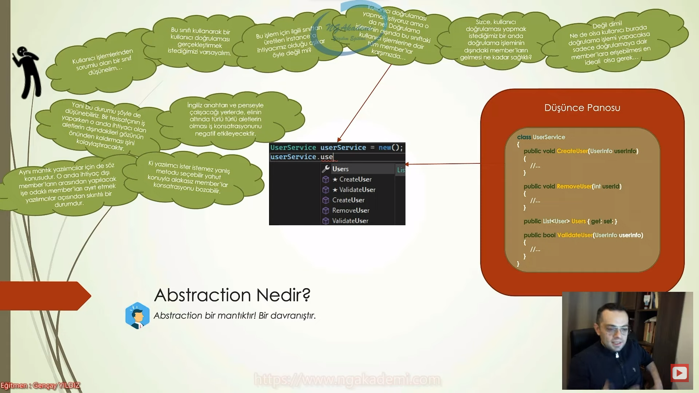
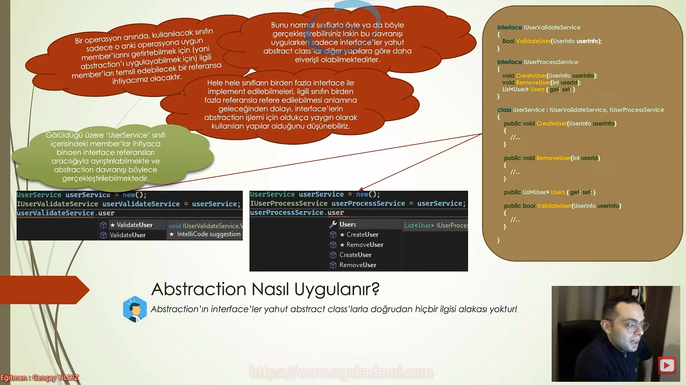

# Nesne Tabanlı Programlama #26 - Abstraction Kavramı Nedir?
- Abstraction herhangi bir programlama dilinin bir özelliği değildir. Aynı şekilde Object Oriented felsefesinin de getirmiş olduğu bir özellik değildir. Biz sadece genellikle Object Oriented çalışmalarında kullandığımız ve bizim işimizi kolaylaştıran bir davranış olarak abstraction'ı değerlendiririz.

- Abstraction bir davranıştır. Bir mantıktır.


## Abstraction Nedir?
- Abstraction bir mantıktır! Bir davranıştır.

- Kullanıcı işlemlerinden sorumlu olan bir sınıf düşünelim...

- Bu sınıfı kullanarak bir kullanıcı doğrulaması gerçekleştirmek istediğimizi varsayalım.

- Bu işlem için ilgili sınıftan üretilen instance'a ihtiyacımız olduğu aşikar öyle değil mi?

- Kullanıcı doğrulaması yapmak istiyoruz ama o da net doğrulama işleminin dışında bu sınıftaki kullanıcı işlemlerine dair tüm member'lar karşımızda...

- Sizce kullanıcı doğrulaması yaapmak istediğimiz bir anda doğrulama işleminin dışındaki member'ların gelmesi ne kadar sağlıklı? 

- Değil dimi! Ne de olsa kullanıcı burada doğrulama işlemi yapacaksa sadece doğrulamaya dair member'lara erişebilmesi en ideali olsa gerek...

- Yani bu durumu şöyle de düşünebiliriz. Bir tesisatçının iş yaparken o anda ihtiyacı olan aletlerin dışındakileri gözünün önünden kaldırması işini kolaylaştıracaktır.

- İngiliz anahtarı ve penseyle çalışacağı yerlerde, elinin altında türlü türlü aletlerin olması iş konsantrasyonunu negatif etkileyecektir.

- Aynı mantık yazılımcılar içinde söz konusudur. O anda ihtiyaç dışı member'ların arasından yapılacak işe odaklı member'ları ayırt etmek yazılımcılar açısından sıkıntılı bir durumdur.

- Ki yazılımcı ister istemez yanlış metodu seçebilir yahut konuyla alakasız member'lar konsantrasyonunu bozabilir.

- İşte bu tarz durumlara karşın, kodun daha idealize olması için gödtereceğimiz davranışa Abstraction denmektedir.

- Abstraction bir özellik değildir herhangi bir programlama dilinin parçası değildir. Bir mantıktır bir davranıştır ve gerçek hayatta biz bunu uyguluyoruz.

- Ben bir instance üzerinde o anki işlemin gereği olarak bir çalışma sergileyeceğim ve o çalışmanın dışında o instance'ın içerisinde ne kadar member varsa hepsi benim karşımda bulunuyor.

- Gerçek hayatta herhangi bir işlemi yaparken o işleme odaklı bir şekilde çalışabilmek için artık hangi ortamda çalışıyorsak sadece o işe odaklı alet edevatı yanımızda bulunduruyoruz. 
    * Örneğin benim günümün yarısı yazılım çalışmaları yapmakla geçiyor haliyle çalıştığım yerde neyin bulunması doğru? İşte yazılım yapabilmem için gerekli alet edevatın bulunması doğru. Klavyenin, farenin, bilgisayarın, monitörün bulunması gayet doğal. Amma velakin bunların dışında örneğin mesela traş köpüğünün bulunması işi etkilemeyecek midir? Burada yapacağım çalışmanın motivasyonunu kırabilir. Herhangi bir tarağın bulunması, televizyon kumandasının bulunması yahut alakasız bir sopanın yazılım yapmış olduğumuz çalışmanın üzerinde bulunması o anki çalışmanın motivasyonunu kıracaktır. Çünkü yazılım yapılan ortamda yazılım yapmamızı sağlayacak ürünlerin bulunması ve diğerlerinin özellikle diğerlerinin soyutlanması bulunmaması abstraction'dır.

- Herhangi bir işleme odaklı bir çalışma sergilerken o çalışmayı gerçekleştireceğimiz instance'ın içerisinde o çalışmanın dışındaki member'ların gelmesi geliştirici açısından çokta doğru bir durum olmayacaktır. Niye? Geliştirici yanlışlıkla farklı bir member'ı farklı bir fonksiyonu farklı bir property'i tetikleyebilir. Farklı işlemler yapabilir. O andaki işlemde yapılacak operasyon/ihtiyaç her neyse onun dışındaki memberları kullanıcıya o anki developer'a o anki instance üzerinden sunarak burada lüzumsuz yere çalışmanın seyrini insicamını etkilemiş oluyoruz.

- Kullanıcı doğrulama işlemi yapacağı bir operasyon sürecinde userService instance'ına `.` operatörü kullandığı zamana sadece doğrulamayla ilgili memberların sadece yapacağı işe odaklı memberlara erişmesi çok ideal bir durumdur. İşte biz bu ideal duruma göre bir davranış sergiliyorsak bu davranışın adı abstraction'dır.

- Alakasız şeyleri yazılım çalıştığım alandan çıkarmak abstraction'dır. Aynı şekilde bir nesnenin herhangi bir operasyon anında o operasyona uygun olmayan memberlarını o noktada soyutlayabiliyorsak bu davranışa abstraction diyoruz. 

- Bir işi yapıyorsan eğer o işle alakalı olan memberlara/alete/edevata o işle hiçbir alakası olmayan memberların/aletlerin/edevatların o andan soyutlanmasını sağlamak abstraction'dır.

- Lazım olan noktada lazım olan şeyi kullanmaya bizler abstraction diyelim.




## Abstraction'ın Özeti Nedir?
- Gerekli olanları göster gereksiz olanları gösterme işte bu durum abstraction'ın ta kendisidir.

- Abstraction, bir sınıfın member'larından ihtiyaç noktasında alakalı olanları gösterip, alakasız olmayanları göstermemek bu davranışı/tutumu sergilemek demek oluyor.

- Bir özellikten Object oriented'ın herhangi bir davranışından bahsetmiyoruz bu senin yani geliştiricinin bir davranışıdır.


## Abstraction Nasıl Uygulanır?
- Abstraction'ın `interface`'ler yahut `abstract class`'larla doğrudan hiçbir ilgisi alakası yoktur!

- Bir operasyon anında, kullanılacak sınıfın sadece o anki operasyona uygun member'larını getirtebilmek için (yani abstraction'ı uygulayabilmek için) ilgili member'ları temsil edebilecek bir referansa ihtiyacımız olacaktır.

- Bunu normal sınıflarla öyle ya da böyle gerçekleştirebilirsiniz lakin bu davranışı uygularken sadece `interface`'ler yahut `abstract class`'lar diğer yapılara göre daha elverişli olabilmektedirler.

- Hele hele sınıfların birden fazla `interface` ile implement edilebilmeleri, ilgili sınıfın birden fazla referansla refere edilebilmesi anlamına geleceğinden dolayı, `interface`lerin abstraction işlemi için oldukça yaygın olarak kulalnılan yapılar olduğunu düşünebiliriz.

- Görüldüğü üzere UserService sınıfı içerisindeki member'lar ihtiyaca binaen `interface` referansları aracılığıyla ayrıştırılabilmekte ve abstraction davranışı böylece gerçekleştirilebilmektedir. 

- İşte bu mantıkla olayı değerlendirdiğimizde abstraction davranışı için `interface`leri veya `abstract class`ları kullanıyoruz. Aksi taktirde bu davranış akla direkt `interface` ve `abstract class` getirmektedir ki yanlıştır! 

- Bir de dikkat ederseniz eğer abstraction davranışı; memberları ayıkladığı/gizlediği için `encapsulation`, kalıtımsal işlem gerektirdiği için `inheritance` ve farklı referanslar kullandırdığı için `polimorfizm` kavramlarıyla doğrudan bağlantılı bir davranıştır.

- Abstraction bir davranıştır. Bu davranışı sergileyebileceğiniz her türlü yol/yordam/manevra/yöntem zaten abstraction'ın kendisidir. Yani abstraction olarak nitelendirdiğimiz durumu izah eder. Ha biz genellikle abstraction diye nitelendirdiğimiz bu durumu `interface`'ler yahut `abstract class`'larla daha rahat bir şekilde uygulayabiliyoruzdur o ayrı birşey ki uyguluyoruz.

- Sen abstraction'ı herşey'de uygulayabilirsin her türlü uygulayabilirsin ama en ideali en rahat uygulayabileceğin yapılar Object Oriented'da `interface` ve `abstract class`tır. Doğrudan bir ilişki yok zaten arada bir ilişki yok. Yani bunları kaldırdığın zaman normal `class`ları da `record`ları da `struct`ları da vs. düşünebilirsiniz ya da farklı özel bir yöntemle de abstraction'ı uygulayabilirsiniz.

- Bir operasyon yapacağız elimizde bir nesnemiz var diyelim Bu nesnenin belirli memberlarını kullanabileceğim bir operasyon olacak. Şimdi bu nesnenin o memberlarını temsil edecek bir referansa ihtiyacım olacak ki o referansla ben bu nesneyi işaretlediğimde o referansın içerisindeki memberlar ya da member imzalarıyla bu nesnedeki ilgili memberları temsil edeceğim ve sadece o operasyonda o memberlara bu referans aracılığıyla erişmiş olacağım.

- Polimorfizm'de mantık bir nesneyi/bir instance'ı birden fazla referansla yani çok biçimli bir şekilde temsil edebilmektir. Ama burada önemli olan nokta her referans kendi içerisindeki memberlara karşılık ilgili nesnedeki memberları tetikleyebiliyordu o memberlara erişebiliyordu.

- Çok biçimliliği normal sınıflar üzerinde uygularsak burada birden fazla referansa ihtiyacımız olabilecek durumlar söz konusu olabilir. Yani elimizdeki nesneyi düşünelim. Bu nesnenin birden fazla member'ı var ve her bir member farklı senaryolara uygun davranış sergiliyor. Şimdi ben her senaryoya uygun olabilecek referansı tanımlayabilemk için bunu birden fazla `class`tan türetmem gerekir. Halbuki böyle birşey mümkün değildir.çünkü C# programlama dilinde bir sınıf sade ve sadece bir tane `class`tan kalıtım alabilir. Haliyle bunu yapabilmek için öyle ya da böyle çalışma sergileyebilirsiniz. `interface`lerle hatta `abstract class`larla bu davranışı daha idealize bir şekilde ortaya koyabiliyoruz. Ondan dolayı yazılımda abstraction davranışını interface`'ler yahut `abstract class`'larla diğer yapılara göre daha elverişli şekilde uygulayabiliyoruz.

- Bir sınıf birden fazla `interface`i implement edebiliyor yani bir sınıf birden fazla `interface`in referansını alabiliyor.

- `interface` içerisinde bizler bir sözleşme yaparız. Yani bu `interface`i implemente edecek bu `interface`i kullanacak olan sınıflarda hangi memberların olmasını istiyorsak onların imzalarını yani tanımlarını barındırırız.

- `interface` yapılanmalarını kullanarak biz burada sınıfın içerisindeki memberların imzalarını işlevsel olarak hani bir gruplamaya tabi tutuyoruz. 

- Bir sınıf birden fazla `interface`'i kullanarak implementasyon dediğimiz davranışı sergileyebilir. Birden fazla `interface` bir sınıf kullanıyorsa eğer bu sınıfın instance'ı bu `interface`lerin referansları üzerinden işaretlenebiliyor. Uzun lafın kısası bu `interface`ler bizim için bir yandan tür görevi görüyor.

- `interface`ler sayesinde bizler kolaylıkla yazılım süreçlerinde abstraction davranışını sergileyebiliyoruz.

- Abstraction memberları ayıkladığı yani gizlediği için yani bir operasyonla alakalı olmayan memberları o anda getirttirmediği için `encapsulation` kalıtımsal işlem gerektirdiği için `interface`ler olur normal diğer `class`larla olur farketmiyor abstraction davranışını sergilerken %99.9 kalıtımsal bir davranış gerektirdiği için `inheritance` ve farklı referanslar kullandırdığı için polmorfizm kavramlarıyla doğrudan bağlantılı bir davranıştır.




## Abstraction'ın Etkisi Nedir?
- Nasıl yaptı bilmiyorum, sadece yapabildiğini biliyorum...

- Abstraction davranışının uygulandığı noktalarda, ilgili nesnenin işlevi nasıl yaptığından öte, ne yaptığıyla ilgilendiğimizi ifade etmiş oluyoruz.

- Bunu da genellikle `interface`ler kullanılarak bu davranışı gerçekleştirdiğimizden dolayı söyleyebiliyoruz.

- İlgili `interface` bizlere refere ettiği instance'da ki o niteliği imza olarak söylemekte ama nasıl bir işlevsellik gösterdiğine dair bilgi vermemektedir.

- Dolayısıyla abstraction, nesnenin işleri nasıl yaptığını değil, hangi görevleri yapabileceğini söylememizi sağlamaktadır.

- Bu durumdan da şu sonucu çıkarabiliriz ki; abstraction, bir sınıfın belirli bir davranışa sahip olduğunun garantisini sağlamaktadır.

- Yani X, Y ve Z davranışlarına sahip olan bir sınıfın abstraction ile sadece Y member'ına erişebilir hale getiriliyorsa bu durumda kesinlikle bu sınıfta Y davranışının olduğu garanti ediliyor anlamına gelmektedir.

- Bu garantiyi ilgili sınıfa abstraction mantığını `interface` yahut `abstract class`larla uyguladığımızda implementasyon zorunluluğu neticesinde sağlayabiliyoruz.

- Abstraction davranışını/tutumunu sergileyebilmek için bizim o anki davranışa karşılık kullanacağımız member'ı temsil edecek içerisinde bulunduracak bir referans oluşturmamız lazım. Bunun içinde türlü türlü yöntemler uygulayabilirsiniz ama en ideal davranış `interface` yapılanmasıdır.

- `interface` yapılanmasında access modifiers kullanılmaması gerekir.

- Bir `class` bir `interface`i implement ettiğinde o `interface`in içindeki memberları mecbur oluşturmak zorunda kendi içerisinde o imzaya uygun bir member'ı tanımlamak/oluşturmak zorunda. O davranışı kendi içerisinde zoraki barındırmak zorunda.

- Biz `interface`ler üzerinden abstraction davranışını sergilediğimiz durumlarda bu kesinlikle konuşabildiğimiz için hangi davranışların var olduğunu ve bu sınıfların bu `interface`in hangi davranılara yaptığını kesinlikle söyleyebiliriz o şekilde düşünebiliriz. Ama nasıl yaptığına dair herhangi bir fikir yürütemeyiz.

- Abstraction uygulanmış olan çalışmalarda operasyonlarda ilgili instance'ın neyi nasıl yaptığıyla ilgilenmekten ziyade neyi yapabildiğiyle ilgilenmiş oluyorsunuz olayın özü bu.


```C#
UserService userService = new();
IUserValidate userValidate = userService;

interface IUserValidate
{
    bool ValidateUser(UserInfo userInfo);
}

class UserService : IUserValidate
{
    public void CreateUser(UserInfo userInfo)
    {
        //...
    }
    public void RemoveUser(UserInfo userInfo)
    {
        //...
    }
    public List<User> Users { get; set; }
    public bool ValidateUser(UserInfo userInfo)
    {
        //...
        return true;
    }
}
class UserInfo
{

}
class User
{

}
```

## Abstraction'ın Ana Hedefi Nedir?
- Bir nesnenin yalnızca o anki duruma göre ilgili davranışları gösterilmekte, gereksiz ayrıntıları gizlenmektedir.

- Abstraction'ın amacı, geliştiriciden bir sınıfa karşın olabilecek gereksiz ayrıntıları gizleyerek karmaşıklığın üstesinden gelmektir.

- O sınıftan üretilmiş bir instance'ı kullanırken o instance'ın sadece ne yapabileceğini göstermek lakin nasıl yapabileceği hakkında bilgi vermemektir.

- Ayrıca yerine göre uygulama ayrıntılarını gizleyerek sadece ilgili davranışların erişilebilir olmasını sağlamakta abstraction'ın bir hedefidir diyebiliriz.

- Ana hedefimiz uygulama sürecinde yapacağınız operasyonla ilgili çalışmaya uygun olan memberlara erişip alakasız memberları elemekse ilgili instance'ın ne yapabileceğini gösterip nasıl yaptığını developer'dan soyutlamaksa ve son olarak ayrıntıları gizleyerek sadece ilgili davranışların erişilebilir olmasını sağlamaksa zaten siz ister istemez abstraction davranışını sergiliyorsunuz diyebiliriz.


## Abstraction'a Örnek Senaryolar Verelim
- Abstraction, hayatın içinden bir davranıştır.

- Abstraction, hayatın içinden programlamaya genellenmiş bir davranıştır yani hayatın içinden olan bir davranıştır.

- Amazon hesabına giriş sürecinde kullanılacak bir nesneyi düşünürsek eğer bu nesnenin o anda bizlerden sadece username ve password'ü alacak metoduna erişebilmemiz ve diğer konudan alakasız metotlarına erişmememiz bir abstraction davranışı neticesidir.

- Bir araba esasında birçok parçanın bir araya gelerek bütünsel olarak işlemesi neticesinde işlevsellik göstermektedir. Lakin şoför için araba sadece bir arabadır, yani şoför açısından arabanın motorunda dönen tüm fiziksel kurallar soyutlanmıştır. Şoför arabanın nasıl çalıştığını bilemeyebilir lakin çalıştığını bilir. İşte bu abstraction'dır.

- Yazılımsal süreçlerde bile kullanmış olduğumuz türlü türlü nesnelerin belirli referanslarla işaretlenip çalışmalara devam edilmesi esasında abstaction'ın neticesidir.

- Evlerimizdeki prizler ve o prizlere takılan fişler arasında bir abstraction durumu söz konusudur. Bir prizin görevi kendisine takılan fiş üzerinden ilgili cihazlara elektrik göndermektir. Tabi bir prize birden çok fiş takabilir amma velakin priz hangi cihaza bağlı olduğunu asla bilmez. Burada priz açısından elektrik göndereceği cihazın detayları fiş sayesinde soyutlanmıştır. Priz sadece kendisine takılacak fişi bilir. Belki bu akla dependency inversion prensibini de getirebilir :) Doğrudur, bir yandan da bir abstraction örneğidir...

- Sabahları uyandığımızda ayılmak için genellikle kahve içeriz. Mutfağa gidip kahve makinesinin düğmesine basarız ve kahveyi yaparız. Bunu yapabilmek için kahve makinesinin nasıl kullanılacağını bilmenin dışında su ve kahve çekirdeği koymanız yeterli olacaktır. Bunların dışında; suyun ideal sıcaklığı, öğütülmüş kahve miktarı, makinenin çalışması için gerekli elektrik voltajı vs. gibi ekstradan bilgilere ihtiyacınız muhtemelen olmayacaktır. Bir kişi, kahve yapabilmek için gerekli olan tüm bu kaygıları ortadan kaldırabilmek için kahve makinesini yapmıştır. Böylece sizlerin kahve yapma sürecinde uygulayabileceğiniz davranışlar gereksiz detaylardan soyutlanmıştır.

- Hayatın her noktasında aslında teknolojik altyapı da birçok lüzumsuz/gereksiz/angarya işten sizleri soyutlayabilmek için gelişim göstermektedir.


## C# Examples
```C#
UserService userService = new();
IUserValidate userValidate = userService;

interface IUserValidate
{
    bool ValidateUser(UserInfo userInfo);
}

class UserService : IUserValidate
{
    public void CreateUser(UserInfo userInfo)
    {
        //...
    }
    public void RemoveUser(UserInfo userInfo)
    {
        //...
    }
    public List<User> Users { get; set; }
    public bool ValidateUser(UserInfo userInfo)
    {
        //...
        return true;
    }
}
class UserInfo
{

}
class User
{

}
```