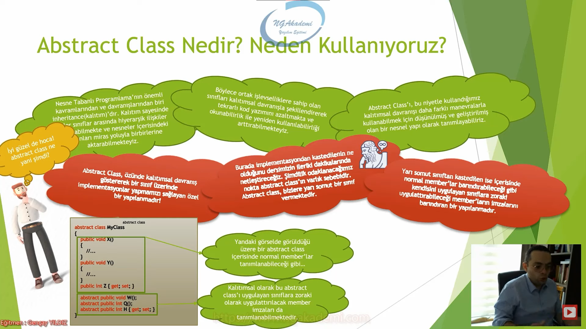
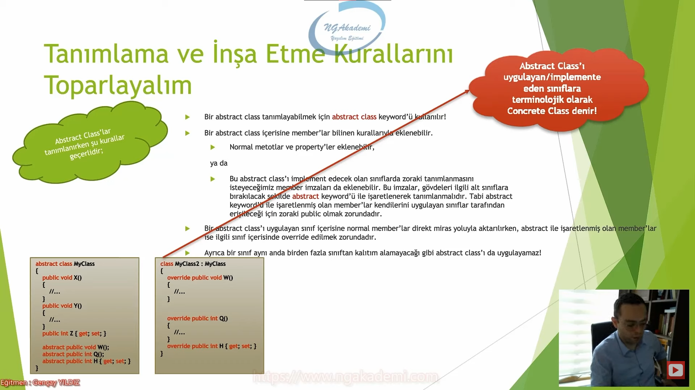
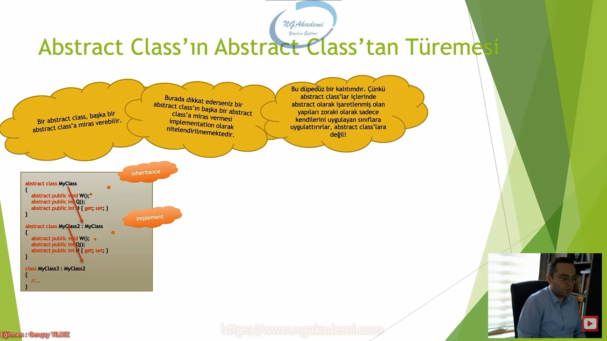
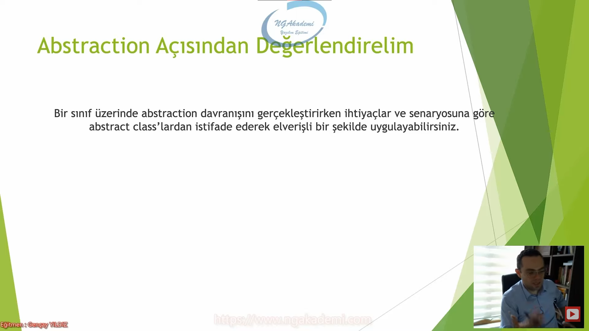

***
# Nesne Tabanlı Programlama #27 - Abstract Class Nedir? Ne Amaçla Kullanılmaktadır?


## Abstract Class Nedir? Neden Kullanıyoruz? 
- Nesne Tabanlı Programlama'nın önemli kavramlarından ve davranışlarından biri inheritance(kalıtım)'dır. Kalıtım sayesinde bizler sınıflar arasında hiyerarşik ilişkiler oluşturabilmekte ve nesneler içerisindeki elemanları miras yoluyla birbirlerine aktarabilmekteyiz.

- Böylece ortak işlevselliklere sahip olan sınıfları kalıtımsal davranışla şekillendirerek tekrarlı kod yazımını azaltmakta ve okunabilirlik ile yeniden kullanılabilirliği arttırabilmekteyiz.

- `abstract class`ı, bu niyetle(bir sınıftaki memberların okunabilir olacak şekilde yeniden kullanılabilir olacak şekilde yeniden farklı bir sınıfa aktarılması niyetiyle) kullandığımız kalıtımsal davranışı daha farklı manevralarla kullanabilmek için düşünülmüş ve geliştirilmiş olan bir nesnel yapı olarak tanımlayabiliriz.

- Nesne tabanlı programlama felsefesini kullanan yazılımcı açısından kalıtım olmazsa olmaz bir yapılanmadır. Kalıtım burada mihenk taşıdır. Olayın önemli kavramlarından en önemlisidir.

- Kalıtımda niyetimiz bir sınıftaki memberları mümkün mertebe yönetilebilir yeniden kullanılabilir okunabilir bir şekilde farklı sınıflara aktarabilmekti. Özündeki neden budur.


- `abstract class` özünde kalıtımsal davranış göstererek bir sınıf üzerinde implementasyonlar yapmamızı sağlayan özel bir yapılanmadır.

- Burada implementasyondan kastedilenin ne olduğunu dersimizin ileri dakikalarında netleştireceğiz. Şimdilik odaklanacağımız nokta `abstract class`'ın varklı sebebidir. `abstract class`, bizlere yarı somut bir sınıf vermektedir.

- Yarı somut sınıftan kastedilen ise içerisinde normal member'lar barındırabileceği gibi kendisini uygulayan sınıflara zoraki uygulattırabileceği/implementasyon edebileceği member'ların imzalarını barındıran bir yapılanmadır.

- Bir `abstract class` içerisinde normal member'lar tanımlanabileceği gibi... Kalıtısımsal olarak bu `abstract class`'ı uygulayuam sınıflara zoraki olarak uygulattırılacak member imzaları da tanımlanabilmektedir.

- Bir sınıf  `abstract class`tan kalıtım alıyorsa biz buna kalıtım demeyeceğiz inheritance demiyeceğiz implementation diyeceğiz.

- Yarı somut sınıftan kasıt içerisinde normal member'lar barındıran sınıf yani sınıfın normal hali normal property'dir field'dır metottur bunları barındıran hali. Birde bunun dışında kendisini uygulayacak yani implemente edecek sınıflara zoraki uygulattırabileceği memberların imzalarını barındıran bir yapılanmadır. Bu da soyut taraf.




- Yani anladığım kadarıyla `abstract class` denen bu yapı özünde normal sınıf memberlarıyla birlikte bu `abstract class`ı uygulayan/implemente eden sınıflara zoraki olarak uygulattırılacak member imzalarını da barındıran bir yapı!

- `abstract class`ı uygulayan sınıflara neden zoraki olarak uygulatmak isteyeceğimiz member'lar olsun?


- Yazılım süreçlerinde `abstract class`ları kullanma nedeni herhangi bir ihtiyaca istinaden değildir! `abstract class`lar tercihen kullanılan yapılardır!

- Evet genellikle `abstract class`lara direkt gereklilik olduğu bir durum hiçbir zaman söz konusu olmayacaktır. Ancak belirli durumlarda iradeli bir şekilde `abstract class`lar ile davranış sergilemeyi tercih edebilir ve varsa sorunlarınız daha basitleştirici unsur olarak `abstract class`ları kullanabilirsiniz.

- Şöyle ki bir `abstract class` ile kalıtımsal olarak istediğiniz davranışlarla birlikte zoraki olarak uygulatmak istediğiniz davranışları bir bütün olarak tasarlayabilirsiniz.

- Ve bu tasarıyı istediğiniz sınıflara uygulatarak hem kalıtımsal aktarımda bulunabilir hem de o sınıflar içerisinde zorunlu olarak ilgili davranışları tanımlatabilirsiniz.

- Böyle bir davranışın gerekli olduğu bir senaryoyu söylememiz pek mümkün değildir. Amma velakin bu tarz bir davranışı gerçekleştirebilmeniz için `abstract class`lardan istifade edebilirsiniz.

- `interface`in amacı vardır o amaç için üretilmiştir. `abstract class`ında bir amacı vardır da o amaç için üretilmemiştir. O amacç doğrultusunda tercihen `abstract class`ı kullanabilirsin.

- Bellek optimizasyonu amaçlı çalıştığımız operasyonlarda belirli optimizasyonlarda deriz ki ya entity'leri gardaşım `record`larla ya da `struct`larla yaparsak bu tarz bir amaca uygun olur. Bunların varlık sebebi var. Ama `abstract class` burada amaca uygun olacaktan ziyade ya bu işi `abstract class`la yaparsak daha çok hoşumuza gidebilir. Bir alternatiftir `abstract class`.

- Template design pattern'da `abstract class`lar biçilmiş kaftandır.

- Hem normal sınıf davranışı gösterecek hem de kendisini uygulayan kendisinden kalıtım alan sınıflara zoraki şu şu şu memberları şu yapılanmaları oluşturacaksın kardeşim dedittirecek yani böyle bir ihtiyacın varsa zaten `abstract class`tan istifade edebiliyorsun. Yani yapının kuralı/tabiatı gereği böyle davranış sergiliyor.


## Abstract Class'ın Yapısal Özellikleri Nelerdir?
- `abstract class` bilinmesi gereken özelliği her ne kadar `abstract` olsa da özünde bir `class`tır. Yani referans türlü bir yapılanmadır. Dolayısıyla `abstract class` türünden belleğin STACK bölgesinde bir referans noktası edinilebilir ve bu referansla HEAP'te ki uygun nesneler işaretlenebilir.

- `abstract class` ise haliyle yine referans noktası alınabilir bir yapılanmadır. Yani bu `abstract class` tarafından implemente edilmiş olan ya da `abstract class`tan türemiş olan sınıfların nesnelerini biz bu referans üzerinden işaretleyebileceğiz.

```C#
A a;

abstract class A
{
    
}
```

- `abstract class`lar soyut yapılanmalar olduğu için yapısal olarak iradeli bir şekilde(`new` operatörü ile vs.) nesne üretilebilir bir tür değildir!

- `new MyClass();` Yani bu şekilde bir `abstract class`tan nesne üretmeye çalışmak mümkün değildir!

- Ama bu `abstract class` türünden bir nesne hiçbir zaman olamaz anlamına gelmemektedir.

- Kalıtımsal olarak bir `abstract class` herhangi bir sınıfa miras verdiği taktirde buradaki davranış şöyle olacaktır;
  * Kalıtımsal durumun söz konusu olduğu durumlarda `new MyClass2();` komutu ile MyClass2 isimli sınıftan  bir  nesne üretilirse eğer burada kalıtımsal olarak hiyerarşinin gereği olarak `abstract class`ın da dahil normal `class`ın nesneleri üretilecektir.  

- `abstract class`lardan nesne üretemezsin.

- `abstract class`tan senle ben nesne üretemiyoruz ama compiler üretiyor.

- Biz kendi irademizle bir `abstract class`tan nesne üretemesekte kalıtımsal/implementation durumlarında `abstract class`ı kullanıyorsak eğer hiyerarşik olarak altındaki torunlarında bulunan sınıflarda nesne üretirken o `abstract class`tan da compiler nesne üretmiş olacaktır.
  
- `abstract class`lardan nesneyi biz üretmeyiz ama `abstract class`ın nesnesi olabilir HEAP'te o referanstan bir nesne tanımlanmış olabilir. Bu nesneyi oluşturmanın tek yolu da kalıtımsal hiyerarşidir. Amma velakin `interface`ler bu hiç olmaz mümkün değildir.

- `interface` türünden bir nesne mümkün değil!

- Demek ki `class`lar eğer ki `abstract class`ları implemente ediyorlarsa bu durumda `abstract class`lardan nesneler üretiliyor. Yani ilgili `class`tan bir nesne/instance talebinde bulunduğumuz taktirde o `class`ın base'i olan `abstract class`tan da bir instance üretilir.

- Kalıtımsal durumlarda `abstract class`ların nesneleri oluşturuluyorsa eğer bu constructor'ları tetikleniyor demektir! Haliyle bizler irademizle her ne kadar `abstract class`lardan nesne üretemesekte, içerisinde constructor tanımlayabilir ve kalıtımsal süreçlerdeki üretilecek olan nesneyi yapılandırabiliriz.

```C#
A a = new _A();

abstract class A
{
    public A()
    {
        System.Console.WriteLine("A Abstract Class");
    }
}

class _A : A
{
    public _A()
    {
        System.Console.WriteLine("_A class");
    }
}
```


## Tanımlama ve İnşa Etme Kurallarını Toparlayalım 
- Bir `abstract class` tanımlayabilmek için `abstract class` keywordü kullanılır!

- Bir `abstract class` içinde memberlar bilinen kurallarıyla eklenebilir.
  * Normal metotlar ve property'ler eklenebilir.  
   ya da
  * Bu `abstract class`ı implement edecek olan sınıflarda zoraki tanımlanmasını isteyeceğimiz member imzaları da eklenebilir. Bu imzalar, gövdeleri ilgili alt sınıflara bırakılacak şekilde `abstract` keywordü ile işaretlenerek tanımlanmalıdır. Tabi `abstract` keywordü ile işaretlenmiş olan member'lar kendilerini uygulayan sınıflar tarafından erişileceği için zoraki `public` olmak zorundadır.

- Bu `abstract class`ı uygulayacak olan gerçek sınıfların içerisinde hangi memberların olmasını istiyorsak zorunlu olarak tanımlanmasını istediğimiz memberlar nelerse onları da burada soyut bir şekilde özet mahiyetinde ifade ediyorduk. Bunları ifade ederken `abstract` keywordü ile ifade ediyorduk. Sadece imzlarını tanımlıyoruz ve bunların gövdelerinin tanımlanmasını ilgili somut sınıflara bırakırız.

```C#
abstract class MyAbstractClass
{
    int a;
    public void X()
    {

    }
    public int MyProperty { get; set; }

    abstract public void Z();
}
```

- Bir `abstract class`ı uygulayan sınıf içerisine normal member'lar direkt miras yoluyla aktarılırken, `abstract` ile işaretlenmiş olan member'lar ise ilgili sınıf içerisinde `override` edilmek zorundadır.

- Eğer ki ben `abstract class`ın içerisinde `abstract`la işaretlenmiş olan yapıyı oluşturmazsam bu projeyi derleyemem compiler izin vermez.

- `override` kalıtımsal ilişki süreçlerinde base `class`ta `virtual` ile işaretlenmiş olan bir member'ı ezmemizi sağlayan ezip içini tekrardan o sınıfa özel bir şekilde yapılandırmamızı sağlayan bir keyworddür. Dolayısıyla `override` keywordünü biz bir de `abstract class`larda implementasyon yaparken kullanıyoruz.

- `virtual` yapılanmalarla `abstract class`lardaki `abstract` yapılanmalar arasındaki fark `virtual` olan bir yapılanmayı sen opsiyonel `override` edebilirsin. Kendi tercihine kalmıştır. İster `override` etmeyip base `class`taki yetenekleriyle kullanabilirsin o member'ı istersende `override` edip o sınıfa özel davranışı da yapılandırmasıyla da yola devam edebilirsin. Ama `abstract class`ta `abstract` işaretlenmiş bir member'ı zorunlu olarak `override` etmek zorundasın. Eğer mevzu bahis `abstract class`sa o zorunlu/şartsız koşulsuz `override` edilmek zorundadır. Zaten aksi taktirde compiler hata verecektir.

- Ayrıca bir sınıf aynı anda birden fazla sınıftan kalıtım alamayacağı gibi `abstract class`ı da uygulayamaz!

- `abstract class`ı uygulayan/implemente eden sınıflara terminolojik olarak Concrete Class denir!

- `abstract class` kendi içerisinde belirli kontratlara sahip lan bir yapılanma olacak bizim için. Hani içinde kuralları olacak. İçindeki kurallar/kontratlar aslında içindeki `abstract` yapılanmalar. Bunu implemente eden sınıflar ise bunun somutu olacak. Artık buradaki sözleşmenin gerçekleştirildiği somut yapılar olacak. Somut sınıflar olacak. Haliyle terminolojik olarak bir mimaride `abstract class` kullanılıyorsa o `abstract class`ı implemente eden sınıf bunun concrete'i olarak nitelendirilir.




- `abstract class` yapılanmasında `abstract` ile işaretlenmiş olan imzalar concrete yapılanmada/`class`ta zoraki implement edilmek zorundadır. Buradaki implementasyonda imzaların birebir aynı tutarlı olmasına dikkat edeceksiniz mecbursunuz buna. `virtual` bir yapılanmayı `override` ederken imzasına nasıl uyuyorsa `abstract class`ın içerisindeki `abstract` yapılanmaları da `override` ederken imzaları birebir uymak zorundadır.

- `abstract` olan memberların gövdelerini tanımlarken o memberlar zoraki `public` olmak zorundalar.

- `abstract class` içerisindeki `abstract` yapıların concrete `class` içerisinde tanımları `public` olmak zorundadır.

- `abstract class`lar bir sınıfın sözleşmesi mahiyetinde kendi içerisinde zorunluluğunu ifade etmektedir. Haliyle bir `class` bu `abstract class`ı uyguladıysa kesinlikle içerisinde zorunlu olarak `abstract` yapıların olmasını bekleriz. Kesinlikle bekleriz. Kesinlikle beklenen bişeyin `private` olmasına gerek yok. Haliyle `public` olarak bunlar işaretlenmelidir. Yani kesinlik olduğu için concrete `class` `abstract class`ı implemente ediyor demek ki concrete `class` `abstract class`ın içerisindeki `abstract` yapılanmaların garantisini veriyor diyorsak eğer o zaman bu yapılanmaların concrete sınıf üzerinden oluşturulacak instance üzerinden erişilebilir olması gerekiyor. Doğru mantık bundan dolayı bunların `public` dışında bir access modifier'la işaretlenmesi engellenmiştir.

## Abstract Class'ı Uygulamaktan Kastettiğimiz Nedir?
- `abstract class`ın söz konusu olduğu durumlarda implementation yani uygulama fiiliyatı mevzu bahistir. Ki bu durum sonraki derste göreceğimiz `interface` içinde geçerlidir.

- Implementation'ı `abstract class`ın bir sınıfa kalıtım vermesidir. Yani bir başka deyişle kalıtımsal bir ilişkinin olduğu bir durumda eğer ki base `class` bir `abstract class` ise biz oradaki durumu implementation olarak nitelendirmekteyiz.

- İki yapımız var eğer ki bu iki yapı sınıfsa biz buna inheritance diyoruz. Yok eğer bu yapılardan base olan `abstract class` diğeri normal `class`sa bu duruma implementation/uygulama diyoruz.

- C#'ta kalıtım ya da implementasyon farketmiyor ikisi de `:` operatörü ile gerçekleştirilir.

- C#'ta bazı operatörler kullanıldığı noktaya göre farklı anlamlar/davranışlar ifade edebilirler.

- İmplementasyon'dan kastedilen şudur ki, `abstract class` içerisinde tanımlanmış olan bazı imzaların kalıtımsal davranış neticesinde zoraki olarak alt sınıfa uygulattırılması ya da bir başka deyişle oluşturulmasıdır! 

- İmplemente ediyorsun bu sözleşmeyi uyguluyorsun.


## Abstract Class'ın Abstract Class'tan Türemesi
- Bir `abstract class` başka bir `abstract class`a miras verebilir. 

- Burada dikkat ederseniz bir `abstract class`ın başka bir `abstract class`a miras vermesi implementation olarak nitelendirilmektedir.

- Bu düpedüz bir kalıtımdır. Çünkü `abstract class`lar içlerinde `abstract` olarak işaretlenmiş olan yapıları zoraki olarak sadece kendilerini uygulayan sınıflara uygulattırırlar, `abstract class`lara değil! 

- `abstract class` `abstract class`'la akrabaysa eğer bu bir kalıtımsal akrabalıktır.

```C#
Z z = new();

abstract class X
{
    public void A() { }

    public void B() { }

    public void C() { }

    public abstract void D();
    abstract public void Z();
}

abstract class Y : X
{
    public void E() { }
    abstract public void F();
}

class Z : Y
{
    public override void D()
    {
        throw new NotImplementedException();
    }

    public override void F()
    {
        throw new NotImplementedException();
    }

    public override void Z()
    {
        throw new NotImplementedException();
    }
}
```



## Abstract Class Referansı İle Nesneyi İşaretleme
- `abstract class` yapısal olarak bir referans türlü değişken olduğu için polimorfizm kuralları gereği kendisini uygulayan tüm sınıfları ve bu sınıflardan kalıtım alan alt sınıfları referans edebilmektedir.


## Abstraction Açısından Değerlendirelim
- Bir sınıf üzerinde abstraction davranışını gerçekleştirirken ihtiyaçlar ve senaryosuna göre `abstract class`lardan istifade ederek elverişli bir şekilde uygulayabilirsiniz.

- abstraction'a `interface`ler daha elverişlidir.



## Özetlersek
- Bir sınıfın uyması gereken temel yapıyı tamamlamak için `abstract class` yapısını kullanabilir ve gerekli modellemeyi gerçekleştirebilirsiniz. 
  * Buradaki uyulması gereken temel yapıdan kasıt `abstract class` içindeki `abstract` imzalardır/memberlardır. Dolayısıyla bu `abstract class`ı uygulayan/implemente eden bu sınıftan bu `abstract class`tan kalıtım alan bütün sınıflar `abstract` olarak işaretlenmiş imzaları/memberları zoraki uygulayacağından dolayı bu taslağa bu modellemeyi ihtiyaç doğrultusunda kullanabilirsiniz.

- `abstract class`lar bir çeşit abstraction yapılanmasıdır. Davranışların var olduğunu garanti eder lakin davranışının implementasyonunu `interface`ler de ki gibi zorunlu kılmaz!
  * `abstract`la işaretlenmiş olan yapılanmalar zorunlu olarak uygulatılıyor/implement ediliyor. Ama `abstract` ile işaretlenmemiş normal memberları miras olarak aktarabiliyorsun. `interface`lerde zorunlu olarak uygulattırırız.

- `abstract class`lar, `interface`ler ile concrete/normal `class`lar arasında bir yapıdır.
  * Ne `interface`tir ne normal `class`tır arada kalmış kişiliksiz amorf bir yapıdır. `interface`in özelliğini gösterebiliyorsun `abstract` ile işaretlediğin memberları zoraki/zaruri bir şekilde oluşturabiliyorsun. Normal `class`larda oldupu gibi miras davranışı sergileyebiliyorsun arada kalmış bir yapıdır.

- `abstract class`lar birçok senaryo için geçerli olabileecek genel davranışlar sağlayabileceği ancak kimi senaryolar için ise özel davranışlarda barındırabileceği bir sözleşmedir.
  * İçerisindeki imzaları zorunlu olarak kalıtımsal süreçlerde uygulattıran bir sözleşme.

- `abstract class` doğrudan inheritance ve polimorfizm ile bağlantılı bir kavramdır. Özellikle inheritance olmaksızın `abstract class` kullanılamaz! Keza inheritance amaçlı kullanılan yapı `abstract class` ise o zaman oradaki ifadeye implementation denir.
  * Çünkü `abstract class`lardan bir nesne üretemediğimiz için illaki kalıtımsal/implementasyon durumlarında kullanıyorsunuz başka bir yerde bir naneye yaramaz.

- `abstract class`lar(`inteface`ler de aynı şekilde) loose coupling'i destekler.

- Yani sonuç olarak `abstract class` pek gerekli bişey olmasa da faydalı bir yapıdır diyebiliriz...

- Bu tarz yapılanmalar kodlama süreçlerinde illa ki bazı senaryolarda ciddi manada avantajlı olabiliyor. Template design pattern olsun ya da event sourcing yapılanmasını modellerken orada böyle `abstract class`larla ekstradan çalısşma sergilemek olsun vs. illaki yarıyor ama onlar için üretilmiyor.


## C# Examples
```C#
Z z = new();

abstract class X
{
    public void A() { }

    public void B() { }

    public void C() { }

    public abstract void D();
    abstract public void Z();
}

abstract class Y : X
{
    public void E() { }
    abstract public void F();
}

class Z : Y
{
    public override void D()
    {
        throw new NotImplementedException();
    }

    public override void F()
    {
        throw new NotImplementedException();
    }

    public override void Z()
    {
        throw new NotImplementedException();
    }
}

//A a = new _A();

abstract class A
{
    public A()
    {
        System.Console.WriteLine("A Abstract Class");
    }
}

class _A : A
{
    public _A()
    {
        System.Console.WriteLine("_A class");
    }
}

abstract class MyAbstractClass
{
    int a;

    public void X() { }

    public int MyProperty { get; set; }

    abstract public void Z();
    abstract public void W(string a, int b);
    public abstract int Y { get; set; }
    abstract public bool H();
}

//Abstract Class içerisindeki `abstract` yapıların concrete `class` içerisinde tanımları `public` olmak zorundadır.
class MyClass : MyAbstractClass
{
    public override int Y { get; set; }

    public override bool H()
    {
        throw new NotImplementedException();
    }

    public override void W(string a, int b)
    {
        throw new NotImplementedException();
    }

    public override void Z()
    {
        throw new NotImplementedException();
    }
}
```