# Nesne Tabanlı Programlama #28 - Interface Nedir Ne Amaçla Kullanılmaktadır - I
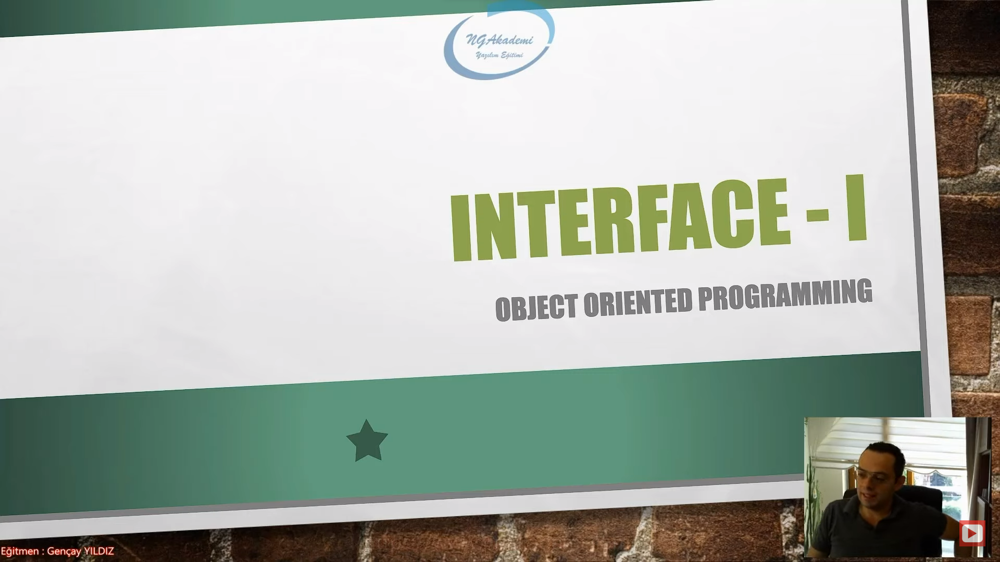

## Interface Nedir?
- Programlama süreçlerinde interface yapılanması, nesnelere direkt olarak bir arayüz/şablon oluşturulmasını ve bu arayüz üzerinden geliştirici ile nesne arasındaki etkileşimin daha da kolaylaştırılmasını sağlayan bir araçtır.

- nesnelere direkt olarak bir arayüz/şablon oluşturmamızı sağlıyor. Bu arayüz şablon üzerinden yani interface denilen yapılanma üzerinde nesne ile geliştirici arasında bir bağ kuruyor. Nesne ile geliştirici arasındaki etkileşimi bizler nesne referansı üzerinden gerçekleştiriyorduk ya bunun yerine interface üzerinden gerçekleştireceğiz.

- Interface Nesnelere bir şablon/maske/arayüz oluşturmamızı sağlayan yapılanmadır. Haliyle bizler bu yapılanmayı kullanarak nesneler üzerinde çalışmalarımızı gerçekleştirebiliriz.

- Hatta sadece geliştirici ile nesne arasındaki süreci kolaylaştırmamakta, ayrıca bir programın farklı bir programla yahut bileşenle etkileşimini de kolaylaştırmaktadır.

- Bir nesneye interface üzerinden uyguladığımız şablon sayesinde geliştirici ile nesne arasındaki etkileşim daha da kolaylaştırılıyorsa mantıken programlar arasında ya da geliştiriciyle farklı bir bileşen arasında ya da programla mevcut olan uygulamayla farklı bir bileşen arasında interface sayesinde ortaya koyacağımız şablonla bir standart meydana getirebilir ve bu yapılar arasındaki etkileşimi iletişimi daha da kolay hale getirebiliriz.

- Interface Türkçe anlamı arayüz demek ya ara şablon interface bir şablon ortaya koyuyor. Bu şablona uyan herkes ekstradan herhangi bir ayrıntıyı düşünmeksizin davranışını ortaya koyabiliyor.
    * Herhangi bir mağazadan almış olduğunuz elektronik bir cihazı evdeki prize takmak istediğinizde önceden bir kaybınız oluşuyor mu yani bu fiş evdeki prize girer mi diye bir düşünceniz oluyor mu? Hayır. Niye? Çünkü fişler'le prizler arasında bir standart var. Dolayısıyla bu standart sizin ekstradan sorgulamanızı ekstradan ayrıntılarda boğulmanızı törpülüyor. Interface'de bunu sağlıyor.

- Interface nesne ile kullanıcı/geliştirici arasında ya da programlar arasında ya da programla bileşen arasındaki etkileşim sürecindeki varolan fazlalıkları ekstradan ayrıntı gerektiren durumların hepsini törpülüyor bize net bir şablon sağlıyor. Bizde bu şablon üzerinden davranışlarımızı şekillendiriyoruz.

- Elimizde bir nesnemiz var. Bu nesnenin içerisinde onlarca member olabilir. Bu onlarca member'dan hangisini hangi maksatla kullanacağımı bilemeyebilirim. İşte böyle bir durumda devreye interface giriyor. Interface bize bir şablon sağlıyor. Biz bu interface üzerinden ilgili nesneyle etkileşim kurmaya çalıştığımızda onlarca member içerisinden sadece interface'te belirtilen memberlara erişim gösterebiliyoruz. Yani bu interface bana sağladığı şablon sayesinde lüzumsuz ayrıntılardan süreci arındırıyor.

- Interface nesnenin içerisinde o anda bana lazım olan memberları getiriyor. Ben direkt artık ekstraları sorgulamaksızın ayrıntılarda boğulmaksızın ilgili memberlar'ın üzerinden çalışmalarımı sergileyip davranışlarımı gösterip operasyonumu gerçekleştiriyorum.

- Geliştirici interface üzerinden nesneye baktığında netice itibariyle ilgili nesne içerisindeki tüm memberları değil interface'in bana sağlamış olduğu şablona karşılık gelen member'ları gösterecektir. Yani bu nesne üzerinde bir işlem yapacaksam eğer gereksiz ayrıntılara boğulmaksızın interface sayesinde o anda yapacağım operasyona uygun member'lara direkt erişim göstereceğim ve ona göre de gerekli operasyonumu yürüteceğim.

- Interface'in nesneye bir arayüz sağlaması, kullanıcı açısından, ilgili nesnenin nasıl çalıştığına dair ayrıntılı bilgiye ihtiyaç duyulmaksızın, sadece arayüzün sunduğu fonksiyonları veya property'leri kullanarak etkileşime girilmesini sağlar.

- Bir nesne düşünün içerisinde onlarca member olabilir. Onlarca member'ın içerisinden o anda yapacağın operasyona uygun olan member'ları direkt getirmek istiyorsan bir şablon kullanman gerekecek.
    * Bir hesaplama nesnesi düşünün içerisinde matematiksel olarak birçok hesaplama fonksiyonu var. Şimdi bu hesaplamalar içerisinden sadece alan hesaplamasıyla ilgili çalışma yapacaksam eğer bu onlarca member'ın içerisinden alan hesaplama fonksiyonlarını tek tek gözümle hani ayrıntılara boğularak seçmektense alan hesaplamayla ilgili bir interface oluştururum ve ihtiyaç doğrultusunda bu interface'i kullanarak alan hesaplama fonksiyonlarına kolaylıkla erişim gösterebilir davranışlarımı sergileyebilirim.

- Yani anlayacağınız inteface, o nesneye bir `abstraction` uygulayarak, belirlenmiş bir arayüz üzerinden çalışılmasını ve böylece ilgili nesne ile geliştirme sürecinin kolaylaştırılmasını sağlamaktadır.

- Interface birebir abstraciton davranışını sergilemizi sağlayan bir yapılanmadır.

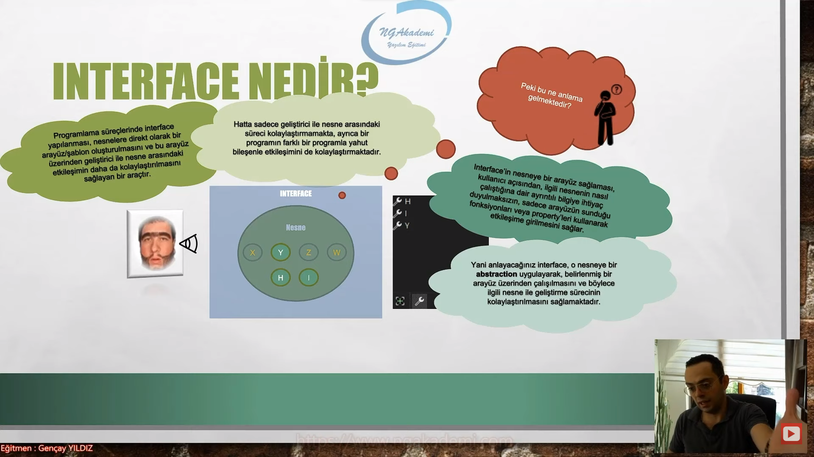

- İyi de hoca bu abstraction işlemini abstract class'la da gerçekleştiriyorduk! Interface'in bundan farkı nedir?
    * Evet abstraction'ı abstract class ile gerçekleştirebiliyorduk. Amma velakin, abstract class'lar da bir nesnenin içerisindeki imzaları modellemenin dışında farklı işlemleride gerçekleştirebiliyorduk! Bu duruma istinaden dil geliştiricileri daha sade ve sadece imzalara konsantre olmuş bir yapıya olan ihtiyacı hissettiler ve interface yapısını ortaya koydular diyebiliriz.

- Interface'de ne yapabiliyorsanız fazlasını abstract class'ta yapabiliyorsunuz. Ama interface abstract class'ların sadece ve sadece imzalara konsantre olmuş hali olarak üretilmiştir. Haliyle bu amaçla ortaya koyulmuş bir yapılanmadır.

- Interface abstract class'ın sadece imzalara konsantre olmuş halidir! O yüzden abstraction davranışı açısından abstract class'a nazaran daha elverişlidir.

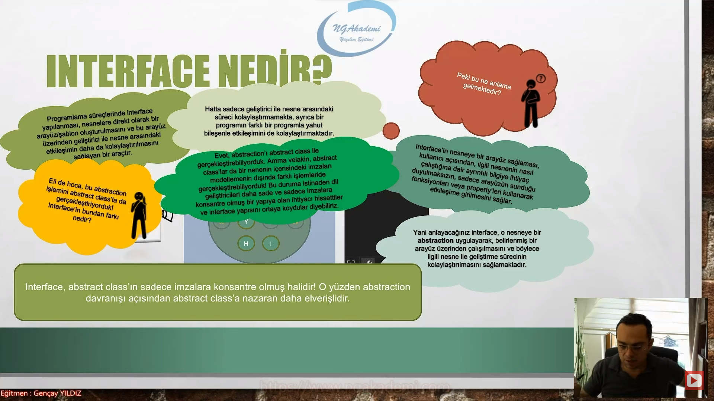

## Interface'in Genel Davranışı | Can-Do İlişkisi
- Interface'in genel davranışı can-do ilişkisidir.

- Interface'in olduğu bir çalışmada ister istemez can-do ilişkisi söz konusu olacaktır.

- Bizler bir sınıfta olmasını istediğimiz member'ları oluşturmadan önce bir interface'de bu member'ların imzalarını tanımlayarak bir şablon oluşturuyoruz.

- Ardından bu şablonu/interface'i kullanarak sınıfta member'ları tanımlıyoruz.

- Elimizde bir class var. Bu class'ın içerisine belirli member'ları koyacağız. Belirli davranışlar koyacağız. İşte bu davranışlar property'ler olabilir metotlar olabilir vs. Normalde interface'i bilmeyen adam direkt gelir class'ın içerisine bu member'ları oluşturmaya başlar. Ama artık interface'i bildiğimizden dolayı önce interface'te bu class'taki memberların imzalarını oluşturuyoruz ardından da bu interface'i class'a uyguluyoruz. 

- Bir interface var. Bu class'ın içerisinde oluşturulması beklenen member'ları bu interface'in içerisinde oluşturuyoruz. Bunlar imza olarak oluşturuluyor. Bir şablon mahiyetinde ardından bu imzalar bu class'ın içerisinde interface sayesinde oluştutturuluyor. Bu oluştutturulma sürecinde can-do ilişkisi söz konusu oluyor.

- Eee? yani interface olmadan da bu member'ları tanımlayabiliyorduk! Interface'in ne artısı var şimdi?
    * Bir sınıf bir interface kullanıyorsa eğer aynen abstract class'larda ki abstract elemanlarda olduğu gibi içerisindeki member'ların uygulanmasını/tanımlanmasını zorunlu kılmaktadır.

- Interface var class var. Class'ın içindeki member'ları interface'in imzasından almak istiyoruz. Yani bir class'ta interface kullanacağız. İşte böyle bir durumda interface'in içindeki imzalar ilgili class'a zorunlu bir şekilde tanımlanmak zorundadır. Yani o imzalara karşılık member'lar tam olarak gövdeleriyle birlikte tanımlanmak zorundadır. Bu zorunluluk bize can-do ilişkisini getirecektir.

- Anlayacağınız interface bir sınıfa içerisinde tanımlanacak member'ların kendi içerisindeki imzaların olacağının taahhüdünü vermektedir!

- Diyor ki ben bir interface'im benim içinmde bu imzalar var. Haliyle bu imzaları bu interface'i kullanacak olan class'larda kesinlikle tanımlamak zorundayız. Yani bir taahhüd ortaya koyuyoruz. İşte bu taahhüd can-do ilişkisini sergilediğimizi gösteriyor. Bu taahhüd sayesinde biz artık şöyle bir yorumda bulunabiliyoruz : Demek ki interface'ler kullanıldıkları class'lara kendi içlerindeki imzaları zorunlu bir şekilde uygulattırıyorlarsa zorunlu bir şekilde bu imzalara karşılık memberları oluştutturuyorlarsa o zaman interface'e baktığımız zamn bu interface'i uygulayan class'lar hangi member'ın hangi davranışın olabileceğini yani can-do'yu görebiliyoruz.

- İşte bizler de bu tahhüdden interface'in can-do ilişkisi/davranışı sergilediğini gözlemlemekteyiz.

- Interface'e bakarak hangi sınıf olursa olsun hangi davranışı yapabileceğini görebiliyorum.

- Hesaplama interface'ine bakan bir adam şunu diyebilir mi? Örneğin alanHesaplama diye bir fonksiyon imzası var içinde o zaman şöyle bir yorumda bulunabilir: Bu interface'i kullanan sınıflarda alan hesaplama işlemi yapılabilir. Can-Do ilişkisinin yorumunu direkt burada yapabilirsiniz. Sınıfı görmenize gerek yok. Interface'e baktığınız zaman zaten bu interface'i uygulayan bütün sınıflarla ilgili bu yorumda direkt peşinen bulunabiliyorsunuz.

- Interface, bir class içerisine tanımlanacak member'ları zoraki uygulattırdığı için o member içerisinde hangi davranışların, işlevlerin yani yeteneklerin olabileceğini özetlemektedir.

- Yani bir interface'e bakıldığında o `interface`'e bakıldığında o `interface`'i uygulayan sınıfların neler yapabileceği(can--do), hangi yeteneklere sahip olabileceği hakkında rahatlıkla yorumda bulunulabilmektedir.  

- İşte bu durumda `interface`lerin yapısal olarak nesnelerle can-do ilişkisi kurduğunu göstermektedir.

- `interface` mi var o zaman can-do ilişkisi söz konusudur.


- `INTERFACE` BİR SÖZLEŞMEDİR!

- `interface` içindeki imzaları kendisiyle çalışma yapan sınıflara zoraki uygulattırdığı için ilgili sınıflar açısından bir sözleşme mahiyetinde kullanılan bir yapılanmadır. Yani uzun lafın kısası `interface`in sınıflar açısından bir sözleşme olduğunu görebilirsiniz.

- `interface` bir sözleşme sınıflara zoraki olarak bir şablonu uygulatıyorsunuz. Bir sözleşme imzalamış oluyorsunuz. Bir `interface`i tanıladığınız zaman bu interface'i kullanacak olan sınıflar `interface` içindeki imzaları zoraki tanımlayacaklar. Kendi içlerinde/bünyelerinde bunu barındıracaklar. Yani bir taahhüd/sözleşme ortaya koymuş oluyorsunuz.


## Interface'i Neden Kullanılıyoruz?
- Peki `interface`i neden kullanıyoruz?
    * Farklı nesneler veya bileşenlera rasında iletişimi kolaylaştırmak, bir standarta tabi kılmak, birbirleriyle uyumlu hale getirmek için...
        + Class'ları bir `interface` sayesinde ortak bir zeminde buluşturabiliyorsunuz. Yani bir sözleşme mahiyetinde bu mantıkla da kullanabiliyorsunuz.
    * Sistemin ve mimarinin modüler bir şekilde tasarlanabilmesi için...
        + Bir class'taki member'ların her biri farklı bir davranışsa eğer bu davranışları bodoslama class'ın içinde tanımlamıyoruz. Biz bunları `interface`ler olarak farklı `interface`ler olarak yani bu davranışları hususi olarak barındıran bu davranışların imzalarını bir sözleşme mahiyetinde hususi olarak barındıran `interface`lerde tanımlıyoruz. Eğer ki class'lar bu davranışlara sahip olacaksa `interface`leri kullanarak bu davranışları class'lar içerisinde zoraki olarak uygulatıyoruz. Bu şekilde modüler bir tasarım ortaya koyabiliyoruz.
        + Hesaplama `interface`indeki maksadımız neydi? Bir class'ın içerisindeki onlarca member'ın içerisinden sadece hesaplamayla ilgili çalışma yapacak davranışları bu `interface`le bir modüler mantıkta bir araya getirmeye çalışıyorduk değil mi diğerlerinden ayırıyorduk. Yani biz bir class'ın içerisinde olacak member'ları davranışsal olarak birbirine yakın olacak şekilde `interface`lerle modüler hale getirip ihtiyaç doğrultusunda o class'a o `interface` üzerinden ilgili member'ları oluştutturuyoruz. Bu da davranışların modüler hale getirilmesini sağlamış oluyor.
        + Interface Segragation principle var arayüz ayrım prensibi. Arayüzleri ayırırız niye? Çünkü davranışları mümkün mertebe modüler hale getirebilmek için birbirlerinden bağımsız hale getirebilmek için birbirlerinden alakasız davranışları birbirlerinden bağımsız hale getirebilmek için. 
        + Single Responsibility principle var bu da tek sorumluluk prensibi mantığında kod yazabilmek için uyguladığımız prensip. Bu prensipte de mümkün mertebe her bir yapının tek bir sorumluluğa odaklı çalışmasını gaye ediniriz. Haliyle hesapla `interface`in içinde hesaplamanın dışında bir davranışın olması hem mantığa hem de prensibe aykırı olacaktır.
    * Farklı geliştiricilerin ve ekiplerin söz konusu olduğu çalışmalarda belirlenmiş bir arayüz üzerinden sınıfların tasarlanmasını sağlayarak, dökümantasyon gerektirmeksizin programatik kurallar koyabilmek için... 

- Evet beyler, bir iş yapacağız. İşin tüm tanımı ahanda bu interface'de.

- Örneğin bir iş yapılacak bu işin nasıl yapılacağını 6 saat bir döküman üzerinden developer'lara anlatmaktansa bir `interface` üzerinden rahatlıkla anlatabilirsiniz.

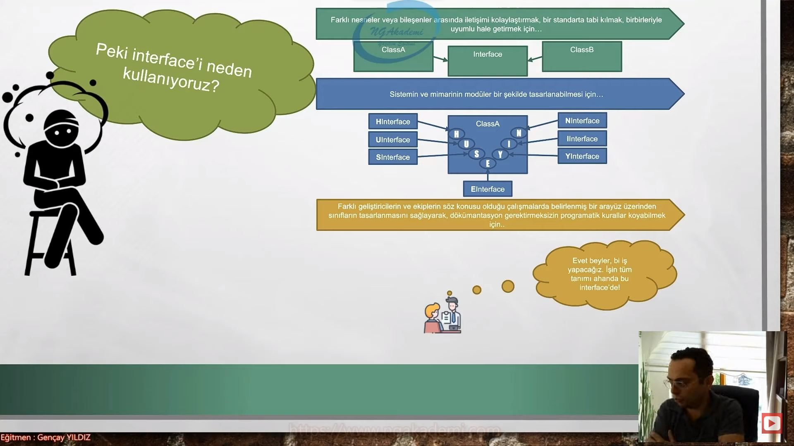

## Interface Tanımlama ve İnşa Etme Kurallarını Toparlayalım
- Bir `interface` tanımlamak istiyorsanız yapmanız gereken `interface` keywordünden istifade etmenizdir. Olay bu kadar basit. Normalde nasıl bir class oluşturuyorsak `class` keywordünden ya da record oluşturuyorsak `record` keywordünden istifade ediyoruz e `interface`'de oluştururken benzer mantıkla `interface` keywordünden istifade ederek bir tanımlama yapabiliyoruz.

```C#
interface IExample 
{

}
```
- Bir interface tanılayabilmek için `interface` keywordünden üstteki gibi istifade etmekteyiz.

- Bu yapılan tanımlama neticesinde IExample adında bir `interface` oluşturulmuş olacaktır.

- `interface` keywordünü kullandıktan sonra bu `interface`'e bir isim veriyoruz ve sonra `{}` açarak `interface`i oluşturmuş oluyoruz.

- `interface`'e yapacağımız çalışmaya uygun bir isim vermeye dikkat ediyoruz.

- Vee unutmayın! `interface`'ler referans türlü değişkenlerdir. Yani bir referanstırlar.

- Ben bir `interface` oluşturduğumda artık bir referans tanılayabiliyorum.

- Bu mantıkla olayı değerlendirdiğimizde üssteki tanım gereği artık ilgili program'da `IExample` adında bir referans türüde oluşturulmuştur diyebiliriz.

- Ayrıca şunu da bilmenizde fayda var ki; C# programlama dilinde bir `interface`e isim verirken adının `I` ile başlaması name conventions dediğimiz gelenektendir.

- C# programlama dilinde bir `interface` oluşturuyorsak bunun adını `I` ile başlatırız. Bu bir kültürdür.

- Bu gelenek sayesinde, geliştirici açısından `I` ile başlayan bir referansın `interface` olduğu direkt Intellisense'da anlaşılacak ve geliştiricin işi kolaylaşacaktır.

- İyi çok güzel Peki hoca bu `interface`'i nerede tanımlayabiliriz?
    * Bir class nerede tanımlanabiliyorsa `interface`de orada tanımlanabilir. Herhangi bir namespace, class, struct yahut `interface` içerisinde `interface` tanımlanabilir. Ya da isterseniz namespace dışında da tanımlama yapabilirsiniz.
    * Metotların içinde interface tanımlanır mı?
        + Metotların içerisinde operasyonel süreçler görürsünüz. Operasyon yapılır. Sen tanımlamayı bir inşayı metot içinde yapamazsın. Yani class'tır struct'tır record'dır `interface`tir metodun içinde bunların hiçbiri tanımlanmaz.
 
```C#
#region Interface Tanımlama ve İnşa Etme Kurallarını Toparlayalım

IMyInterface asdasdasad = null;//MyInterface türünden bir referans noktası alabiliyorum. Referans türlü değişken olduğu için buna direkt null atayabiliyorum
//Oluşturmuş olduğumuz interface'ler direkt bize bir referans türlü değişken sağlıyorsa haliyle biz ileride bu referans türlü değişkenle nesnelerimizi refere edebiliriz. 


interface IMyInterface { }//Interface yapılanması içerisinde imzaları barındıracağından dolayı haliyle scope'lardan oluşmaktadır. 


interface IMyInterfaceNamespaceDisinda //Namespace dışında da ben interface'i tanımlayabilirim.
{

}

namespace MyNamespace //MyNamespace içinde ben interface'i tanımlayabilirim.
{
    interface IMyInterfaceeNamespaceIcinde
    {
        
    }

    class MyClass //MyClass içinde ben interface'i tanımlayabilirim.
    {
        interface IMyInterfaceClassIcinde //IMyInterfaceClassIcinde içinde ben interface'i tanımlayabilirim.
        {
            interface IMyInterfaceeInterfaceIcinde
            {

            }
        }
    }
}
#endregion
```

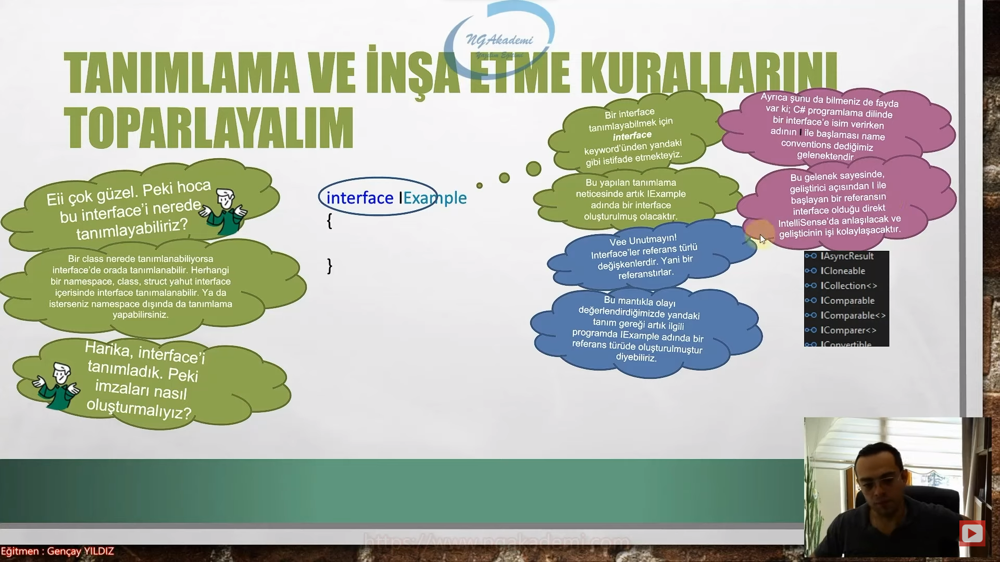

## Interface İçerisine İmzaların Oluşturulması
- Tanımlanmış bir `interface` içerisinde imzaların oluşturulması tabi ki de belirli kurallara tabiidir!

```C#
interface IExample
{
void AMethod();
int BMethod();
void CProperty{get; set;};
}

```
- Görüldüğü üzere bu `interface` içerisinde metot ve property imzaları tanımlanabilmektedir.

- İmza tanımlama sürecinde Access Modifier eşliğinde metot ve property'lerin gövdeleri tanımlanmaz! Sadece imzaları tanımlanır!

- absctract class'lardan hatırlarsanız public abstract işaretlemesinde bulunuyorduk imza tanımlama sürecinde ama `interface`in yapısı direkt imzalara odaklı yapı olduğu için direkt olarak sadece imza odaklı bir tanımlamada bulunuyoruz.

- abstract class'ta da `interface`te de temel gaye aynıdır. İkisinde de imza oluşturarak bu imzaları bu yapıları kullanan class'lara zoraki uygulatmak. 

```C#
#region Interface İçerisine İmzaların Oluşturulması
interface IMyInterface // interface'lerde direkt implementasyon direkt kendi içlerindeki imzaları kullanılan class'lara uygulattırmak vardır. Dolayısıyla burada zaten zorakilik olacağından dolayı public gibi bir durumun olmasına gerek yoktur. private olsa ne olacak. Sen hem imzayı tanımlayacan hemde private diyip bu imzaya karşılık bir member oluşturmamı diyeceksin? E haliyle erişim belirleyicisi interface'lerde kullanılmaz.
{
    void X();// Interface'te kalıtımsal herhangi bir davranış olmayacağından dolayı abstract gibi bişeyle işaretleme durumu da söz konusu değildir. Yani interface salt olarak direkt içerisindeki imzları kendisini kullanan class'lara zoraki uygulattıracak bir yapıya fıtrata sahiptir. Abstract class'lar belki değildir. 
    void Y(int a);
    int Z { get; set; }
}
abstract class MyAbstractClass //Abstract class'larda temel gaye direkt implementasyon değildir. Bazen kalıtımsal davranışta sergileyebilir. 
{
    public abstract void X();//Bizler abstract class içerisinde bu abstract class'ı kullanan implemente eden class'lara zoraki olarak belirli imzaları uygulatmak istiyorsak abstract işaretli ve bir yandan da public ile işaretli member'ları/imzaları tanımlamak gerekir. 
    //Bu imza neticesinde bu abstract class'ı implemente eden class'larda bu imzaya karşılık olan member zoraki oluştutturulacaktı.
    public abstract void Y(int a);//Abstract class'larda public olmak zorundadır. Private dediğinizde zaten bir anlam ifade etmeyeceğinden dolayı hata verir. Ama buranın kuralı gereği public'in kullanılması zaten zorunludur. interface'de ona hiç gerek yoktur. Ayriyetten abstract class'larda tanımlanmış olan imzaların abstract ile işaretlenmesi gerekmektedir. Bunun implemente edilecek bir imza olduğu compiler tarafından anlaşılsın.
    public abstract int Z { get; set; }

    public bool D() //Abstract class'ta böyle bir fonksiyon olabilir ve bu fonksiyonu kalıtımsal olarak kendisini kullanan/kalıtım alan sınıfa aktarabilir. Bunun dışında ekstradan public abstract ile işaretli olan imzaları da bir yandan oraya da implemente ettirebilir.
    {
        return true;
    }
}
// İki türlü bir davranış söz konusu abstract class'ta. Ama interface'te ikinci bir davranış yok. interface'te imzalar var. ve bu imzaların karşılıkları direkt kensini uygulayan sınıfa zoraki uygulattırılması var.
#endregion
```

- Ve ayruca dikkat ederseniz abstract class'lar da olduğu gibi imzalar `abstract` keywordü eşliğinde de TANIMLANMAMAKTADIR! Abstract class'lar içlerinde derived class'lara miras olarak aktarılacak member'ların eşliğinde biryandan da zoraki uygulatılacak member'ları barındırabildiği için bu farkı abstract keyword'ü ile ortaya koymaktadırlar. Lakin interface'ler sade ve sadece sınıflara uygulatılacak imzaları barındırdıkları için bu şekilde bir ayrıma gereksinim görülmemiştir!

- Ayrıca `interface` içerisinde field tanımının mümkün olmadığını bilmenizde fayda vardır!
    * Bunun nedeni, field'ların metotlar ve property'ler tarafından operatif olarak kullanılmalarıdır. Operasyonel yapılardır field'lar. Haliyle metotların yahut property'lerin kullanacakları operatif değişkenleri tanımlamak ihtiyaç sürecinin bir parçası olacağı için `interface` içerisinde tanımlanmaları gereksiz/saçma olacaktır. Bu yüzden field tanımı yasaklanmıştır.
    * Yani field metotların ve property'lerin içerisinde operasyonel süreçlerde kullanılan class'ın bir parçası olacağından dolayı bu class'ın parçasını `interface`te belki şu operasyona istinaden lazım olur diye baştan öngörüpte tanımlamak çokta akıl karı değildir. Class'ın bir parçası olabilecek şekilde bir field'a ihtiyacın varsa o andaki operasyon sürecinde bunu öngörüp tanımlaman daha doğru olacaktır.
    * Field'ların `interface`te tanımlanma gereği bu şekilde ortadan kaldırılmıştır. Bu gerekçeyle saçma olur çünkü. Yersiz bir tanımlamaya izin verilmiş olur. Programlamada biz bonkör değiliz. Bonkör olmadığımız gibi kullandığımız programlama dili de bonkör değildir. Gereksiz olan birşeye izin verilmemiştir birçok noktada.

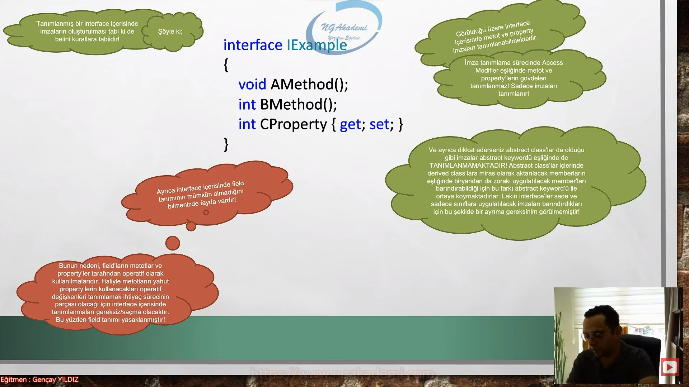

## Interface Kullanımı
- `interface`ì kullanabilmek için kalıtım sürecinde kullandığımız : operatöründen aşağıdaki gibi istifade etmekteyiz.

```C#
class MyClass : IExample
{

}
```

- Dikkat ederseniz sankş kalıtım alıyormuş gibi : operatörü eşliğinde `interface`i kullanabiliyoruz.

- Burada : operatörü eşliğinde `interface` kullanıldığı için artık bu kalıtım operatörü değil, uygulama/implementation operatörü olarak nitelendirilecektir.

- Abstract class'laradaki : operatörü mantığı birebir burada da aynıdır.

- `class A : B` => Bir A class'ımız olsun bu A Class'ını eğer ki ben B den türetiyorsam B bir class'sa bu bir inheritance'tır/kalıtımdır. B bir abstract class'sa bir implementation'dır. Benzer mantıkla eğer ki bir interface ise yine bir implementation'dır.

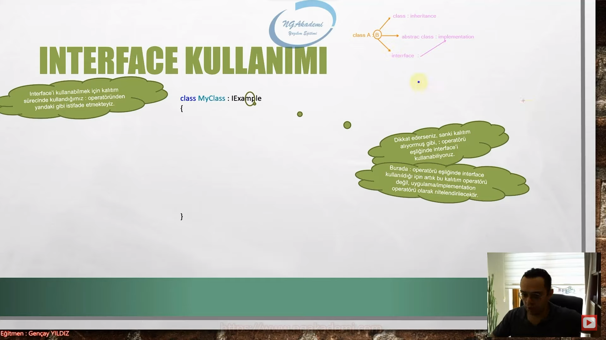

- Ya da bir başka deyişle : operatörüyle birlikte kullanılan yapı bir class değil de `interface` ise işte o zaman ilgili operatör `implementation` görevi görecektir. 

- Buradaki implementasyonun mantığı birebir abstract class'larla aynıdır. Yani `interface` içindeki imzaların ilgili class'a implemente edilme söz konusudur.

- Implementation; herhangi bir class'a herhangi bir interface'in/abstract class'ın : operatörü ile şablon/arayüz olarak sağlanmasıdır.

- Ya da başka deyişle, bir class'a başka bir class'tan kalıtım alıyorsa buna inheritance, yok eğer interface'den kalıtım alıyorsa buna implementation denir.

- Çünkü bir class'a interface'in uygulanması/implemente edilmesi demek o interface içerisindeki imzaların, o class'a zoraki dayatılması demektir. Bir sözleşme/taahüd veriyorduk ya bir zorakilik var. Haliyle bu eylem nihai olarak kalıtımsal bir davranıştan ziyade uygulama/implementasyon davranışıdır. O yüzden bu şekilde bir terminolojik betimeleme yapılmaktadır. Hatırlarsanız eğer abstract class'lar içerisinde abstract işe işaretlenmiş olan member'ların derived class'lara zoraki uygulatılmasına da implementation diyorduk. Çünkü her iki durumda aynı mantıktan beslenmektedir.

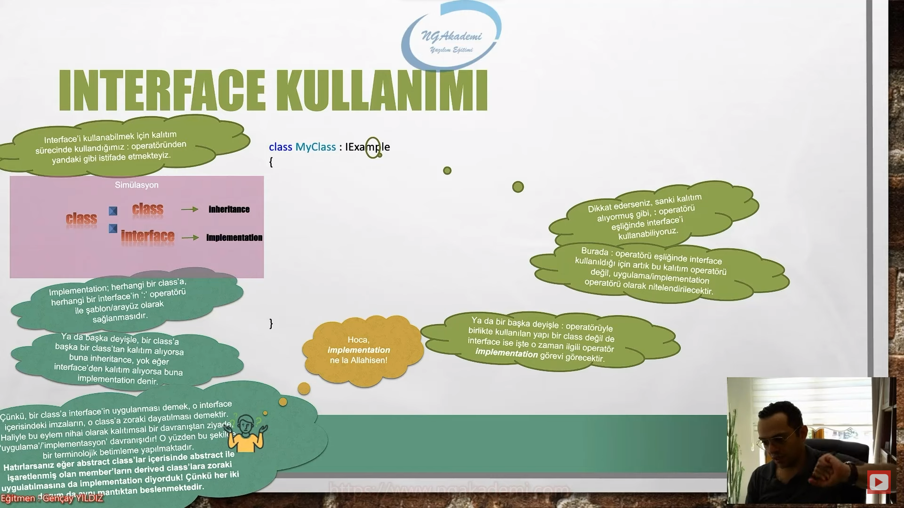

- Velhasıl kelam, aşağıdaki gibi bir implementation neticesinde MyClass içerisine IExample interface'i içerisindeki imzalar, gövdeleriyle birlikte zoraki uygulatılacaktır.

```C#
class MyClass : IExample
{
    public void AMethod()
    {

    }
    public int BMethod()
    {
        
    }
    public int CProperty {get; set;}
}
```

- Buradaki implementasyonun nasıl gerçekleştirildiğinin detaylarına birazdan gireceğiz. Bundan önce dikkatinizi çekmek istediğim bir nokta var ki o da, `interface` üzerinden yapılan implementation neticesinde uygulanan member'ların imzalarında abstract class'lardan yapılan implementation'da ki gibi override durumu söz konusu değildir!

- Abstract class'larda implementation yaptığın zaman override edilerek bu implementasyon gerçekleştirilir. Ama `interface`lerde sanki manuel yazmışsın gibi Herhangi bir override durumu falan söz konusu değil. IExample içindeki imzalar direkt oluşturulur Hani IExample'ı silsek bunlar burada kalacak. Override'lık bir durum yok. Direkt bu şekilde yazılıyor. `interface`'ten yapılan implementasyon neticesinde imzalara karşılık gövdeler sade bir şekilde tanımlanır. Çünkü `interface` nettir bu konuda direkt sözleşmedir ve bu sözleşmenin karşılığında içerisindeki imzalara karşılık gövdeleri class'ın içerisinde salt bir şekilde bekler. Abstract class'ta ise abstract ile işaretlenmiş olan imzalar derived class'ta yine implement ediliyor ama implement edilirken de override edilerek implement edilmek zorundadırlar.

```C#
#region Interface Kullanımı

class MyClass : MyAbstractClass
{
   public override int Z { get => throw new NotImplementedException(); set => throw new NotImplementedException(); }

   public override void X()//Abstract class'tan implementasyon yaptığımızda override keywordü eşliğinde implementasyon sağlanır.
   {
       throw new NotImplementedException();
   }

   public override void Y(int a)
   {
       throw new NotImplementedException();
   }
}

class MyClass : IMyInterface
{
    public int Z { get => throw new NotImplementedException(); set => throw new NotImplementedException(); }

    public void X()//interface'in içerisindeki imzalara karşılık member'lar direkt sade bir şekilde oluşturulur. Yani herhangi bir override falan yok.
    {
        throw new NotImplementedException();
    }

    public void Y(int a)
    {
        throw new NotImplementedException();
    }
}

interface IMyInterface
{
    void X();
    void Y(int a);
    int Z { get; set; }
}

abstract class MyAbstractClass
{
    public abstract void X();
    public abstract void Y(int a);
    public abstract int Z { get; set; }

    public bool D()
    {
        return true;
    }
}
#endregion
```

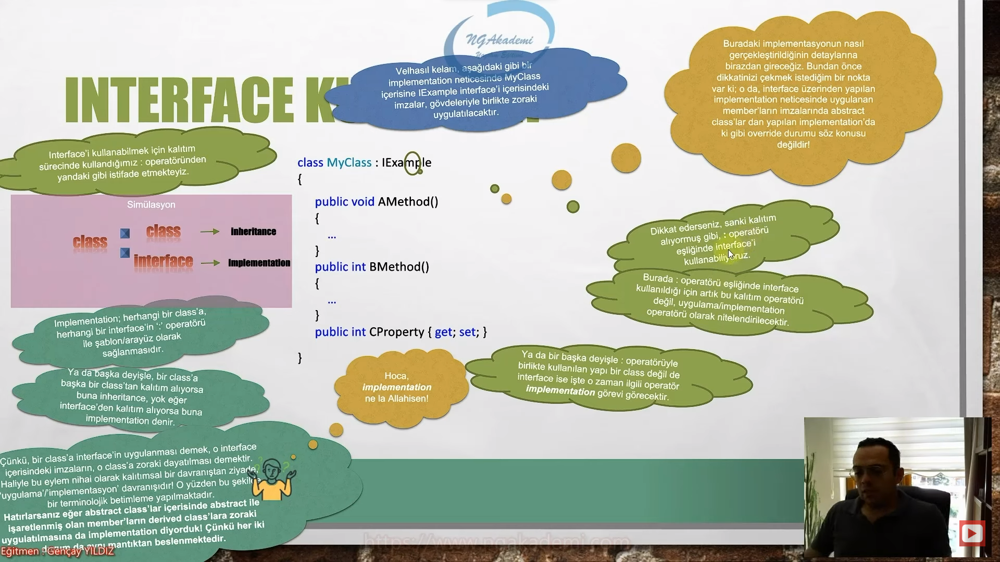

- `INTERFACE`'LER SINIFLARIN İMZASIDIR!

- Bir `interface`in içindeki imzaları bu `interface`i kullanan sınıflara zoraki uygulatması `interface`'lerin sınıfların imzası olduğu anlamına gelir.

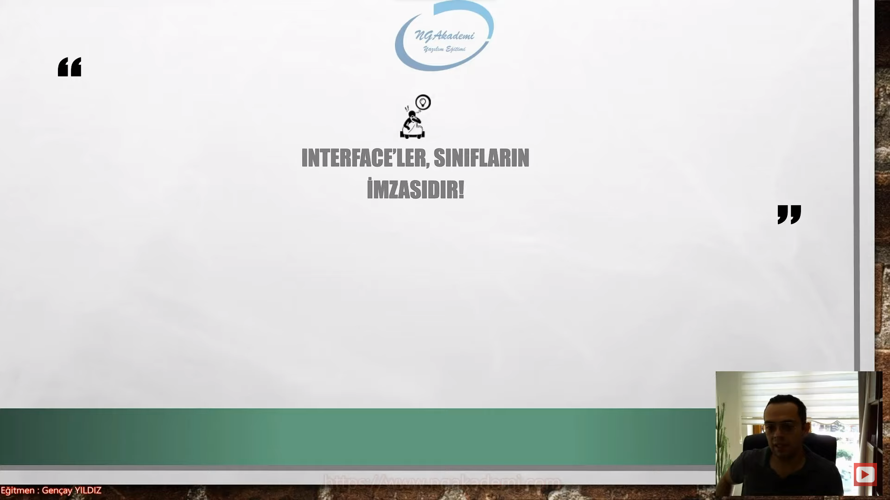

## Interface Implementation Yöntemleri
- Bir `interface`i herhangi bir class'a implemente ederken; implement, explicity implement ve ameleus olmak üzere üç farklı yöntemden birini kullanabilirsiniz.

|Ameleus|implement|explicity implement|
|-------|---------|-------------------|
|`interface`de ki imzaların karşılığını class'a manuel bir şekilde oluşturma yöntemidir.|Visual Studio editörü aracılığıyla implementasyonun yapılmasını sağlayan yöntemdir.|Yine Visual Studio editörü aracılığıyla implementasyonun yapılamasını sağlayan yöntemdir.|
|Vira bismillah bileğe kuvvet diyerekten yapılır.|`interface` üzerinde çıkan ampul'e tıkladığımızda implement interface'e tıklamamız yeterli olacaktır. | Bu yöntemde de açılan küçük pencerede `Implement all members explicity` sekmesine tıklayarak davranış gerçekleştirilmektedir. Bu yöntemin detaylarına dersimizin devamıunda Name Hiding başlığı altında gireceğiz.|
||Implementasyonun yapılacağı satırda yanda çıkan ampul simgesine tıklandığında ya da ilgili satırda `CTRL` + `.` kombinasyonunun ya da `ALT` + `ENTER` kombinasyonunun  kullanılması neticesinde çıkan küçük ekrandaki `Implement interface` sekmesine tıklanması yeterlidir.||

- Biz bir `interface`in imzasını implement ettiğimizde o imzanın kesinlikle class'ta public olması gerekiyor. member'ın private olmasını istiyorum derseniz hata verecektir. Bu member'ın public versiyonunun olmasını isteyecektir. Yani `interface` içerisindeki bir imzanını class'a implemente edilmesinin neticesinde onun public olmasını isteyecektir. Bu bir kuraldır.

- `interface` neticesinde implement edilmiş olan member'ların access modifierı kesinlikle public olmak zorundadır. Eğer ki biz interface'i implement interface ile değilde `Implement all members explicity` ile implemente edersek o zamanda private olmak zorundadır.

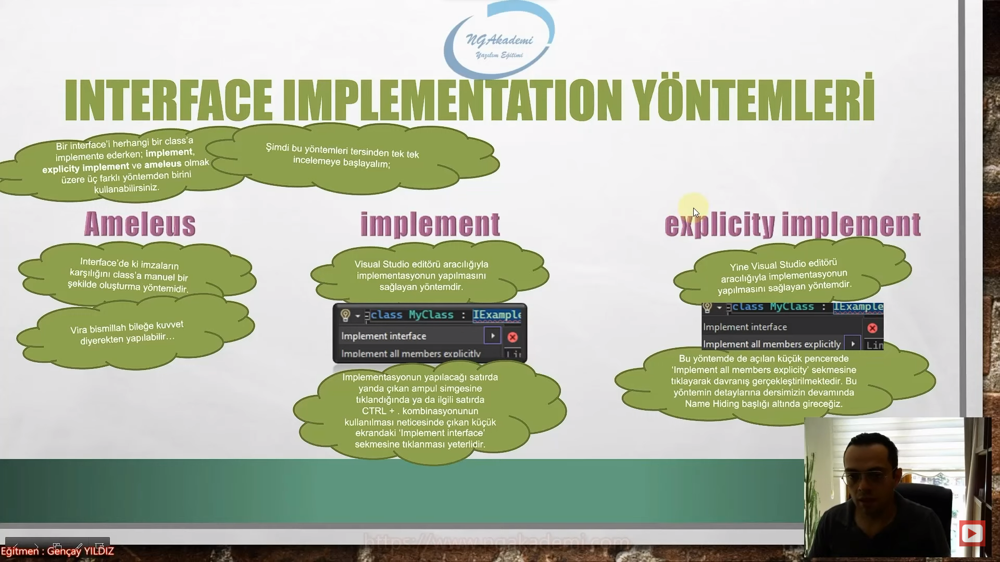

## Interface'ler de Çoklu Kalıtım Durumu
- C#'ta malumunuz bir sınıf sade ve sadece tek bir sınıftan kalıtım alabilmektedir. 

- Yani yatay düzlemde aynı anda birden fazla class'tan kalıtım alınamamaktadır.

- Lakin bir sınıf aynı anda birden fazla `interface`i implemente edebilmektedir/uygulayabilmektedir. 

```C#
class MyClass : IA, IB, IC, ID
{

}
```

- Bu yapılar `interface` olduğu sürece bu tanımlama C# compiler'ı açısından mümkündür. Herhangi bir sıkıntı olmayacaktır.

 -Bu şekilde çoklu implementasyon durumlarında tüm `interface`ler ilgili class'a implemente edilecektirler.

```C#
#region Interface'ler de Çoklu Kalıtım Durumu

MyClass myClass = new MyClass();
IA ia = new MyClass();
IB ib = new MyClass();
IC ic = new MyClass();

class MyClass : IA, IB, IC //Ne kadar interface varsa tüm interface'lerin implement edilmesi gerekiyor. Çünkü olaya bakarsanız eğer bu class bir tane sözleşmeyle taahhüd anlaşmasına girmiyor birden fazlasıyla giriyor. Dolayısyla her birinin implementasyonu gerçekleştirilmeli yani her bir sözleşmenin gereği yerine getirilmeli. Hem IC'yi hem IB'yi hem de IA'yı uygulamalısın. Bunların içinde birini uygulamazsan/implemente etmezsen o zaman bir anlam ifade etmeyecek compiler derlemeyecektir.
    //Bu tarz bir tanımlama ancak interfacelerde mümkündür. Eğer ki bunların en az iki tanesi class olsaydı compiler açısından bu tanımlama mümkün olmayacaktı.
{
    public void A()
    {
        throw new NotImplementedException();
    }

    public void B()
    {
        throw new NotImplementedException();
    }

    public void C()
    {
        throw new NotImplementedException();
    }
}
interface IA
{
    void A();
}
interface IB
{
    void B();
}
interface IC
{
    void C();
}

#endregion
```

- Ayrıca dersimizin devamında inceleyecek olsakta tüm bu `interface` referansları tarafından ilgili class'ın instance'ını refere edebileceğimizi bu noktada da söylemekte fayda görmekteyim.

- `interface`ler referans türlü değişkenlerdir. Dolayısıyla bizlere referans oluşturma imkanı sağlıyorlar. Zaten bu `interface`ler tarafından implemente edilmiş class varsa o `interface`in referansıylada o class'ın instance'ı rahatlıkla refere edilip çalıştırılabilir.

- Her bir `interface` referansı kendi member'ına eriştirecektir. Yani bir abstraction davranışı durumu söz konusudur.

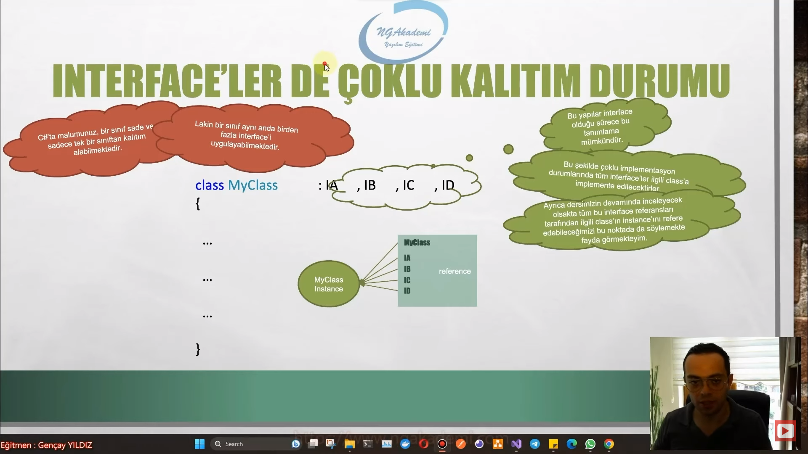

## Interface'in Interface'den Türemesi
- `interface`leride kendi aralarında birbirlerinden türetebilmekteyiz.

```C#
interface IA
{
    void A();
}
interface IB : IA
{
    void B();
}
interface IC : IB
{
    void C();
}

```

- Eğer ki bu şekilde `interface`in `interface`e kalıtım vermesi durumu söz konusuysa burada : operatörü implementation değil inheritance görevi görecektir ve bu `interface`leri birbirlerinden türetecektir.

- Class `interface` arasındaki ilişkide : operatörü kullanılıyorsa buna biz implementation diyoruz. Yok eğer : operatörü `interface`ler arasında kullanılıyorsa buna da inheritance diyoruz.

- Haliyle kalıtımım tüm kuralları bu noktada geçerli olacaktır ve hiyerarşik olarak `interface`lerin member'ları torunlarına aktarılacaktır.

- Ayrıca polimorfizm kuralları geçerli olacak ve misal olark IC `interface`inin implemente edileceği class tüm üst referanslar tarafında da işaretlenebilir olacaktır.

- Aşağıda IC `interface`ini implemente eden class'ın son halini gözlemlersek eğer;

- Kalıtımsal olarak IC diğer `interface`lerin member'larını barındırdığı için MyClass hepsini zoraki uygulayacaktır.

```C#
class MyClass : IC
{
    public void A()
    {
        throw new NotImplementedException();
    }

    public void B()
    {
        throw new NotImplementedException();
    }

    public void C()
    {
        throw new NotImplementedException();
    }
}

```

- Unutma!!! C# programlama dilinde bir class sade ve sadece tek bir class'tan türeyebilirken bir `interface` aynı anda birden fazla `interface`den de türeyebilmektedir.

```C#
#region Interface'in Interface'den Türemesi
class MyClass : IC
{
    public void A()
    {
        throw new NotImplementedException();
    }

    public void B()
    {
        throw new NotImplementedException();
    }

    public void C()
    {
        throw new NotImplementedException();
    }

    public void D()
    {
        throw new NotImplementedException();
    }

    public void W()
    {
        throw new NotImplementedException();
    }
}
interface IA
{
    void A();
}
interface IB : IA
{
    void B();
}
interface IC : IB, ID, IW
{
    void C();
}
interface ID
{
    void D();
}
interface IW
{
    void W();
}
#endregion
```

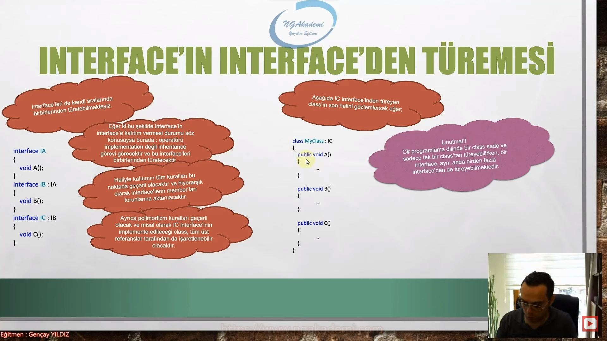

## Bir Class'a Inheritance İle Birlikte Implementation Nasıl Uygulanır
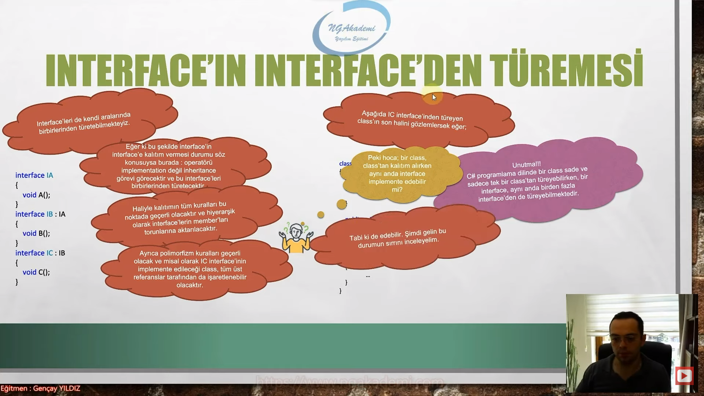

- C#'ta bir class farklı bir class'tan kalıtım alırken hem de bir yandan `interface`i implement edecekse eğer önce class'tan kalıtım almalı, sonrasında da virgülle `interface`(ler) tanımlanmalıdır.

- Aynı anda bir class hem bir class'ı kalıtım alacak hem de herhangi bir `interface`i ya da `interface`leri implemente edecekse eğer burada dikkat edilmesi gereken nokta önce class'tan kalıtım almalı ardından `interface`leri implemente etmelidir. 

- Önce class aksi taktirde derleyici hata verecektir.

```C#
class MyClass :ExampleClass, IA, IB, IC, ID
{

}
```

```C#
#region Bir Class'a Inheritance İle Birlikte Implementation Nasıl Uygulanır
class MyClass : ExampleClass, IA, IB, IC
{
    public void A()
    {
        throw new NotImplementedException();
    }

    public void B()
    {
        throw new NotImplementedException();
    }

    public void C()
    {
        throw new NotImplementedException();
    }

    public void D()
    {
        throw new NotImplementedException();
    }

    public void W()
    {
        throw new NotImplementedException();
    }
}

class ExampleClass
{
    
}
interface IA
{
    void A();
}
interface IB : IA
{
    void B();
}
interface IC : IB, ID, IW
{
    void C();
}
interface ID
{
    void D();
}
interface IW
{
    void W();
}

#endregion
```

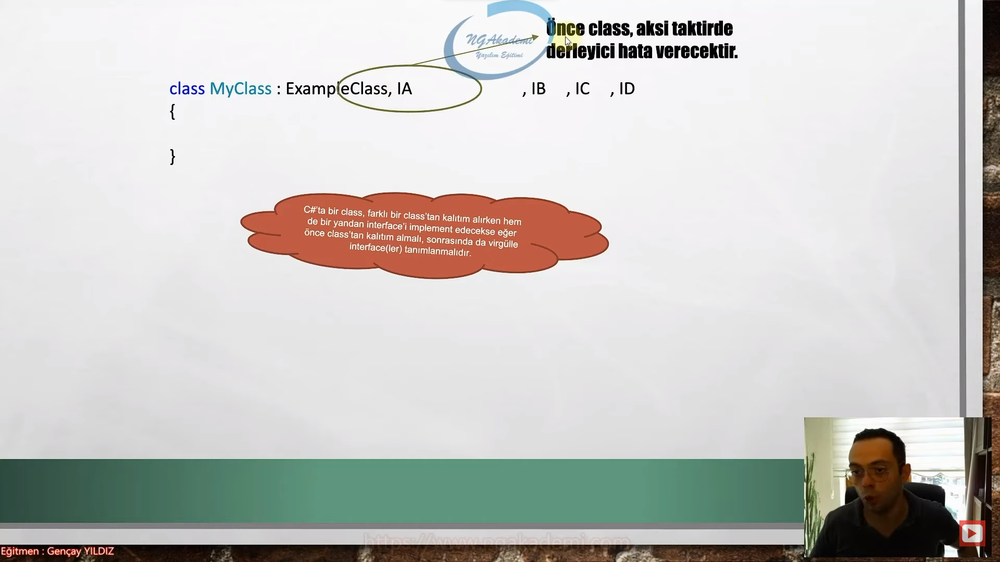


## C# Examples
```C#
#region Interface Tanımlama ve İnşa Etme Kurallarını Toparlayalım

//IMyInterface asdasdasad = null;//MyInterface türünden bir referans noktası alabiliyorum. Referans türlü değişken olduğu için buna direkt null atayabiliyorum
////Oluşturmuş olduğumuz interface'ler direkt bize bir referans türlü değişken sağlıyorsa haliyle biz ileride bu referans türlü değişkenle nesnelerimizi refere edebiliriz. 


//interface IMyInterface { }//Interface yapılanması içerisinde imzaları barındıracağından dolayı haliyle scope'lardan oluşmaktadır. 


//interface IMyInterfaceNamespaceDisinda //Namespace dışında da ben interface'i tanımlayabilirim.
//{

//}

//namespace MyNamespace //MyNamespace içinde ben interface'i tanımlayabilirim.
//{
//    interface IMyInterfaceeNamespaceIcinde
//    {

//    }

//    class MyClass //MyClass içinde ben interface'i tanımlayabilirim.
//    {
//        interface IMyInterfaceClassIcinde //IMyInterfaceClassIcinde içinde ben interface'i tanımlayabilirim.
//        {
//            interface IMyInterfaceeInterfaceIcinde
//            {

//            }
//        }
//    }
//}
#endregion
#region Interface İçerisine İmzaların Oluşturulması
//interface IMyInterface // interface'lerde direkt implementasyon direkt kendi içlerindeki imzaları kullanılan class'lara uygulattırmak vardır. Dolayısıyla burada zaten zorakilik olacağından dolayı public gibi bir durumun olmasına gerek yoktur. private olsa ne olacak. Sen hem imzayı tanımlayacan hemde private diyip bu imzaya karşılık bir member oluşturmamı diyeceksin? E haliyle erişim belirleyicisi interface'lerde kullanılmaz.
//{
//    void X();// Interface'te kalıtımsal herhangi bir davranış olmayacağından dolayı abstract gibi bişeyle işaretleme durumu da söz konusu değildir. Yani interface salt olarak direkt içerisindeki imzları kendisini kullanan class'lara zoraki uygulattıracak bir yapıya fıtrata sahiptir. Abstract class'lar belki değildir. 
//    void Y(int a);
//    int Z { get; set; }
//}
//abstract class MyAbstractClass //Abstract class'larda temel gaye direkt implementasyon değildir. Bazen kalıtımsal davranışta sergileyebilir. 
//{
//    public abstract void X();//Bizler abstract class içerisinde bu abstract class'ı kullanan implemente eden class'lara zoraki olarak belirli imzaları uygulatmak istiyorsak abstract işaretli ve bir yandan da public ile işaretli member'ları/imzaları tanımlamak gerekir. 
//    //Bu imza neticesinde bu abstract class'ı implemente eden class'larda bu imzaya karşılık olan member zoraki oluştutturulacaktı.
//    public abstract void Y(int a);//Abstract class'larda public olmak zorundadır. Private dediğinizde zaten bir anlam ifade etmeyeceğinden dolayı hata verir. Ama buranın kuralı gereği public'in kullanılması zaten zorunludur. interface'de ona hiç gerek yoktur. Ayriyetten abstract class'larda tanımlanmış olan imzaların abstract ile işaretlenmesi gerekmektedir. Bunun implemente edilecek bir imza olduğu compiler tarafından anlaşılsın.
//    public abstract int Z { get; set; }

//    public bool D() //Abstract class'ta böyle bir fonksiyon olabilir ve bu fonksiyonu kalıtımsal olarak kendisini kullanan/kalıtım alan sınıfa aktarabilir. Bunun dışında ekstradan public abstract ile işaretli olan imzaları da bir yandan oraya da implemente ettirebilir.
//    {
//        return true;
//    }
//}
//// İki türlü bir davranış söz konusu abstract class'ta. Ama interface'te ikinci bir davranış yok. interface'te imzalar var. ve bu imzaların karşılıkları direkt kensini uygulayan sınıfa zoraki uygulattırılması var.
#endregion
#region Interface Kullanımı

////class MyClass : MyAbstractClass
////{
////    public override int Z { get => throw new NotImplementedException(); set => throw new NotImplementedException(); }

////    public override void X()//Abstract class'tan implementasyon yaptığımızda override keywordü eşliğinde implementasyon sağlanır.
////    {
////        throw new NotImplementedException();
////    }

////    public override void Y(int a)
////    {
////        throw new NotImplementedException();
////    }
////}

//class MyClass : IMyInterface
//{
//    public int Z { get => throw new NotImplementedException(); set => throw new NotImplementedException(); }

//    public void X()//interface'in içerisindeki imzalara karşılık member'lar direkt sade bir şekilde oluşturulur. Yani herhangi bir override falan yok.
//    {
//        throw new NotImplementedException();
//    }

//    public void Y(int a)
//    {
//        throw new NotImplementedException();
//    }
//}

//interface IMyInterface
//{
//    void X();
//    void Y(int a);
//    int Z { get; set; }
//}

//abstract class MyAbstractClass
//{
//    public abstract void X();
//    public abstract void Y(int a);
//    public abstract int Z { get; set; }

//    public bool D()
//    {
//        return true;
//    }
//}
#endregion
#region Interface Implementation Yöntemleri
//class MyClass : IMyInterface
//{
//    public void X() {  } 
//    public void Y(int a) { }
//    public int Z { get; set; }
//}
//interface IMyInterface
//{
//    void X();
//    void Y(int a);
//    int Z { get; set; }
//}
#endregion
#region Interface'ler de Çoklu Kalıtım Durumu

//MyClass myClass = new MyClass();
//IA ia = new MyClass();
//IB ib = new MyClass();
//IC ic = new MyClass();

//class MyClass : IA, IB, IC //Ne kadar interface varsa tüm interface'lerin implement edilmesi gerekiyor. Çünkü olaya bakarsanız eğer bu class bir tane sözleşmeyle taahhüd anlaşmasına girmiyor birden fazlasıyla giriyor. Dolayısyla her birinin implementasyonu gerçekleştirilmeli yani her bir sözleşmenin gereği yerine getirilmeli. Hem IC'yi hem IB'yi hem de IA'yı uygulamalısın. Bunların içinde birini uygulamazsan/implemente etmezsen o zaman bir anlam ifade etmeyecek compiler derlemeyecektir.
//    //Bu tarz bir tanımlama ancak interfacelerde mümkündür. Eğer ki bunların en az iki tanesi class olsaydı compiler açısından bu tanımlama mümkün olmayacaktı.
//{
//    public void A()
//    {
//        throw new NotImplementedException();
//    }

//    public void B()
//    {
//        throw new NotImplementedException();
//    }

//    public void C()
//    {
//        throw new NotImplementedException();
//    }
//}
//interface IA
//{
//    void A();
//}
//interface IB
//{
//    void B();
//}
//interface IC
//{
//    void C();
//}

#endregion
#region Interface'in Interface'den Türemesi
//class MyClass : IC
//{
//    public void A()
//    {
//        throw new NotImplementedException();
//    }

//    public void B()
//    {
//        throw new NotImplementedException();
//    }

//    public void C()
//    {
//        throw new NotImplementedException();
//    }

//    public void D()
//    {
//        throw new NotImplementedException();
//    }

//    public void W()
//    {
//        throw new NotImplementedException();
//    }
//}
//interface IA
//{
//    void A();
//}
//interface IB : IA
//{
//    void B();
//}
//interface IC : IB, ID, IW
//{
//    void C();
//}
//interface ID
//{
//    void D();
//}
//interface IW
//{
//    void W();
//}
#endregion
#region Bir Class'a Inheritance İle Birlikte Implementation Nasıl Uygulanır
class MyClass : ExampleClass, IA, IB, IC
{
    public void A()
    {
        throw new NotImplementedException();
    }

    public void B()
    {
        throw new NotImplementedException();
    }

    public void C()
    {
        throw new NotImplementedException();
    }

    public void D()
    {
        throw new NotImplementedException();
    }

    public void W()
    {
        throw new NotImplementedException();
    }
}

class ExampleClass
{
    
}
interface IA
{
    void A();
}
interface IB : IA
{
    void B();
}
interface IC : IB, ID, IW
{
    void C();
}
interface ID
{
    void D();
}
interface IW
{
    void W();
}

#endregion
```


 