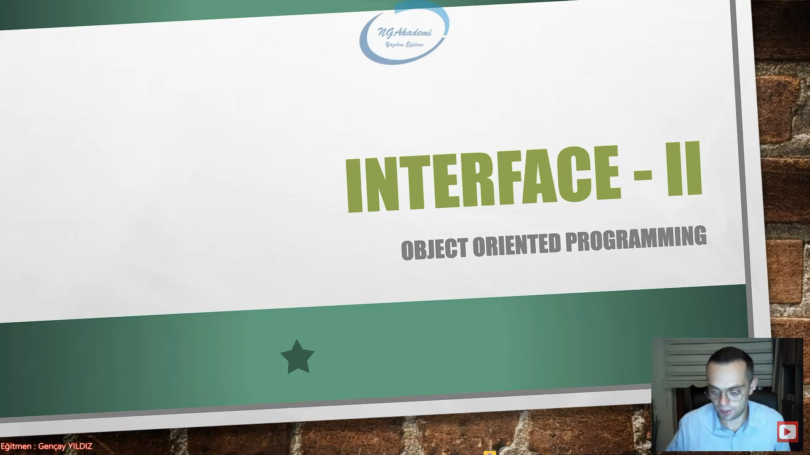
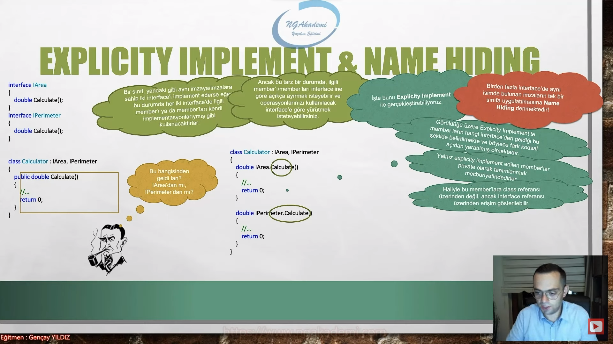
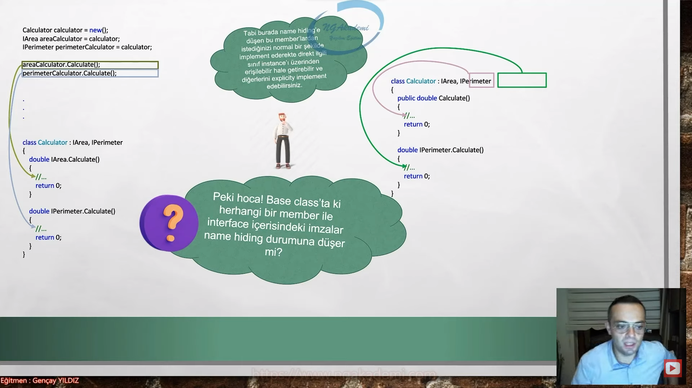
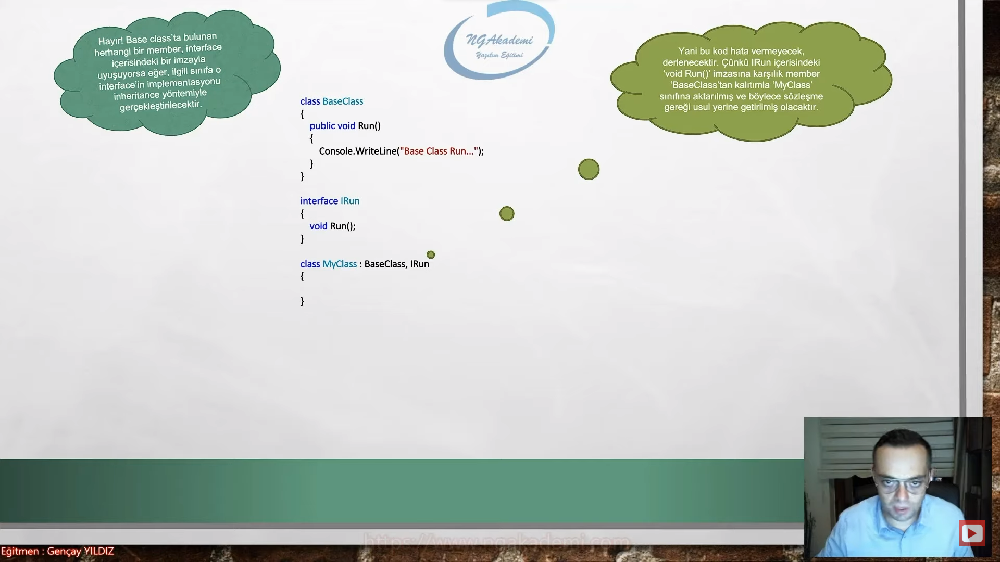
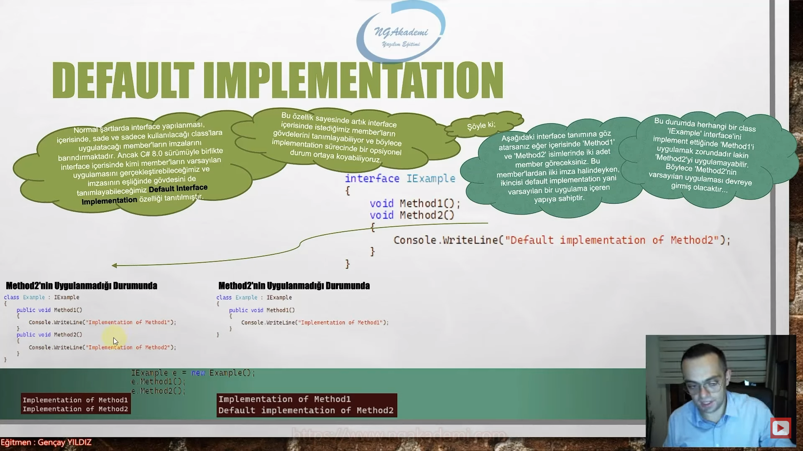
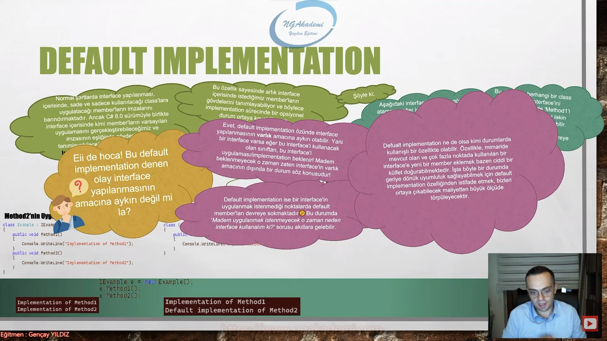
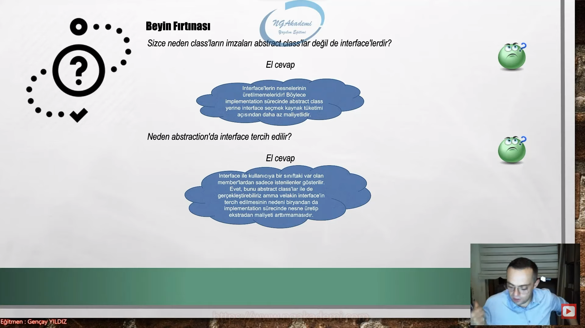
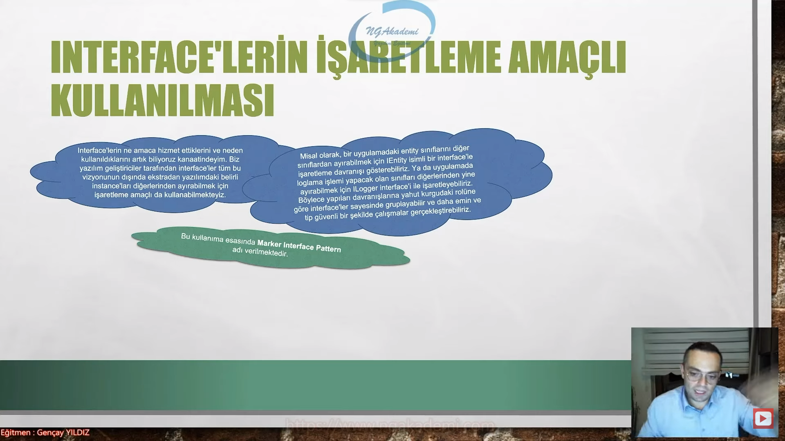
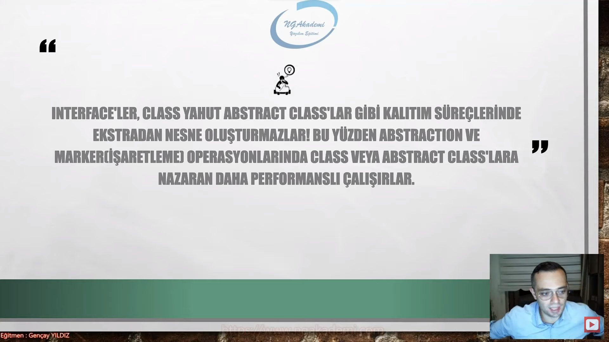

***
# Nesne Tabanlı Programlama #29 - Interface - Explicity Implement & Default Implementation - II


## Explicity Implements & Name Hiding
- `interface`teki temel niyetimiz bir sınıfın imzasını oluşturmaktır.

- Diyelim ki ben bir matematiksel bir sınıf ortaya koyacağım. Şimdi matematiksel sınıfı direkt olarak oluşturmayacağım. Diyeceğiz ki benim yapacağım iş her neyse öncelikle bir `interface`te o işi benim modellemem lazım. İlk önce o sınıfın yapacağım işle ilgili davranış sergileyecek olan sınıfın sözleşmesini ortaya koymam lazım. Profesyonel çalışmalar için bunu bir alışkanlık haline getirmenizde fayda var.

- Yani her somut sınıfı oluşturmadan önce o sınıfın abstraction'ınını yani `interface`ini/`interface`teki sözleşmesini/imzalarını oluşturmayı bir alışkanlık haline getirmeniz sizin ileride design pattern çalışmalarında, ileri düzey yapılanmalarda, kurumsal mimarilerde işinizi kolaylaştıracaktır.

- `interface`i biz bir sınıfın sözleşmesi amacıyla kullanırız. Şimdi ben bu `interface`i hedef sınıfa implement ettiğim taktirde bunu zoraki bana uygulattıracaktır. Yani burada bir sözleşmeyi ben herhangi bir sınıfa dayatıyorsam o sözleşmenin içerisindeki bütün kontrat'lar bu sınıfa uygulanmak uygulatılmak zorundadır. İşte `interface`in getirisi bu noktadadır. Yani sınıfın kalıbına imzasını önceden hazırlıyoruz ve bunun compiler açısından da zorunlu hale getiriyoruz. Bu `interface` bu sınıfa zorunlu olarak uygulatılacaktır.

- `interface`in beklediği member'ları tanımladıktan sonra fazlasıyla ekstradan member tanımlayabilirsiniz.

```C#
#region Explicity Implements & Name Hiding
class MatematikIslemleri : IMatematikIslemleri //Biz bir interface'i sınıfa uygularken implement interface sekmesi üzerinden uygulama işlemini gerçekleştiriyorduk.
{
    public int Bol(int s1, int s2)
    {
        throw new NotImplementedException();
    }

    public int Carp(int s1, int s2)
    {
        throw new NotImplementedException();
    }

    public int Cikar(int s1, int s2)
    {
        throw new NotImplementedException();
    }

    public int Topla(int s1, int s2)
    {
        throw new NotImplementedException();
    }

    public void X() 
    {

    }
    public int Z { get; set; }
}

interface IMatematikIslemleri //interface der ki sen söz verdiğin şeyleri gerçekleştir fazlasında zaten sıkıntı yok. Fazla mal göz çıkartmaz diyor. Ama en az bunları gerçekleştireceksin uygulanan sınıfta. ve bunu gerçekleştirirkende sana verdiğim imzalara uygun bir şekilde gerçekleştireceksin.
//Gerçekleştireceksinden kasıt bu imzalara karşılık gövdeleri oluşturacaksın yani bu imzalara karşılık member'ları bu sınıfa ekleyeceksin.
{
    int Topla(int s1, int s2);
    int Cikar(int s1, int s2);
    int Bol(int s1, int s2);
    int Carp(int s1, int s2);
}
#endregion
```

```C#
interface IArea 
{
  double Calculate();
}
interface IPerimeter
{
  double Calculate();
}

class Calculator : IArea, IPerimeter
{
  public double Calculate()// İmplementasyon neticesinde uygulatılan Calculate() fonksiyonu her iki `interface` açısından da benim sayemde uygulatıldı diye yorumlatılacaktır. Yani buradaki Calculate() IArea'dan mı geldi IPerimeter'dan mı geldi bunu biz bilemiyoruz. Bunu aslında compiler'da bilemiyor. Sadece diyor ki kardeşim burada bir tane metot var bu metot her iki `interface`inde sözlşeme olarak dayatmış olduğu member'ların imzasına uyuyor mu uyuyor o zaman bir problem yoktur diyor. İşte bu durum bizim için name hiding durumudur.
  //Name hiding aynı isimdeki member'ların ya da birebir aynı olan member'ların farklı interface'lerde birbirlerine ezmesi durumudur. Yani isim saklama. Buradaki Calculate() dediğimiz fonksiyon hangisinden geliyor. Bunu bilebiliyor muyuz? Bilemiyoruz.
  //Buradaki çalışmaya baktığımızda dışarıdan bakan adam şunu diyecektir değil mi? Buradaki Calculate nereden geldi? IArea'dan mı IPerimeter'dan mı? Bunu dememesi için buna bir şekil vermemiz gerekecektir. İşte bu şekil Explicity Implement diyoruz.
  {
    //...
    return 0;
  }
}

```
- Bir sınıf düşünün bu sınıf birden fazla `interface`i implement ediyor. Şimdi bu `interface`lerin içerisinde aynı imzaların olduğunu varsayarsak eğer bu durumda ne olacaktır?

- Bir sınıf yukarıdaki gibi aynı imzaya/imzalara sahip iki `interface`'i implement ederse eğer bu durumda her iki `interface`de ilgili member'ı ya da member'ları kendi implementasyonlarıymış gibi kullanacaktırlar.

- Bir sınıf birden fazla `interface`i kullanıyorsa ve bu `interface`ler içlerinde tekrar eden/birebir aynı olan memberlara sahiplerse bu member ilgili sınıfın içerisine uygunlandığı taktirde her iki `interface`te bu member'ın kendisi tarafından uygulatıldığını varsayacaktır.

- Ancak bu tarz bir durumda, ilgili member'ı/member'ları `interface`lerine göre açıkça ayırmak isteyebilir ve operasyonlarınızı kullanılacak `interface`e göre yürütmek isteyebilirsiniz.

- İşte bunu Explicity Implement ile gerçekleştirebiliyoruz.

- Yani üstteki örnekte IArea içindeki Calculate() fonksiyonu ile IPerimeter içindeki Calculate() fonksiyonunu ayırmak isteyebilirim. İşte böyle bir çalışmayı ortaya koymak istiyorsam eğer Explicity Implement ile gerçekleştirebilirim.

```C#
interface IArea 
{
  double Calculate();
}
interface IPerimeter
{
  double Calculate();
}

class Calculator : IArea, IPerimeter //Calculator'a implemente edilmiş/uygulanmış olan IArea ve IPerimeter `interface`lerindeki Calculate() fonksiyonlarını imzasına karşılık member'lar dikkat ederseniz burada private olacak şekilde ve hangi `interface`den geldiğini belirtecek şekilde tanımlama yapılmıştır. Bu tanımlama Explicity Implement dediğimiz tanımlamadır. 
//Mülakatta sana bu class'ı bir yorumla gibi bir soru gelirse eğer;
//Demek ki burada her iki `interface`in içinde tekrar eden birebir aynı olan imzalar mevcut yani bir name hiding durumu söz konusu. Bu duruma karşılık çözüm olarakta Explicity implement davranışı gerçekleştirilmiştir.
{
  double IArea.Calculate()
  {
    //...
    return 0;
  }

  double IPerimeter.Calculate()
  {
    //...
    return 0;
  }
}

```

- Görüldüğü üzere Explicity Implement'te member'ların hangi `interface`den geldiği bu şekilde belirtilmekte ve böylece fark kodsal açıdan yaratılmış olmaktadır.

- Yalnız Explicity Implement edilen member'lar private olarak tanımlanmak mecburiyetindedirler.

- Hocam public yapsak? Yapamıyorsun. Çünkü public neticesinde Calculator instance'ının içerisindeki Calculate() fonksiyonunun hangisi olduğunu public üzerinden gösteremezsin. Çünkü public neticesinde Calculator instance'ı üzerinden gelecek olan Calculate() fonksiyonlarından hangisinin IArea'dan olacağı hangisinin IPerimeter'dan olacağını developer bilemez. Developer hangi fonksiyonu kullanacaksa o fonksiyonu da yine polimorfizm kuralları gereği ilgili `interface`in referansıyla ayırt etmek zorundadır. Yani IArea'ya göre bir hesaplama işlemi ortaya koymak istiyorsanız IArea `interface`inin referansı üzerinden Calculator instance'ının işaretlenmiş olması gerekecek.

- Haliyle bu member'lara class referansı üzerinden değil, ancak `interface` referansı üzerinden erişim gösterilebilir.

- Birden fazla `interface`de aynı isimde bulunan imzaların tek bir sınıfa uygulatılmasına Name Hiding denmektedir!




- Bizler `interface`lerde yaşanan name hiding durumlarında `interface`lerin davranışlarını birbirinden ayırmak istiyorsak yani `interface`ine göre bir davranış ortaya koymak istiyorsak Explicity Implement bu davranışla bu implementasyon yöntemiyle aynı isimdeki aynı birebir olan member'ları birbirilerinden fiziksel olarak bu şekilde ayırıp ona göre operasyonlarımızı yürütebiliriz. Tabiki de bu member'lara erişim gösterebilmek için `interface` referanslarından istifade etmek mecburiyetindeyiz.

```C#
#region Explicity Implements & Name Hiding
//class MyClass : IA, IB //MyClass IA ve IB'yi bu şekilde implement ettiğinde her ikisinde de birebir aynı imza olacağından dolayı bu implementasyon neticesinde bir name hiding durumu söz konusu olacaktır.
//{
//    public int X()// Bu X() fonksiyonu IA'dan mı geldi IB'den mi geldi. Bilemediğinizden dolayı burada bir name hiding söz konusudur. İşte biz bu duruma karşılık yani name hiding durumunu fark ettiğimiz bu tarz bir davranışa karşılık bu X() fonksiyonunun hangisinden geldiğini ayırt etmek istiyorsak burada Explicity Implement davranışını sergilememiz gerekecektir. 
//    {
//        throw new NotImplementedException();
//    }
//}
//class MyClass : IA, IB //MyClass IA ve IB'yi bu şekilde implement ettiğinde her ikisinde de birebir aynı imza olacağından dolayı bu implementasyon neticesinde bir name hiding durumu söz konusu olacaktır.
//{
//    public int X()// Bu X() fonksiyonu IA'dan mı geldi IB'den mi geldi. Bilemediğinizden dolayı burada bir name hiding söz konusudur. İşte biz bu duruma karşılık yani name hiding durumunu fark ettiğimiz bu tarz bir davranışa karşılık bu X() fonksiyonunun hangisinden geldiğini ayırt etmek istiyorsak burada Explicity Implement davranışını sergilememiz gerekecektir. 
//    {
//        throw new NotImplementedException();
//    }
//}


MyClass m = new();
IA a = m;//Eğer ben IA üzerinden gelen X() fonksiyonunu tetiklemek istiyorsam bu şekilde IA referansına karşılık nesneyi işaretlemem gerekecek.
a.X();// Bu referans üzerinden X'i tetiklemem yeterli olacak. Bu referans IA referansından implemente edilen member'ı tetikleyecektir.

IB b = m;
b.X(); //Bu referans IB referansından implemente edilen member'ı tetikleyecektir.

class MyClass : IA, IB
{
    int IA.X()//Explicity Implement davranışını sergiliyorsak burada implement edilen member'lar private olmak zorunda. Bu member'lar nereden geliyorsa geldiği yeri belirtmek zorundayız (IA.X() gibi)
    //Explicity implement davranışı neticesinde member'lara erişim göstermek istiyorsak o zaman member'ına uygun interface'i tercih etmemiz gerekecek.
    {
        Console.WriteLine("A - X");
        return 0;
    }

    int IB.X()
    {
        Console.WriteLine("B - X");
        return 1;
    }
}
interface IA 
{
    int X();
}
interface IB
{
    int X();
}
#endregion
```

```C#
Calculator calculator = new();
IArea areaCalculator = calculator;
IPerimeter perimeterCalculator = calculator;

areaCalculator.Calculate();
perimeterCalculator.Calculate();

class Calculator : IArea, IPerimeter
{
  double IArea.Calculate()
  {
    //...
    return 0;
  }
  double IPerimeter.Calculate()
  {
    //...
    return 0;
  }
}
```
- Calculator sınıfındaki Calculate() fonksiyonlarından artık hangisini tetiklemek istiyorsanız o fonksiyonun `interface` arayüzü üzerinden bir referansla tetiklemede bulunmanız yeterli olacaktır. IArea Calculate'ini tetiklemek istiyorsanız IArea `interface`i referansı üzerinden ilgili referansı işaretlemeniz yeterli olacak o referans üzerinden de Calculate()i çağırmanız yeterli olacaktır. Aynı mantıkla IPerimeter üzerinde de çalışma sergileyebilirsiniz. Yani hangi `interface` referansından instance'ı tetikliyorsanız o `interface`e karşılık gelen member arka planda tetiklenmiş olacaktır.

- Tabi burada name hiding'e düşen bu member'lardan istediğinizi normal bir şekilde implement ederekte direkt ilgili sınıf instance'ı üzerinden erişilebilir hale getirebilir ve diğerlerini explicity implement edebilirsiniz.

- Bir member'ı explicity implement yöntemiyle implement ettikten sonra diğer member'ıda normal implementasyon implement edebilirsiniz.

```C#
class Calculator : IArea, IPerimeter
{
  public double Calculate()//Normal Implement
  {
    //...
    return 0;
  }
  double IPerimeter.Calculate()//Explicity Implement
  {
    //...
    return 0;
  }
}
```
- Bu şekilde çalışma neticesinde Calculator instance'ının içinde direkt Calculate dediğimizde IArea tetiklenecektir. Yok eğer IPerimeter içerisindeki ya da IPerimeter `interface`ine karşılık gelen Calculate() fonksiyonunu tetikelemek istiyorsak o zaman buradaki davranışın birebir aynısını uygulamamız gerekecektir. Yani IPerimeter türünden bir referansla bu instance'ı çalıştırmadığımız sürece buradaki Calculate() fonksiyonu default olarak IArea davranışı sergileyecektir.

- Peki hoca Base class'ta ki herhangi bir member ile `interface` içerisindeki imzalar name hiding durumuna düşer mi?



```C#
class BaseClass
{
  public void Run()
  {
    Console.WriteLine("Base Class Run...")
  }
}
interface IRun
{
  void Run();
}

class MyClass: BaseClass, IRun
{

}
```
- BaseClass'la `interface`in içindeki imzalar ve member'ın imzası birebir uyuyorsa bu bir name hiding durumu mudur?
  * Hayır değildir.

- Hayır Base class'ta bulunan herhangi bir member, `interface` içerisindeki bir imzayla uyuşuyorsa eğer, ilgili sınıfa o `interface`in implementasyonu inheritence yöntemiyle gerçekleştirilecektir.

- MyClass'a biz hem BaseClass'ı inherit ediyoruz hem de bir yandan IRun `interface`ini implement ediyorsak burada bir name hiding söz konusu olmayacaktır. Hatta compiler bu `interface`in dayatmış olduğu sözleşmenin inheritance kuralları gereği geçerli olduğunu kabul edip çalışmaya devam edecektir. Yani bu kodu derleyecektir.

- Base class'taki herhangi bir member'ın imzasının `interface`teki member'la ya da imzayla birebir aynı olması name hiding durumuna düşürmeyecektir. 

- Biz bu tür davranışı repository design pattern'da uygulamaktayız. Repository design pattern'da repository arayüzlerimiz var `interface`lerimiz var. Bu `interface`lerin zoraki uygulattıracakları member'ları biz ana repository sınıfından inheritance'la çekiyoruz. Dolayısıyla her repository sınıfında tekrar tekrar aynı işlemleri yapmaya gerek kalmayacaktır. Hepsini biz zaten base'den inheritance'la çekip bir yandan da `interface`in dayatmış olduğu sözleşmeyi geçerli kılmış olacağız. Buradaki mantığı uygulamış oluyoruz repository design pattern'da aslında.

- Buradaki mantığa tekrardan bakarsak IRun'ın bize dayatmış olduğu bir fonksiyon var bu fonksiyonu her sınıfın tasarımında tekrar tekrar implemente etmektense bunu BaseClass isimli bir sınıftan inheritance yöntemiyle çekiyorum.

- Yani bu kod hata vermeyecek, derlenecektir. Çünkü IRun içerisindeki void Run() imzasına karşılık member BaseClass'tan kalıtımla MyClass sınıfına aktarılmış ve böylece sözleşme gereği usul yerine getirilmiş olacaktır.



## Default Implementation
- `interface`'ler sınıfların sözleşmeleridir. Sınıflara zoraki uygulattırılacak yapılar `interface`lerde imza olarak tanımlanır diyorduk. `interface`in içinde sade ve sadece imzalar tanımlanabilir. Herhangi bir imzanın gövdesi `interface`te tanımlanamaz demiştik. Tabi bunu diyorduk ama C# bizi yalancı çıkarıyor. C# default implementation diye bir özellik getiriyor. Diyor ki kardeşim implementasyonu sen varsayılan olarakta `interface`in içinde tanımlayabilirsin. Imzanın dışında ekstradan da o imzanın default implementasyonunu yani gövdesini `interface`in içinde tanımlayarak bir varsayılan tutum davranış ortaya koyabilirsin diyor.

- Bir önceki derste kesin olarak söylemiş olduğumuz şu cümleyi artık biraz daha genişletiyoruz. Interface'in içinde sade ve sadece imzalar barındırılabilir amma velakin bir yandan da bu imzaların gövdeleride default implementation olarakta tanımlanabilir.

- Normal şartlarda `interface` yapılanması içerisinde, sade ve sadece kullanılacağı class'lara uygulatacağı member'ların imzalarını barındırmaktadır. Ancak C# 8.0 sürümüyle birlikte `interface` içerisinde kimi member'ların varsayılan uygulamasını gerçekleştirebileceğimiz ve imzasının eşliğinde gövdesini de tanımlayabileceğimiz Default Interface Implementation özelliği tanıtılmıştır.

- Bu özellik sayesinde artık `interface` içerisinde istediğimiz member'ların gövdelerini tanımlayabiliyor ve böylece implementation sürecinde bir opsiyonel durum ortaya koyabiliyoruz.

- Bir member'ın/`interface` içerisindeki herhangi bir imzanın default implementation'ı varsa eğer demek ki o imzaya karşılık ilgili class'ta bir implementasyon yapmak artık opsiyonel duruma düşüyor. YAni ilgili imzanın default implementation'ı varsa sen bu imzaya karşılık gövdeyi bu imzaya karşılık member'ı class'ta ister implement ederek oluşturabilirsin istersen de oluşturmayıp default implementation'da kullanabilirsin.

Şöyle ki;

```C#
interface IExample
{
  void Method1();
  void Method2()
  {
    Console.WriteLine("Default implementation of Method2");
  }
}
```

- Biz artık C#'ta `interface` içinde normal bildiğiniz member'lar tanımlayabiliyoruz anlayacağınız.

- Yukarıdaki `interface` tanımına göz atarsanız eğer içerisinde Method1 ve Method2 isimlerinde iki adet member göreceksiniz. Bu member'lardan ilki imza halindeyken, ikincisi default implementation yani varsayılan bir uygulama içeren yapıya sahiptir.

- Bu durumda herhangi bir class IExample `interface`ini implement ettiğinde Method1'i uygulamak zorundadır çünkü o herhangi bir default implementation barındırmıyor normal bir imza yani `interface`in varlık amacını güden bir yapıya sahip lakin Method2'yi uygulamayabilir isterse uygulayabilir opsiyonel bir durum söz konusu. Böylece Method2'in varsayılan uygulaması devreye girmiş olacaktır. Uygularsa devreye girecek uygulamazsa default implementation durumu zaten söz konusu Zaten o default olarak devrede.

```C#
#region Default Implementation
class MyClass : IA
{
    public void X()
    {
        Console.WriteLine("X");
    }
    public void Y()
    {
        Console.WriteLine("Y");
    }
}
interface IA
{
    void X();
    void Y()
    {
        Console.WriteLine("Default Imp Y");
    }
}
//Normal şartlarda imzalarımızdan herhangi biri ya da imzalarımızın hiçbirinde default implementation yoksa ya da bir başka deyişle default implementation'ı olmayan imzalar söz konusuysa bunları zaten seve seve bizim implement etmemiz gerekiyor. Herhangi birini implement etmediğim taktirde compiler zaten bana hata verecektir.
//Y'nin default implementation'ı olmadığı durumda compiler hata veriyordu amma velakin Y default implementation'ı varsa hata ortadan kalkıyor. Yani sen IA'daki Y imzasına karşılık herhangi bir tanımda implementasyonda bulunmuyorsan burada default implementation devreye giriyor. Yok eğer ben bir yandan da default implementation'a rağmen implementasyonda bulunacağım diyorsan bunuda yapabilirsin.
//Eğer bu şekilde Y'yi tanımlıyorsanız default implementation'da tanımlamış olduğunuz gövdeyi ezmiş olursunuz. Yani artık buradaki operasyon geçerli olacaktır.
#endregion
```



- İyi de hoca Bu default implementation denen olay `interface` yapılanmasının amacına aykırı değil mi la?
  * Şimdi haklı bir soru soruyoruz. `interface`i nasıl biliyoruz? Bir sınıfta zoraki olarak olmasını istediğimiz yapılanmaların imzalarını `interface`in içine koyarız. Bu `interface`i kullanan sınıflarda o yapılar seve seve uygulattırılır. Şimdi `interface`in amacı zaten bir zorakiliktir. Bir zorunluluk durumudur. Default implementation ise `interface`in içerisindeki member'ların zoraki-liğini ortadan kaldırıyor yani `interface`in sanki temel varlık sebebine şöyle birazcık dokunmuşlar adamlar.

- Evet default implementation özünde `interface` yapılanmasının varlık amacına aykırı olabilir. Yani bir `interface` varsa eğer bu `interface`i kullanacak olan sınıftan, bu `interface`i uygulaması/implementation beklenir. Madem beklenmeyecek madem opsiyonel bir durum söz konusu olacak o zaman zaten `interface`in varlık amacının dışında bir durum söz konusudur!

- Default implementation ise bir `interface`in uygulanmak istenmediği noktalarda default member'ları devreye sokmaktadır. Bu durumda madem uygulanmak istenmeyecek o zaman neden `interface` kullanalım ki? sorusu akıllara gelebilir.

- Default implementation özelliği bence `interface`in varlık amacına aykırı bir özelliktir. Çok tutarlı bir özellik değildir. Madem ki ben herhangi bir şeyi implement etmeyeceğim zorunlu tutmayacağım o sınıfın içerisinde zorunlu bir şekilde oluştutturmayacağım o zaman `interface` niye kullanıyorum ki? `interface`in temel amacı bazı şeyleri yaptırmak e madem yaptırmayacağız madem default bişey kullanacağiz o zaman `interface`in dışında o tarz bir senaryoya çözüm aramak daha mantıklıdır. Bu tarz senaryolar için `interface`in varlık amacını/fıtratını bozmanın bir amacı yoktu diye düşünüyorum.

- Default implementation ne de olsa kimi durumlarda kullanışlı bir özellikte olabilir. Özellikle mimaride mevcut olan ve çok fazla noktada kullanılan bir `interface`e yeni bir member eklemek bazen ciddi bir külfet doğurabilmektedir. İşte böyle bir durumda geriye dönük uyumluluk sağlayabilmek için default implementation özelliğinden istifade etmek bizleri ortaya çıkabilecek maliyetten büyük ölçüde törpüleyecektir.

- Bazen projede bazı `interface`ler öyle bir kök salıyor ki üzerinde ufak yapmış olduğumuz değişiklikler projenin birçok noktasında patlamaya sebep olabiliyor. Hele hele böyle 5 6 yıllık kurumsal projelerde bir `interface`e bişey eklemen gerekir en doğru noktası orasıdır ama kaçınırsın farklı bir çözüm aramaya çalışırsın. Çünkü `interface`e dokunduğun anda projede her yer patlayacaktır. İşte böyle bir durumda default implementation'dan istifade ederek sürdürülebilirliği sağlıyorsunuz geriye dönük uyumluluğu sağlıyorsunuz ve böylece projede kök salmış olan `interface`ler üzerinde yapmış olduğunuz değişiklikleri de yıllanmış class'ların üzerine tekrardan uygulamaktansa default implementation'la ilgili class'lara direkt hani varsayılan davranışı yönlendirip asıl amacınıza odaklı bir şekilde çalışmayı gerçekleştirebiliyorsunuz. Bu amaca hizmet edecek diye `interface`in genel vizyonuna aykırı bir özellik eklemek bence çok doğru değildi.



## Beyin Fırtınası
- Sizce neden class'ların imzaları abstract class'lar değil de `interface`lerdir?
  * Ne demiştik `interface`ler sınıfların imzasıdır. Neden `interface`ler sınıfların imzasıdır? Neden abstract class ya da diğerleri değil?
  * Interface'lerin nesnelerinin üretilmemeleridir! Böylece implementation sürecinde abstract class yerine `interface` seçmek kaynak tüketimi açısından daha az maliyetlidir.
  * Ekstradan bir nesne üretilmeyeceğinden dolayı sadece bir sözleşme görevi görecektir. Şimdi abstract class'larda nasıldı? Abstract class'larda bir class'a implementasyon uyguladığımızda tamam abstract class'ın nesnesini/instance'ını iradeli bir şekilde kendimiz oluşturamuyorduk ama compiler seviyesinde abstract class'tan bir nesne oluşturuluyordu. hatırlarsanız eğer abstract class'ların constructor'ları vardı. Şimdi biz abstract class'ı madem sözleşme niyetinde kullanacağız madem bunu bir imza mahiyetinde kullanacağız bu nesne gibi bir ağır yapı/concrete yapı olmamalı biraz daha soyut bir yapı olmalı. Bişeyi böyle bir sözleşme olarak imza olarak biraz daha ilke olarak kalabilmesi için bunun instance'ının olmamasını bekleriz. Bir maliyetinin olmamasını bekleriz. Bunun sadece kağıt üzerinde kalmasını bekleriz. Haliyle `interface`lerde böyle bir durum söz konusu değildir. `interface`in abstract class'larda olduğu gibi compiler seviyesinde de bir instance'ı yoktur. `interface` compiler seviyesinde bir veriye karşılık gelmiyor. `interface` sadece bir sözleşmedir bir imzadır. Ondan dolayı class'ların imzaları `interface`lerdir. Abstract class'lar değildir.

- Neden Abstraction'da `interface` tercih edilir?
  * Abstract class'ı da tercih edebilirsiniz normal class'ları da tercih edebilirsiniz.
  * `interface` ile kullanıcıya bir sınıftaki varolan member'lardan sadece istenilenler gösterilir. Evet bunu abstract class'lar ile de gerçekleştirebiliriz amma velakin `interface`in tercih edilmesinin nedeni bir yandan da implementation sürecinde nesne üretip ekstradan maliyeti arttırmamasıdır.
  * Abstraction sürecinde tabiki de diğer yöntemleri kullanabiliriz ama `interface` abstraction yapacakken bir yandan da nesne üretmeyeceğinden dolayı daha az maliyetli bir yapılanmadır. Onun için genellikle abstraction'da `interface` tercih edilir. Olay soyut kalıyor çünkü. Hani herhangi bir nesne oluşturmuyor. Abstract class'la yapmış olduğun abstraction'da arka planda bir instance oluşturmuş oluyorsun. Ne gerek var bu maliyete? Aynı işi `interface`te instance olmaksızın yapıyorsan `interface` daha mantıklıdır daha uygun bir ticarettir.



## Interface'lerin İşaretleme Amaçlı Kullanılması
- `interface`lerin ne amaca hizmet ettiklerini ve neden kullanıldıklarını biliyoruz kanaatindeyim. Biz yazılım geliştiriciler tarafından `interface`ler tüm bu vizyonunun dışında ekstradan yazılımdaki belirli instance'ları diğerlerinden ayırabilmek için işaretleme amaçlı da kullanabilmekteyiz.

- Biz yazılım geliştiriciler `interface` yapılanmalarını şu ana kadar sizlere bahsettiğim bütün vizyonunun dışında ekstradan da yazılımda belirli instance'ları sınıfları diğerlerinden ayırabilmek için işaretleme amaçlıda kullanabilmekteyiz.

- Misal olarak bir uygulamadaki entity sınıflarını diğer sınıflardan ayırabilmek için IEntity isimli bir `interface`le işaretleme davranışı gösterebiliriz. Ya da uygulamada loglama işlemi yapacak olan sınıfları diğerlerinden yine ayırabilmek için ILogger `interface`i ile işaretleyebiliriz. Böylece yapıları davranışlarına yahut kurgudaki rolüne göre `interface`ler sayesinde gruplayabilir ve daha emin ve tip güvenli bir şekilde çalışmalar gerçekleştirebiliriz.

- Uygulamalarımızda operasyonlarına göre gruplarına göre davranışlarına göre belirli sınıfları diğerlerinden ayırıyoruz. Hatta sizle entityFramework üzerine çalışmalar yapmıştık. Orada entity'leri biz IEntity olarak işaretliyorduk hatırlarsanız. Çünkü bir uygulamada binlerce sınıf olabilir ama bu sınıfların aralarında öyleleri vardır ki IEntity ile işaretlenmiştir. IEntity'den implementasyon almıştır. Yani bir başka deyişle IEntity'den türetilmiştir. İşte onlar bizim entity sınıflarımızdır. Hani bakınca direkt anlaşılsın. Uygulama açısından da kodsal açıdan da ona göre tip güvenli davranış ortaya koyabilelim diye böyle bir çalışma modeli benimsiyorduk.

- Bizler `interface`leri uygulamadaki bazı yerlerini ayırabilmek için işaretleme maksadıyla kullanabiliyoruz. Buradaki işaretlemekten kastımızda bildiğiniz implementasyon süreci. Yani kalıtım operatörünü kullanıyoruz yine. Niye bu amaçla kullanıyoruz? Çünkü instance'ları yok. Class ya da Abstract Class'ı da ben işaretleme maksatlı kullanabilirim ama bir yandan işaretleme yapacağım derken bir yandan arka planda compiler seviyesinde class'ın ya da abstract class'ın instance'ını oluşturup ekstradan maliyet çıkarmanın ne manası var? Şimdi ben uygulamamdaki entity'leri diğer sınıflardan ayırt edebilmek için IEntity `interface`inin yerine işte BaseEntity isimli bir sınıflada işaretleyebilirim ve bu sınıf sayesinde BaseEntity'den türeyen sınıfların entity olduğunu hem uygulama kodsal açıdan hem de bakan geliştirici açısından da ifade edebilirim. Ama bunu class'tan ziyade `interface`le yapmayı tercih ederim Niye?`interface`in bir instance'ı olmayacaktır. Haliyle burada ekstradan bir maliyet durumu söz konusu olmayacaktır.

- Uzun lafın kısası bizler `interface`leri ekstradan da işaretleme operasyonlarında kullanıyoruz.

- Bu kullanıma esasında Marker Interface Pattern adı verilmektedir.

- Bir `interface`i bir uygulamada belirli sınıfları diğer sınıflardan ayırabilmek için işaretleme maksadıyla kullanma davranışına biz Marker Interface Pattern olarak değerlendiriyoruz. Bu bir design pattern'dır.



- INTERFACE'LER CLASS YAHUT ABSTRACT CLASS'LAR GİBİ KALITIM SÜREÇLERİNDE EKSTRADAN NESNE OLUŞTURMAZLAR! BU YÜZDEN ABSTRACTION VE MARKER(İŞARETLEME) OPERASYONLARINDA CLASS VEYA ABSTRACT CLASS'LARA NAZARAN DAHA PERFORMANSLI ÇALIŞIRLAR.



## C# Examples
```C#
#region Explicity Implements & Name Hiding
//class MatematikIslemleri : IMatematikIslemleri //Biz bir interface'i sınıfa uygularken implement interface sekmesi üzerinden uygulama işlemini gerçekleştiriyorduk.
//{
//    public int Bol(int s1, int s2)
//    {
//        throw new NotImplementedException();
//    }

//    public int Carp(int s1, int s2)
//    {
//        throw new NotImplementedException();
//    }

//    public int Cikar(int s1, int s2)
//    {
//        throw new NotImplementedException();
//    }

//    public int Topla(int s1, int s2)
//    {
//        throw new NotImplementedException();
//    }

//    public void X() 
//    {

//    }
//    public int Z { get; set; }
//}

//interface IMatematikIslemleri //interface der ki sen söz verdiğin şeyleri gerçekleştir fazlasında zaten sıkıntı yok. Fazla mal göz çıkartmaz diyor. Ama en az bunları gerçekleştireceksin uygulanan sınıfta. ve bunu gerçekleştirirkende sana verdiğim imzalara uygun bir şekilde gerçekleştireceksin.
//    //Gerçekleştireceksinden kasıt bu imzalara karşılık gövdeleri oluşturacaksın yani bu imzalara karşılık member'ları bu sınıfa ekleyeceksin.
//{
//    int Topla(int s1, int s2);
//    int Cikar(int s1, int s2);
//    int Bol(int s1, int s2);
//    int Carp(int s1, int s2);
//}
//class MyClass : IA, IB //MyClass IA ve IB'yi bu şekilde implement ettiğinde her ikisinde de birebir aynı imza olacağından dolayı bu implementasyon neticesinde bir name hiding durumu söz konusu olacaktır.
//{
//    public int X()// Bu X() fonksiyonu IA'dan mı geldi IB'den mi geldi. Bilemediğinizden dolayı burada bir name hiding söz konusudur. İşte biz bu duruma karşılık yani name hiding durumunu fark ettiğimiz bu tarz bir davranışa karşılık bu X() fonksiyonunun hangisinden geldiğini ayırt etmek istiyorsak burada Explicity Implement davranışını sergilememiz gerekecektir. 
//    {
//        throw new NotImplementedException();
//    }
//}
//class MyClass : IA, IB //MyClass IA ve IB'yi bu şekilde implement ettiğinde her ikisinde de birebir aynı imza olacağından dolayı bu implementasyon neticesinde bir name hiding durumu söz konusu olacaktır.
//{
//    public int X()// Bu X() fonksiyonu IA'dan mı geldi IB'den mi geldi. Bilemediğinizden dolayı burada bir name hiding söz konusudur. İşte biz bu duruma karşılık yani name hiding durumunu fark ettiğimiz bu tarz bir davranışa karşılık bu X() fonksiyonunun hangisinden geldiğini ayırt etmek istiyorsak burada Explicity Implement davranışını sergilememiz gerekecektir. 
//    {
//        throw new NotImplementedException();
//    }
//}


//MyClass m = new();
//IA a = m;//Eğer ben IA üzerinden gelen X() fonksiyonunu tetiklemek istiyorsam bu şekilde IA referansına karşılık nesneyi işaretlemem gerekecek.
//a.X();// Bu referans üzerinden X'i tetiklemem yeterli olacak. Bu referans IA referansından implemente edilen member'ı tetikleyecektir.

//IB b = m;
//b.X(); //Bu referans IB referansından implemente edilen member'ı tetikleyecektir.

//class MyClass : IA, IB
//{
//    int IA.X()//Explicity Implement davranışını sergiliyorsak burada implement edilen member'lar private olmak zorunda. Bu member'lar nereden geliyorsa geldiği yeri belirtmek zorundayız (IA.X() gibi)
//    //Explicity implement davranışı neticesinde member'lara erişim göstermek istiyorsak o zaman member'ına uygun interface'i tercih etmemiz gerekecek.
//    {
//        Console.WriteLine("A - X");
//        return 0;
//    }

//    int IB.X()
//    {
//        Console.WriteLine("B - X");
//        return 1;
//    }
//}
//interface IA 
//{
//    int X();
//}
//interface IB
//{
//    int X();
//}
#endregion
#region Default Implementation
class MyClass : IA
{
    public void X()
    {
        Console.WriteLine("X");
    }
    public void Y()
    {
        Console.WriteLine("Y");
    }
}
interface IA
{
    void X();
    void Y()
    {
        Console.WriteLine("Default Imp Y");
    }
}
//Normal şartlarda imzalarımızdan herhangi biri ya da imzalarımızın hiçbirinde default implementation yoksa ya da bir başka deyişle default implementation'ı olmayan imzalar söz konusuysa bunları zaten seve seve bizim implement etmemiz gerekiyor. Herhangi birini implement etmediğim taktirde compiler zaten bana hata verecektir.
//Y'nin default implementation'ı olmadığı durumda compiler hata veriyordu amma velakin Y default implementation'ı varsa hata ortadan kalkıyor. Yani sen IA'daki Y imzasına karşılık herhangi bir tanımda implementasyonda bulunmuyorsan burada default implementation devreye giriyor. Yok eğer ben bir yandan da default implementation'a rağmen implementasyonda bulunacağım diyorsan bunuda yapabilirsin.
//Eğer bu şekilde Y'yi tanımlıyorsanız default implementation'da tanımlamış olduğunuz gövdeyi ezmiş olursunuz. Yani artık buradaki operasyon geçerli olacaktır.
#endregion
```