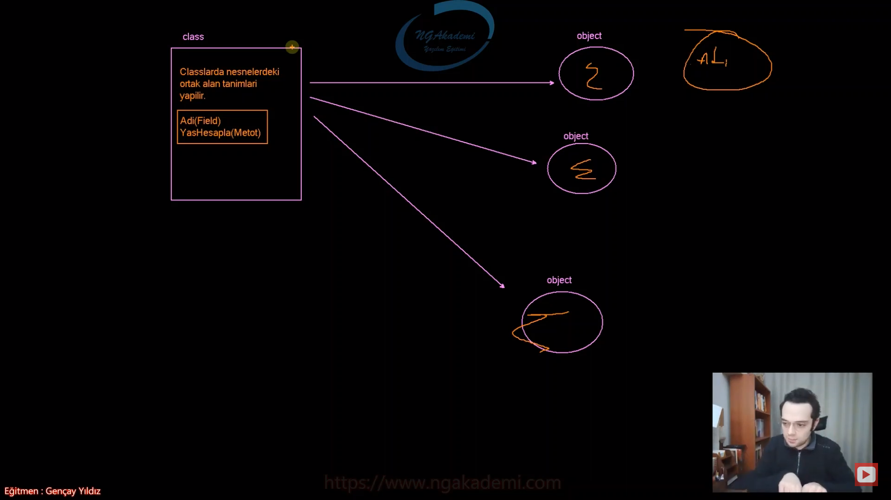
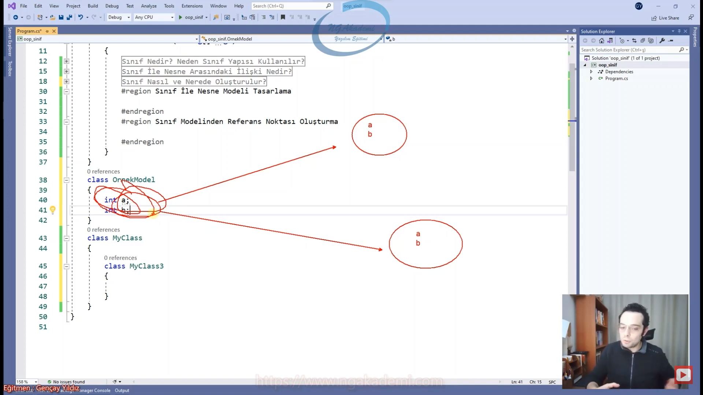
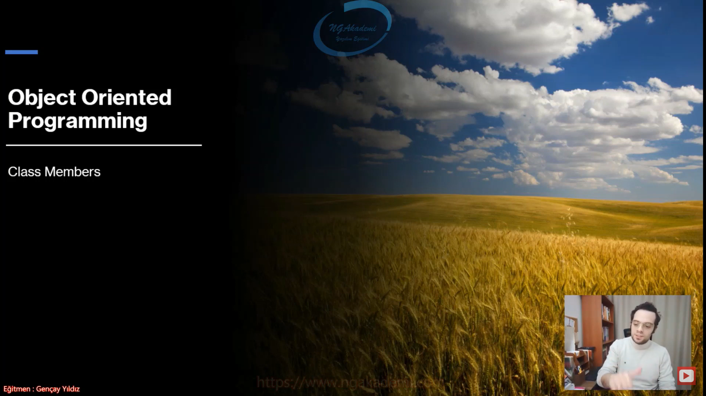
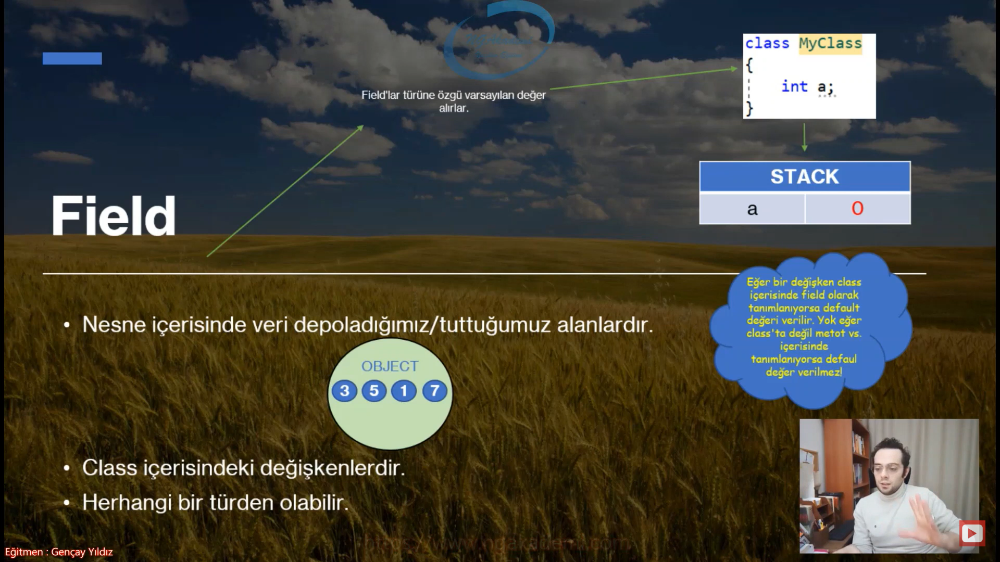
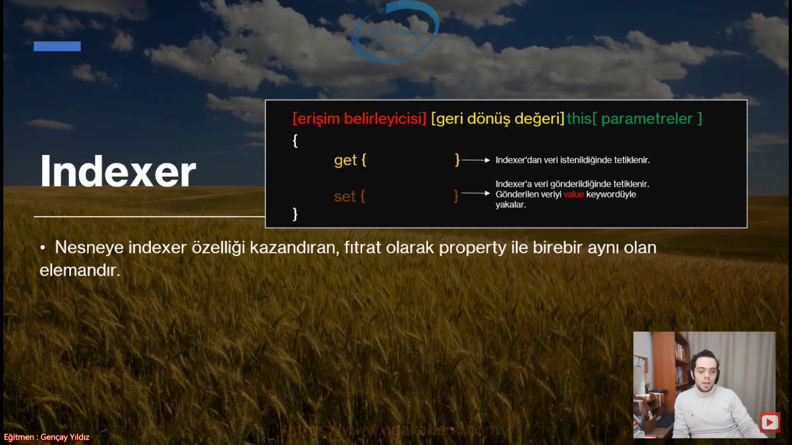

# Nesne Tabanlı Programlama #2 - Class Kavramı
- Nesne fıtrat olarak `class`tan üretilebilir bir yapıdır.

## Sınıf Nedir? Neden Sınıf Yapısı Kullanılır?
- OOP'de temel esas olan nesnedir.

- Benim bir object oluşturabilmem için öncelikle bunu modellemem gerekir.

- OOP'yi destekleyen herhangi bir programlama dilinde bir nesne oluşturabilmeniz için öncelikle o nesneyi modellemeniz lazım.

- Modellemek ilgili nesnenin önceden tanımlanmış arayüzü demektir.
    * Ben bir bina yapacam bu binayı ilk önce Autocad'de çiziyorum değil mi? Çizdiğim bu Autocad'deki modeli, gerçeği/somut hali ta kendisi oluyor. Dolayısıyla benim objem somut olan bu nesneyi oluşturabilmem için öncelikle bunu Autocad'de çizmem lazım gibi düşünün ya da kağıt üzerinde projesini çizmem lazım gibi düşünün. Haliyle onu çizmektir/onu modellemek/onu tasarlamak/onu oluşturmaktır.

- OOP'de bir object oluşturabilmek için öncelikle o objectin modellenmesi tanımlanması gerekmektedir.

- Bir objenin modelini/tanımını oluşturabilmek için `class` yapısı kullanılır.

- Programlama dillerindeki `class` dediğimiz yapılanma esasında bir nesnenin modelidir.

- `class` yapısı kendi içerisinde field dediğimiz ilgili nesnenin içerisinde hangi değerlerin tutulacağına dair o alanları tanımlamamızı sağlayan alanlar tutmamızı/tanımlamamızı sağlayabiliyor. Property yapılanmaları encapsulation yapılanmasını sağlayabiliyor. Indexer diyoruz işte dizilerde koleksiyonlarda ya da bunların dışında istediğiniz herhangi bir noktada Indexer operatörüyle işlem yapabilmemizi sağlayan belirli bir efektif syntax kazandırabiliyor. Metotlar tanımlayabiliyoruz. Metotlarla operasyonel olarak bir objenin içerisinde field'lardaki ya da dışarıdan gelen değerleri hangi işlemlere tabi tutabileceğimizi vs. bunları ayarlayabiliyoruz. 

- Sınıf bizim kodu yazdığımız kodu inşa ettiğimiz yerdir. Kod inşa edildi kod yazıldı artık bunu çalıştırmam lazım buradaki yazılan kod işlevselliğini göstersin dediğimde de Obje oluşturup bunu objede çalıştırıyoruz. Haliyle bizim için `class` dediğimiz yapılanma Objenin yani nesne tabanlı programlamanın temelidir.


## Sınıf İle Nesne Arasındaki İlişki Nedir?
- Sen bir `class` oluşturuyorsun bu `class`tan nesne üretilebiliyor.

- Sınıf bir nesne modelidir. Bu sınıf modelinden üretilen nesnelerde operasyonlar gerçekleştirebiliriz. Haliyle sınıfla nesne arasındaki ilişki bu davranış üzerinden kurulur.

- Sınıftan birden fazla nesne oluşturulabilir. İstediğin kadar nesne oluşturabilirsin. Yani tahsis edilen alanlarla belleği doldurana kadar oluşturabilirsin. Sınırın senin belleğin.

- `class`larda nesnelerdeki ortak alan tanımları yapılır.

- 80 milyonun cebindeki kimlik tek bir tane `class`tan türetildi. Aynı olan bu kimlik kartlarında senin kimliğinde senin adın benim kimliğimde benim adım yazmaktadır. Objeler aynı fıtrarlar aynı ama obje/nesne olarak farklı. İkisi de kimlik türünden farklı nesneler.

- `class` tekildir yani `class` bir tane tanımlarsın. Sadece bir modele karşı `class`ı bir kere tanımlarsın. Nesne ondan çoğul olarak türer. Yani bire çok vir ilişki vardır arada.
    * Ben bir insan diye `class` tanımlarım geriye kalan 8 milyar nesneyi bu insanlara bu `class`tan türetirim.



## Sınıf Nasıl ve Nerede Oluşturulur?
- C# syntax'inde ne var? C#'ta bişey oluşturacaksan öncelikle o şey ile ilgili bir keyword koyman lazım ortaya.
    * Örneğin `if` bloğu mu oluşturacaksın `if` yazarsın devamı gelir.
    * Örneğin `do while` bloğu mu oluşturacaksın `do while` yazarsın devamı gelir.
    * Örneğin `while` bloğu mu oluşturacaksın `while` yazarsın devamı gelir.
    * Örneğin `for` bloğu mu oluşturacaksın `for` yazarsın devamı gelir.
    * Örneğin `foreach` bloğu mu oluşturacaksın `foreach` yazarsın devamı gelir.

- C#'ın zaten genel semantiği bu şekilde.


- `class [isim]{}` Haliyle `class` mı oluşturacağım `class` yazıyorum diyorum ki ya kardeşim compiler bana bir tane `class` oluştur. Daha sonra bu `class`a isim vereceğim. Ardından da süslü parantezi açıp kapatıyoruz.

- Sen bir `class` oluşturdun yani nesne oluşturulabilir bir yapılanma oluşturdun.

- `class` oluşturduğum zaman RAM'de bundan nesne üretip yerleştirebiliyorum. Benim bu `class`ın türü neyse RAM'e yerleştirdiğim nesneninde türü o olur. İlgili nesneyi işaretleyebilmek içinde onun türünden bir referans gerekmektedir. Nesneyi RAM'e koymuş olduğum obje `class`ın adı neyse o türde.

- OOP'yi destekleyen tüm dillerde oluşturmuş olduğunuz `class` sizin için bir türdür. Bir referans türüdür. Nasıl ki `int` bir sayısal modele karşılık geliyor `bool` mantıksal değerlere karşılık geliyor `char` metinsel tek karakterli değerlere karşılık geliyor. Bunların hepsi tanımlanmış türler.
    * Diyelim ki ben geldim Ahmet diye bir `class` oluşturdum. Bu Ahmet türünden nesneyi karşılayacak. Ha işte Ahmet diye bir tür oluşturmuş oluyorsun. 

- Sen `class` oluşturduğunda bil ki yeni bir tür oluşturmuş oluyorsun. Bu şekilde de biz kendimize ait türlerimizi oluşturmuş oluyoruz.


- Sınıf 3 farklı yerde oluşturulur;
    * Namespace İçinde
    * Namespace Dışında
    * Class İçinde(Nested Type)

- Bir `class` tanımlamasında tanımlanan yerde(`namespace/dışı`,`class`) aynı isimde birden fazla `class` tanımlanamaz!

- Nasıl ki aynı scope içerisinde birden fazla değişken tanımlayamıyorsun aynı yerde nerede tanımlıyorsan artık aynı isimde birden fazla `class` tanımlayamazsın.

## Namespace İçerisinde Class Oluşturma
- `namespace` içerisinde birden fazla `class`, `struct`, `interface` gibi yapılanmaları barındıran esasında senin kütüphane mantığını oluşturmanı sağlayan yani genel anlamda kurmuş olduğun sistemde sınıflarını farklı `namespace`ler altında kategorize edip çağırılma esnasında hani o kategorizeler üstünden çağırmanı sağlayan bir yapılanma.

- Sınıf istiyorsan eğer `namespace` içerisinde oluşturulabilir. Zaten biz %99.9 bunu kullanacağız.

```C#
namespace oop_sinif
{
    class Program
    {
        static void Main(string[] args)
        {
            Console.WriteLine("Hello, World!");
        }
    }

    class MyClass
    {

    }
}
```

## Namespace Dışarısında Class Oluşturma
- Benzer mantıkla `namespace` dışında da `class` oluşturabiliyoruz.

- Aynı `namespace` altındaki `class`lar birbirlerine direkt ismi üzerinden erişebilirken farklı namespace altındaki `class`lar `namespace` ismi üzerinden birbirlerine erişebiliyorlar.

- Senle ben aynı evdeysek birbirimize çok rahat erişebiliyoruz. Ama sen karşı evdeysen ben bu evdeysem evim üstünden bana erişebiliyorsun.

- Eğer ki bir `class`ı `namespace`in üzerine koyarsan eğer `namespace`den bağımsız olur. Yani aynı evdeki ikimiz ikimize erişebiliyoruz. Farklı evlerde isimlerimizden ev isimleri üzerinden birbirimize erişebiliyoruz. Ama birimiz dışarıda. Dışarıdakine herkes erişebiliyor. 

- Yani bu `namespace`in altında tanımlanmayan `class`lara herhangi bir `namespace` ismi belirtmeksizin direkt erişebiliyoruz.
 
```C#
class MyClass2
{
    
}
namespace oop_sinif
{
    class Program
    {
        static void Main(string[] args)
        {
            Console.WriteLine("Hello, World!");
        }
    }
    class MyClass
    {

    }
}
```

## Class İçerisinde(Nested Type) Class Oluşturma
- Herhangi bir `class` içerisine `class` tanımlaması yapılabilir.

```C#
class MyClass
{
    class MyClass3
    {
        
    }
}
```

## Sınıf İle Nesne Modeli Tasarlama
- Sınıfla nasıl bir nesne modeli tasarlayabilirim Yani Autocad'de nasıl ben bu evi tasarlayabilirim konumuz.

- Sınıf ile nesne modeli tasarlayabilmek için yapmanız gereken ilk önce bir tane sınıf oluşturmak.

- Sınıf ile nesne modeli tasarlayabilmek için ihtiyacın;
    1. Bu nesnenin içerisinde değerler tutmam gerekebilir yani field dediğimiz değerler tutman gerekebilir.
    2. Bu nesnenin içerisinde operasyonel/eylemsel işlemler yapmam gerekebilir. Yani fonksiyonalite özelliği kazandırmam gerekebilir.

- 2 Tane özellik olması lazım. Biri alan koyacam bunun içerisine nesne üretildiği zaman o alanlara istediğim değerleri koyabileyim. İkincisi kah o alanlardaki değerler üzerinde işlemler yapabilecek fonksiyonlar oluşturmalıyım kah başka bir yerden dışarıdan gelen metotları vs. tanımlamalıyım.

- `class`ın içerisinde oluşturulan değişkenlere biz field deriz.

- Field bildiğin değişkenlerdir.



- `class`ın altında istediğin metodu tanımlayabilirsin.

- Yani temelde nesne varya işte o nesneyi kullanabileceğim sekilde bir sınıf burada tasarlıyorum tasarladığım sınıfı simüle ediyorum. Bunu böyle yaparsam bu böyle davranış sergiler. Şöyle olur böyle olur.


```C#
class OrnekModel
{
    int a;
    int b;
    public void X()
    {
        System.Console.WriteLine(a + " " + b);
    }
    public int Y()
    {
        return a * b;
    }
```
## Sınıf Modelinden Referans Noktası Oluşturma 
- Belleğimizde STACK ve HEAP denilen iki alan vardır.

- STACK'te neler tutuyorduk?;
    * Değişkenlerin kendileri
    * Değişkenlerin değerleri
    * Referans Türlü Değişkenlerin refaransları/kendileri

- HEAP'te neler tutuyorduk?
    * Nesneler

- Ben normalde STACK'e direkt erişebiliyorum. Developer olarak STACK'e direkt el uzatabiliyorum. Ama ne yazık ki HEAP'teki herhangi bir nesneyi elde edebilmek için developer olarak HEAP'e erişemiyorum. HEAP'e developer'ların erişimi direkt engellenmiş. Böyle bişeye müsaade edilmemiş. Dolayısıyla benim HEAP'teki nesneyi kullanabilmem için yapmam gereken işlem HEAP'e erişebilen bir aracı kullanmak. İşte bu aracı da STACK'teki referanslar oluyor.

- Referans STACK'te tutulan ve HEAP'teki herhangi bir nesneyi işaretleyebilme özelliğine sahip olan değişken türüdür. Biz buna değişken türü demiyoruz referans noktası diyoruz. Çünkü referans edebilme özelliğine sahip.


- Bir `class` tanımlandığında o `class` adı bir türdür. Haliyle o türü kullanabilmek için direkt olarak `class` adını kullanmamız yeterlidir.

- Yani bir nesne türüdür. Bir türe karşılık gelir.

- HEAP'teki herhangi bir nesneyi işaretleyebilmem için bunun işaretleyecek olan referansın türü nesnenin fıtratına/türüne uygun olmalıdır.
    * Birden fazla `class`ın olduğunu düşün biri erkek biri kadın. Nesne erkekse referansını türü erkek referansı olmalı. Kadınsa kadın referansı olmalı Yani nasıl ki normal değişkenlerde herhangi bir sayısal değeri tutarken sayısal türden bir değişken olması lazımken `bool` türdeki bir değişkeni `bool` dışında `char` ile tutamıyorsan işte bununla aynı mantık. 
    
- Türler eşleştirmeler birebir aynı olmalıdır.

- Referansın türünü belirlerken `class`ın ismini kullanmam yeterli olacaktır.


- Bir `class`ı değişken türüymüş gibi kullanabilmenin altında yatan şey esasında bu bir referans türlü bir değişken olmasıdır.

- Eğer ki bir referans noktasında herhangi bir nesne referans edilmiyorsa o referans noktası/referans `null` değere sahiptir...

- `null` değere sahip olabilmesi için nullable olması lazımdı. Referans türlü değişkenler özünde nullable olan değişkenlerdir.

- Referans eğer ki herhangi bir nesneyi işaretlemiyorsa bu default/varsayılan olarak `null`dır.


```C#
class Program
{
    static void Main(string[] args)
    {
        #region Sınıf Modelinden Referans Noktası Oluşturma
        //Bir `class` tanımlandığında o `class` adı bir türdür. Haliyle o türü kullanabilmek için direkt olarak `class` adını kullanmamız yeterlidir.
        OrnekModel w;
        
    }
}
class OrnekModel
{
    int a;
    int b;
    public void X()
    {
        System.Console.WriteLine(a + " " + b);
    }
    public int Y()
    {
        return a * b;
    }
}
```

## C# Examples
```C#
class MyClass2
{

}
namespace oop_sinif
{
    class Program
    {
        static void Main(string[] args)
        {
            #region Sınıf Nedir? Neden Sınıf Yapısı Kullanılır?

            #endregion
            #region Sınıf İle Nesne Arasındaki İlişki Nedir?

            #endregion
            #region Sınıf Nasıl ve Nerede Oluşturulur?
            #region Namespace İçerisinde

            #endregion
            #region Namespace Dışarısında

            #endregion
            #region Class İçerisinde

            #endregion

            //Bir `class` tanımlasında tanımlanan yerde(`namespace`/dışı, `class`) aynı isimde birden fazla `class` tanımlanamaz!
            #endregion
            #region Sınıf İle Nesne Modeli Tasarlama
                
            #endregion
            #region Sınıf Modelinden Referans Noktası Oluşturma
            //Bir `class` tanımlandığında o `class` adı bir türdür. Haliyle o türü kullanabilmek için direkt olarak `class` adını kullanmamız yeterlidir.
            OrnekModel w;
            #endregion

        }
    }
    class OrnekModel
    {
        int a;
        int b;

        public void X()
        {
            System.Console.WriteLine(a + " " + b);
        }
        public int Y()
        {
            return a * b;
        }
    }
    class MyClass
    {
        class MyClass3
        {

        }
    }
}
```

***
# Nesne Tabanlı Programlama #3 - Class Members #Field #Property #Encapsulation #Methot #Indexer


- OOP'de temel esas merkezi yapılanma objedir. Objenin fıtratıda `class`tır. Yani bir nesne ortaya koyabilmek için öncelikle o nesneyi modellemeniz lazım. Bu modellemeyi `class` dediğimiz yapılanmalarla oluştururuz.

- `class`ın içerisinde koyabildiğimiz bu yapılar `class`ın elemanları diye nitelendirilir ve `class` member olarak terminolojide geçer. member eleman demek üye demek Dolayısıyla `class`ın elemanları yani içerisine koyabildiğimiz işlevsel yapılar.

- bir nesne modellemesi yaptığımız `class`ın içerisinde Biz neler tanımlayabiliriz
    * Field => `class`tan üretilen nesne üzerinde değer tutmamızı sağlayan alanlardır.
    * Property => Field'lar üzerinde kontrollü bir şekilde değerleri dışarı açmamızı sağlayan ve bu dışarıdan gelecek olan değerleri de kontrollü bir şekilde field'lara atamamızı sağlar.
    * Metot => Nesne üzerinde prosedürel işlemler yapmamızı sağlayan küçük kod parçacıklarıdır.
    * Indexer => Dizilerde koleksiyonlarda olduğu gibi bizim kendi nesnelerimize indexer operatörünü(`[]`) kazandıran ve belirli işlemlerde kullanmamızı sağlayan bir özelliktir.

- Sınıfın elemanlarında constructor destructor ve static constructor gibi yapılanmalarda vardır. Bu memberlar özelleştirilmiştir. Bunlar sen tanımlasanda tanımlamasanda bir `class`ın içerisinde var olan özel yapılanmalardır. Ama property,field,metot gibi yapılanmalar sen tanımladığın sürece var olan tanımlamadığında bir nesnenin içerisinde varsayılan olarak olmayan yapılardır.

## Field Nedir?
- Nesne içerisinde veri depoladığımız/tuttuğumuz alanlardır.

- `class` içerisindeki değişkenlerdir.

- Herhangi bir türden olabilir.

- Field'lar türüne özgü varsayılan değer alırlar.

- Eğer bir değişken `class` içerisinde field olarak tanımlanıyorsa default değeri verilir. Yok eğer `class`ta değil metot vs. içerisinde tanımlanıyorsa default değer verilmez.

- OOP'de bir nesnenin içerisinde barındırılan en temel yapılanmadır.

- Bir nesnen var ya da bir `class` modelin var. Bu `class`tan üretilen binlerce nesnen var. Bu nesnelerin her biri kendi içerisinde kendine ait alanlara sahiptir. İşte bu alanlar field dediğimiz alanlardır.

- `class`ın içerisinde salt bir şekilde bir değişken tanımlandığını görüyorsan o field'dır. O `class`tan üretilecek olan nesnenin içerisinde field'dır. O nesne üzerinde değer tutmanı sağlar.


- Field tanımlamak istiyorsak eğer direkt `class` scope'larını içerisine değişken tanımlamanız yeterlidir.

- Tanımladığımız değişken `class` içerisindeyse field diyoruz metot içerisindeyse field demiyoruz. Herhangi bir metodun içerisinde/property dediğimiz yapının scope'ları içerisinde tanımlanmış olan değişkenler field değildir. Field sade ve sadece `class`ın scope'larında tanımlanmış olan değişkendir.

- Nesne üzerindeki field'larımız türüne göre STACK'te ya da HEAP'te tutulacak.

- Field dediğimiz yapılanma nesnenin üzerinde değer depolamamızı değer tutmamızı sağlayan yapılanmadır.

- Property ismini temsil edecekleri field'ın baş harfi büyük olarak başlar. Field isimleri küçük property isimleri de baş harfi büyük olacak şekilde tanımlanır/tasarlanır.

- Property hangi türden bir field'ı temsil ediyorsa o türden olmalıdır...

- Property'ler temsil ettikleri field'ların isimlerinin başharfi büyük olacak şekilde isimlendirilir...

```C#
#region Field
//Nesne içerisinde değer tutmamızı sağlayan alanlardır. 
MyClass m1 = new MyClass();//Nesne Oluşturduk!!!
m1.a = 5;
MyClass m2 = new MyClass();//Nesne Oluşturduk!!!
m2.a = 25;
#endregion

class MyClass
{
    public int a;
    public string b;
}
```

- `class` içerisinde tanımlanmış olan değerler türüne özgü varsayılan değeri direkt alacaktır.

- Bir `class` içerisinde field tanımlanırsa field'ın türüne özgün varsayılan değeri HEAP'te ya da STACK'te direkt atanmış olarak gelecektir.

- Sadece field'larda default değer atanır.

- Bir metot içerisinde değişken tanımlarsak eğer bunun default değeri atanmaz!



## Property Nedir?
- Nesne içerisinde özellik/property sağlar.

- Property esasında özünde bir metottur. Yani programatik/algoritmik kodlarımızı inşa ettiğimiz bir metot.

- Lakin fiziksel olarak metottan farkı parametre almamakta ve içerisinde `get` ve `set` olmak üzere iki adet blok almaktadır.

- Property'e bir değer atandığında o değeri `set` bloğu karşılar.

- Property'nin değeri çağrıldığında `get` bloğu tetiklenir ve değeri return eder.

- Property'nin işlevsel açıdan metottan farkı yoktur, yani bütün operasyonları property içinde sağlayabilirsin lakin davranışsal olarak nesne üzerinde bir değer okuma ve değer atama işlemlerinde kullanılır.

- Keza bu bloklar compile neticesinde `get` ve `set` isimli metotlar olarak karşımıza çıkmaktadır.

- `get` ve `set` dediğimiz özelleştirilmiş 2 adet metot olan bloklar barındırmaktadır.

- Metotta parantez vardır property'de yoktur.

- Eğer property'i çağırıyorsan `get` bloğu tetiklenecek eğer ki property'e bir değer gönderiyorsan `set` bloğu tetiklenecektir. `set` bloğunda da ilgili gönderdiğin değeri yakalayacaktır.

- C# dilinde bu property dediğimiz yapılanma bunun için geliştirilmiştir. Adamlar diyor ki yav metotlarda yaptığımız bu işlemleri spesifik olarak belirli işlemleri property dediğimiz yapılarda yapmamız daha doğru olacaktır.

- Property'nin işlevsel açıdan metottan hiçbir farkı yok. Yani metotta ne yapıyorsan property'de de aynısını yapabilirsin. Sadece belirli davranışlar var o davranışlarda property'i tercih ediyoruz. O davranışlarda bir field'ın değerini okumak ya da değer atamak.

- Senin property olarak ele alacağın bu yapılanmalar özünde bir metot.


- Biz yazılımcılar nesnelerimiz içerisindeki field'lara direkt erişilmesini istemeyiz.

- Dolayısıyla field'lar da ki verileri kontrollü bir şekilde dışarıya açmak isteriz.

- İşte böyle bir durumda metotları kullanabiliriz.

- Ancak benim kontrolümde field'daki değeri elde edebilirsin. Burada ilgili field'da ki değerin hepsi yahut bir kısmı talep edene gönderilir. Böylece kontrol sağlanmış olur.

- Böyle bir durumda C# propgramla dilinde metot yerine property yapıları geliştirilmiştir.

- Yani property yapıları özünde nesne içerisindeki bir field'ın dışarıya kontrollü açılmasını ve kontrollü bir şekilde dışarıdan değer almasını sağlayan yapılardır.

- İşte... Biz property'lerin bu işlevine Encapsulation(Kapsülleme/Sarmalama) diyeceğiz...

- Elinde bir nesne var diyelim ben bir sınıf yazdım ve sen bu sınıfı kullanacaksın. Benim yazdığım sınıf içerisinde field varsa eğer ben yazılımcı olarak namuslu davranacağım diyeceğim ki ben benim yazmış olduğum sınıftaki herhangi bir field'ı direkt herhangi bir developer'ın erişmesini istemiyorum böyle bir takıntım var.

- Field'ı sınıfın içerisindeki bir cüzdan gibi düşün. Benim cüzdanımdan sen direkt para alma kardeşim. Benim cüzdanımdan para istiyorsan devreye ben gireyim kontrollü bir şekilde ben sana vereyim parayı. İşte bu kontrolü property sağlamaktadır. Sen buradaki kontrolde araya metot sokabilirsin ve metotta elindeki field'ın değerini dışarıya kontrollü bir şekilde açabilirsin. C# diyorki Metotlarla bütün diller yapıyor biz farkımızı yaratalım property dediğimiz yapılanma üzerinden sen bu işlemi yap. Tamam metotla yapabilirsin. Property'i bunun için icat ettik property ile de yapabilirsin kardeşim. ben nasıl cüzdanıma direkt müdahale edilmesini istemiyorsam hani field'ıma haliyle property'de araya girebiliyor.

- Şimdi bizim bir nesnemiz var ve bu nesnenin içerisinde field'larımız var. Eleman gelecek diyecek ki ya kardeşim şu field'ın içindeki değeri sen ver bakayım bana diyecek biz araya property'i sokacaz. Yok öyle ben sana direkt field'ı falan vermem kardeşim kusura bakma. Field'ı vermemek için field'ın dışarıdan erişilebilir olmasını engellemem lazım. `private` olarak işaretleyeceğim. Öyle yok ha diyince istediğin field'ın değerine erişmek. Ben verecem sana kontrollü olarak ben verecem. Bir function tanımlayacağım tanımladığım function ilgili field'ın değerini istediğim şekilde yani benim kontrolümde verecek. Dışarıdan direkt erişimi engelleyeceğiz.

- Burada ilgili field'daki değerin hepsi veya bir kısmı talep edene gönderilir. Bu benim kararıma bağlı. Hilmi benden 100TL istedi ben vebimdeki cüzdandaki 100 TL'nin hepsini vermem derim ki kardeşim sen dur benim cüzdanıma bakma alırsın böyle ulan 100 TL değilde ben bu herife 50 TL vereyim dersin. Hilmi zanneder ki senin cüzdanındaki parayı aldı halbuki 50 TL daha duruyor. Ama orada ne duruyor bilemez. İşte araya ben girmesem Hilmi bizm cüzdanı soyacak. Nesne olarak düşünürsen field'ına direkt Hilmi erişirse olmaz. Biz yazılımcılar bu durumu istemeyiz. Haliyle araya metot sokabilirsin C#'ta property'i sokarsın. Property derki kardeşim fieldlara kontrollü erişmeni sağlarım ben. İlk önce bana erişeceksin ben sana verecem field'daki değeri. Ne istiyorsan ben kendi kontrolüme göre verecem.

- Field var arkada field'a dışarıdan erişilmek isteniyor. Dışarıdan kastımız uzak bir makinadan ya da farklı bir yerden değil senin `class`ını kullanan developer. Yine kodun içerisinde ilgili `class`ının nesnesi üzerinden birisi senin field'ına erişmek istiyor. Oraya bir değer atamak istiyor ya da oradaki değeri okumak istiyor. Bu istek durumunda yani buradaki operasyonda sen dur kardeşim benim field'ıma sen erişemezsin bu field'a benim yani property üzerinden erişeceksin demek o field'ı kapsüllemek.


## Encapsulation(Kapsülleme/Sarmalama) Nedir?
- Encapsulation, bir nesne içerisindeki dataların(field'lardaki verilerin) dışarıya kontrollü bir şekilde açılması ve kontrollü bir şekilde veri almasıdır.

- İşte bu şekilde field'lardaki verilerin erişim kontrolünü yapmamız için geliştirilmiş olan yapılara Property denmektedir.

- Nesnenin içerisinde data diyorsam %1000 aklına field gelecek.

- Encapsulation dediğimiz yapılanma, bir nesne içerisindeki dataların/fieldların verilerini dışarıya kontrollü bir şekilde açan dışarıdan gelecek olan değerleri kontrollü bir şekilde alıp ilgili field'lara yerleştiren yapılanmadır.

- Küçük bir çocuğun babası var diyelim. Şimdi küçük bir çocuğu siz kızdınız yaramazlık yaptı sen gidip çocuğu dövmüyorsun babasına haber veriyorsun. Babası kapsüllüyor çocuğunu. Normalde sana kalsa çocuğu perişan edeceksin ama gidiyorsun babasına senin çocuğun bana bunu bunu yaptı diyorsun babası senin vermiş olduğun buradaki duruma göre gidiyor çocuğuna gerekli cezayı gerektiği kadarıyla veriyor. Nihayetinde ceza verilmiş oluyor mu oluyor ama çocuğunu koruyarak veriyor yani orada bir kontrol var. Dışarıdan gelen şiddeti absorbe edebiliyor. Aynı şekilde çocukla dışarıdaki iletişimi de baba sağlayabiliyor.

- Property kullanıyorsanız encapsulation kavramını kullanıyorsunuz/gerçekleştiriyorsunuz/buradaki fiiliyatı uyguluyorsunuz demektir


## Property İmzaları
- Property yapısı oluşturabilmenin yapısal olarak birkaç farklı yolu/farklı imzası vardır.
    * Full Property
    * Prop
    * Auto Property Initializers
    * Ref Readonly Returns
    * Computed(Hesaplanmış) Properties
    * Expression-Bodied Property
        + Read Only Property
    * Init-Only Properties ve Init Accessor


## Property İmzaları - Full Property
- En sade/temel property yapılanmasıdır.

- İçerisinde `get` ve `set` blokları tanımlanmalıdır.

- `[Erişim Belirleyicisi] [Geri Dönüş/Alış Değeri] [property adı]{ get{} set{}}`
    * `[Erişim Belirleyicisi]` => Herşeyden önce dışarıdan erişilip erişilmeyeceğini property imzasından önce belirlememiz gerekiyor.
    * `[Geri Dönüş/Alış Değeri]/[Property Türü]` => Bu property hangi değeri alacak hangi değeri geri döndürecek. 
    * `[property adı]` => Property adı verilir.
    * `{` => İşlem yapacağımız scope'umuzu başlatıyoruz.
    * `get{}` => Property'den veri istendiğinde tetiklenir.
    * `set{}` => Property'e veri gönderildiğinde tetiklenir. Gönderilen veriyi `value` keywordüyle yakalar.
    * `}`

- Full property'lerde `set` bloğu tanımlanmazsa sadece okunabilir(readonly) bilakis `get` bloğu tanımlanmazsa sadece yazılabilir(write only) olacaktır.

- Parantezsin scope açarsak bu direkt property olur. Parantez koyarsak metot olur.

- İlgili field'lar arasında veri gönderirken veri istenirken araya property'i sokacağız ya bu property'nin erişilebilir olması gerekir.

- Propertyler hangi field'ı temsil ediyorsa hangi field üzerinde işlem yapıyorsa o field'ın türüyle aynı olmak zorundadır. Nihayetinde property'de o türde değer alacak. 

- `get{}`
    * Property üzerinden değer talep edildiğinde bu blok tetiklenir.
    * Yani değer buradan gönderilir. Değer buradan gönderilecekse değerin `return` edilmesi gerekir.

- `set{}`
    * Property üzerinden ilgili field'a bir değer göndereceksek bu blok tetiklenir.
    * Gönderilen değeri `value` keywordüyle yakalarız.
    * `value` keywordü property'nin türü ne ise o türe bürünecektir.

- Property üzerinden değer talep edildiğinde `get` Property üzerinden değer gönderildiğinde `set` bloğu çalışacaktır. Dolayısıyla burada property araya girmiş olacak senin field'ına dışarıdaki kişi erişemediğinden dolayı property aracılığıyla dolaylı yoldan erişebildiğinden dolayı encapsulation yapmış olacaksın. Bunu metotlada yapabilirsin ama property oluşturulmasının sebebi metotlardaki zahmetli süreci tek bir property üzerinden `get` `set` blokları sayesinde hızlı bir şekilde yapmanı sağlamasıdır.

- Diyelim ki biz bir banka operasyonu/çalışması yapıyoruz ve 50 kişilik bir ekibiz. 50 kişilik ekibin içerisinde 4 5 kişilik ekip kuruluyor. Diyorlar ki ya kardeşim siz çok önemli bir iş yapacaksınız ve diğer arkadaşlarınızla bu işi paylaşmamanız lazım. Bankayla ilgili bütün bakiye bilgilerinin çalışmasını sen yapacaksın. Bu 4 kişinin eriştiğiyle geriye kalan 46 kişinin eriştiği aynı olmamalıdır. Bu 4 kişinin erişebildiği field bilgilerini direkt 46 kişiye açmamamız lazım. Dolayısıyla buradaki field'ları kapatıyoruz. Property üzerinden o 46 kişiye kapsülleyerek yani kontrollü bir şekilde açıyoruz ki bankada ne kadar bakiye bilgisi var kimin ne kadar parası var vs. bilemesinler.

- Eğer ki bir property'nin sadece `get` bloğunu tanımlarsanız o property üzerinden set işlemi yapamazsınız. Sadece okunabilir özelliği aktif olacağından sadece okuma işlemi yaparsınız. Yani elinizde bir field var bu field'ın kontrollü bir şekilde sadece dışarıdan okunmasını istiyorsun ama herhangi bir değer almak istemiyorsan ilgili property'nin `set` bloğunu kapatabilirsin. Benzer mantıkla ilgili property'nin `get` bloğunu silip `set` bloğunu aktif bırakırsan sadece property'e değer atayabilirsin ama okuyamazsın.


```C#
#region Property
MyClass myClass = new();
System.Console.WriteLine(myClass.Yasi);
myClass.Yasi = 65;
System.Console.WriteLine(myClass.Yasi);
#endregion

class MyClass
{
    int yasi;
    string b;

    #region Full Property
    //Property hangi türden bir field'ı temsil ediyorsa o türden olmalıdır...
    //Property'ler temsil ettikleri field'ların isimlerinin başharfi büyük olacak şekilde isimlendirilir...
    public int Yasi
    {
        get
        {
            //Property üzerinden değer talep edildiğinde bu blok tetiklenir.
            //Yani değer buradan gönderilir.
            return yasi - 10;
        }
        set
        {
            yasi = value;
        }
    }
    #endregion
}

class Banka
{
    int bakiye;
    public int Bakiye
    {
        get
        {
            if (bakiye > 0)
                return bakiye * 10 / 100;
            return 5;
        }
        set
        {
            if (value < 10)
                bakiye = value;
            else
                bakiye = value * 5 / 100;
        }
    }
}

```

## Property İmzaları - Prop Property
- Bir property her ne kadar encapsulation yapsada temsil ettiği field'da ki dataya hiç müdahale etmeden erişilmesini ve veri atanmasını sağlıyorsa böyle bir durumda kullanılan property imzasıdır.

- Ne gerek var direkt field'a erişim sağlasak? Hayır! Field'da ki değere müdahale olsun olmasın direkt erişim yapılmasını istemiyoruz. Bu alışkanlığımız olsun. Haliyle böyle bir durumda yine property kullanacağız. Sadece `get` ve `set` tanımlanması yeterli olacaktır.

- `[Erişim Belirleyicisi] [Geri Dönüş/Alış Değeri] [Property Adı] {get;set;}`

- Prop property'ler compile edildiklerinde arkaplanda kendi field'larını oluştururlar. Dolayısıyla bir field tanımlamaya gerek yoktur.

- Prop imzalarda ilgili property readonly olabilir lakin writeonly olamaz!

- Yani senin bir field'ın var bu field'ın içerisindeki değeri property üzerinden herhangi bir kontrol yapmadan/`if`e `switch`e tabi tutmadan direkt değerini property üzerinden gönderiyorsan aynı şekilde gelen değeri herhangi bir kesme/kontrol/operasyon yapmadan direkt field'a gönderiyorsan böyle bir durumda property'e ne gerek var. Amma velakin biz yine bunu property üzerinden sağlayacağız ve bunu prop property'si üzerinden sağlayabilirsiniz.

- Müdahale olsada olmasada sen araya property'i koyacaksın. Field'a direkt erişim olmaz.

- Property tanımlarken eğer prop tanımlıyorsanız bunda herhangi bir field tanımlamanıza gerek yok. Compiler arka planda bu property'e ait bir tane field oluşturacaktır.

- Prop Property'ler readonly olabilir amma velakin write only olamaz çünkü zaten arkada oluşturulan field'a sen yazacanda bir yerde kullanamadıktan sonra/ bir yerde get edemedikten sonra ne anlamı var diyip adamlar bunu engellemişler.

- Prop'la tanımlanan tüm property'lerde readonly yapabiliyorsun. readonly'ide Auto Property Initializers (C# 6.0) özellikten dolayı yapabiliyorsun. Yani diyor ki adam sana ilk değerini burada atadın ya atadıktan sonra en azından başka yerlerde bu değeri çağırma şansın oluyor onun için müsaade etmişler. Ama write only yapamıyorsun. 


```C#
MyClass myClass = new();
myClass.Yasi2 = 12;
System.Console.WriteLine(myClass.Yasi2);

class MyClass
{
    #region Prop Property
    // public int Yasi
    // {
    //     get
    //     {
    //         return yasi;
    //     }
    //     set
    //     {
    //         yasi = value;
    //     }
    // }
    public int Yasi2 { get; set; }//Prop Property
    public int Yasi3 { get => yasi; set => yasi = value; } //Full Property
}
```

## Property İmzaları - Auto Property Initializers (C# 6.0)
- Bir property'nin ilk değerini nesne ayağa kaldırılır kaldırılmaz verebilmekteyiz.

- Auto property initializers özelliği sayesinde read only prop'lara hızlıca değer atanabilmektedir.

- Entity Framework'te entity'leri tasarlarken bizim her bir entity'nin içerisinde full prop property'si kaynıyor bunun nedeni esasında sen orada field oluşturuyorsun oluşturacağın field'ların yerine property'ler üzerinden ilgili field'larını tasarlayıp hızlı bir şekilde veri transferini sağlamış oluyorsun. Orada da encapsulation oluşturuyorsun. 

- Bundan sonra biz field'mı oluşturacağız. Oluşturacağımız field üzerinde herhangi bir kapsülleme operasyonu yapmasakta direkt prop üzerinden o field'ı oluşturup encapsulation yine kullanalım ama herhangi bir kontrole gerek kalmaksızın kullanalım diyebileceğiz.


```C#
class MyClass
{
    public int Yasi { get; set; } = 15;//Çünkü Yasi property'si prop olduğundan dolayı arkada compiler tarafından bunun field'ı oluşturulacak haliyle oluşturulan field'ın değeri türüne göre default değer olacaktır. İşte sen oradaki default değere bu şekilde müdahale edebiliyorsun.
    #endregion
}
```

## Property İmzaları - Ref Readonly Returns
- [C# 7.2 – Ref Readonly Returns](https://www.gencayyildiz.com/blog/c-7-2-ref-readonly-returns/)

- ref readonly returns, bir sınıf(`class`) içerisindeki field'ı referansıyla döndürmemizi sağlayan ve biryandan da bu değişkenin değerini read only yapan özelliktir.

- Şimdi diyelim ki bir property/field tanımladığını düşün. Şimdi bu property'e/field'a her erişmen gerektiği taktirde yapman gereken işlem bu `class`tan nesne oluşturmak. `class`tan nesne oluşturdukça burada sürekli field oluşturulacaktır her bir nesne için. İşte bu field'ın her seferinde oluşturulup bellekte lüzumsuz yer kaplamasından ziyade biz burada ilgili field'ın sadece referansını döndürebiliyoruz.


```C#
class MyClass
{
    #region Ref Readonly Returns
    string adi = "Musa UYUMAZ";
    public ref readonly string Adi => ref adi;
}
```

## Property İmzaları - Computed(Hesaplanmış) Properties
- İçerisinde türetilmiş bir bağıntı taşıyan property'lerdir.


```C#
class MyClass
{
    #region Computed Property
    int s1 = 5;
    int s2 = 10;s

    public int Topla{
        get{
            return s1 + s2;
        }
    }
    #endregion
}
```

## Property İmzaları - Expression-Bodied Property
- Tanımlanan property'de Lambdda Expression kullanmamızı sağlayan söz dizimidir.

- Bu şekilde expression-bodied ile imzalanan property'ler readonly olarak oluşturulacaktır.

- Expression-Bodied Property'ler kısmi olarak Auto property initializers'ın akrabasıdır diyebiliriz...


## Property İmzaları - Init-Only Properties - Init Accessor (C# 9.0)
- Init-Only properties, nesnenin sadece ilk yaratılış anında property'lerine değer atamaktadır.

- Böylece iş kuralı gereği runtime'da değeri değişmemesi gereken nesneler için bir önlem alınmaktadır.

- Init-Only properties developer açısından süreç esnasında değiştirilmemesi gereken property değerlerinin yanlışlıkla değiştirilmesinin önüne geçmekte ve böylece olası hata ve bug'lardan yazılımı arındırmaktadır. Böyle bir durumda direkt aklınıza Auto Property Initializers gelmiş olabilir... Ama farkları sonraki derslerimizde göreceğimiz Object Initializer desteğidir.

- Object Initializer konusudna bir nesne oluşturulurken nesnenin içerisindeki property'lere ilk değerlerini verebiliyoruz. Eğer ki bu property'ler Auto Property Initializers'sa bundan yararlanamıyoruz. Yok bu property'ler Init-Only Property şeklinde tasarlanduysa burada ilk değerlerini verebiliyoruz. Yani bu Object Initializer özelliğinden faydalanabiliyoruz. Amma velakin yine readonly davranışa devam ediyor.


## Metot Nedir?
- Nesne üzerinde field'larda ki yahut dışarıdan parametreler eşliğinde gelen değerler üzerinde işlemler yapmamızı sağlayan temel programatik parçalardır.

- Prosedürel operasyonlar gerçekleştirmemizi sağlarlar.

- Property'lerin kesinlikle bir türü olmalı yani hiçbir property `void` olamaz. Kesinlikle bir türü olmalı. Herhangi bir tür olmabilir. Metotlar `void` olabiliyor. Geri dönüş türüne sahip olmak zorunda değil.

- Property'lerde bir tür olmak zorunda çünkü o tür sadece geri dönüş türü değil. Yani veri transferini sağlayacak ya arada bir kapsüüleme yapıyor işte bu görev yaparken hangi türde veriyi transfer edeceğini arada nasıl bir encapsulation hangi türde bir kapsülleme yapacağını bilmek ister. Kesinlikle bir türü olmalıdır.

- Property'lerde değer alırken ve değer atarken normal değişken davranışı sergiliyoruz. Ama metotlarda parantez ile kullanmak zorundayız. Semantik açıdan bu şekilde çalışmalıyız.


```C#
#region Metot
MyClass myClass1 = new();
myClass1.X();
#endregion

class MyClass
{
    #region Metot
    public int X(){
        return 0;
    }
    #endregion
}
```

## Indexer Nedir?
- Nesneye indexer özelliği kazandıran, fıtrat olarak property ile birebir aynı olan elemandır.

- `[Erişim Belirleyicisi] [Geri Dönüş/Alış Değeri] this[parametreler] {get{} set{}}`
    * `get{}` => Indexer'dan veri istenildiğinde tetiklenir.
    * `set{}` => Indexer'a veri gönderildiğinde tetiklenir. Gönderilen veriyi `value` keywordüyle yakalar.

- Eğer ki bir sınıfın nesnesine indexer özelliği kazandırmak istiyorsan `this` keywordü olması gerekir.



```C#
#region Indexer
MyClass myClass2 = new();
myClass2[3] = 10;
#endregion

class MyClass
{
    #region Indexer 
    public int this[int a]
    {
        get
        {
            return a;
        }
        set
        {
            a = value;
        }
    }
    #endregion
}
```


## C# Examples
```C#
namespace oop_sinif;
class Program
{
    static void Main(string[] args)
    {
        #region Class Members
        #region Field
        //Nesne içerisinde değer tutmamızı sağlayan alanlardır. 

        // MyClass m1 = new MyClass();//Nesne Oluşturduk!!!
        // // m1.a = 5;
        // System.Console.WriteLine(m1.a);

        // int a;
        // System.Console.WriteLine(a);

        // MyClass m2 = new MyClass();//Nesne Oluşturduk!!!
        // m2.a = 25;
        #endregion
        #region Property
        MyClass myClass = new();
        System.Console.WriteLine(myClass.Yasi);
        myClass.Yasi = 65;

        System.Console.WriteLine(myClass.Yasi);

        myClass.Yasi2 = 12;
        System.Console.WriteLine(myClass.Yasi2);
        #endregion
        #region Metot
        MyClass myClass1 = new();
        myClass1.X();
        #endregion
        #region Indexer
        MyClass myClass2 = new();
        myClass2[3] = 10;
        #endregion
        #endregion
    }
}
class MyClass
{
    int yasi;
    string b;

    #region Full Property
    //Property hangi türden bir field'ı temsil ediyorsa o türden olmalıdır...
    //Property'ler temsil ettikleri field'ların isimlerinin başharfi büyük olacak şekilde isimlendirilir...
    public int Yasi
    {
        get
        {
            //Property üzerinden değer talep edildiğinde bu blok tetiklenir.
            //Yani değer buradan gönderilir.
            return yasi - 10;
        }
        set
        {
            yasi = value;
        }
    }
    #endregion
    #region Prop Property
    // public int Yasi
    // {
    //     get
    //     {
    //         return yasi;
    //     }
    //     set
    //     {
    //         yasi = value;
    //     }
    // }
    public int Yasi2 { get; set; }//Prop Property
    public int Yasi3 { get => yasi; set => yasi = value; } //Full Property
    public int Yasi4 { get; set; } = 15;//Çünkü Yasi4 property'si prop olduğundan dolayı arkada compiler tarafından bunun field'ı oluşturulacak haliyle oluşturulan field'ın değeri türüne göre default değer olacaktır. İşte sen oradaki default değere bu şekilde müdahale edebiliyorsun.
    #endregion
    #region Ref Readonly Returns
    string adi = "Musa UYUMAZ";
    public ref readonly string Adi => ref adi;
    #endregion
    #region Computed Property
    int s1 = 5;
    int s2 = 10;

    public int Topla
    {
        get
        {
            return s1 + s2;
        }
    }
    #endregion
    #region Metot
    public int X()
    {
        return 0;
    }
    #endregion
    #region Indexer 
    public int this[int a]
    {
        get
        {
            return a;
        }
        set
        {
            a = value;
        }
    }
    #endregion
}

class Banka
{
    int bakiye;
    public int Bakiye
    {
        get
        {
            if (bakiye > 0)
                return bakiye * 10 / 100;
            return 5;
        }
        set
        {
            if (value < 10)
                bakiye = value;
            else
                bakiye = value * 5 / 100;
        }
    }
}

```

***
# Nesne Tabanlı Programlama #4 - Class Yapısına Dair Son Dokunuşlar
## Class İçerisinde Tanımlanan Class Sınıf Elemanı mıdır?
- `class` `namespace` dışında, `namespace` içinde ya da herhangi bir `class`ın içerisinde tanımlanabilir.

- field, property, method, indexer `class` elemanıdır. Aynı zamanda constructor, deconstruct, static constructor da sınıf elemanıdır.

- `class` içinde `class` tanımlayabiliriz biz buna nested `class`lar deriz.

- Nested type `class`lar `class`ın elemanı olmazlar. Koca uygulamada o kadar namespace varken tanımlayacak yer bulamamışsın gitmişsin nested type olarak `class`ı tanımlamışsın. Bu da bir `class`tır nihayetinde bununda kendine göre memberları olacaktır. Bununda nesneleri olacaktır. Sadece tanımlandığı yer bir `class`ın içerisidir.

- Bir `class`ın elemalarına `class`ın nesnesi üzerinden erişebiliriz. Eğer ki nested `class`ta bir member olsaydı `class` üzerinden içinde tanımlanmış olan `class`a bir şekilde erişebilmem lazımdı.

- Bir `class` içerisinde tanımlanmış nested type dediğimiz `class`lar sınıfın elemanı olamaz!

- nested `class`lar üstteki `class`ın sadece isminin altındadır. Yani üst `class`ın ismi üzerinden erişilebilir.

- `.` operatörüyle giden kod hani zincirleme gidiyor en sonda ne varsa o kodun türü o dur.

```C#
#region Class İçerisinde Tanımlanan Class Sınıf Elemanı mıdır?
MyClass m1 = new();
MyClass.MyClass2 m2 = new MyClass.MyClass2();
#endregion

class MyClass
{
    int a;
    public int MyProperty { get; set; }
    public void X() { }
    public void X(int a) { }

    public int this[int a]
    {
        get { return 0; }
    }

    class MyClass2 { }
}
```


## Class Elemanlarına Açıklama Satırı Nasıl Eklenir?
- Sınıfa ya da sınıfın altındaki herhangi bir member'a bir açıklama eklemek istiyorsanız yapmanız gereken şey açıklama ekleyeceğiniz yapının başına gelip `///` koyarsak eğer summary dediğimiz yapıyı getirecektir. Bu summary'inin içine yazmış olduğunuz açıklama senin ilgili member'a eklenecek açıklamadır.

- `//` yorum satırı anlamına gelir.

- Sen `///` koyduğun anda hangi yapının üzerinde bunu yapıyorsan eğer o altındaki yapılanmaya göre bir format bir taslak çıkaracaktır.

- Açıklama satırları bizim kendi adımıza yazdığımız kodları daha sonraki süreçlerde geriye dönüp baktığımızda daha hızlı kavrayabilmek ne amaçla kodu yazdığımızı anlayabilmemiz için oluşturulması gereken notlardır. Nihayetinde kodun açıklamasını izahatini yapmamızı sağlayan yapılanmalardır.

- Özellikle sen kodun içerisine yorum satırı olarak bu açıklama satırlarını eklersen eğer ilgili yorumu görebilmen lazım. Halbuki editörümüz summary yapılanmasıyla direkt türün üzerinden ya da ilgili member'ın üzerinden sana açıklamayı direkt gösterebilmektedir. Burada daha hızlı bir şekilde `class` ya da member'ın neye yaradığını öğrenebilmektesin. 
 
- Hem kendi yazmış olduğun kodlar için kendine hatırlatıcı bir unsur olacaktır. Hemde asıl önemlisi olan senin dışında senden sonra göreve devam edecek olan ya da sisteme daha sonradan dahil olan developer'ın ne olduğuna dair bu kodun açıklanması sistemdeki kodların ne olduğuna dair hızlı bir şekilde anlamasını sağlayacak bir dökümantasyon görevi gören yapılanmalardır. 

- Bu açıklama satırlarını çokta abartmamak lazım. Oturupta böyle destan yazmayacaksınız. Mümkün mertebe kısa ve anlaşılır yazmanız yeterli olacaktır.

## C# Examples
```C#
#region Class Elemanlarına Açıklama Satırı Nasıl Eklenir?
Random random = new();
MyClass myClass = new MyClass();
myClass.X();
#endregion

/// <summary>
/// Bu bir örnek classtır
/// </summary>
class MyClass
{
    int a;

    /// <summary>
    /// Bu bir property'dir.
    /// </summary>
    public int MyProperty { get; set; }

    /// <summary>
    /// Bu bir örnek metottur.
    /// </summary>
    public void X() { }

    /// <summary>
    /// Bu bir örnek metot overload'ıdır.
    /// </summary>
    /// <param name="a">a parametresi</param>
    public void X(int a) { }

    public int this[int a]
    {
        get { return 0; }
    }

    class MyClass2 { }
}
```

***
# Nesne Tabanlı Programlama #5 - this Keyword'ü Nedir? İşlevleri Nelerdir?
- `this` keywordü 3 amaçla kullanılır;
    1. Sınıfın nesnesini temsil etme durumudur ki genellikle bu amaçla kullanılır.
    2. Aynı isimdeki field ile metot parametrelerini ayırmak için kullanılan `this` keywordüdür. Bu 1. ile aynı amaca hizmet eden bir keyword yapılanması.
    3. Bir constructor'dan başka bir constructor'ı çağırmak için kullanılan keyworddür.

## this Keywordünün Kullanıldığı Durum - 1. Sınıfın Nesnesini Temsil Eder
- `this` keywordü direkt sınıf içerisinde kullanılan ve sınıfın içerisindeki memberlarda kullanılan bir keyworddür.

- `this` keywordü programatik bir keyword yani herhangi bir yerde çağıramazsınız sadece memberların içerisinde çağırmanız gerekiyor. Haliyle field, property, metot, indexer ya da constructor, deconstructor, desctructor bunlar gibi memberlarda çağırılır

- Elimizdeki bir `class`tan istediğimiz kadar nesne oluşturabiliyoruz. Örneğin bir nesne oluşturduk Bu sınıftan oluşturulan bu nesneyi sınıfın modellemesi esnasında temsil etmemi sağlayan keyword `this` keywordüdür.

- `this` keywordünü kullanarak `class`tan üretilecek olan nesneyi `class`ta temsil edebiliyorum.

- İlgili sınıftan üretilen her bir nesneyi `this` keywordü ile temsil edebiliyoruz. 

- İlgili sınıftan oluşturulmuş olan nesneyi sınıf modellemesinde temsil etmeni sağlayan keyword `this` keywordüdür. Ama bu nesnelerden herhangi birini temsil etmez. Oluşturulan nesneyi temsil eder. Yani nesne açısından baktığın zaman nesnenin içerisindeki `this` keywordü nesneyi bağlar. 

- O anki nesne ne ise bu oluşturulmuş olan binlerce nesnenin her birini nesne üzerinden daha doğrusu nesne modellemesi üzerinden temsil etmeni sağlayan keyword `this` keywordüdür.

- Nesne modellemesi içerisinde o modelden o `class`tan üretilmiş olan nesneyi temsil edebiliyorsam `this` keywordüyle `this` ile `.` operatörünü kullandığımda ilgili nesneden erişebildiğim bütün memberlara erişebilirim.

- static yapılanmalarda `this` keywordune erişemeyiz.

- field, property, metot, indexer ya da constructor, deconstructor, desctructor'da `this` keywordünü sen kullanıp o modelden üretilmiş olan nesneleri o anlık temsil edip farklı işlemler gerçekleştirebilirsin.

```C#
#region 1. Sınıfın Nesnesini Temsil Eder
MyClass m1 = new();
MyClass m2 = new();
m1.X();
m2.X();
#endregion

class MyClass
{
    public void X()
    {
        this.X();
    }
}
```
## this Keywordünün Kullanıldığı Durum - 2. Aynı İsimde Field İle Metot Parametrelerini Ayırmak için Kullanılır
- Esasında bu özellik 1. özelliğinden gelmektedir.

- Bir sistemde adı üstünden değişkene erişirken her zaman yakın olana erişir.

- Elindeki field property metot isimleri bazen senin o anki kullanmış olduğun metodun parametre ismiyle birebir aynı şekilde olabiliyor. İşte böyle durumda `class`ın member'ı olan yapılanmayla o anki metodun parametresini ayırabilmek için `this` keywordünü kullanıyorsun.

- Buradaki kullanımın altında yatan sebepte yine nesneyi temsil etmesi. Nihayetinde nesneyi temsil ettiğinden dolayı nesne metottan daha geniş bir kavram haliyle nesnenin içerisindeki member'a erişebilirsin. Burada `this` ile `.` operatörünü kullanırsam metodun içindeki parametre gelmez. `this` dediğinde artık nesnenin memberları gelir.

- `this` keywordü ilgili `class` yapılanmasının o anki nesnesine karşılık gelir.

- `this` kullanmak zorunda değiliz. 

- Ben bir metodun içerisinde herhangi bir field'a/metoda/property'e direkt isminden erişebilirim. Sen burada `this`i kullansanda kullanmasanda compiler seviyesinde zaten otomatik `this` kullanılmakta. Sen kullanmak zorunda değilsin. Ama bazı dillerde zorundasın. TypeScript gibi.

- C# programlama dilinde `this` kullanılmak zorunda değildir.

- Sen sınıfın/sınıf modelinin içerisinde nesneyi temsil edecek `this`i kullanmasanda esasında compiler seviyesinde `this` keywordü zaten kullanılmakta.

- Parametreyle memberların isimleri aynıysa bunları ayırabilmek için kesinlikle `this`e ihtiyacın var. Aksi taktirde senin `this` kullanma ihtiyacın yok.
## this Keywordünün Kullanıldığı Durum - 3. Bir Constructer'dan Başka Bir Constructer'ı Çağırmak İçin Kullanılır
- Bir nesnenin oluşum sürecinde ilk tetiklenen fonksiyonlardır Constructor yapıcı/kurucu fonksiyonlarımız.

- Burada devasa mimariler oluşturabiliyoruz. 
    * Örneğin Exception sınıfları.

- Bir sınıfı inşa ederken farklı constructor'ları tek elden tetikleyebilmemizi sağlayan mimarisel bir manevra getiriyor `this` keywordü.

## C# Examples
```C#
namespace oop_sinif;
class Program
{
    static void Main(string[] args)
    {
        #region this Keywordü

        #region 1. Sınıfın Nesnesini Temsil Eder
        MyClass m1 = new();
        MyClass m2 = new();

        m1.X();
        #endregion
        #region 2. Aynı İsimde Field İle Metot Parametrelerini Ayırmak için Kullanılır
        //`this` keywordü ilgili `class` yapılanmasının o anki nesnesine karşılık gelir.
        //`this` kullanmak zorunda değiliz.
        //
        #endregion
        #region 3. Bir Constructer'dan Başka Bir Constructer'ı Çağırmak İçin Kullanılır

        #endregion
        #endregion
    }
}
class MyClass
{
    int a;
    public void X(int a)
    {
        this.a;
    }
}
```
