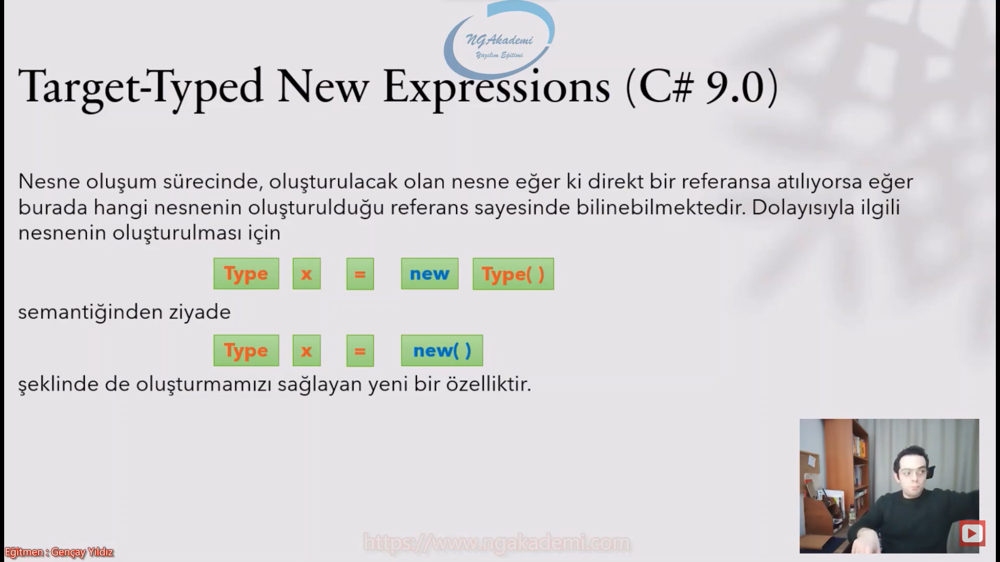
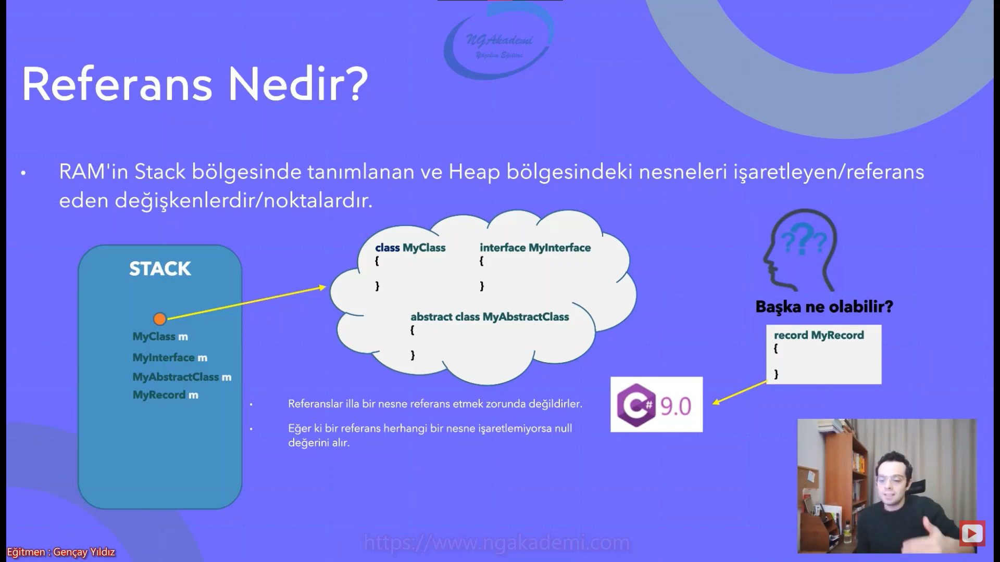
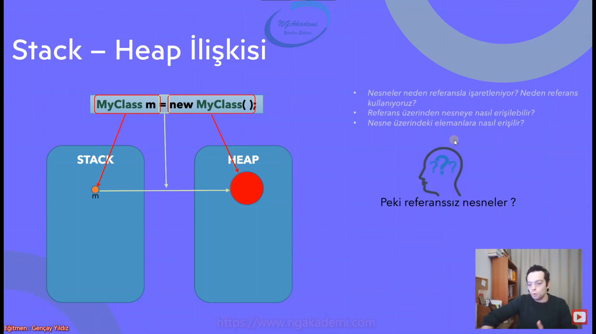
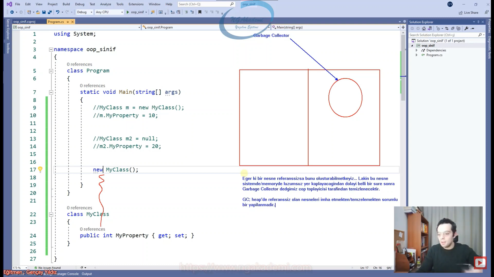
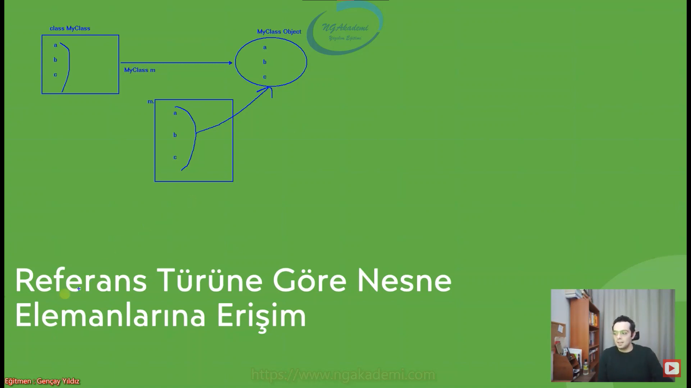
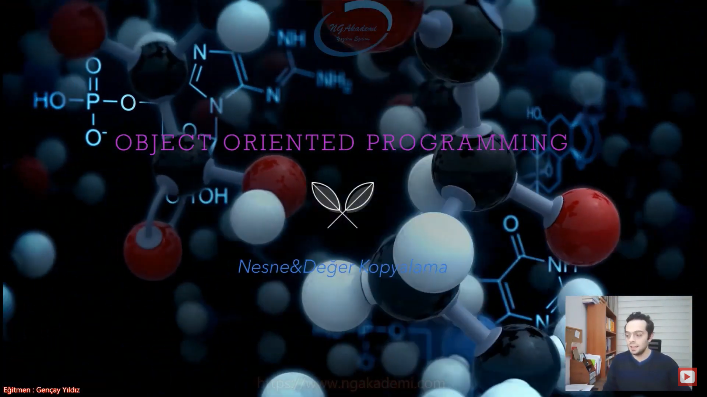
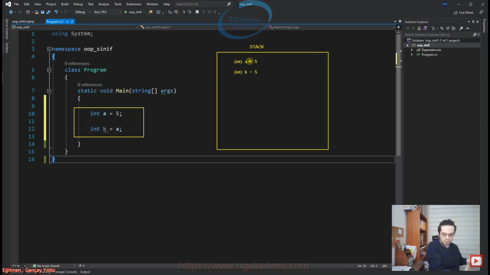
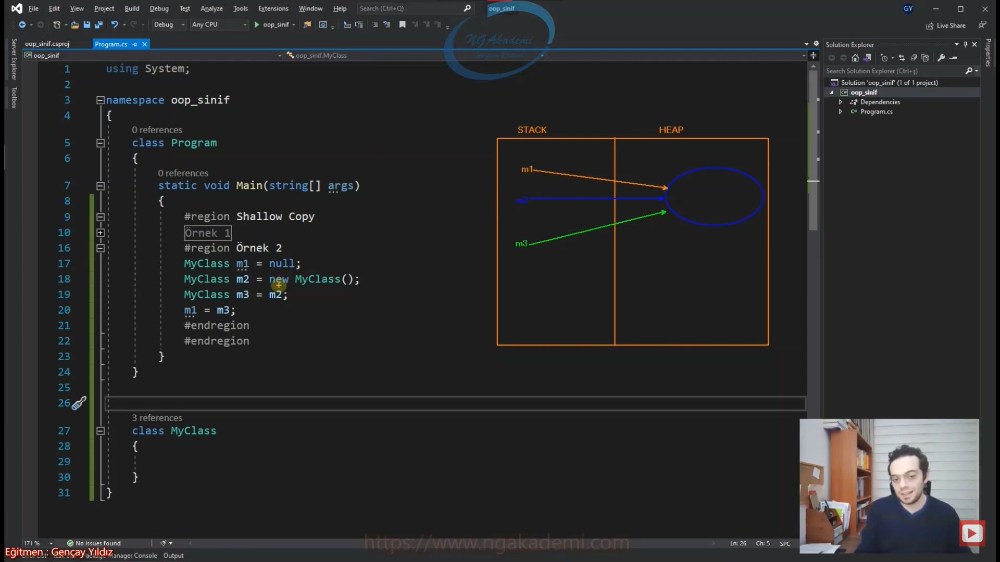
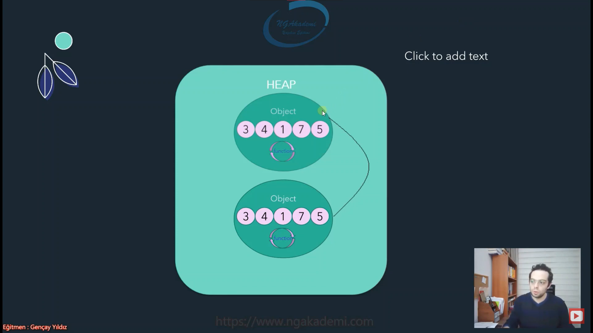

# Nesne Tabanlı Programlama #6 - Nesne Kavramı Nedir? Nesne Nasıl Oluşturulur? | new Operatörü


## Nesne Nedir? Ne Amaçla Kullanılır?
- Nesne dediğimiz yapılanma canlı bir organizma içerisinde birden fazla anlamlı birbirleriyle ilişkisel veriler tutan ve sadece bunları tutmakla yetinmeyen birazda böyle entellektüel bir alışkanlığını yanı olan bu veriler üzerinde işlemler yapıp sonuçlar üretebilen fonksiyonellikler barındıran bir yapılanma/organizmadır.

- Nesne dediin kavram bir veri bütünü. Mesela ben Musa olarak bir nesneyim. Adım Musa nesnemin bir parçası soyadım Uyumaz nesnemin bir parçası gözümün rengi nesnemin başka bir parçası. Benin ben yapan bütün değerler ile ben nesne olarak ortaya çıkarım.

- Bir olguya dair bütün alakadar değerler bir araya geldiğinde nesne ortaya çıkar. Haliyle o nesne o olguya dair verileri tutan verileri barındırabilen ve o veriler üzerinde işlem yapılmasını sağlayabilen bir organizma.

- Organizma diyince akla amip geldi. Amip diyebilirsin nihayetinde ilkel bir organizma üzerinde veriler tutuyorsun bu veriler üzerinde de işlem yapmanı sağlayan fonksiyonlar barındıran bir yapılanma. Ekosistemden bahsediyoruz bakın canlı üzerindeki veriler değişebiliyor o veriler üzerinde işlem yapan fonksiyonları var onlarla hareket edebiliyor vs. Ekosistemi olan canlı bir mekanizma.

- Nesne dediğimiz prosedürel programlamada bir olguya dair verileri temsil edebilmek için kullandığımız değişkenler diziler vs. yani bu olgular bir yerden sonra çoğaldığında oradaki kodun yönetimi ne kadar zorlaşıyorsa biz bu olguların bir tanesini `class`la modelliyoruz. Bu `class`lar neticesinde o olguya dair bütün alanları field dediğimiz yapıları bundan üretilen nesnede field'larımıza gerekli değerlerimizi koyuyoruz ve bu field'lar üstünde işlem yapmamızı sağlayan metotlar property'ler indexer dediğimiz yapılanmalar vs. bunları kullanarak ortaya bir organizma koyuyoruz. Nesne tabanlı programlamada işte temel esas teşkil eden yapılanma bu organizma yani nesnedir.

- Nesne dediğimiz yapılanma `class` yapılanmalarından üretilen verilerdir. Yani nesne de bir veridir.
    * Şimdi ben Musa olarak adım, soyadım, yaşım, boyumun uzunluğu vs. bunun gibi değerler bir veridir. Ama ben bir bütün olarakta tek başıma bir veriyim. Nihayetinde Ahmet'e, Mehmet'e nazaran Musa verisiyim. Musa'nın detayına inersen adına, soyadına, yaşına varabiliyorsun.

- Nesneler de bir veridir sadece daha üstün/kompleks veridir. Nesneler kompleks veri diye geçer. Çünkü ne `int`tir ne `string`tir ne de `char` çünkü bunların hepsini barındırabilen bir yapıdır.

- Nesne dediğiniz bir olgunun karşılığıdır.


- Oluşturduğum nesne kompleks mi kompleks içerisine `string`, `int`, `bool` değerler alarak meydana gelen bir bütün.

- Bu nesneyi bir araya getiren veriler bütünsel olarak birbirleriyle ilişkisel bir bütün oluşturacak verilerin meydana gelmesiyle oluşur.

- Nesne dediğin içinde lüzumsuz bir değere yer vermeyen yapılanmadır/bir değerdir. Haliyle bu değer kompleks bir değerdir/türdür.

- Nesneler complex değerlerdir.... Çünkü içerisinde birden fazla normal değer türlülere nazaran daha fazla bir yapılanma daha fazla bir değer taşıdıklarından dolayı. 

- Nesneleri modellememizi sağlayan `class`lar ise Complex Type'lardır.


- Kavramsal olarak nesne içerisinde bir veya birden fazla değer barındırabilen anlamlı verileri bir bütün olarak barındıran organizmadır ve bu organizma entellektüel açıdan alışkanlığa sahip o verilerin üzerinde işlem yapan ve bu işlemler neticesinde değerler üretebilen canlı bir ekosisteme sahip yapılanmadır.

- Nesne tabanlı programlama da olguları modelleyip olguları tek bir değer olarak temsil edebilmekteyiz.

- Kimlikte Devlet bir tane nesne modeli oluşturuyor burada olgusal olarak birbirine yakın anlamlı ilişkisel verileri o nesne modelinin içerisine koyuyor ve buradan üretilen tüm nesneler ile tüm vatandaşlara karşılıyor. Oradaki nesne modeli esasında vatandaşı modelliyor. Bir vatandaşta olabilecek ortak bilgiler;
    * Adı
    * Soyadı
    * Seri Numarası
    * TC Kimlik Numarası vs.
- Adam gidip oraya şunu yazıyor mu tuttuğu takım. İyi de arkadaş bütün vatandaşlar bir takım tutmak zorunda değil. Anlamlı mı o veri oradaki bütüne anlam katıyor mu? Anlamını bozuyor o zaman onu çıkarmış adamlar bak.

- Nesne dediğiniz anlamlı verilerin bir araya gelip bir bütün oluşturduğu temel kopmleks bir değerdir. 

- Nesne neden kullanılır?
    * Kodu daha hızlı geliştirebilmek
    * Kodu daha sistematik hale getirebilmek
    * Kodu daha yönetilebilir kılmak için kullanılır.

- Prosedürel programlamada 10 tane öğrenciyi adıyla soyadıyla tutmaya çalış. Yapmaya çalıştığında gerçekten dersin ki of ya kodlama da ne kadar zormuş Halbuki kodlamanın zorluğu değil. O yaklaşıma göre bu şekilde olgusal modellemeleri yapmak neredeyse imkansız. Amma velakin sen bunu gelip nesnel yaklaşımda ele alırsan çok kolay bir şekilde bu işlemi gerçekleştirdiğini göreceksin. Onun için yapmış olduğumuz işlemleri daha hızlı daha sistematik daha yönetilebilir daha kullanılabilir hale getirmek için nesne yapılarını tercih etmekteyiz.

- Nesnenin fıtratı `class`tır. Nesne oluşturmak istiyorsan kesinlikle sadece `class`a ihtiyacın var. Programlamada nesne mi oluşturacaksın `class`tan başka şansın yok.`interface` denilen yapılanma var nesne oluşturmaz. `struct` denen bir yapılanma var. nesne oluşturduğunu zannedersin ama onda da nesne oluşturamazsın. `Record` dediğimiz yapılanma var o ayrı onda nesne oluşturacağız ama davranışımız değişecek. `Record`larda esasında `class` yapılanması. `abstract class` nesne oluşturamazsın. Haliyle senin nesne oluşturabilmek için yapman gereken kullanman gereken tek şey `class` normal yani. Uzaya füze de göndersen üzgünüm ki sadece `class`la nesne oluşturabiliyoruz.

## Bir Sınıftan Nesne Üretme/Türetme/Oluşturma


## new Operatörü İle Nesne Üretimi
- C#'ta nesne üretimi için `new` operatörü kullanılmaktadır.

- Semantik açıdan nesne oluşturabilmek için kullanmamız gereken bir operatör vardır. Compiler'a senin bildirmen lazım. Yani kardeşim şu `class` var ya şu `class`tan bana bir tane nesne oluştur demen gerekiyor. İşte bunun için kullanacağımız operatör `new` operatörüdür.

- `new Type()` => `new` operatörü ile nesne oluşturmak için direkt kodun içinde `new` yazıyorsun `new` yazdıktan sonra hangi sınıftan/türden bir nesne oluşturmak istiyorsan `new` yazdıktan sonra ilgili sınıfın ismini bildirmen yeterli olacaktır.
    * Burada dikkat etmen gereken şey sınıf ismini yazarken bir parantez açıp kapatırız. Bu da bir metot biz buna ileride constructor metot diyeceğiz. `new` operatörü ile herhangi bir türdeki sınıftan ya da herhangi bir sınıftan ya da herhangi bir türden nesne oluşturacaksan bu metodu çağırmak zorundasın.

- `new` operatörünü compiler gördüğünde aha bir tane nesne oluşturacam diyor. Neyi oluşturacağını da yanındaki bildiriden anlıyor.

- Biz oluşturduğumuz nesneler HEAP'e koyulduğu zaman nesnelere biz direkt erişemiyorduk çünkü developer olarak bizim HEAP'e erişme yetkimiz yok. Haliyle biz elimizdeki nesneleri yani HEAP'te oluşturmuş olduğumuz o organizmaları o verileri erişip üzerinde işlem yapıp değerlerimiz üzerinde çalışmalar sergilemek istiyorsak bizim bu nesneyi STACK'teki bir referansla işaretlememiz gerekir ve bu nesneyi işaretlerken referansın türüde bu nesneden olmalı.

- Eğer değer türlü değişkenlerde çalışıyorsanız `=` operatörü ile değer türlü değişkenlerde assign görevi görüyor. Yok eğer referans türlülerde çalışıyorsanız referans etme görevi görüyor.

- Assign => Bellekte tahsisi yapılmış İçi boş alana bir değer eklemek

- Değer türlü değişkenler bellekte alan tahsisi yaparlar. Assign operatörünün önündeki değer, bu değer türlü değişkenlerin tahsisini yaptığı ve henüz içi boş olan alana atanır. Böylece değer türlü değişkenlerde (Assign) olayı gerçekleşir.

- Assign'ın yukarıda yaptığım tanımını göz önünde bulundurarak referans türlü değişkenlere bakacak olursak onlarda assign olmadığını görürüz. Çünkü referans türlü değişkenlerde alan tahsisi diye bir olay yoktur ki tahsisi yapılmış içi boş alana değer atama işlemi diğer bir adıyla assign işlemi gerçekleşsin; zira referans türlü değişkenlerde bizim yaptığımız şey referans noktası ile nesnenin arasında bir bağlantı kurmaktır.

- Değer türlü değişkenlerde iki unsur vardır;
    1. Değişken  
    2. Değer.
- Referans türlü değişkenlerde de iki unsur vardır; 
    1. Referans noktası 
    2. Nesne.

- Değer türlü değişkenlerin iki unsuru arasındaki alaka: Birinin tahsis ettiği alanı diğerinin doldurmasıdır. Bu doldurtma işlemi assign'dır.

- Referans türlü değişkenlerin iki unsuru arasındaki alaka ise: Yalnızca, birinden diğerine vasıl olabilmemiz için biri ile diğerinin arasında bağlantı kurmaktır. Bağlantı kurmak ise assign değildir.

- Bir nesneyi illaki bir referansla işaretmelek zorunda değiliz. Nesneyi oluşturup HEAP'e koyup bir daha kullanmamak üzere orada bırakabilirsin.

```C#
new MyClass();
new Random();
        
new MyClass();
new MyClass();
new MyClass();
new MyClass();
class MyClass
{
    public int A { get; set; }
    public void X()
    {

    }
}
```


## Target-Typed New Expressions (C# 9.0)
- [C# 9.0 – Target-Typed New Expressions](https://www.gencayyildiz.com/blog/c-9-0-target-typed-new-expressions/)

- Nesne oluşum sürecinde, oluşturulacak olan nesne eğer ki direkt bir referansa atılıyorsa eğer burada hangi nesnenin oluşturulduğu referans sayesinde bilinebilmektedir. 

- Bu özellikle birlikte oluşturulacak nesnenin türü referanstan bilinebilmektedir.

- Generic yapılanmalarda uzun uzun referanslar tanımlıyoruz. `List` koleksiyonları uzun uzun tanımlıyoruz. İşte böyle durumlarda karşı taraftaki tanımlama sürecini inanılmaz derecede kısaltan bir özelliktir.



## C# Examples
```C#
namespace oop_sinif;
class Program
{
    static void Main(string[] args)
    {
        new MyClass();

        new Random();

        new MyClass();
        new MyClass();
        new MyClass();
        new MyClass();

        MyClass m = new();
    }
}
class MyClass
{
    public int A { get; set; }
    public void X()
    {

    }
}
```

***
# Nesne Tabanlı Programlama #7 - Referans Nesne İlişkisi


## Referans Nedir?
- RAM'in Stack bölgesinde tanımlanan ve Heap bölgesindeki nesneleri işaretleyen/referans eden değişkenlerdir/noktalardır.

- Referanslar illa bir nesne referans etmek zorunda değildirler.

- Eğer ki bir referans herhangi bir nesne işaretlemiyorsa null değerini alır.

- Referans belleğin STACK bölgesinde tutulur. İşlevi HEAP bölgesindeki nesneleri işaretlemektir.

- Referans STACK bölgesinde tanımlanan belirli bir iş yapan değişkenler ya da noktalardır.

- STACK'te `int`, `bool`, `char` tutabiliyorum yani değer türlü tüm değişkenlerimi değerlerini hepsini burada tutabiliyorum. Amma velakin referans türlü değerlere geçtiğimizde değerler HEAP'te tutulurken STACK'te referanslar tutulur yani değişkenin kendisi tutulur ama karşılığı olacak olan değer HEAP'te tutuluyor.

- Referans `class`, `interface`, `abstract class`  yapılanmasıyla oluşturulabilir.
  * Bir `class` oluşturursun bu `class` üzerinden oluşturduğun değişken senin referansın olacaktır. 

- `interface`ler referans türlü değişkenlerdir yani referans noktası alınabilir değişkenlerdir.

- Dolayısıyla bizim referanstan kastımız sadece `class`lar değil Bu `class`ın türevi olabilecek/akrabası olabilecek farklı yapılanmalardan da referans noktası oluşturup sen STACK'te çalışmana devam edebilirsin.

- Bu referans noktaları ile HEAP'teki nesneleri referans edebiliriz. Nesne sade ve sadece `class`tan olabilmektedir.

- İleride `abstract class`larda compiler seviyesinde nesne oluşturulduğundan bahsedeceğiz. `class` dediğimiz şey nesne demektir. Sen burada `interface`de olsa `abstract class`ta olsa ya da normal `class`ta olsa bunlardan referans oluşturabiliyorsun ileride göreceğimiz polimorfizm diyeceğimiz yapılanma sayesinde bu referanslar aracılığıyla kesinlikle `class`tan üretilmiş bir nesneyi referans edebiliyoruz. Başka bişeyi değil.

- HEAP'teki `class`tan türetilen herhangi bir nesneyi işaretleyebilmek için bu referansı oluşturman lazım. Bu referansı oluşturmanı sağlayacak olan yapılarda `class`, `interface`, `abstract class`tır.

- Aynı zamanda bir de referans oluşturmamızı sağlayan C# 9.0 ile gelen `record` yapılanması vardır.

- `record` nesneye en yakın olan yapılanmadır.

- Sen herhangi bir referans tanımlayıp STACK'e koyabilir ve kullanmayabilirsin. Dolayısıyla bunu yaptığın zaman yani bir referansı herhangi bir nesneyi işaretlemeyecek/referans etmeyecek şekilde oluşturduğun zaman default olarak `null` değerini alacaktır.

- `class` elemanı olan değer türlü değişkenlerde/fieldlarda eğer ki herhangi bir değer vermiyorsak eğer fieldların/değişkenlerin değerleri varsayılan/default değerleridir.
    * `int` => 0
    * `double` => 0
    * `bool` => `false`
    * `char` => `/0`
    * Referans türlü değişkenler => `null`



## Stack - Heap İlişkisi
- `new` operatörünün yanında bildirilen tip neyse o tipte bir nesneyi HEAP'e yerleştirir.

- Temel prosedürel programlama da `=` operatör assign operatörüdür. Eğer ki OOP'de çalışıyorsak yani üretilmiş bir objeyi bir referansla işaretlemek istiyorsak yine `=` operatörünü kullnıyoruz ama buradaki sorumluluğu değişiyor assign değil referans etme ya da işaretleme operatörü oluyor.

- Nesneler neden referansla işaretleniyor? Neden referans kullanıyoruz?
    * Developer olarak biz bilgisayarımda sabit diske direkt erişebiliyorum belirli yetkilerim varsa register denilen belleğe erişebiliyorum. Bellekte STACK'e erişebiliyorum static yapılanmaya erişebiliyorum. Amma velakin HEAP'e erişemiyorum. Dolayısıyla ben HEAP'teki herhangi bir değere/nesneye erişebilmek için HEAP'e dolaylı yoldan erişmem gerekecek haliyle HEAP'e erişebilen ve benimde erişebildiğim bir başka yapılanmayı kullanamam gerekecek. İşte burada STACK devreye giriyor. Biz STACK'e erişebiliyoruz STACK'teki referanslarda HEAP'teki nesnelere erişebildiğinden dolayı bizde dolaylı yoldan STACK üzerinden HEAP'teki nesnelerimize erişebilmekteyiz. Bundan dolayı nesneleri referanslarla işaretliyoruz. Eğer ki bir nesneyi referansla işaretlemezsek ilgili nesneyi kullanamayız.

- Referans üzerinden nesneye nasıl erişilebilir?
    * Bir referans üzerinden nesneye erişebilmenin davranışı bildiğiniz değişken kullanım davranışlarıyla birebir aynı.

- Nesne üzerindeki elemanlara nasıl erişilir?
    * Elemanlara erişebilmek için yapmanız gereken yine nesneye erişmek. Haliyle ben referans üzerinden nesneye erişir ve member access operatörü(`.`) ile ilgili nesne içerisindeki dışarıya erişebilirliği olan/dışarıdan erişim izni olan/dışarıdan erişilebilir olan tüm elemanlara/memberlara erişebilirim.

- Bir referans eğer ki bir nesneyi referans ediyorsa ben o referans üzerinden ilgili nesnenin üzerinde yapmış olduğum herhangi bir işlem daha doğrusu referansın üzerinde yapmış olduğum herhangi bir işlem referans/işaret ettiği nesne üzerinden gerçekleştirilir.

- Eğer ki bir referans `null`sa yine member access operatörü(`.`) sayesinde siz ilgili referansın içerisindeki memberlara erişebilirsiniz. Eğer ki member'a erişip işlem yapmaya çalışırsanız bir nesnesi olmadığından dolayı bu member'ı tetikleyecek bu member'ı üzerinde çalıştıracak bir nesne/ekosistem/organizma olmayacağından dolayı burada null reference hatası verecektir.

- `null` olan (yani nesnesi olmayan) referanslar üzerinden herhangi bir member'ı çağırıp işlemeye çalıştığımızda/çağırdığınızda bu durumda NullReference hatası verecektir.




```C#
MyClass m2 = null;
```

## Referanssız Nesneler
- Her nesne de bir referans tarafından işaretlenmek zorunda değildir.

- `new` operatörüyle herhangi bir `class`tan nesneyi oluşturup herhangi bir referansla işaretlemeyebilirsiniz.

- Bir nesne oluşturulduğu an herhangi bir referansla işaretlenmezse eğer Heap'e yerleştirilir. Lakin bu nesneye tarafımızca birdaha erişemeyiz. Haliyle ilgili nesneyle aramızdaki tek diyalog oluşturma anıdır.

- Referansız nesne üzerindeki elemanlara nasıl erişilir?


```C#
new MyClass();
```

## Referanssız nesne üzerindeki elemanlara nasıl erişilir?
- Sen bir nesneyi referansla işaretlemediğinde HEAP'te kalır. HEAP'te kalması ne kadar doğru hem ben erişemiyorum hem kullanamıyorum hem de HEAP'te nesne lüzumsuz bir şekilde kalıyor. Yani memory'de durduk yere bir alan tahsis ediyor. İşte böyle bir durumda referanssız bir nesnenin memory'de alan tahsis etmesi durumu C# tarafında düşünülmüş demişler ki Eğer ki HEAP'te bulunan nesneler referanssızsa yani herhangi bir işaretleyecisi yoksa Garbage Collector dediğimiz mekanizma sayesinde bu nesneler temizlenecektir demişler.

- HEAP'te referanssız nesneler garbage collector yani çöp toplayıcı mekanizması sayesinde temizlenmekte imha edilmektedirler.

- Eğer ki bir nesne referanssızsa bunu oluşturabilmekteyiz... Lakin bu nesne sistemde/memory'de lüzumsuz yer kaplayacağından dolayı belli bir süre/belirsiz bir süre/ bilinmeyen bir süre sonra Garbage Collector dediğimiz çöp toplayıcısı tarafından temizlenecektir.

- Garbage Collector HEAP'te referanssız olan nesneleri imha etmekten/temizlemekten sorumlu bir yapılanmadır.

- Garbage Collector esasında bizim bellek yöneticimiz kendisi robotize çalışan bir mekanizma belleği düzenliyor. Daha farklı işlemlere de sahiptir.

- Eğer ki elinizde referanssız nesneleriniz varsa ilgili nesneleri siz Garbage Collector'un insafına bırakmış oluyorsunuz. Garbage Collector bilgisayarınızdaki lüzumsuz tahsisleri temizleyecektir.

- Bir nesne referanssızsa nesneyi tanımladıktan sonra bir daha erişemezsiniz. Dolayısıyla referanssız tanımlanmış olan nesneye erişebilmenin tek yolu tanımlama anıdır. Bir kere erişirsin o da son kez selametle demek için. 



```C#
new MyClass().MyProperty = 10;
```

## Nesne Üzerinden Elemanlara Erişim
- Nesneye kah referans üzerinden erişmeniz lazım kah nesne oluşturulurken bir şekilde erişmeniz lazım. Bu şekilde nesnenin üzerindeki elemanlara erişebiliyorsunuz. Tabiki de buradaki elemanlar erişilebilir olmalıdır. Dışarı açık olmalı.


```C#
MyClass m2 = new MyClass();
m2.MyProperty = 10;
```

## Referans Türüne Göre Nesne Elemanlarına Erişim
- Her bir referans nesneyi temsil edebilecek imzaya sahiptir.

- Bir nesneyi referans edebilmek için bu nesneyi temsil edebilecek bir fıtratta `class`a ihtiyacım var. Nesnenin türü neyse bizzat o türdeki `class`.

- Referans türüne göre nesne elemanlarına erişim sağlayabiliriz.



## Object Initializer İle Nesne Oluşturma Esnasında Propertylere İlk Değer Atama​


- Bir sınıftan nesne oluştururken bu sınıfın property'lerine değer atamak için sınıfın property'lerine referans üzerinden erişip değerlerini atayabilirim.

- Nesne başlatılırken ilk oluşturulurken ilk değerler direkt verilebilir.

- Bu özelliği kullanmazsan eğer içindeki değişkenlerin değerleri default olarak atanacaktır.

- Bu özellik sayesinde nesnenin default/varsayılan başlangıç değerlerini değiştirebilirsiniz.

- İlk nesnenin oluşturulma sürecinde ayağa kaldırılırken değerlerini atamamızı sağlayan bir semantiktir.

- Object initializers'ta sadece field ve property'leri kullanabilirsin.

```C#
MyClass m3 = new MyClass() 
{ 
    MyProperty = 10,
    MyProperty2 = 20,
    MyProperty3 = 30 
};
```

## C# Examples
```C#
namespace oop_sinif;

class Program
{
    static void Main(string[] args)
    {
        MyClass m = new MyClass();
        m.MyProperty = 10;

        MyClass m2 = null;
        m2.MyProperty = 20;

        new MyClass().MyProperty = 10;

        MyClass m3 = new MyClass() 
        { 
            a = 5,
            MyProperty = 10,
            MyProperty2 = 20,
            MyProperty3 = 30 
        };
    }
}

class MyClass
{
    public int a;
    public int MyProperty { get; set; }
    public int MyProperty2 { get; set; }
    public int MyProperty3{ get; set; }
}

```

***
# Nesne Tabanlı Programlama #8 - Nesne Kopyalama Davranışları | Shallow Copy | Deep Copy


## Nesne&Değer Kopyalamadan Kastedilen Nedir?
- Değer türlü değişkenler belleğin STACK kısmında tanımlanan ve değerlerini orada tutan değişkenlerimizdir.

- Nesnelerden farkı sadece değersel olmaları sadece veri olmaları.

- Deep kopyalamada elimizdeki veri 1 iken 2 olur yani elimizdeki veri çoğaltılır.

- Verilerin nesnelerin kopyalanması dediğimiz olay kod yazarken zaten doğal olarak olan ve yönetilmesi gereken bir olaydır.

```C#
int a  = 5;
int b = a;
```





## Shallow Copy
- Var olan bir nesnenin, değerin, referansının kopyalanmasıdır. Shallow copy neticesinde eldeki değer çoğaltılmaz. Sadece birden fazla referansla işaretlenmiş olur.

- Nesne tek lakin işaretleyen referans sayısı birden fazla!

- Nesnelerde bir değerdir ama kompleks bir değerlerdir.

- Bir nesnenin sadece referansı kopyalanıyorsa kendisi çoğaltılmıyorsa bir nesne birden fazla referansla işaretleniyorsa biz buna Shallow Copy diyoruz. Sadece birden fazla referansla işaretlenmesi gerekiyor.

- `MyClass m2 = m1;` 
  * Bu davranış değer türlü değişkenlerde yapıldığında  bu Deep Copy olur yani değer çoğaltılır. Eğer ki bu davranış referans türlü değişkenlerde oluyorsa burada Shallow Copy yapılır yani ilgili nesne ilgili değer türetilmez/çoğaltılmaz sadece işaretlenir.

- Shallow Copy bir nesnenin birden fazla referansla işaretlenmesidir. Somut bir tane madde var o maddeyi birden fazla referansla işaretlediğin zaman herahngi bir referanstan bir etki gördüğünde diğer referanslara da otomatik bu yansıyacaktır. Dolayısıyla nesne türetilmiyor yüzeysel sığ bir kopyalama yapılıyor. İşte buradaki yüzeysellik sığlık sadece referansların türetilmesi yani birden fazla referansın olması.

- Bir nesne birden fazla referansla işaretleniyorsa burada Shallow Copy söz konusudur. Çünkü Deep/Derin Copy/kopyalamada elindeki veri türetilmeli/çoğaltılmalı birken iki olmalı 2'yken 5 olmalı. Ama Shallow Copy'de nesne bir tane. O bir tane nesneyi birden fazla referans işaretliyor.


```C#
#Örnek 1
MyClass m1 = new MyClass();
MyClass m2 = m1;
MyClass m3 = m2;
MyClass m4 = new MyClass();
```

- Değer türlü değişkenlerde kopyalama yapar ilgili değer kopyalanır. Amma velakin referans türlü bir değişkense Shallow Copy yapılır. Yine bu da bir kopyalamadır ama Deep Copy yapılmaz. Deep Copy'de nesne çoğaltılır.



```C#
#Örnek 2
MyClass m1 = null;
MyClass m2 = new MyClas
MyClass m3 = m2;
m1 = m3;
```

- Bir referans sade ve sadece tek bir nesneyi işaretleyebilir. Birden fazla nesneyi işaretlemesi mümkün değildir.

- Bir referans önceden işaret etdiyorsa bir nesneyi o referansı başka bir nesneyi işaret etmesini söylediğin anda önceki işaretleme referans kopacaktır.


```C#
#Örnek 3
MyClass m1 = new MyClass();
MyClass m2 = new MyClass();
MyClass m3 = m1;
m1 = m2;
m2 = m1;
m1 = m1;
```


## Deep Copy
- Var olan bir nesne, deep copy ile kopyalanıyorsa eğer ilgili nesne miktarı çoğalır. Aynı özelliklere ve değerlere sahip olan bellekte farklı bir nesne daha oluşur.

- RAM'de bir nesne eğer ki Deep Copy ile kopyalanıyorsa davranışsal olarak o nesneden bir tane daha olacaktır.


## Shallow Copy ve Deep Copy Önemli Not
|Shallow Copy|Deep Copy|
|---|---|
|Referans türlü değişkenlerin/değerlerin default davranışı shallow copy'dir.|Değer türlü değişkenlerde/değerlerde default davranış deep copy'dir.|
|Sen elinde referans türlü bir değeri başka bir şeye atadığında o kopyalanmaz/türetilmez. Shallow Copy yapılır yani yüzeysel olarak işaretlenir. Yani elindeki değer/nesne bir taneyse bir tane olmaya devam eder çoğaltılmaz.|Yani sen elindeki bir 5 değerini tutan bir değişkeni bir yere gönderdiğinde default olarak ilgili değişken elindeki 5'i göndermez o 5'i kopyasını alıp öyle gönderir. Deep Copy/derin kopyalama işin defaultunda var. Direkt varsayılan olarak fıtrat bu şekilde çalışıyor.|
|Eğer ki ilgili nesneyi koplayalamak/türetmek/çoğaltmak istiyorsan default davranışın dışındaki diğer davranışı yapmak istiyorsan burada iradeli bir şekilde çalışma yapman lazım. |Shallow Copy ile ilgili bir çalışma yapmak istersen iradeli bir şekilde yapman gerekecek.|

- Bir değer türlü değişkeni/değeri bir yere verirsen(Metot parametresine, Property'e vb.) oraya değişkenin kendisi gitmez kopyası/türetilmiş hali gidecektir.


- Derin kopyalamada elimizdeki bir nesne değerleriyle birlikte çoğaltılır. 

- Birebir aynı şekilde çoğaltıldıysa eğer bu derin kopyalamadır.

- Çoğaltılmıştır ama bu nesne birebir ikiz bebek gibi birine iğneyi batırdığında öbürünün canı yanıyor gibi değil. Aynı referansla işaretleniyor gibi düşünmeyin. Bunlar artık farklı nesnelerdir. Doly dediğimiz koyun kopyalandı. derin kopyalama nihayetinde orada yapılan derin kopylaamada var olan koyunun annesinin üzerinden bir kopyalama yapılıyor. Ama ikisi artık farklı koyun. Birini kesip kebap yaptığın zaman öbürü hiç bişey hissetmeyecektir. Dolayısıyla burada da aynı davranış olarak sen derin kopyalam yapmış oluyorsun ama artık kopyalandıktan sonra oluşan değerler birbilerinden bağımsız aynı fıtratta olan bağımsız değerler/nesneler olacaktır.



- Bir nesneyi öyle bir kopyalayacağım ki varolan RAM'de 1'ken 2 olacak yani çoğaltılacak yani mükerrer olacak amma velakin ayrı nesneler olacak. Yani referanslar aynı nesneyi işaretlemeyecek derin kopyalama yapacağım. Bunun için nesne kendi içerisinde bir metot/fonksiyon ya da bir property sağlamalı. Yani demeliyim ki kardeşim beni kopyalayabilirsin diyebilmeli. Dolayısıyla `IClonable` dediğimiz klonlama yapabileceğimiz bir arayüzden bizim bunu türetmemiz lazım.

- `MemberwiseClone` bir sınıfın içerisinde o sınıftan üretilmiş olan o anki nesneyi clone'lamamızı sağlayan bir fonkiyondur. Bu clone'lama neticesinde sana `object` olarak sana sonucu döndürecektir. Yani boxing işlemi vardır geriye döndürebilmek için UnBoxing yapılması gerekmektedir.

- Referans türlü değişkenlerde Deep Copy'i syntax üzerinden sağlayamayız. İlla derin kopyalamayı yapabilmek için iradeli/bilinçli şekilde çalışman lazım. Değer türlü değişkenler üzerinde de shallow copy yapabilmek için 
iradeli/bilinçli bir şekilde çalışmak gerekmektedir.

- Biz bundan sonra çalışmalarımız yaparken shallow copy'mi yapıyoruz deep copy'mi yapıyoruz bunlar önemli. Nesne tabanlı programlamada nesnelerle çalışacaksanız nesneleri yönetebilmeniz lazım. Yönetmek demek irade gerektirir. 
 
- !!!!!!!!!!!!!! İrade de neyi ne şekilde kullandığınızı ve nerede ne şekilde davranış sergilediğinizi bilmenizi gerektirir !!!!!!!!!!!!!!


```C#
public MyClass Clone()
{
    return (MyClass)this.MemberwiseClone();
}
```


## C# Examples
```C#
namespace oop_sinif;

class Program
{
    static void Main(string[] args)
    {
        int a = 5;
        int b = a;

        #region Shallow Copy
        #region Örnek 1
        // MyClass m1 = new MyClass();
        // MyClass m2 = m1;
        // MyClass m3 = m2;
        // MyClass m4 = new MyClass();
        #endregion
        #region Örnek 2
        // MyClass m1 = null;
        // MyClass m2 = new MyClass();
        // MyClass m3 = m2;
        // m1 = m3;
        #endregion
        #region Örnek 3
        // MyClass m1 = new MyClass();
        // MyClass m2 = new MyClass();
        // MyClass m3 = m1;
        // m1 = m2;
        // m2 = m1;
        // m1 = m1;
        #endregion
        #endregion
        #region Deep Copy
        MyClass m1 = new MyClass();
        MyClass m2 = m1;//Shallow copy
        MyClass m3 = m1.Clone(); //Deep Copy
        #endregion
    }
}

class MyClass
{
    public MyClass Clone()
    {
        return (MyClass)this.MemberwiseClone();
    }
}

```