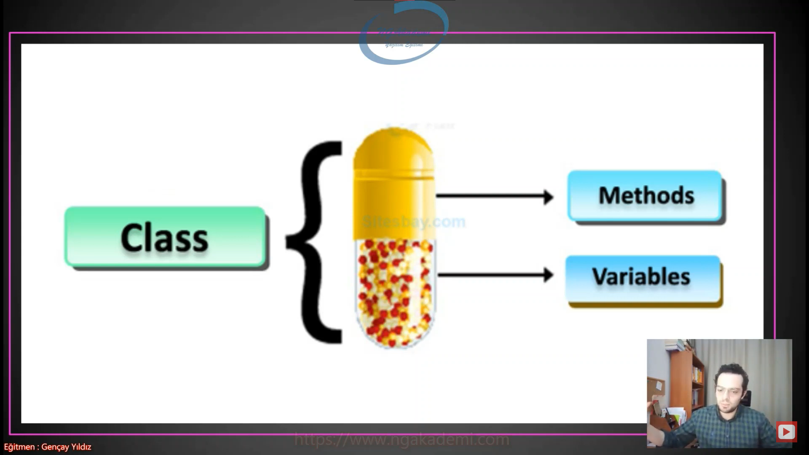
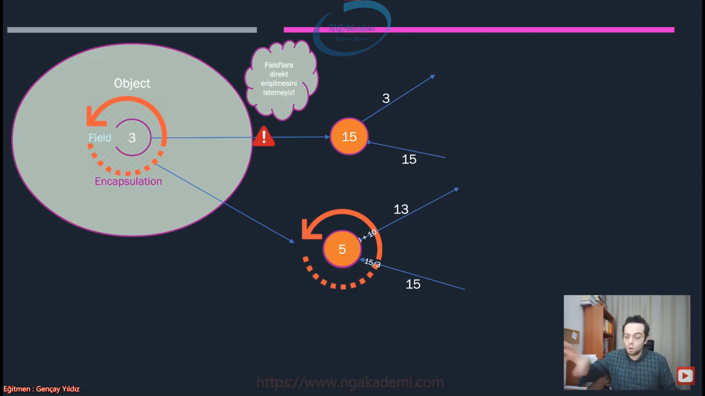
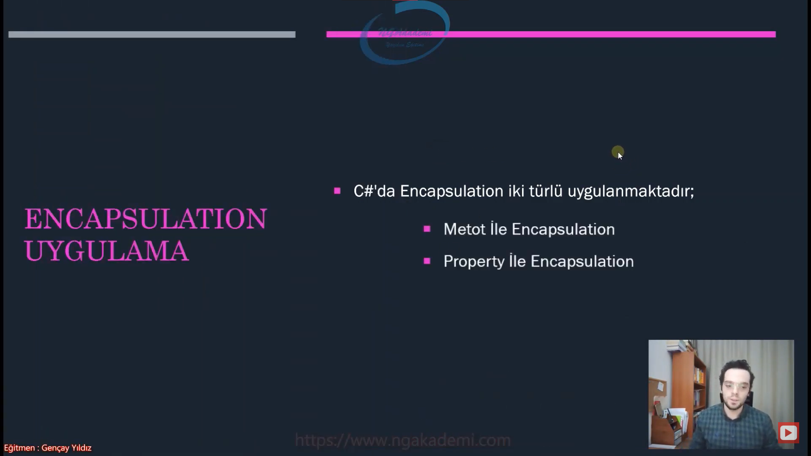
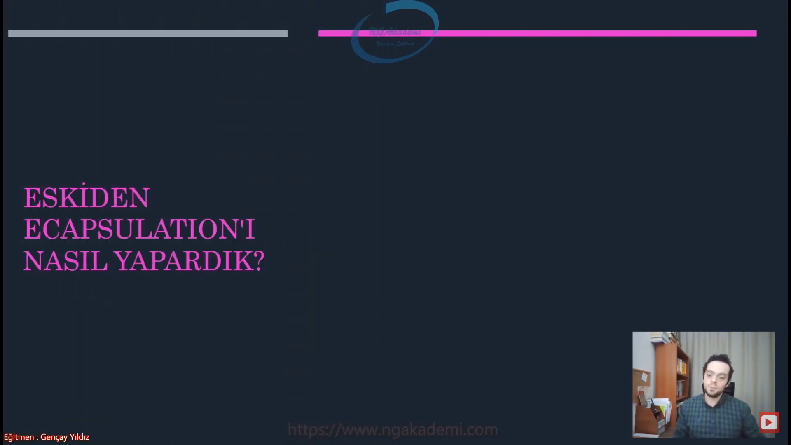

***
# Nesne Tabanlı Programlama #9 - Derinlemesine Encapsulation Nedir?  


## Encapsulation Nedir? Bir Veriyi Neden Kapsülleriz?
- Encapsulation nesnelerimizde ki field'ların kontrollü bir şekilde dışarıya açılmasıdır.

- Bir başka deyişle, nesnelerimizi başkalarının yanlış kullanımlarından korumak için kontrolsüz değişime kapatmaktır.

- Elinde nesnenin içerisindeki field'lara dışarıdan direkt erişilmesini istemiyorsan dışarıdan erişimi kontrollü bir şekilde yapmak istiyorsan işte buradaki yaptığın faaliye Encapsulation'dır.

- Nihayetinde ben bir nesne oluşturuyorum. Oluşturmuş olduğum nesnenin dışarıdan kullanılacak bir adam tarafından benim kurallarımın dışında yanlış kullanılmasını istemiyorsam eğer ilgili nesnenin field'larını kapsüllemem lazım. Aksi taktirde belirli iş kurallarımızı dıştaki developer bilemeyeceğinden dolayı ya da bilsede art niyeti kullanma ihtimalinden dolayı dinlemez ve istediği gibi bir değişime tabi tutabilir ve dolayısıyla buradaki kontrol sorumluluğu bizlere düştüğü için elimizdeki nesnelerin değerlerini yani field'larını korumamız gerekiyor. Encapsulation dediğimiz yapılanma field'ların kontrolünü sağlar.

- Kapsüllemek kontrol etmek kapsüllemek korumak siz bunu dış pencere olarak düşüneceksiniz.

- Nasıl ki bir arabanın motorunu kaportasıyla üstündeki kapağıyla vs. koruyorsak nesnelerimizin field'larını da aynı şekilde korumamız gerekiyor. Arabadaki bu korumaya da kapsülleme denir yani encapsulation'dır. Nesnelerdeki field'ları da korumak kapsüllemedir/encapsulation'dır. Yani sen bişeyi koruyorsan encapsulation'dır.

- Benim cüzdanıma dışarıdan müdahale edilmesini istemem çocuğum geldi diyelim gelen çocuk benden para istiyorsa direkt cüzdana erişememeli napmalıyım cüzdanı çıkarıp benim kendim vermeliyim.


- Günlük hayatta başınız ağrıdığında herhangi bir ağrınız sızını olduğunda kullandığınız kapsül haplar var. Bu kapsüller içindeki gerçek veriyi/değerleri/nesneyi kapsüller. Eğer ki bu kapsülü sen haplarda kullanmazsan eğer dıştaki müdahalelerde işte bakterinin/virüsün/pisliğin/mikropun müdahalesi herşey buna bulaşacak. Yani ilgili değerleri kopyalayabilmen dış dünyaya açılımını koruyabilmen için senin bunu kapsüllemen lazım. İşte kapsülleme mantığını günlük hayatta her yerde kullanıyoruz.

- OOP hayatın içinde olan bir felsefedir. Hayatta ne uyguluyorsan aslında OOP'de de onu uyguluyorsun. Kapsülleme günlük hayatta hepimizin yapmış olduğu bişeydir. Günlük hayattaki insanın temel fıtratından gelen alışkanlığını sen programlamaya aktarıyorsun. Ya kardeşim nesnelerime dışarıdan erişilmesini istemiyorum.

- Her daim OOP günlük hayatta yerini bulabileceğiniz yer eden bir olgudur.



- Elimde bir nesnem var. İçinde de bir field var. Eğer ki field dışarıdan talep edildiğinde bu field'a direkt erişiliyorsa bu erişim neticesinde direkt değeri okunabiliyor ve istenilen değer direkt field'a atanabiliyorsa işte biz bunu istemeyiz. Burada encapsulation lazım. Ya birader böyle bişey olmaz. 

- Biz o kadar da açık değiliz Herşeyimizi paylaşmak herşeyimizi gel babacım sen istediğini elde et demek yok. Programcı olarak birazcık bonkör olmamız gereken yerlerde bonkör olacağız. Amma velakin genellikle bencil ve gayribonkörüzdür. Mümkün mertebe verini ve belleğini olabilecek en cimri boyutta kullanmak ve kullandırtmak istersin. Dışarıya erişimi mümkün mertebe kısmak istersin. Sen kod yazarken genel prensibin bu olacak. İlk önce bir dışarı kapalı olacaksın. Açman gerektiğinin bir sebebi olmalı. Bu varsayılan düşüncen/huyun olacak.

- Tamam biz Türkler açığızdır her gelene her şeyimizi veririz. Ülkeyi verdik suriyelilere falan ama hayır bu geleneği bir kenara bırakacaksın diyeceksin ki en azından nesnemi koruyacam nesnemin içindeki field'lara erişimi kendim belirleyeceğim. Kendim kontrol edeceğim. Sosyolojik kültürümüzü burada bırakıp olması gereken coder ahlakına sahip olacağız. OOP bunu size sağlayacaktır.

- Sen elindeki verileri dış dünyaya kontrol bir iş kuralın olmasa dahi kapsülleyerek açma alışkanlığına sahip olacaksın.



## Encapsulation Nasıl Uygulanır?
- C#'ta Encapsulation iki türlü uygulanmaktadır;
  * Metot İle Encapsulation
  * Property İle Encapsulation  



## Eskiden Encapsulation'ı Nasıl Uyguluyorduk?
- Eskiden encapsulation metotlar üzerinden sergileniyordu. Yani C#'ta property denilen yapılanma gelene kadar biz metotlarla elimizdeki field'ları encapsulation uyguluyorduk.

- Biz bir nesnenin içerisindeki herhangi bir field'a direkt erişilmesini istemiyorsak o field'ın erişim belirleyicisini `private` yaparız. Erişilmediği zaman bu field'a değer atamayı ve değer okumayı kapsülleme mekanizması ile sağlıyoruz.

- Elimdeki cüzdan dışarıdan direkt erişilmiyor ama benim üzerimden cüzdan dışarıya açılabiliyor. Yani ben cüzdana erişebiliyorum. Cüzdana başkası erişemiyor Başkası bana erişebiliyor dolayısıyla cüzdandan bir para verilecekse araya ben girip ben cüzdandan alıp dış dünyaya veriyorum.

- Field'ımız yani bizim cüzdanımız veriyi tutan ana bölüm/alan kesinlikle dışarıya erişilmeyecek. Bunu da `private` ile işaretliyorsunuz. Eğer ki bunu hiçbirşeyle işaretlemezseniz default/varsayılan olarak `private` ile işaretlenecektir.

- Bir field'ı kapsülleyerek açmak istiyorsak metot oluştururuz ve dışarıya erişimini açarız. `public` yaparız. Ardından dış dünyaya açmak istediğimiz field her neyse o türde çalışman lazım.

- Sırf encapsulation için bu şekilde fonksiyonlar oluşturmayın. Ya tamam oluşturabilirsiniz belki ama bu kadar da zahmete gerek yok. Biz property dediğimiz memberları geliştirdik onların üzerinden encapsulation yapın hem kodunuz daha okunaklı olsun hemde metotları direkt işlevsel operasyonlarda yani amaçları doğrultusunda kullanında sende rahat et kodlamada rahat etsin demişler.

```C#
class MyClass
{
    int a;
    public int AGet(){
        return this.a;//AGet fonksiyonu tetiklendiğinde/çağırıldığında sen `this`deki yani o anki nesnedeki a field'ının değerini geri gönder.
    }
    public void ASet(int value){
        this.a = value;
    }
}

```



## Property İle Encapsulation Gerçekleştirmek


- Bizim bir prop'umuz vardı bu prop normalde elimizdeki herhangi bir field'ın değerine müdahale etmeyeceksek kendi field'ını oluşturan ve direkt kısa bir property tanımlaması yapan property türüdür.

- Ama varolan bir field'ın üzerinde encapsulation'ı property üzerinden yapacaksanız full property dediğimiz formatı kullanırız. Bunu yaparken kısayol olarak `propfull` yazabilirsiniz.

- Property'ler temsil ettikleri yani kapsülledikleri field'ların isimlerinin büyük harfiyle yani büyük harfle başlayan halleriyle isimlendirilir. Yani Pascal Case ile yapılır.

- Burada bu property'e bir değer atıyorsam `set` bloğu, property'nin değerini okumak istiyorsam `get` bloğu tetiklenir.

```C#
class MyClass
{
    int a;
    public int A
    {
        get { return a; }
        set { a = value; }
    }
    
}
```

## this'e Dair Genel Kültür Dokunuşu :)
- `this` o anki nesneyi temsil eden keyworddür.

- C#'ta `this` kullanmak zorunda değiliz. Eğer kullanmazsak compiler seviyesinde `this` keywordü otomatik olarak algılanır.

## C# Examples
```C#
namespace oop_sinif;

class Program
{
    static void Main(string[] args)
    {
        MyClass m = new MyClass();
        m.ASet(15);
        System.Console.WriteLine(m.AGet());

        m.A = 123123;
        System.Console.WriteLine(m.A);
    }
}

class MyClass
{
    int a;

    #region Eskiden Encapsulation Nasıl Yapılıyordu?
    public int AGet()
    {
        return this.a; //AGet fonksiyonu tetiklendiğinde/çağırıldığında sen `this`deki yani o anki nesnedeki a field'ının değerini geri gönder.
    }

    public void ASet(int value)
    {
        this.a = value;
    }
    #endregion
    
    public int A
    {
        get { return a; }
        set { a = value; }
    }
    
}
```
