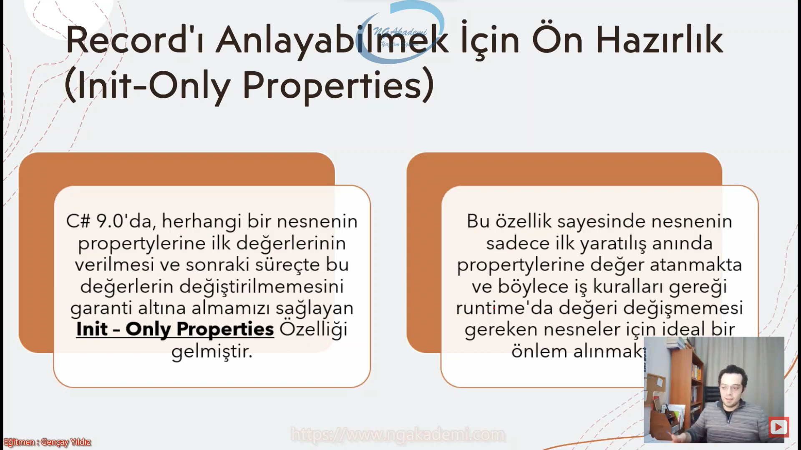
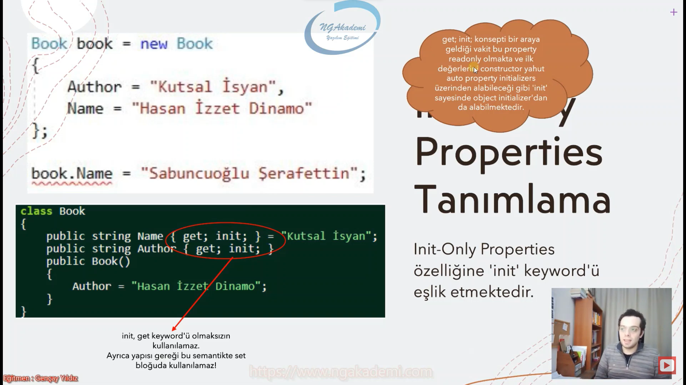
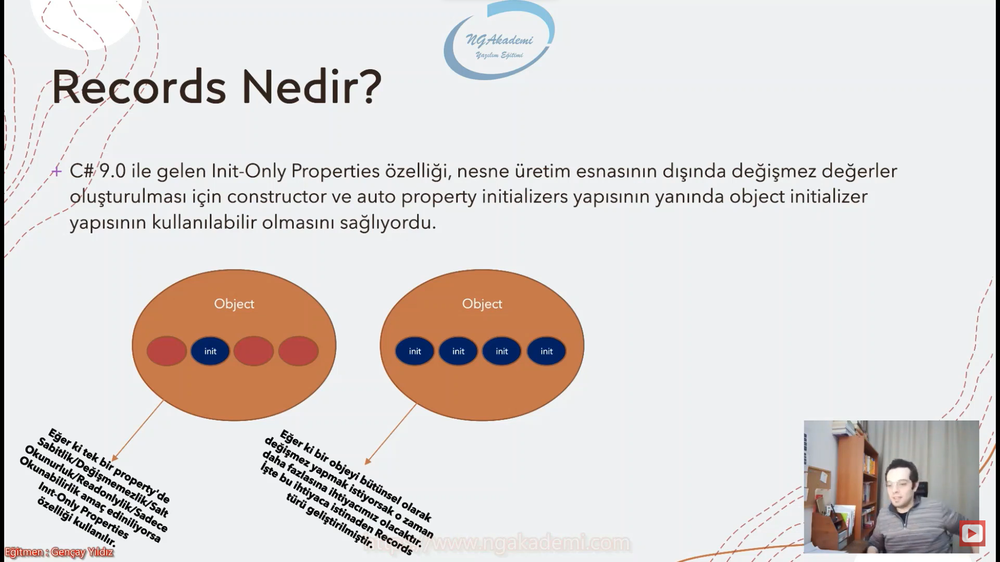

***
# Nesne Tabanlı Programlama #10 - Record Nedir? OOP'de ki Yeri Neresidir? (C# 9.0)
- C# 9.0 ile hayatımıza katılan bir yapılanmadır.


## Record'ı Anlayabilmek İçin Ön Hazırlık(Init-Only Properties)
- C# 9.0'da, herhangi bir nesnenin propertylerine ilk değerlerinin verilmesi ve sonraki süreçte bu değerlerin değiştirilmemesini garanti altına almamızı sağlayan Init – Only Properties Özelliği gelmiştir.

- Bu özellik sayesinde nesnenin sadece ilk yaratılış anında propertylerine değer atanmakta ve böylece iş kuralları gereği runtime'da değeri değişmemesi gereken nesneler için ideal bir önlem alınmaktadır.

- Elimizdeki nesnenin herhangi bir property'sinin readonly haline getiriyor.

- Eğer ki normal bildiğiniz readonly property'leri kullanıyorsanız nesnenin ilk yaratılış anındaki (Object Initializers) sen ilgili nesneyi üretirken readonly olan bir property'e değer atayamıyorsun. Atayabilecek bir özellik istiyorsan init only properties olması gerekiyor.

- init only properties hem elindeki property'leri readonly yapıyor hemde nesnenin ilk yaratılış anındaki Object Initializer dediğimiz noktada ilk değerini vermeni sağlıyor.

- Object initializer ilgili obje ilk ayağa kaldırılırken/yaratılırken ilk property'lere değerlerini vermek istediğin alandır. Haliyle bir property readonly ise burada gelmez değer veremezsin.

- Init-Only properties, developer açısından süreç esnasında değiştirilmemesi gereken property değerlerinin -yanlışlıkla- değiştirilmesinin önüne geçmekte ve böylece olası hata ve bug'lardan yazılımı arındırmaktadır.




- Property'nin değerinin değiştirilmemesi mi? İyi de bunun için zaten getter-only-properties'ler yok mu,?

- Sadece get işlemi yapan property'lere getter-only-properties deriz.

- Tanımlanan propertyler sadece get olduklarından dolayı ya tanımlandıkları anda ya da sadece constructor'dan değer alabilmektedirler.

- Biz herhangi property'i readonly olarak tanımlıyorsan bunun değerini ya tanımlandığı yerde verebiliyorsun ya da constructor dediğimiz metodun içinde verebiliyorsun.

- Biz elimizdeki readonly olan property'lerin ilk değerlerini object initializer yapılırken ayağa kaldırılırken vermek istiyorsak init only property'i kullanmalıyız. Sadece başlangıçta değer verilebilir yani readonly.


- O halde yeni gelen InitOnly Properties özelliği ile mevcudiyetteki getter-only properties arasında nasıl bir fark var?
    * Bu ikisi arasındaki temel fark esasında Object Initializer işlevselliğinden kaynaklanmaktadır.
    * Bu ikisi arasındaki temel fark oluşturduğun nesnenin oluşum sürecinde yani Object Initializer sürecinde orada ilk değeri atayabiliyorsan init only properties atayamıyorsan getter only properties

- Object Initializer özelliğinden getteronly-properties özelliği ile istifade edememekteyiz, lakin C# 9.0 ile gelen init-only-properties özelliği ile kullanabilmekteyiz. İşte her iki özellik arasındaki temel fark buradadır...


## Init-Only Properties Tanımlama
- Init-Only Properties özelliğine 'init' keyword'ü eşlik etmektedir.

- `get; init;` konsepti bir araya geldiği vakit bu property readonly olmakta ve ilk değerlerini constructor yahut auto property initializers üzerinden alabileceği gibi `init` sayesinde object initializer'dan da alabilmektedir.

- Normal bildiğimiz readonly property yapılanmasıyla init only property yapılanması özünde sadece salt okunabilir bir property sağlıyor.

- Bir property tanımlarken `set` keywordü yerine `init` keywordünü yazarsak eğer bu property artık init only property yani hem salt okunur/readonly/sadece okunabilir hem de nesne object initializer edilirken oradan değeri atanabilir.

- `init` keywordü `get` keywordü olmaksızın kullanılamaz. Ayrıca yapısı gereği bu semantikte `set` bloğuda kullanılamaz!



- Ayrıca getter-only-properties ile çalışmaktansa readonly bir field üzerinde işlem yapmamız gerekiyorsa eğer aşağıdaki gibi '`init`' bizlere eşlik edebilmektedir.

- Böylece C# 9.0 yeniliklerinden olan initonly-properties sayesinde, nesnelerin ilk yaratılış esnasında salt okunabilir değerlerini vermek için Object Initializer'ı bloklamadan kullanabilmekteyiz.

- Bir nesneyi oluştururken nesne başlatıcıda ilk değerleri vermek inanılmaz kolaylaştırıcı bir unsur.

- Elinde bir field'ın var ve `readonly` ile işaretlenmiş. Elindeki field'da artık sadece okunabilir. Haliyle sadece okunabilir olan bir field'ı sen ilk değerini verirken constructor'dan verebilirsin. ya da sen bunu `init` ile bu nesne ayağa kaldırılırken buradaki field'ları kapsülleyen property'ler üzerinden ilk değerlerini verebilirsin. Burada `init` `set` görevi görüyor. Oradaki değeri value'yu bir kereye mahsus alıyor o da initializer durumunda alıyor.


```C#
class MyClass
{
    public int MyProperty { get; init; } = 3;
}
```

## Readonly Field'lar da Init Only Property Kullanımı Kritik

- readonly olan bir şeye ya cosntructor'dan ya da tanımlandığı yerden değer atayabilirsin.

- `init` bir yandan `set` görevi görür. Sadece mevzu nesneyi oluştururken initialize ederken oradaki datayı alıp bir kereye mahsus oluşturma anında ilgili field'a atayacaktır.

```C#
class MyClass
{
    readonly int a;
    public int A
    {
        get
        {
            return a;
        }
        init 
        {
            a = value;
        }
    }
}
```

## Record Nedir?


- C# 9.0 ile gelen Init-Only Properties özelliği, nesne üretim esnasının dışında değişmez değerler oluşturulması için constructor ve auto property initializers yapısının yanında object initializer yapısının kullanılabilir olmasını sağlıyordu.

- Eğer ki tej bir property'de sabitlik/değişmemezlik/salt okunurluk/readonly'lik/sadece okunabilirlik amaç ediniliyorsa Init-Only Properties özelliği kullanılır.

- Eğer ki bir objeyi/nesneyi bütünsel olarak değişmez yapmak istiyorsak o zaman daha fazlasına ihtiyacımız olacaktır. İşte bu ihtiyaca istinaden Records türü geliştirilmiştir.

- OOP'de temelde nesne vardır. Record'da bir nesne. Record `class`ın ta kendisi. Sadece belirli noktalarda ön yüze çıkması gereken yani orada odaklanılması gereken nesne mi yoksa değer mi sorusu sorulduğunda eğer ki değer ön plana çıkıyorsa ama nesnede çalışıyorsanız `record` kavramı geliyor artık.

- Gelen nesne komple bir değer ama değişmeyen değerlerden ibaret olacaksa o zaman `init`ten daha fazlasına ihtiyacımız var. 

- `record` bir property'nin değişmezliğinden ziyade nesnenin genel değerinin değişmemesine odaklanıyor. Elinde bir nesne var bunun field'ları var property'leri var. Bunların alayı readonly ise işte bunu odaklanan tek tek init only properties'ler değil. Adam diyor ki sana bundan daha fazlası. Bütün parçalardan daha farklıdır. Daha bağımsızdır.



- Record, bir objenin topyekün olarak sabit/değişmez olarak kalmasını sağlamakta ve bu durumu güvence altına almaktadır

- Böylece bu obje, artık değeri değişmeyeceğinden dolayı esasında objeden ziyade bir değer gözüyle bakılan bir yapıya dönüşmektedir.

- Buradan yola çıkarak record'ları, içerisinde data barındıran lightweight( hafif) class'lar olarak değerlendirebiliriz.

- Record'lar, class'lara istinaden objeden ziyade içerisinde bulunan dataları sabitleyerek, nesneden ziyaden verilerini/datalarını öne çıkarmaktadır.

- Record'lar bir class'tır. Sadece nesnelerinden ziyade, değerleri ön plana çıkmış bir class.

- Elinde bir nesne olacak nesne artık sabitse Bir nesne sabitse bütün değerleri değişmezse o zaman nesnelik özelliklerinden çok fazla feragat etmiş olmaz mı?
    * Belki oluyor. Ama belki de o anki ihtiyacın o.

- Nesneye değiştirilmez/sabitlik özelliği kazandıracaksan o zaman `record`ı kullanmalısın. Hatta biz buna immutable(değiştirilmez) nesneler diyeceğiz.

- Nesne tabanlı programlamada nesneler dediğin şeyler değişkenlik gösterir içindeki field'lar değişir. Nesne dediğin canlı bir organizma. Ama öyle bir nesne geliyor ki bu nesne gene bir nesne ama bu nesne sabit değerlere sahip. Yani bunda nesnelilikten daha çok değerleri ön planda.

- Nesne ön plandaysa bu `class`, nesnenin değerleri ön plandaysa bu `record`dur.

- `record` özünde HEAP'te tutulan bir nesnedir. `record` bir `class`ın karşılığıdır.

```C#
record MyRecord
{
    public int MyProperty { get; init; }
    public void X()
    {
    }
    public MyRecord()
    {
    }
    ~MyRecord()
    {
    }
    static MyRecord()
    {
    }
}

class MyClass
{
    readonly int a;
    public int A
    {
        get
        {
            return a;
        }
        init 
        {
            a = value;
        }
    }
    public int MyProperty { get; init; } = 3;
}
```


|`class`|`record`|
|---|---|
| Class'lar da verisel olarak nesne ön plandadır ve bir farklı referansa sahip olan nesne farklı değer olarak algılanmaktadır.| Record'lar ise verisel olarak değeri ön planda tutmaktadır. Sadece nesnel olarak bu veriler bir objede tutulmakta lakin değiştirilmemektedir|
| Dolayısıyla Equals(x, y) karşılaştırması yanlıştır.| Haliyle farklı objelerde de olsa, veriler (property değerleri) aynı olduğu sürece Equals(x, y) önermesi doğru olacaktır|

- Her iki türde de veriler objede tutulmakta lakin record'lar class'lara nazaran, bir objeden ziyade topekün veri imajında olacak şekilde spesifik bir davraış sergilemektedirler.

- `record`larda iki nesneyi karşılaştırıyorsan iki farklı nesne/instance olmasına odaklanmaz. Bunların değerleri aynıysa bunlar benim için aynıdır diyor. `class`ta ise istediği kadar nesnelerin değerleri birbirinin aynı olsun ikisi de farklı nesne/instance ise benim için farklı değerlerdir.

- `record` diyor ki ben verisel olarak ön plandayım.

```C#
MyClass m1 = new MyClass()
{
    MyProperty = 5
};
MyClass m2 = new MyClass()
{
    MyProperty = 5
};
System.Console.WriteLine(m1.Equals(m2));
MyRecord m3 = new MyRecord()
{
    MyProperty = 5
};
MyRecord m4 = new MyRecord()
{
    MyProperty = 5
};
System.Console.WriteLine(m3.Equals(m4));

public record MyRecord
{
    public int MyProperty { get; init; }
}
public class MyClass
{
    public int MyProperty { get; set; }
}
```


## Record Tanımlama
- Ayrıca record bildiğiniz class fıtratında bir yapılanma olduğu için içerisine her türlü class member'ları tanımlanabilmektedir. Haliyle tanımlanan propertylerin hepsinin init ile işaretlenmesi Record'ın esas amacına eşlik edecektir.

- prototip olarak `class` lara çok benzemektedir.

- `record`da bir `class`ta kullanılabilecek tüm memberları kullanabilirim.

- `record` içinde değeri ön planda tutmak istiyorsan eğer oluşturduğun property'lerin hepsinde `init` keywordünü kullan.

- `record`da `init` yapmış olduğun bütün property'lerin hepsi ön planda olacak `init` yapmadıkların onlarda ön planda olacak. Sadece biz bu `init` yapılanmasını `record`da daha çok kullanıyoruz.

- `record`lar değer türlü nesneler falan değildir. `recordlar` bildiğiniz referans türlü yapılardır.


## Record İle Class Arasındaki Fark Kritiği Yapalım!
- Record'lar değiştirilemez objeler oluşturmamızı sağlamaktadır demiştik! Peki bu değiştirilemez objeleri class'lar ile gerçekleştiremez miyiz?

- içinde `init` olan(yani sadece okunabilir olan) propertyler barındıran bir class tasarlayabilir.

- Bu sınıftan nesne oluştururken object initializer'da ilgili propertylere değerlerini set edebiliriz.

- Yani anlayacağınız record'lar da ki değiştirilemez obje ihtiyacını kolaylıkla class ile karşılayabilmekteyiz!

- Bu nesnenin süreçte herhangi bir property değerini değiştirmek istediğimizde bunu gerçekleştirebilmek için yeni bir Employee nesnesi üretmemiz ve değişikliğin yapılacağı property dışında diğer property'leri bu nesneden eşleştirmemiz gerekecektir.


- `class`ların propertylerinde `init` kullanırsak eğer ve bir nesne oluşturursak bu nesne üzerinde bir property'i değiştirmek istediğimizde yeni bir nesne oluşturup değiştireceğimizi onun üstünde değiştirip sonra diğer değerlerini eski nesneyle eşleştirmemiz gerekecektir.


## With Expressions
- Immutable türlerde çalışırken nesne üzeirnde değişiklik yapabilmek için ilgili nesneyi ya çoğaltmamız/klonlamamız(deep copy) ve üzerinde değişiklik yapmamız gerekmekte ya da manuel yeni bir nesne üretip mevcut nesnedeki değerleri, değişikliği yansıtılacak şekilde aktarmamız gerekmektedir.

- Misal, yan tarafta bu tarz durumlara istinaden yazılımcıların yılların deneyiminden getirdiği With function çözümü ele alınmaktadır.

- Elindeki bir nesneyi hızlı bir şekilde klonlayabilmek/kopyalayabilmek ve yeni bir nesne oluşturmak istiyorsan bunu `class`larda yapmak senin için zahmetli olacaktır. Ama `record`larda çalışıyorsan With Expressions'ı kullanabilirsin.


- Klonlama/kopyalama işlemini with function/reflection/serialize işlemleri ile de bunları gerçekleştirebilirsiniz. `class`ları kullanıyorsanız. Ama `record`u kullanıyorsan elindeki `record`ı direkt kopyalamanı sağlayacak olan `with` keywordü/ifadesi gelmiştir. `record`dan üretilen nesneyi sen `with` ile kopyalıyorsun ve otomatik değiştirdiğin değeri setliyor diğer değerleri kopyaladığın `record`dan getiriyor.

- Normal `class`lardan üretilen nesnelerde ön planda olan nesneyken `record`larda üretilen değerlerde ön planda olan nesneler değil o nesnelerin içerisindeki değerlerdir.

- Değer ön plandaysa `record`ı tercih etmen senin için daha hızlı/efektif güzel nimetlerle eşlik edilebilir kod inşası sağlar.


```C#
 #region With Expression
#region Class
MyClass m = new MyClass
{
    MyProperty1 = 5,
    MyProperty2 = 10
};
// m.MyProperty2 = 15;
MyClass m2 = new MyClass
{
    MyProperty1 = m.MyProperty1,
    MyProperty2 = 15
};
MyClass m3 = m.With(15);
#endregion
#region Record
MyRecord m = new MyRecord
{
    MyProperty1 = 5,
    MyProperty2 = 10
};
MyRecord m2 = m with {MyProperty2 = 15};
```

## C# Examples
```C#
namespace oop_sinif;
class Program
{
    static void Main(string[] args)
    {
        // MyClass my = new MyClass
        // {
        //     MyProperty = 3,
        //     A = 5
        // };

        #region Equals
        // MyClass m1 = new MyClass()
        // {
        //     MyProperty = 5
        // };
        // MyClass m2 = new MyClass()
        // {
        //     MyProperty = 5
        // };

        // System.Console.WriteLine(m1.Equals(m2));

        // MyRecord m3 = new MyRecord()
        // {
        //     MyProperty = 5
        // };
        // MyRecord m4 = new MyRecord()
        // {
        //     MyProperty = 5
        // };

        // System.Console.WriteLine(m3.Equals(m4));
        #endregion
        #region With Expression
        #region Class
        MyClass m = new MyClass
        {
            MyProperty1 = 5,
            MyProperty2 = 10
        };

        // // m.MyProperty2 = 15;

        // MyClass m2 = new MyClass
        // {
        //     MyProperty1 = m.MyProperty1,
        //     MyProperty2 = 15
        // };
        // MyClass m3 = m.With(15);
        #endregion
        #region Record
        MyRecord m = new MyRecord
        {
            MyProperty1 = 5,
            MyProperty2 = 10
        };

        MyRecord m2 = m with {MyProperty2 = 15};
        #endregion
        #endregion
    }
}
record MyRecord
{
    public int MyProperty { get; init; }
    public void X()
    {
    }
    public MyRecord()
    {
    }
    ~MyRecord()
    {
    }
    static MyRecord()
    {
    }
}

public record MyRecord
{
    public int MyProperty1 { get; init; }
    public int MyProperty2 { get; init; }
}
public class MyClass
{
    public int MyProperty1 { get; init; }
    public int MyProperty2 { get; init; }
    public MyClass With(int property2){
        return new MyClass
        {
            MyProperty1 = this.MyProperty1,
            MyProperty2 = property2
        };
    }

}

class MyClass
{
    readonly int a;
    public int A
    {
        get
        {
            return a;
        }
        init 
        {
            a = value;
        }
    }
    public int MyProperty { get; init; } = 3;
}
```