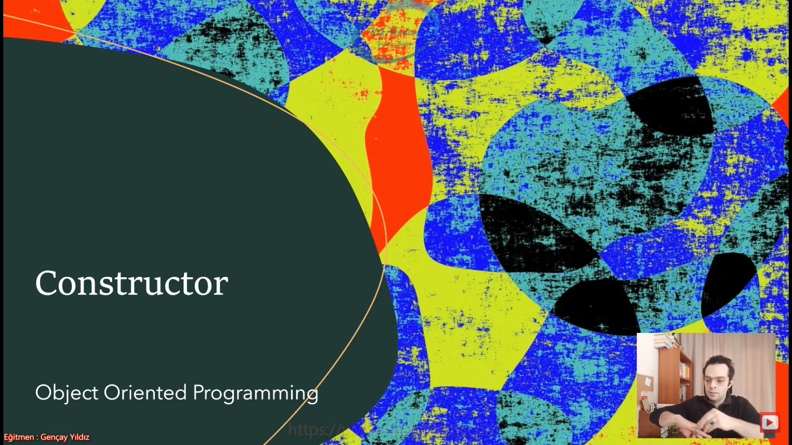
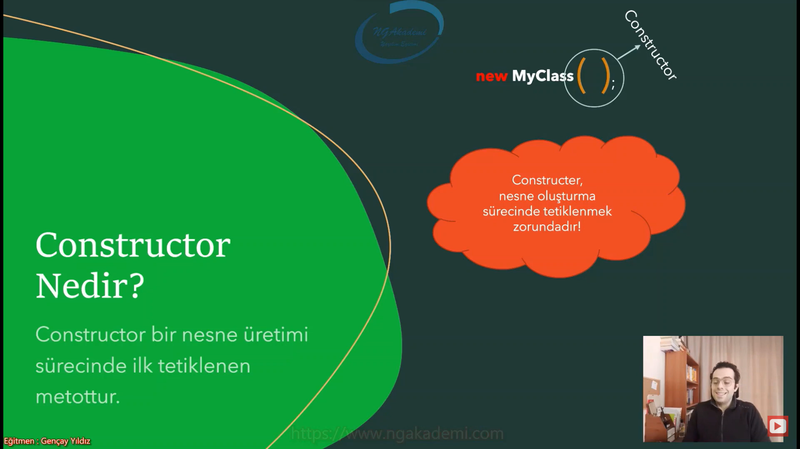
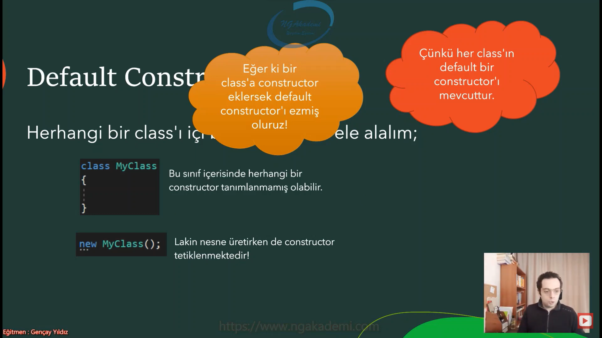
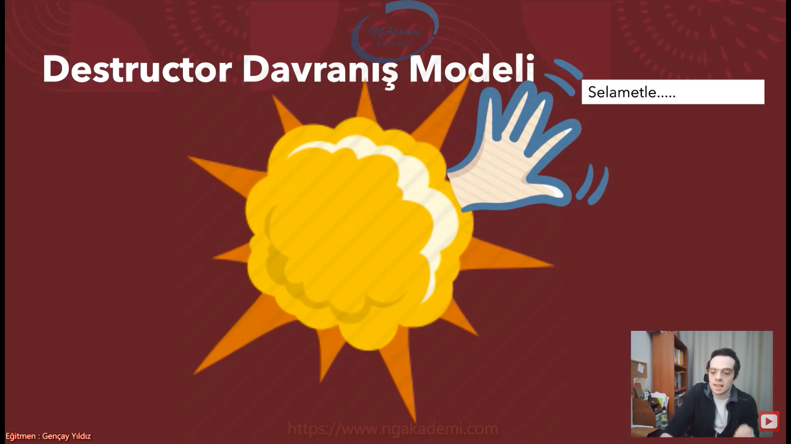
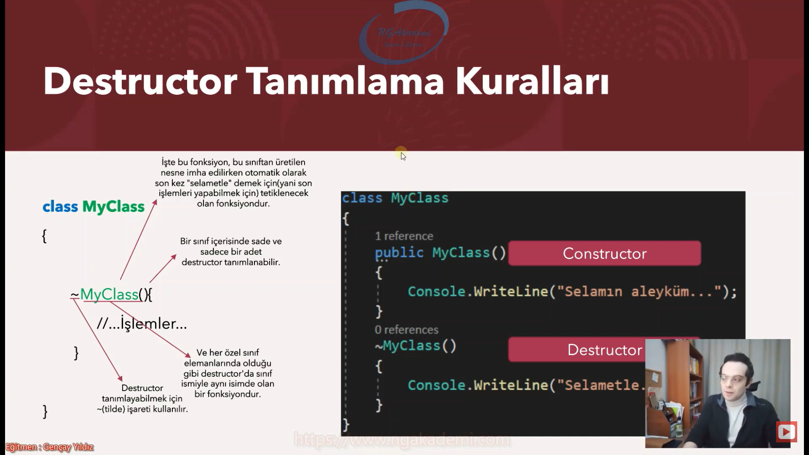
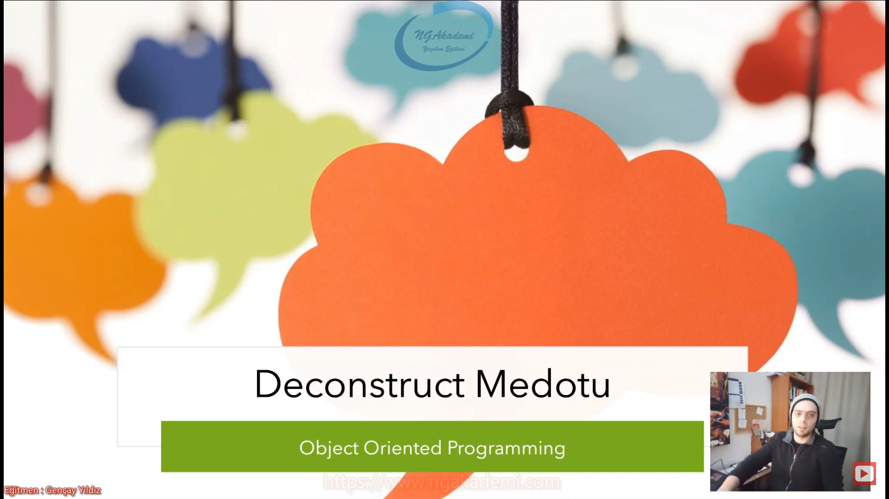
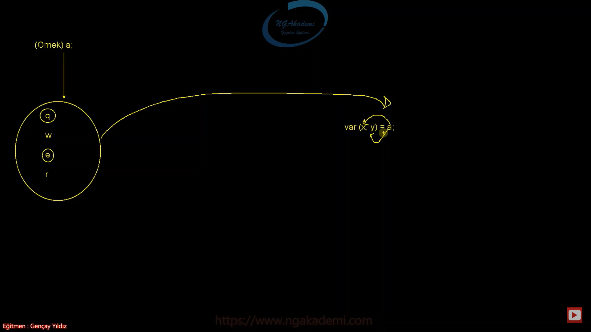
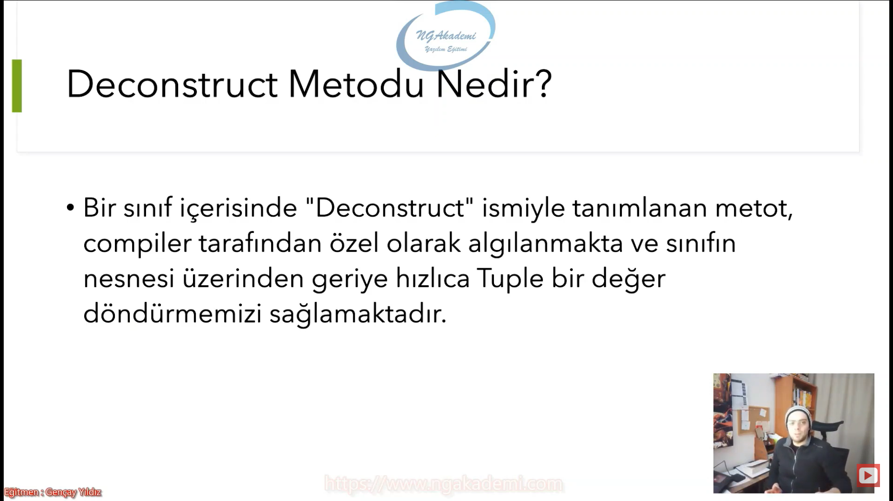
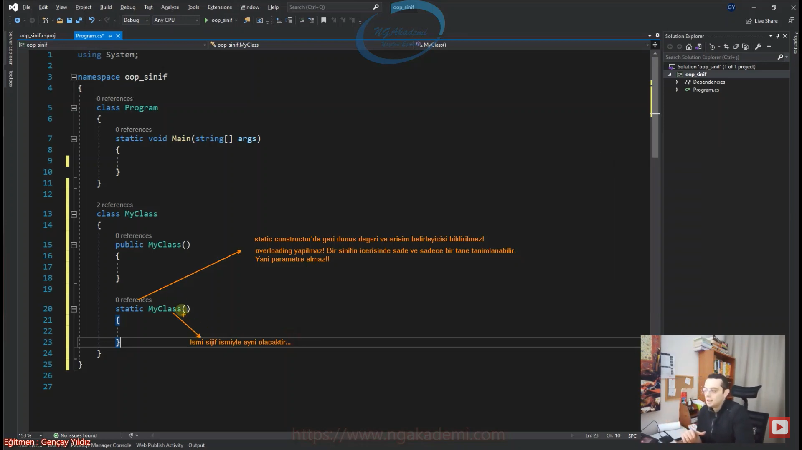

***
# Nesne Tabanlı Programlama #11 - Özel Sınıf Elemanları - Constructor Metot Nedir?
- Bir sınıf içerisinde farklı memberlar barındıran(field, property, metot, indexer) ve bu memberlar eşliğinde ürettiğimiz nesne üzerindeki değerlerde işlem yapmamızı sağlayan bir tanımlayıcı yapılanmadır. Yani bir nesne modelidir.

- Sınıf üzerinden üretilecek nesnenin üzerinde bu nesnenin üretim esnasındaki yapılacak operasyonları tanımlamamızı sağlayacak aynı şekilde üretilen bu nesnenin imha edilme sürecinde sonkez yapılacak işlemlere dair tanımlamaları yapmamızı sağlayacak olan özel fonksiyonlarımız vardır. İşte bu tarz spesifik durumlara hitap eden o noktalarda işlem yapmamızı sağlayan fonklsiyonlara biz `class`ın özel memberları diyeceğiz.

- Bu memberlar özünde 3 tanedir
  * Constructor
  * Static Constructor
  * Desctructor => Yıkıcı bir etki yaratan yani imha edilirken devreye giren fonksiyon.

- Bu özel memberlar tüm sınıflarda ortak olarak kullanılabilir yapılanmalara sahiptir.

- Özel sınıf memberları birer fonksiyondur.



## Constructor Nedir?
- Constructor bir nesne üretimi sürecinde ilk tetiklenen metottur.

- Constructer, nesne oluşturma sürecinde tetiklenmek zorundadır!

- Biz bir sınıftan `new` keywordü ile nesne üretiriz.

- C#'ta parantez (`()`) semantik açıdan sadece metotlarda vardır. Siz bir nesne oluştururken aslında bir metot tetikliyorsunuz işte biz bu metoda constructor metot diyoruz.

- Constructor metot adı üstünde yapıcı/inşa edici metot. Nesne ilk ayağa kaldırılırken o nesneye dair ilk konfigürasyonları yaptığımız metottur.

- Senin bir sınıfın var ve bu sınıftan nesne üretiyorsun. Bu sınıftan nesne üretirken bu sınıfın içindeki belirli konfigürasyonlar şu şekilde olsun diyebilmek istiyorsan ve nesne üretilir üretilmez o konfigürasyonlarla sana gelmesini istiyorsan bununla ilgili ekstradan fonksiyon oluşturup nesne ürettikten sonra çağırmaktansa bunu Constructor'da konfigüre edebilirsin. İşte constructor nesne üretim esnasında nesneye dair konfigürasyon yapmanı sağlayan ve nesne üretilirken ilk tetiklenen fonksiyondur. Çünkü sen nesneyi `new` keyword'ü ile üretirken türü bildirdiğinde zaten çoktan bunu tetiklemiş oluyorusun.

- Nesne oluştururken kesinlikle constructor metodu tetiklemek zorundasın.



## Constructor Davranış Modeli
- Görüldüğü üzere, constructor işlevsel açıdan nesnelerin yaratılma aşamalarında içerisindeki field'lara ilk değerlerini atamakla yükümlü OLABİLMEKTEDİR!

- Constructor, new ile nesne yaratma talebi geldikten ve ilgili nesneye hafızada yer ayrıldıktan sonra tetiklenir.

- Bu nesne oluşturulurken constructor tetikleneceğinden dolayı ilgili nesne içerisindeki field'ların ilk değerleri verilmiş olacaktır.

- Nesne üretirken bu nesnenin field'larının başlangıç değerlerini atamak istiyorsak kullanabiliriz.

- Nesneye dair konfigürasyonlar yapabileceğimiz bir fonksiyondur. İstediğimiz her şeyi yapabiliriz. Sen bu konfigürasyonları yapmayıp başka işlemlerde yapabilirsin. Nihayetinde nesne üretilirken tetikleniyor. Tetiklenirken akıştaki kod neyse onu tetikleyecektir illaki konfigürasyon kodu olmasına gerek yoktur. Ama genellikle nesneye dair konfigürasyonlarımızı yaparız.

- `new MyClass()` Sen `new` dedikten sonra türü verirsin. Türden sonra öncelikle bu nesneye dair hafızada yer ayrılır. Bu ayrım yapıldıktan sonra artık constructor tetiklenir. Yani çoktan nesne aslında fiziken vardır. Varolduktan sonra ilk tetiklenen fonksiyon constructor fonksiyonu olacaktır.


## Constructor Metot Nasıl Oluşturulur?
- Constructor, özel bir sınıf elemanıdır.

- Özel olsada fıtrat olarak bir metottur.

- Lakin bildiğimiz metot imzalarından bir nebze farka sahiptir.

- Constructor'ların;
  * Metot adı sınıf adıyla aynı olmalıdır! (Özel sınıf elemanlarının dışında hiçbir member sınıf adıyla aynı olamaz!)
  * Geri dönüş değeri olmaz/belirtilmez!
  * Erişim belirleyicisi public olmalıdır! (private olduğudurum ayriyetten incelenecektir)

- Özel sınıf elemanlarının tanımlanması imzası normal bildiğimiz fonksiyonlara nazaran bir tık farklıdır.

- Bir sınıfın içinde herhangi member'ın adı sınıfın adıyla aynı olamaz. Compiler hata verir. Eğer ki bir sınıfın içinde herhangi bir member'ın adı sınıfın adıyla aynıysa belirli kurallar gereği constructor olabilir.

- Geri dönüş değeri olmamalı derken void bile değil hiçbişey tanımlanmamalıdır Orası direkt geçilmelidir.

- Bir sınıfın içinde constructor metot tanımlamak istiyorsanız o sınıfla aynı isimde ve geri dönüş değeri bildirilmemiş olan bir imza tanımlamanız gerekmektedir.

- Constructor metot sınıftan nesne üretilirken ilk tetiklenen metottur.

- Nesne oluşturulurken constructor metodu tetiklemek zorundasınız. Eğer tetiklemezseniz hata alırsınız!!!

- Constructor her daim tetiklenmesi gereken zoraki bir fonksiyondur.

```C#
new MyClass();
new MyClass();
new MyClass();
new MyClass();
new MyClass();
MyClass m = new();

class MyClass
{
    public MyClass()
    {
        System.Console.WriteLine("Bir adet myclass nesnesi oluşturulmuştur.");
    }
    public void X(){}
}
```


## Default Constructor
- Eğer ki bir class'a constructor eklersek default constructor'ı ezmiş oluruz!

- Çünkü her class'ın default bir constructor'ı mevcuttur.

- Her sınıfın içerisinde var olan default constructor vardır. Eğer ki bir sınıf oluşturdun sen herhangi bir constructor koymadın içerisine bil ki her sınıfın içerisinde tanımlamasak dahi default bir constructor mevcuttur.

- Compiler seviyesinde bir nesne oluşturulurken bir constructor tetiklenecektir. Sen constructor oluşturmasan bile.

- Sen default constructorın yerine kendi constructor'ını yazarsan default constructor'ı ezmiş olursun.

- OOP'de `class` yapılanmalarında default constructor compiler tarafından sınıfların içerisine yerleştirilecektir. 

- Ben sınıfın içerisine gelip manuel constructor'ı kendi ellerimle yazarsam mevcudiyetteki default constructor'ı ezmiş olurum. Ezdiğimde de benim yazdığım geçerli olacaktır.



## Parametreli Constructor
- Constructor'lar parametre alabilmektedir.

- Bir nesneyi üretirken bu nesneye dair ilk konfigürasyonları constructor metodu içerisinde yapabilirim. Aynı şekilde nesneyi üretirken dışarıdan dış dünyadan alınacak parametreleri değerleri de constructor üzerinden verebilirim. Dolayısıyla constructorlar parametre alabilen yapılardır.

```C#
new MyClass(5);
new MyClass(10);
MyClass m = new(15);

class MyClass
{
    public MyClass(int a)
    {
        System.Console.WriteLine("Bir adet myclass nesnesi oluşturulmuştur. " + a);
    }
    public void X(){}
}
```


## Constructor Overload
- Constructor'lar overloading yapılabilir fonksiyonlardır.

- Bir sınıf tanımlamasında birden fazla constructor tanımlayabiliyoruz. Yani constructor dediğimiz yapılanmalar overload olan yapılanmalardır.

- Bir sınıf içerisinde aynı isimde birden fazla member olamaz. Haliyle bir sınıf içerisinde bir isimde bir metot olabilir. Eğer ki bir sınıfın içerisinde aynı isimde birden fazla metot oluşturacaksak bu metotlar overloading yani çoklu yüklenme yapılmış olması lazım. Bir isme çoklu yükleme yapılır. 

- İmza yapılanması aynı sadece imzaların nitelikleri değişiyor. Her metodun ismi aynı olmalı overload olabilmesi için ve parametrelerin sayıları yahut türleri yahut yerleri değişmiş olmalı.
  * Yani iki parametreli (`int` `string`) (`string` `int` )olabilir bak bu overload'da geçerli olacaktır ama iki parametreli aynı isimde aynı imzada bir metot ikisi de aynı türden parametrelere sahipse burada çakışma olacağından dolayı birini kaldırmanız gerekecektir.

- Overloading yapılabilen özel fonksiyonlardır.

- Genellikle biz parametreyi dış dünyadan alır aldığımız parametre üzerinden nesneyi oluştururken belirli ilk değerleri o dış dünyadan gelen değerler üzerinden veririz. 

- Overloading'te yaparız belirli durumlara göre farklı varyasyonlara göre nesne oluşum sürecini destekleyici nitelikler oluştururuz.


```C#
class MyClass
{
    public MyClass()
    {
        
    }
    public MyClass(int a)
    {
        System.Console.WriteLine("Bir adet myclass nesnesi oluşturulmuştur. " + a);
    }

    public MyClass(string a)
    {
        
    }
    public MyClass(string a, int b)
    {
        
    }
    public void X(){}
}
```

## Constructor'ın Erişim Belirleyicisini private Yaparsak Sorunsalı?
- `public` elemanların dışarıdan erişilmesini sağlar.

- Bir sınıfın nesnesi üzerinden sınıfın constructor'ına erişebiliyorsam constructor'ın `public` olması gerekir. Benzer mantıkla default constructor'da da erişebildiğim için default constructor'da `public`tir.

- Eğer ki biz bir sınıfın constructor'ını `private` yaparsak ilgili sınıfın `private` yapılan o member'ı dışarıdan nesne üzerinden erişelemeyeceğinden dolayı eğer ki bu member constructor'sa eğer yine erişilemeyecek haliyle nesne üretiminde hata alırız.

- Nesne üretilirken kesinlikle bir sınıftan nesne üretim sürecinde constructor metot tetiklenmelidir. Constructor metodu tetikleyemiyorsanız ilgili sınıftan nesne üretemezsiniz. Eğer ki sen bir sınıfın constructor metodunu `private` yaparsan o sınıfın constructor'ına erişilemeyeceği için nesne üretim esnasını da baltalamış olursun haliyle nesne üretimini engellemiş olursun.

- Bir sınıftan nesne üretebilmek için constructor'ı tetiklemen şart bunsuz nesne oluşturamazsın eğer ki constructor'ı `private` yaparsan başka bir overload yoksa eğer ilgili sınıftan nesne üretimini engellemiş olursun.

- Nesne üretimini engellemek singleton design pattern'da işimize yaramaktadır.

- Singleton design pattern'da constructor'lar `private` yapılır. Çünkü bir nesnenin üretimi constructor'ı `private` yapman dışarıdan erişimi engellersin ama sınıfın içerisinde constructor'a erişebilirsin sınıfın içinden ilgili sınıfa dair bir nesne oluşturabiliyorsun.

- Nesne oluşturmayı dışarıdan engelleyip içeriden nesne oluşum sürecini yönetmek istediğimiz durumlarda o sınıfın nesnesini dışarıdan talep edilmesini engellemeniz gerekebilir. Böyle durumlarda bu özelliği kullanabilirsiniz.

- Constructor `private` olabilir ama içeriden erişime izin verir. `private` sadece buradan erişilebilir. Bu odadakiler birbirlerine erişilebilir. `private` olan bu odadaki herhangi bir nesneye bir başka odadaki erişemez.

- Constructor bir sınıfın içerisinde `private` yapılabilir. Yaptığımız zaman ilgili sınıfın nesnesini üretemeyiz çünkü constructor'a ihtiyacımız olacağından dolayı.

```C#
class MyClass
{
    MyClass()
    {
        
    }

    void X()
    {
        new MyClass();
    }
}

```


## this Keywordüyle Constructor'lar Arası Geçiş
- Bir sınıfta birden fazla overloading yaparak constructor tanımladığımızda herhangi bir constructor üzerinden sınıftan nesne inşa ederken biz farklı constructor'ların tetiklenmesini isteyebiliriz. İşte bunun için `this` keywordünü kullanabilmekteyiz.

- Bir sınıfın içinde `this` keywordü o sınıfın o anki nesnesini temsil eder.

- `this` keywordü nasıl ki sınıfın o anki nesnesini temsil ediyor aynı şekilde `this` keywordü bir sınıfın nesnesinin içerisindeki birden fazla constructor'lar arasında geçiş yapabilme sorumluluğunu da üstlenebilmektedir. Nihayetinde nesneyi temsil eden nesne içerisindeki constructor'larında aralarında geçiş yapmasını sağlayabilen bir nitelik taşımakta.

- Herhangi bir constructor'ın yanına `this` keywordünü verirsen bu constructor yani o anki constructor'ın dışındaki diğer constructorlara erişmeni sağlayacaktır.

`public MyClass(int a) : this()` bu yapıda ilk önce bu constructor tetiklenmeden önce `this`deki constructor'ı tetikle. İlk önce `this`deki constructor işlenecek sonra bu constructor işlenecektir.

- `this` keywordü constructor'lar arasında atlamayı yani constructor'ın herhangi birinden farklı constructor'ları tetikleyebilmemizi sağlayan bir keyword.

- `this` keywordü ile atlamalar yaparken constructorlar arasında bazen değer vermemiz gerekebiliyor. `this(parametreler)` keywordüne bu syntax'da değer vermek için ya constructor'dan gelen parametreyi kullanabiliyorsunuz ya da manuel değer verebiliyorsunuz. Bunun dışında farklı bir field'ın ya da property'nin değerini burada çağıramazsınız. Erişebildiği değişkenler hangi constructor üzerinde kullanılıyorsa o constructor'un parametrelerindeki değerlerdir. Ayriyetten parametrenin dışında bir değer verebiliyorsunuz.

- Genellikle custom exception sınıfları oluştururken bu tasarımı uygularız.

```C#
class MyClass
{
    public int x;
    public MyClass()
    {
        System.Console.WriteLine("1. Constructor");
    }
    public MyClass(int a) : this()
    {
        System.Console.WriteLine($"2. Constructor : a = {a}");
    }
    public MyClass(int a, int b) : this(a)
    {
        System.Console.WriteLine($"2. Constructor : a = {a} |b = {b}");
    }
}
```


## Record'lar da Constructor
- `record`ın esasında/özünde bir sınıftan farkı yoktur.


```C#
record MyRecord
{
    public MyRecord()
    {
        
    }
    public MyRecord(int a) : this()
    {
        
    }
}
```


## C# Examples
```C#
namespace oop_sinif;
class Program
{
    static void Main(string[] args)
    {
        // new MyClass(5);
        // new MyClass(10);
        // new MyClass();
        // new MyClass();
        // MyClass m = new(15);

        new MyClass();
        new MyClass(5);


    }
}
// class MyClass
// {
//     MyClass()
//     {

//     }

//     void X()
//     {
//         new MyClass();
//     }
// }

// class MyClass
// {
//     public MyClass()
//     {

//     }
//     public MyClass(int a)
//     {
//         System.Console.WriteLine("Bir adet myclass nesnesi oluşturulmuştur. " + a);
//     }

//     public MyClass(string a)
//     {

//     }
//     public MyClass(string a, int b)
//     {

//     }
//     public void X(){}
// }

class MyClass
{
    public int x;
    public MyClass()
    {
        System.Console.WriteLine("1. Constructor");
    }
    public MyClass(int a) : this()
    {
        System.Console.WriteLine($"2. Constructor : a = {a}");
    }
    public MyClass(int a, int b) : this(a)
    {
        System.Console.WriteLine($"2. Constructor : a = {a} |b = {b}");
    }
}

record MyRecord
{
    public MyRecord()
    {
        
    }
    public MyRecord(int a) : this()
    {
        
    }
}

```

***
# Nesne Tabanlı Programlama #12 - Özel Sınıf Elemanları - Destructor Metot Nedir?


## Destructor/Finalizer Metot Nedir?
- Bir class'tan üretilmiş olan nesne imha edilirken otomatik çağrılan metottur.

- C# programlama dilinde Destructor sadece class yapılanmasında kullanılabilir ve bir class sade ve sadece bir adet Destructor içerebilir.

- Constructor yapıcı desctructor yıkıcı. 

- Constructor, bir nesneyi oluştururken `new` keywordü ile compiler'dan sen o nesneyi talep ediyorsan eğer bu nesne oluşturulurken constructor devreye giriyor. constructor dediğimiz fonksiyon nesne oluşturulurken yapılması gereken temel konfigürasyonları nesneyle ilgili temel işlemleri yapan ilk tetiklenen fonksiyondur. Haliyle destructor ise nesne artık işimiz bitti nesneyle ilgili bu değerle ilgili bir işlem yapmama gerek yok dolayısıyla böyle bir durumda nesneyi yok ederiz. Çünkü biz belleğimizde bize lazım olmayan bir değerle işimiz olmaz. 

- Desctructor Nesne imha edilirken yok edilirken son kez nesne adına selametle dememizi sağlayacak olan bir fonksiyondur.

- Nesnedeki en son tetiklenecek fonksiyon destructor'dır.

- Destructor dediğimiz fonksiyon parametre alamaz!

- Sadec `class`ın içerisinde tanımlanan bir fonksiyondur. 

- `class` içerisinde sade ve sadece bir kere tanımlanabilir.

- Parametre alamayan bir fonksiyondur.


## Destructor Davranış Modeli
- Nesne oluşum sürecinde ilk tetiklenen fonksiyon constructor fonksiyonuydu.


- Nesneyi imha ederken nesnenin son kez hadi hoşçakalın dediği fonksiyona biz destructor diyoruz.

- Destructor yıkıcı metot diye geçer. Nesne imha edilirken/yıkılırken/yok edilirken/silinirken devreye girecektir.



## Peki Bir Nesne Hangi Şartlarda, Kim Tarafından İmha Edilir?
- Bir nesnenin imha edilmesi için;
    * İlgili nesne herhangi bir referans tarafından işaretlenmemelidir,
    * Yahut nesnenin oluşturulduğu ve kullanıldığı scope sona ermiş olmalıdır.
    * Yani anlaşılan ilgili nesneye bir daha erişilemez hale gelinmelidir. 
- işte o zaman nesne imha edilir.

- Nesne eğer referanssızsa garbage collector tarafından imha edilir ya da garbage collector dediğimiz meaknizmanın insafına bırakılmıştır. Yani işine geldiği zaman ne zaman ki tetiklenirse o zaman gelecek ilgili nesneyi tak imha edecektir.

- Nesneler herhangi bir referans tarafından işaretlenmezse biz bir daha bu nesneye erişemeyiz. bir nesne salt bir şekilde herhangi bir referans üzerinden erişilmiyecek haldeyse imha edilmeye yüz tutmuştur.

- Şimdi bir nesne oluşturdun oluşturduğun nesnenin kullanıldığı scope artık sona erdi. Sona erdiğine göre sen bu nesneyi bu scope'un dışına taşımadıysan dışarıya bir şekilde vermediysen dışarıdan bir şekilde ulaşılır kılmadıysan artık o nesneye de ihtiyaç olmadığından dolayı bu nesne de imhaya yüz tutacaktır.

- Nesne mimari tarafından imha edilir.


## Garbage Collector
- Uygulamada lüzumsuz olan nesneleri toplamak için Garbage Collector isimli bir mekanizma devreye girer.

- Esasında Garbage Collector C#'da bellek optimizasyonunu üstlenen bir yapılanmadır.

- C#'da Garbage Collector'ın ne zaman iş göreceği tahmin edilemez. Kafasına göre takılır :)

- Dolayısıyla biz geliştiricilerin bu mekanizmaya müdahale etmesi pek önerilmez!

- RAM'de bir daha kullanılmamak üzere erişilmemek üzere duran nesneleri toplayan yapıya garbage collector denir.

- .NET'te bellek optimizasyonu/yönetimi biz developer'lardan alınmış Garbage Collector'a verilmiştir. Mimari/işletim sistemi bunu otomatik yürütür.

- Garbage Collector denilen mekanizma lüzumsuz olan referanssız olan erişilemeyecek olan nesneleri imha etmekle görevli olan bir mekanizmadır. Bu mekanizma kendi kafasına göre çalışır. Yani ne zaman boştaki/lüzumsuz nesneyi imha edeceğini biz bilemeyiz. Kendisi belki bugün belki yarın belki yarından da yakın bir zaman gelecek ve imha edecek. Dolayısıyla kendi kafasına göre çalışan bir yapılanmadır. Haliyle bu yapılanmaya biz developer'ların müdahalesi çokta tavsiye edilmez. Nİhayetinde bizler buna müdahale ettikçe işine karıştıkça orada büyük bir maliyete sebep olabilmekteyiz. Garbage Collector dediğimiz mekanizma bellek optimizasyonunu kendi planına göre yürüttüğünden dolayı müdahale edebiliyoruz ama bu müdahalede çok fazla önerilmiyor. 

- Garbage Collector dediğimiz bu mekanizma RAM'deki nesneleri işte alacak gelecek yok edecek. Hani Pacman denilen bir oyun vardı. Onun gibi düşünün. HEAP'te varolan nesnelerden boş olan/lüzumsuz olan/referanssız olan nesnelere gidiyor bakıyor diyor ki ulan diyor bu referanssız ben bunu imha edeceğim diyor. Hop yutuyor götürüyor. İşte tam o anda imha edilirken nesne son kez hadi eyvallah diyeceği desctructor fonksiyonunu devreye sokuyor onu tetikliyor.

- Garbage Collector ilgili nesneyi tam imha ederken işte tam o anda destructor fonksiyon devreye girer.


## Destructor Tanımlama Kuralları
- İşte bu fonksiyon, bu sınıftan üretilen nesne imha edilirken otomatik olarak son kez "selametle" demek için(yani son işlemleri yapabilmek için) tetiklenecek olan fonksiyondur.

- Bir sınıf içerisinde sade ve sadece bir adet destructor tanımlanabilir

- Ve her özel sınıf elemanlarında olduğu gibi destructor'da sınıf ismiyle aynı isimde olan bir fonksiyondur.

- Destructor tanımlayabilmek için `~`(tilde) işareti kullanılır.



## Pratik İnceleme
- Destructor fonksiyonu nesnenin imhadan bir öncesi yani son nefesini verdiği son duasını ettiği yerdir.

```C#
using Internal;
using System;
namespace oop_sinif;
class Program
{
    static void Main(string[] args)
    {
        #region 1. Örnek
        X();
        GC.Collect();//Garbage Collector devreye sokulmuş oldu
        Console.ReadLine();
        #endregion
        #region 2. Örnek
        int sayi = 100;
        while(sayi >= 1)
        {
            new MyClass2(sayi--);
        }
        System.Console.WriteLine("********************************");
        GC.Collect();

        Console.ReadLine();
        #endregion
    }
    static void X()
    {
        MyClass m = new MyClass();
    }

}
class MyClass
{
    public MyClass()
    {
        System.Console.WriteLine("Nesne Üretilmiştir");
    }

    ~MyClass()
    {
        System.Console.WriteLine("Nesne imha ediliyor...");
        System.Console.WriteLine("Nesne son duasını ediyor...");
        System.Console.WriteLine("Nesne son nefesini veriyor");
    }
}
class MyClass2
{
    int no;
    public MyClass2(int no)
    {
        this.no = no;
        System.Console.WriteLine($"{no}. nesne oluşturulmuştur");
    }
    ~MyClass2()
    {
        System.Console.WriteLine($"{no}. Nesne imha ediliyor...");
    }
}
```

***
# Nesne Tabanlı Programlama #13 - Özel Sınıf Elemanları - Deconstruct Metot Nedir?


- Bir sınıf içerisinde "Deconstruct" ismiyle tanımlanan metot, compiler tarafından özel olarak algılanmakta ve sınıfın nesnesi üzerinden geriye hızlıca Tuple bir değer döndürmemizi sağlamaktadır.

- Bir sınıfınız olduğunu tahayyül edin ve bu sınıftan ürettiğiniz bir nesne olduğunu varsayalım. Şimdi bu nesne içerisinde onlarca property'niz olabilir. Bu property'lerden ihtiyacınıza istinaden belli başlı olanları hızlı bir şekilde bir özet bir analiz mahiyetinde elde etmek istiyor olabilirsiniz. İşte bu ihtiyaca istinaden size bu nesnenin istediğiniz property'lerini hızlı bir şekilde belirli bir semantikle ve bunu tuple olarak verebilecek bir özelliktir deconstruct dediğimiz fonksiyon.

- Özel sınıf elemanları dediğimiz yapılanmaların ortak özelliği hepsinin isminin sınıf ismiyle birebir aynı olmasıydı. Bu özel sınıf member'larının arasında bir tane istisna var o da deconstruct fonksiyonu. Deconstruct fonksiyonu sınıf ismiyle aynı ismi barındırmaz/aynı isimde olmaz. Deconstruct fonksiyonunun ismi deconstruct olmalıdır.

- Deconstruct fonksiyonunun özelliği isminden gelir.

- Elimizde bir objemiz var. Bu objenin belirli property'leri var. Bu property'leri hızlı bir şekilde tuple nesnesi olarak çıktısını almak istiyorsak bu sınıfın nesnesinin içerisinde ya da bu sınıfın modeli olan `class`ın içerisinde deconstruct dediğimiz fonksiyonun tanımlanmış olması gerekiyor.

- Deconstruct metodu da overload edilebilir.




## Deconstruct Prototipi
- Geri dönüş tanımlaması vardır. Geri dönüş değeri olmasada `void` ile işaretlenmesi gerekiyor.

- Diğer özel sınıf elemanlarının isimleri sınıfın ismiyle aynı olması gerekiyorken burada ise Deconstruct olarak tanımlanması gerekiyor.

- Bir sınıfın içerisinde deconstruct fonksiyon tanımlamak istiyorsanız;
    1. Fonksiyonun dışarıdan erişilebilir olması lazım. Yani `public` olmalı. 
    2. Bu özel bir metottur. Özel metot olduğunu ifade edebilmek içinde compiler tarafından tanımlanan isimle isimlendirilmeli. Haliyle ismi Deconstruct.
    3. Mantıken geriye değer döndürmesi gerekirken Deconstruct fonksiyonu sayesinde sen geriye değer döndürürken compiler buradan o değeri alacak.
    4. Tuple oalrak geriye döndürelecek olan değerler Deconstruct fonksiyonunda `out` keywordü tanımlanmış parametreler olmalıdır.

- `out` keywordü metodun içindeki değerleri dışarı taşır.

- Geriye değer döndürmeyecek adı da Deconstruct olacak.


## Pratikte İnceleme
```C#
Person person = new Person
{
    Name = "Musa",
    Age = 24
};
var (x, y) = person;//person'ı al x ve y değişkenlerine ayır

class Person
{
    public string Name { get; set; }
    public int Age { get; set; }

    public void Deconstruct(out string name,out int age)
    {
        name = Name;
        age = Age;
    }
}
```

## C# Examples
```C#
namespace oop_sinif;
class Program
{
    static void Main(string[] args)
    {
        Person person = new Person
        {
            Name = "Musa",
            Age = 24
        };

        var (x, y) = person;//person'ı al x ve y değişkenlerine ayır
    }
}
class Person
{
    public string Name { get; set; }
    public int Age { get; set; }

    public void Deconstruct(out string name,out int age)
    {
        name = Name;
        age = Age;
    }
}
```

***
# Nesne Tabanlı Programlama #14 - Özel Sınıf Elemanları - Static Constructor Metot Nedir?


- Bir sınıftan nesne oluşturulurken ilk tetiklenen fonksiyon constructor fonksiyonudur. 

- Bir sınıftan nesne üretilirken constructor'a nazaran ilk tetiklenen metot static constructor'dır. Ondan sonra normal constructor tetiklenir.

- Bir sınıfta constructor var birde `static` keywordüyle işaretlenmiş bir constructor daha var. Haliyle bir sınıftan nesne üretilirken ilk başta static constructor tetiklenir ardından normal constructor tetiklenir.

- Bir sınıftan nesne üretilirken ilk tetiklenen fonksiyon Static Constructor'dır.... Amma velakin belirli bir duruma istinaden!!!

- Sınıfların içerisinde özel memberlarımız var. Bunlardan kimi constructor kimi destructor kimi static constructor bunlar belirli davranışlara göre belirli durumlarda tetiklenen ve işlemler yapmamızı sağlayan özel metotlar. Bu metotlardan constructor ilgili sınıftan her nesne üretilirken tetiklenen fonksiyon.

- Static constructor ilgili sınıftan ilk nesne üretilirken bir kereye mahsus tetiklenen fonksiyondur.

- Bir sınıftan ilk defa bir nesne üretiliyorsa ilk tetiklenen fonksiyon static constructor ardından constructor'dır. Yok eğer bu sınıftan ilk değilde n. bir nesne üretiliyorsa artık static contructor bir daha tetiklenmez çünkü uygulamada o sınıftan bir yerlerde bir zamanlarda ilk olan bir nesne üretilmiştir o zaman tetiklenmiştir.

- Bir sınıftan ilk nesne üretilirken o sınıftan o uygulamada ilk defa bir yerlerde nesne üretiyorsun işte o sınıfın varsa static constructor'ı orada tetiklenir. Amma velakin ilkinin dışında bambaşka yerlerde nesneler üretiyorsan artık tetiklenmez. Çünkü static constructor ilgili sınıftan ilk nesne üretilirken tetiklenir. 

- Contructor ilk tetiklenen fonksiyondur. İlk sınıfın nesnesi üretilirken birinciliği static constructor'a kaptırır. O da bir constructor'dır ama static yapılanmadır.

- static yapılanmalar uygulama bazlı datalarımızı yerleştirdiğimiz alandır.

- static nesneden bağımsızdır. Bir kereye mahsus tetiklenir. Bir değer koyarsın her yerde aynı değer söz konusudur.


- Constructor `public` olmalıdır. `private` olduğu durumda biz bu constructor'a dışarıdan erişemeyeceğimizden dolayı haliyle nesneyi/nesne oluşumunu engellemiş oluruz. Dolayısıyla `public` olması gerekiyor.

- static constructor oluşturmak istiyorsanız normal constructor'ın başına `static` keywordünü koymanız yeterli. Amma velakin sadece bir erişim belirleyicisi yok.

- static constructor'da geri dönüş değeri ve erişim belirleyicisi bildirilmez! 

- Overloading yapılmaz! Bir sınıfın içinde sade ve sadece bir tane tanımlanabilir. Yani parametre almaz.

- İsmi sınıf ismiyle aynı olacaktır...



- Bir uygulama hepsiburada olabilir uzaya füze gönderiyorsundur haliyle o uygulamanın içerisinde bir sınıfın var farketmiyor bu uygulamanın herhangi bir yerinde bu sınıftan bir nesne üretiyorsun üretirken ilk üretilen nesneyse eğer ilk başta static constructor tetiklenecek ardından normal constructor tetiklenecek. İlkinden sonraki nesnelerde nesne üretimlerinde ise static constructor tetiklenmeyecek sürekli normal constructor tetiklenecek.

- Static constructor'ın tetiklenebilmesi için illa ilk nesne üretimi yapılmasına gerek yoktur. İlgili sınıf içerisinde herhangi bir static yapılanmanında tetiklenmesi static constructor'ın tetiklenmesini sağlayacaktır.

- İlk nesne üretiminde static constructor tetiklenebilir. Bir de ilgili sınıftan herhangi bir static olan member'ı tetikliyorsan eğer yine static constructor bir kereye mahsus tetiklenecektir.

- Bir sınıfta static constructor varsa bu davranışlardan herhangi birinde bir kere tetiklendiyse diğerlerinde bir daha tetiklenmeyecek. 

- Static contructor öyle ya da böyle bir kere tetiklendi mi bir daha tetiklenmez.

```C#
namespace oop_sinif;
class Program
{
    static void Main(string[] args)
    {
        new MyClass();
        new MyClass();
    }
}
class MyClass
{
    public MyClass()
    {
        //Bu sınıftan nesne üretilirken ilk tetiklenecek olan metottur.
        System.Console.WriteLine("MyClass constructor'ı tetiklenmiştir.");
    }
    static MyClass()
    {
        //Bu sınıftan ilk nesne üretilirken ilk tetiklenecek olan metottur.
        //Üretilen ilk nesnenin dışında bir daha tetiklenmez!
        System.Console.WriteLine("MyClass static constructor'ı tetiklenmiştir.");
        //Static constructor'ın tetiklenebilmesi için illa ilk nesne üretimi yapılmasına gerek yoktur. İlgili sınıf içerisinde herhangi bir static yapılanmanında tetiklenmesi static constructor'ın tetiklenmesini sağlayacaktır.
    }

}
```

- Singleton design pattern'ı uygularken static constructor kullanılabiliyor.

- Bir sınıftan uygulama bazında sade ve sadece tek bir nesne oluşturulmasını istiyorsan kullanabileceğin bir design pattern.

- Design pattern dediğimi yapılanmalar OOP nimetlerinden faydalanarak geliştirdiğimiz tekrar eden stratejilerdir. Yani dünyada her yerde standart olan stratejilerdir.

- Bir sınıfın var ve bu uygulamada bu sınıftan sadece bir tane nesne oluşsun iki tane oluşmasın diyipte bu sınıftan sade ve sadece bir tane nesne olacak. Ne zaman ki yeni nesneye ihtiyacım varsa varolanı sana döndürüp onu kullanmanı sağlayacak böyle bir ihtiyacın varsa singleton design pattern senin bu ihtiyacına çözüm getirebiliyor.

- Bir sınıfı singleton yani tekil hale getirmek istiyorsan onun constructor'ını `private` etmen lazım. Nesne üretimini engellemen lazım.

- Bir sınıfın constructor'ını `private` yaparsanız o sınıfın constructor'ına dışarıdan erişemezsiniz içeriden erişebilirsiniz.

- `static` yapılanmalara sınıf ismi üzerinden erişiriz.

- `static` yapılanmaların nesneyle işi yoktur.

- Nesneler hangi yapılanma olursa olsun her daim HEAP'tedir.

- `static` yapılanma normal constructor'dan önce tetiklenen lakin ilk nesne üretilirken ya da herhangi bir `static` yapılanma tetiklenirken tetiklenen bir yapılanmadır. Onun dışında tüm nesne üretimlerinde normal constructor tetiklenecektir.

```C#
#Singleton Design Pattern
//Bir sınıftan uygulama bazında sade ve sadece tek bir nesne oluşturulmasını istiyorsan kullanabileceğin bir design pattern.
class Database
{
    Database()
    {

    }
    static Database database;
    public static Database GetInstance
    {
        get
        {
            return database;
        }
    }

    static Database()
    {
        database = new Database();
    }
}
```

## C# Examples
```C#
namespace oop_sinif;
class Program
{
    static void Main(string[] args)
    {
        new MyClass();
        new MyClass();

        Database database1 = Database.GetInstance;
        Database database2 = Database.GetInstance;
        Database database3 = Database.GetInstance;

        database1.ConnectionString = "sfafasfasfsafasfaswf";

        System.Console.WriteLine(database1);
        System.Console.WriteLine(database2);
        System.Console.WriteLine(database3);
    }
}
class MyClass
{
    public MyClass()
    {
        //Bu sınıftan nesne üretilirken ilk tetiklenecek olan metottur.
        System.Console.WriteLine("MyClass constructor'ı tetiklenmiştir.");
    }
    static MyClass()
    {
        //Bu sınıftan ilk nesne üretilirken ilk tetiklenecek olan metottur.
        //Üretilen ilk nesnenin dışında bir daha tetiklenmez!
        System.Console.WriteLine("MyClass static constructor'ı tetiklenmiştir.");
        //Static constructor'ın tetiklenebilmesi için illa ilk nesne üretimi yapılmasına gerek yoktur. İlgili sınıf içerisinde herhangi bir static yapılanmanında tetiklenmesi static constructor'ın tetiklenmesini sağlayacaktır.
    }

}

#region Singleton Design Pattern
//Bir sınıftan uygulama bazında sade ve sadece tek bir nesne oluşturulmasını istiyorsan kullanabileceğin bir design pattern.
class Database
{
    Database()
    {

    }
    public string ConnectionString { get; set; }

    static Database database;
    public static Database GetInstance
    {
        get
        {
            return database;
        }
    }

    static Database()
    {
        database = new Database();
    }
}
#endregion
```
