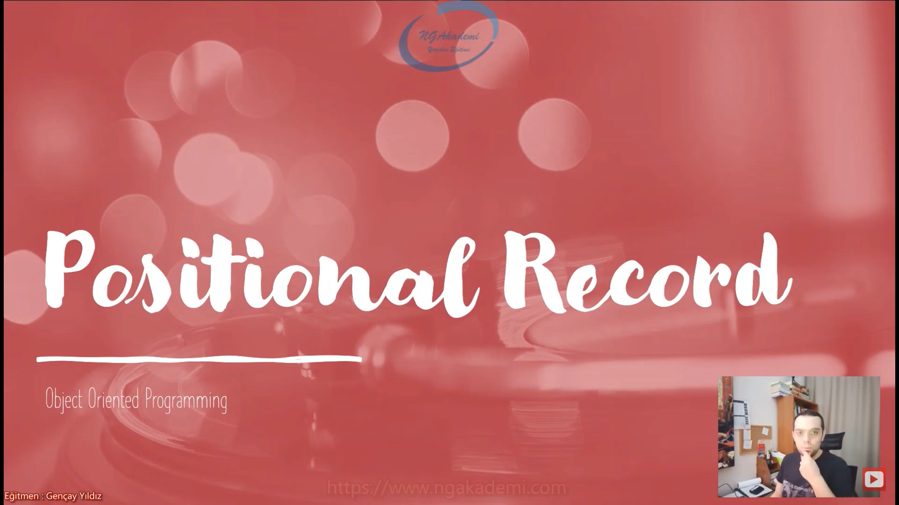

***
# Nesne Tabanlı Programlama #15 - Positional Record Nedir?
## Positional Record Nedir? Giriş


- Nesne içinde veriler tutan bu veriler üzerinde işlemler yapmamızı sağlayan fonksiyonlar barındıran bu verileri koruyabilmemizi sağlayan property dediğimiz kapsülleme yapmamızı sağlayan yapılar barındıran vs. bir canlı organizma. Kendine has bir ekosistemi var. Nesne dediğimiz yapılanmada kullandığımız özel belirli durumlara göre davranış sergileyen memberlar barındırır. Constructor, static constructor, destructor, deconstruct dediğimiz yapılanmalar. Bunlar olağanın dışındaki özel memberlar. Belirli durumlara göre davranışlar sergiliyor.

- Nesne nasıl ki kendi içerisinde özel memberlar barındırabiliyor. Aynı şekilde nesnenin birebir ta kendisi olan sadece davranışsal olarak datasını ön planda tutan `record` dediğimiz C# 9.0'da gelen yapılanmalarında kendine has varolan özel memberları özel bir semantikte kullanmamızı sağlayan Positional Record'ları inceleyeceğiz. 

- Norminal Record'lar Object Initializer'lar ile ilk degerleri verilerek üretilebilen readonly datalardi.
 
- Positional Record'lar ise esasinda Record'lar içerisinde tanimlama yapabildigimiz constructor ve deconstructor kullanimlarini daha da özellestirerek kullanilmasini saglamaktadirlar.

- Bir nesne oluşturuyorsun bu nesne içerisindeki readonly property'lere normal `class` yapılanmalarında Object Initializer dediğimiz semantik üzerinden ilk değerlerini veremezken `record`'lar sayesinde bunları yapabiliyoruz. 

- Positional Record sana bir semantik kazandırır. Sen `record`la çalışırken constructor ve deconstructor oluştururken uzun uzun eski yönteme dayalı bir oluşturma semantiğinden ziyade Positional Record sayesinde gelen yeni bir semantiği kullanıp daha hızlı bir kod inşası gerçekleştirebilirsin.


## Positional Record İnceleme
`record MyRecord(string name, string surname){}`//Bu semantik arka planda name ve surname isminde property'ler tanımlayacaktır. Bu property'lerin özellikleri de `init` olacaktır.

- Bir `record` üzerinde constructor ve deconstruct yapılanmasını hızlı bir şekilde oluşturmamızı sağlayan bir semantik sağlamaktadır.

- Positional Record kullanırken parametrelerin karşılıkları olan property'leri manuel oluşturmak zorunda DEĞİLİZ....

- Yazdığın parametrelerin karşılığı olarak compiler seviyesinde property'ler otomatik oluşturulacaktır. BU PROPERTYLER OLUŞTURULURKEN `init` OLACAK ŞEKİLDE OLUŞTURULUR....

- Sen bu `record`dan bir nesne oluştururken bu `record`ın nesnesinin oluşum sürecinde Object Initializer'ı kullanarak bu property'lere direkt datalarını atayabilirsin ama daha sonra bu dataların değerlerini değiştiremezsin.


```C#
MyRecord m = new MyRecord("asfsafsaf", "asfasfasfaf");
var (n, s) = m;

record MyRecord(string name, string surname)//Bu semantik arka planda name ve surname isminde property'ler tanımlayacaktır. Bu property'lerin özellikleri de `init` olacaktır.
{

}
```

## Positional Record'lar da ayrıca Constructor tanımlayabilir miyiz?
- Positional Record kullanırken kendine ait constructor tanımlayabilirsin.

- Bir sınıfın içinde birden fazla overloading kuralları gereği constructor tanımlıyorsanız bu constructor'lardan isrediğiniz birini nesne oluşum sürecinde kullanabiliyorsunuz. Bu birebir `record`da da geçerlidir. Amma velakin sen eğer ki Positional Record kullanıyorsan bir kere bunun kullanılması zorunludur. Haliyle overloading yapsan dahi hani kendin manuel farklo constructorlar oluştursan dahi o constructor'lar tetiklendiği zaman yine positional record'ı kullanmak zorundasın.

- `this` keywordü ile constructorlar arasında geçiş yapabiliyorum.

- Positional Record kullanıyorsan diğer constructor'larda da o constructor'ı tetiklemek zorundasın. 

```C#
record MyRecord(string name, string surname)//Bu semantik arka planda name ve surname isminde property'ler tanımlayacaktır. Bu property'lerin özellikleri de `init` olacaktır.
{ 
    public MyRecord() : this("sdasfasfasf","sasafasfsafd")
    {
        
    }
    public MyRecord(string name) : this()
    {
        
    }s
}
```

## Positional Record Kullanılırken Property Oluşturma
- İçinde property oluşturup kullanabilirsin.

```C#
record MyRecord(string name, string surname)//Bu semantik arka planda name ve surname isminde property'ler tanımlayacaktır. Bu property'lerin özellikleri de `init` olacaktır.
{ 
    public MyRecord() : this("sdasfasfasf","sasafasfsafd")
    {
        
    }
    public MyRecord(string name) : this()
    {
        
    }
     public string Name => name;
     public string Surname => surname;
    public int Test { get; init; }
}
```

## C# Examples
```C#
namespace oop_sinif;

class Program
{
    static void Main(string[] args)
    {
        MyRecord m = new MyRecord();
        var (n, s) = m;
    }
}

record MyRecord(string Name, string Surname)//Bu semantik arka planda name ve surname isminde property'ler tanımlayacaktır. Bu property'lerin özellikleri de `init` olacaktır.
{ 
    public MyRecord() : this("sdasfasfasf","sasafasfsafd")
    {
        
    }
    public MyRecord(string name) : this()
    {
        
    }
    // public string Name => name;
    // public string Surname => surname;
    public int Test { get; init; }
}
```
