***
# Nesne Tabanlı Programlama #16 - Inheritance(Kalıtım) Nedir? 1. Bölüm


## Bir Programcı Açısından Kalıtım Nedir?
- Yazılımda bir kavramı öğreneceksen öğrenmen gerektiği için öğreniyorsun. Artistlik olsun diye bir kavram öğrenilmiyor yazılımda.

- Kalıtım dediğimiz kavram küçüklüğümüzden beri bildiğimiz biyolojik bir terim.  

- OOP dediğimiz yaklaşım gerçek hayattan modellenerek yazılıma uygulanmış bir yaklaşımdır.

- Kalıtımı adamlar demişler ki ulan biz OOP diye bir yaklaşım geliştiriyoruz bunu daha iyi nasıl yapabiliriz demişler biyolojide ki kalıtım mantığını alıp buraya uyarlamışlar. 
 
- Yine günlük hayattan bilimden sanattan herhangi bir yerden bir konuyu alıp uyarlamışlar.

## Şahsi Tezim :) - OOP ile istihbarat teşkilatı kurulabilir.
- Kalıtım OOP'nin ennnn önemli özelliğidir.
 
- Üretilen nesneler farklı nesnelere özelliklerini aktarabilmekte ve böylece hiyerarşik bir düzenleme yapılabilmektedir.

- Bir programcı açısından bu özellik;
  * Aynı aile grubundan gelen nesnelerin ya da yatayda eşit seviyede olan tüm olguların benzer özelliklerini tekrar tekrar herbirinde tanımlamaktansabir üst sınıfta tanımlanmasını ve her bir sınıfın bu özellikleri üst sınıftan kalıtımsal olarak almasını sağlamaktadır.
  
  * Böylece hem kod maliyeti düşmekte, hem de mimarisel tasarım açısından avantaj sağlanmaktadır.

- Nesne tabanlı programlamayı bilen bir kişi güzel bir istihbarat teşkilatı kurulabilir.

- Nesne tabanlı programlama bir tek yazılımı programlama değil günlük hayatı ya da bir teşkilatı programlama üzerine de size mantık kazandıracaktır.

- Kalıtım deniyorsa eğer bir nesne başka bir nesneye genetik bir miras bırakıyor. Bir özellik aktarıyor.

- OOP'de nesnelerimizin bazı özelliklerini başka nesnelere kalıtımsal olarak aktarabiliyoruz. Bu aktarma işlemine biz kalıtım diyoruz. Elinde bir nesne var bu nesnenin belirli özelliklerini memberlarını(field, metot, property) bunlardan belirlediklerini başka bir nesneye aktarmayı sen kalıtım olarak sağlıyorsun. 

- Aynı aile grubundan gelen nesnelerin ortak özellikleri olabilir. İşte bu ortak özelliklerin her birisine kodlama esnasında gidip tek tek aynı işi yapmaktansa ortak olan özellikleri sen bir üst sınıfa tanımla bu üst sınıftan bunlara kalıtımsal olarak al.

- Kalıtım kod maliyetini düşürmektedir.

- Sen aynı olguya dir olan nesnelerinin içindeki tekrar eden birbirleriyle birebir aynı olan alanları/memberları/propertyleri/özellikleri her neyse bunları her bir yer için tekrar tekrar tanımlamaktansa sen gidip bir tane `class`ta tanımlayıp o `class`ta bir üst `class` olacak onların hepsini temsil edebilen üst sınıf olacak. Bu sınıftan bunlara mirasla/kalıtımla aktarıyorsan eğer kod maliyetini düşürmüş oluyorsun. Hem de mimarisel tasarım açısından da avantaj sağlamış oluyorsun.

- İleride design pattern'lardan bahsedeceğiz. Birçok design pattern OOP'deki kalıtım üzerine kurulu.


## Her Sınıfı Kalıtımsal Operasyona Tabi Tutmalı mıyım? Sorunsalı...
- Sen bütün sınıflarını kalıtımsal operasyonlarda kullanmak zorunda değilsin. Kullanabileceklerin varsa da bunları kalıtımda kullanacaksın. Yani elindeki bütün sınıfları bir şeyden kalıt diye bir prensip yok. Kalıtım denilen olay lazımsa kullanılır. Herşeyi de kalıtacağım diye bir derdin olmasın.

- Dolayısıyla kullanacağın yer var kullanmayacağın yer var.

## Kara Tahtada Anlatım
- Bizim işimiz bir yerden sonra varolan birşeyi tekrar tekrar yazmak değil biz durmadan stratejik bir yapılanmaya kayacağız. Yani senin yazacağın kodlar lazım olduğu noktada kullanılabilir olmalı. Eğer kullanamıyorsan tekrardan lazım olduğu noktada tekrardan yazıyorsan orada bir problem vardır.

- Olgusal olarak aynı kategoriye girebilecek nesnelerde tekrar eden memberları diyeceksin ki tekrar etmemesi lazım bunları bir üst sınıfa almam gerekiyor. Kalıtımsal strateji uygulamam gerekiyor diyeceksin.

- Nesne tabanlı programlamada benzer/aynı olgudaki nesnelerin aynı olan memberları/özellikleri/içerikleri eğer ki her sınıf içinde tekrar tekrar tanımlanırsa bu aykırı bir durumdur. Yani biz bunu istemeyiz.

- Aynı olguda olan sınıfların tekrar eden memberları bir başka sınıfta toplansın ve oradan ilgili sınıflara kalıtımsal olarak aktarılsın.

- Bir sınıf başka bir sınıftan kalıtım alırsa/türetilirse/miras alırsa kalıtım aldığı sınıftaki tümmmmm memberları(erişimine izin verilen/miras olarak aktarılmasına izin verilen memberlar) miras/kalıtımsal/genetik olarak aktarılacaktır...

- Her sınıf tabikide diğerinde olmayan kendine has özellikler barındırabilir. İşte diğerinde olmayan genellenemeyen özellikler sınıfların kendilerinde tanımlanacaktır.

- Genellenemeyen, diğerlinde olmayan ve sadece o sınıfa ait olan özellikler direkt ilgili sınıfta tanımlanmalıdır.

- Genellenemeyen her cümlesiyle devam edilemeyen özellikler üst sınıfa yani bu kalıtım veren sınıfa koyulmaz.


## Kalıtımın Kullanılmadığı Durumu İnceleyelim
- Elimde 3 tane sınıf var 3'üde aynı içeriğe sahip ya ben amele miyim yazılımcı mı? Yazdığım kod ne kadar kaliteli diye kendine sormalısın!

- Benim bir cümle kurma tarzım var birde o cümleyi üslubuyla tadında kurma şansım var. Hani kısacık bir cümleyle derdimi anlatıp çözüm getirmek varken uzun uzun derdimi anlatıp daha sonradan da o derdi daha da komplike hale getirebilecek halde çözmeye çalışmak ne kadar mantıklı?

- Sen de şüpheleneceksin kodlarına baktın sınıfların aynı olgularsa yani bütün nesneler aynı olguda olduğu sürece aynı olguda olan sınıfların tasarımına baktığında tekrar eden yapılanmalar varsa diyeceksin ki burada bir yanlışlık olabilir ben burada hepsinde tekrar eden yapılanmaları bir farklı sınıfa alıp oradan kalıtım alabilirim diyeceksin.

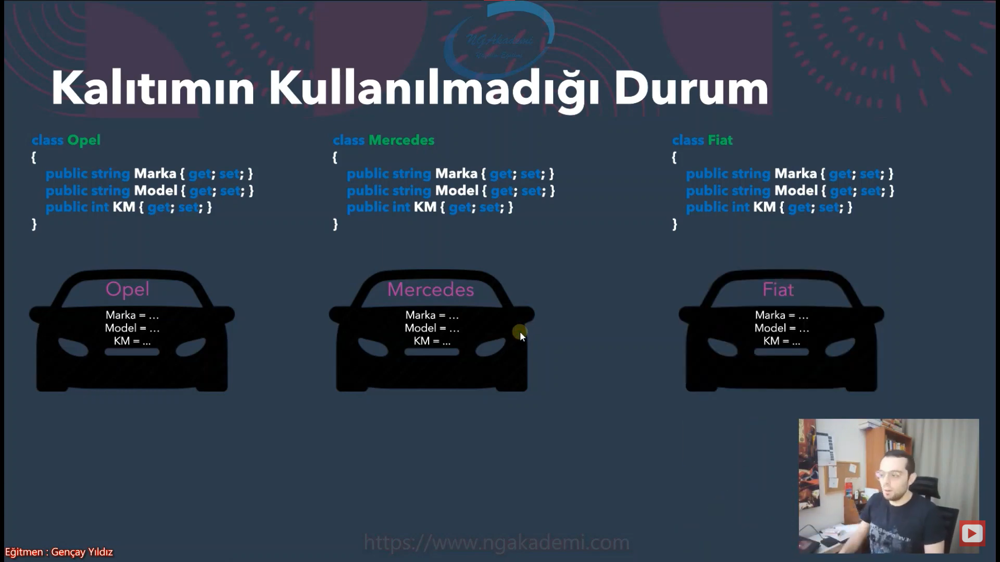
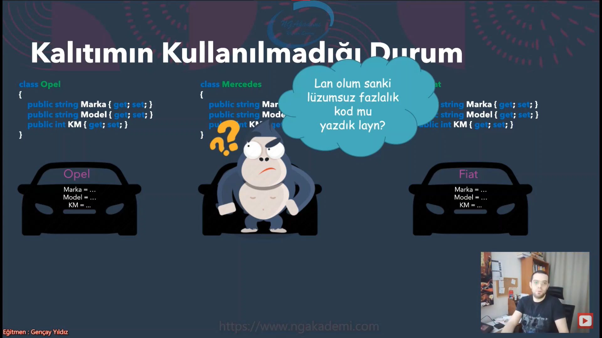

## Kalıtımın Kullanıldığı Durumu İnceleyelim
- Kalıtım lalettayin bir şekilde tasarlanmamalıdır. Ortak olguda olan nesneleri temsil edecek olan bir üst ve daha evrensel nitelikte olgu olmalıdır. Opel, Mercedes ve Fiat ortak olgudur. Yani üçüde bir arabadır. Haliyle bunların daha evrensel üst niteliği Araba olarak nitelendirilebilir.

- Kalıtım operasyonunda, kalıtım veren sınıfın erişilebilen tüm memberları kalıtım alan sınıfa kalıtsal olarak aktarılacaktır.

- Kalıtım veren sınıf neyi kalıtım vereceğini içindeki memberların erişim belirleyicisi dediğimiz keywordler sayesinde belirleyecek.

- Hem yönetilebilirliği arttı hem de kod maliyetini düşürmüş olduk.

- Polimorfizm'de kalıtımın sonucudur. Dolayısıyla kalıtım mihenk taşıdır.

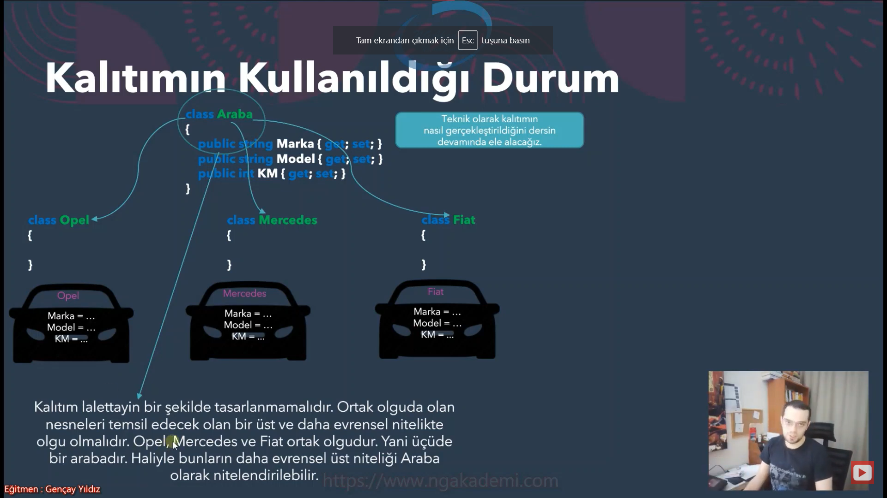
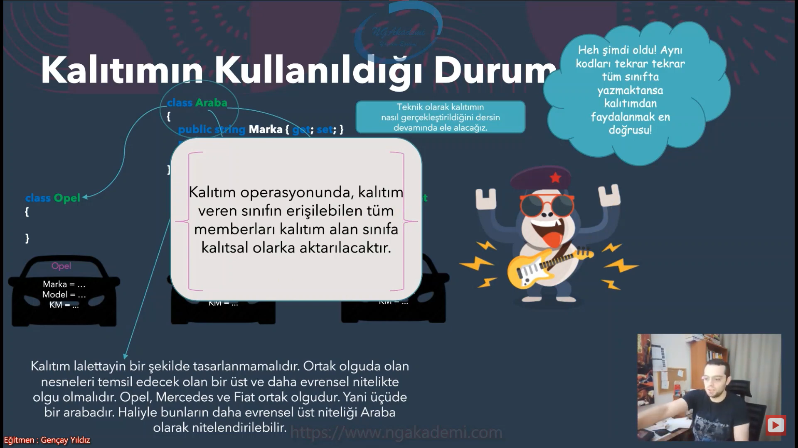

- OOP'de kalıtım özünde nesnelerin birbirlerinden türemesini sağlayan bir özelliktir.

- Bu özellik yanında da birçok özellik ve stratejik yapılanma getirmektedir.
  * Virtual
  * Polimorfizm
  * Abstraction 

- Bu eğitim sürecinde OOP'de ki kalıtımı ve kalıtımın getirisi olan tüm stratejik yapılanmaları tam teferruatlı ele alacağız!


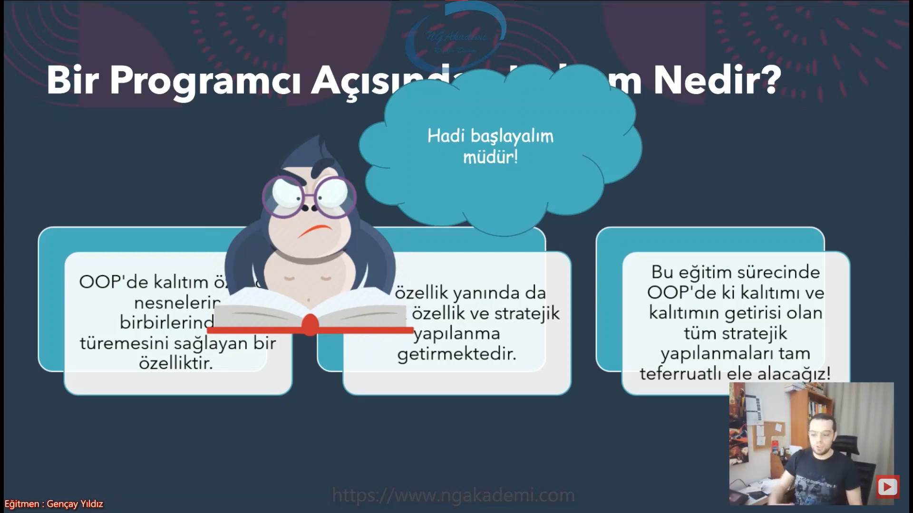

## C# Programlama Dilinde Hangi Yapılar Kalıtım Alabilirler?
- C# programlama dilinde kalıtım sınıflara özel bir niteliktir.

- Yani bir sınıf sade ve sadece bir sınıftan kalıtım alabilir.

- Evet, record'lar da kalıtım alabilmekte. Lakin sadece kendi aralarında. Kalıtım alabildikleri tek istisnai sınıf ise ileride göreceğimiz Object sınıfıdır.

- Ayrıca sonraki derslerimizde göreceğimiz abstract class, interface ve struct gibi yapılarında kendilerine göre kalıtımsal operasyonları mevcuttur. Bu yapılardaki kalıtımsal detaylar ilgili derslerde ele alınacaktır.

- Her yapılanmaya kalıtım uygulanmaz.

- `abstract class`tan ve `interface`den kalıtım almayız. Çünkü burada yapılan fiiliyat başkadır. Orada yapılanm işlem operasyon olarak aynı operatörle yapılır ama operasyon/işlem farklıdır. İmplementasyon mantığı farklı bir mantıktır.

- Bir `record`a her ne kadar fıtrat olarak `class`ta olsa gidip bir `class` üzerinden kalıtım veremiyorsun. Aynı şekilde bir `class`a `record` üzerinden de kalıtım veremiyorsun.


## C#'ta Kalıtım Nasıl Alınır? : Operatörü
- C#'ta iki sınıf arasında kalıtımsal ilişki kurabilmek için `:` operatörü kullanılmaktadır.

- Hatta bilsekte bilmesekte kalıtımsal tüm ilişkiler `:` operatörü tarafından yapılmaktadır.

- Bir sınıf başka bir sınıftan kalıtım aldığında erişime açık/kalıtıma müsait olan bütün memberlar sınıfa aktarılacaktır. Şöyle bişey beklemeyelim :) Hocam ben bu kodu yazdım ama memberlar gelmedi arkadaş öyle kodun içerisinde selena gibi gelmesini bekleme tabiki de! Bu yapmış olduğun işlem neticesinde artık bu sınıftan bir nesne oluşturduğunda direkt ilgili aktarılan miras alınan memberlara erişebileceksin. Yani bunların direkt burada fiziksel olarak görünmesini bekleme. Bu compiler seviyesinde yani arkada dijital seviyede oluyor öyle düşün.


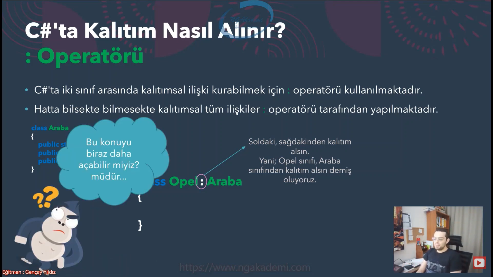

- Kalıtım operatörünün `:` solunda bir sınıf sağında ise başka bir sınıf vardır.

- `... : ...` `:` operatörü sağdaki sınıftaki tüm erişilebilir memberları, soldaki sınıfa kalıtımsal olarak aktarmaktadır.

- `:` Bu operatörü kalıtımsal operasyon olarak kullanmak istiyorsanız bir tek `class`ın modeli üzerinde kullanabilirsiniz. `class`ın tanımlanma süreci dışında başka yerde kullanamazsınız.

- Eriim belirleyicileri bir yandan da kalıtımsal durumlarda memberların davranışlarını sergilememizi sağlar.
 


- Kalıtım, operasyonel olarak gerçekleştirildikten sonra compiler seviyesinde member aktarımı sağlanır!


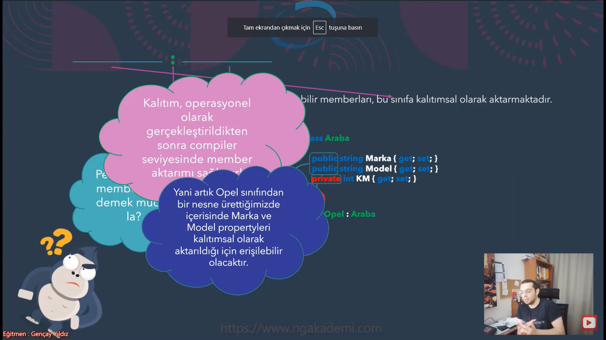

## Pratik Yapalım
- Eğer kalıtım yoksa aynı olgudaki sınıflar tekrar ederler ve bizde burada kalıtım ihtiyacı olduğunu anlarız.

```C#
#Kalıtımdan Önce
class Muhasebeci
{
    public string Adi { get; set; }
    public string Soyadi { get; set; }
    public bool MedeniHal { get; set; }
}

class Yazilimci
{
    public string Adi { get; set; }
    public string Soyadi { get; set; }
    public bool MedeniHal { get; set; }
}

class Mudur
{
    public string Adi { get; set; }
    public string Soyadi { get; set; }
    public bool MedeniHal { get; set; }
}

#Kalıtımdan Sonra
class Personel
{
    public string Adi { get; set; }
    public string Soyadi { get; set; }
    public bool MedeniHal { get; set; }
}

class Muhasebeci : Personel
{
    public bool Musavir { get; set; }
}

class Yazilimci : Personel { }

class Mudur : Personel { }
```

## C# Examples
```C#
namespace oop_sinif;

class Program
{
    static void Main(string[] args)
    {
        Muhasebeci muhasebeci = new Muhasebeci();
        Mudur mudur = new Mudur();
        Yazilimci yazilimci = new Yazilimci();
    }
}

#region Kalıtımdan Önce
// class Muhasebeci
// {
//     public string Adi { get; set; }
//     public string Soyadi { get; set; }
//     public bool MedeniHal { get; set; }
// }

// class Yazilimci
// {
//     public string Adi { get; set; }
//     public string Soyadi { get; set; }
//     public bool MedeniHal { get; set; }
// }

// class Mudur
// {
//     public string Adi { get; set; }
//     public string Soyadi { get; set; }
//     public bool MedeniHal { get; set; }
// }
#endregion
#region Kalıtımdan Sonra
class Personel
{
    public string Adi { get; set; }
    public string Soyadi { get; set; }
    public bool MedeniHal { get; set; }
}

class Muhasebeci : Personel
{
    public bool Musavir { get; set; }
}

class Yazilimci : Personel 
{ 
    public string[] KullandigiDiller { get; set; }
}

class Mudur : Personel { }
#endregion
```

***
# Nesne Tabanlı Programlama #17 - Inheritance(Kalıtım) Nedir? 2. Bölüm
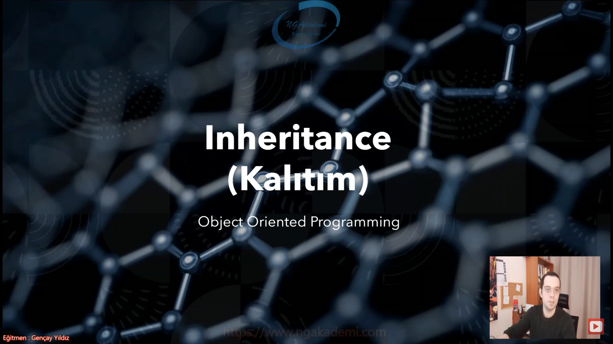

## Base Class ve Derived Class Nedir?
- Kalıtım veren sınıfa Base / Parent Class denir.

- Kalıtım alan sınıfa Derived / Child Class Denir.

- Kalıtımsal ilişkide olan iki sınıf arasında kalıtım veren sınıfa base/parent class, kalıtım alan sınıfa ise derived/child class denmektedir.


## Base Class ve Derived Class Kritik
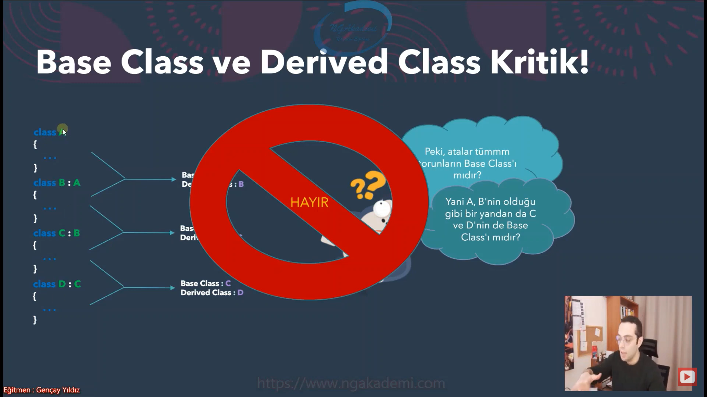

- Unutma! Bir sınfın sade ve sadece tek bir Base Class'ı olabilir!

- Yani bir sınıfın Base Class'ı direkt türediği sınıftır.

- Lakin atalarındaki tüm sınıflar Base Class'ı değildir!

- Direkt türediği sınıftır base class'ı ataları değildir. Yani benim base class'ım babamdır dedem değildir. Dedem atalarımdan birisidir amma velakin base class'ım değildir.

- Base class dediğimiz kavram direkt birebir kalıtımı aldığın sınıftır.

- Bir `class` ın birden fazla derived class'ı olabilir. 

- Benim bir tane babam vardır. Ama babamın birden fazla oğlu ya da kızı olabilir. Yani olay gerçek hayattaki kalıtımsal mantığın ta kendisidir. Sadece sen burada base class dediğimiz kavramı sadece tek bir kişiye veriyorsun. Tüm atalara değil sadece babaya veriyorsun. Sadece babamızdır bizim base class'ımız atalarımız değil.

- Bir sınıfın birden fazla derived class'ı olabilir ama bir sınıfın sadece bir tane base class'ı olur.

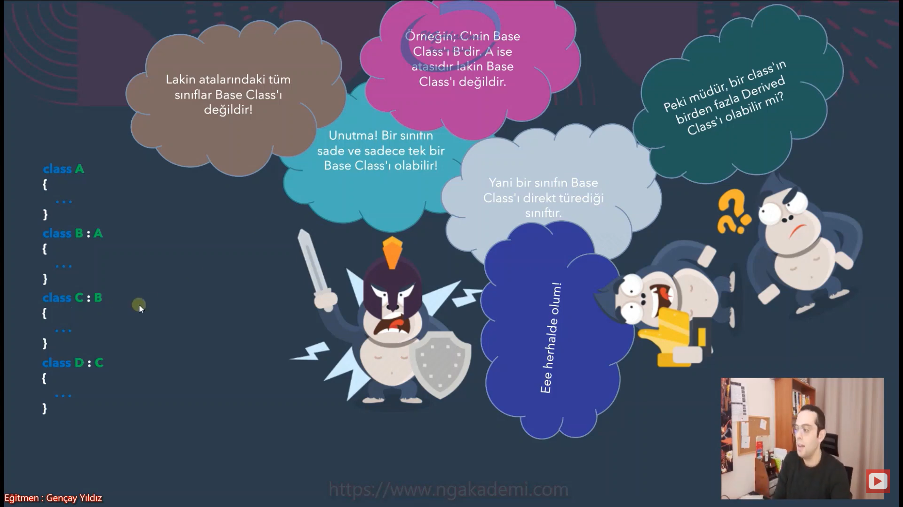

- Bir `class` hem base class hemde derived class olabilir.

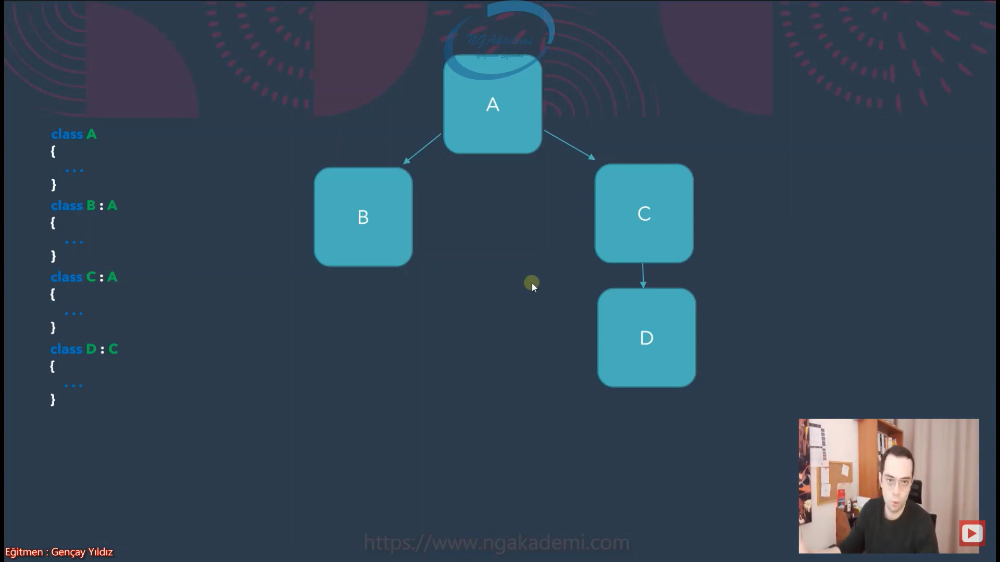

## Kalıtımın Altın Kuralı!
- Bir class'ın sade ve sadece bir Base Class'ı olur dedik. 

- Bunun nedeni, C# programlama dilinde bir class'ın sade ve sadece tek bir class'tan türetilmesine izin verilmektedir! Aynı anda birden fazla class'tan türeme işlemi gerçekleştirilemez!

- Bir sınıf fiziksel olarak sade ve sadece tek bir sınıftan türeyebilir. Aynı anda birden fazla sınıftan türeyemez. Dikey boyutta türetebilirsin sen babandan alırsın baban büyük babandan alır ama yatay boyutta türetemezsin bir sınıf hem anneden hem babadan bir kalıtım alamaz. Belirli problemlerden dolayı engellenmiştir.

- Bir sınıfın yatay düzlemde birden fazla sınıftan kalıtım alabilmesine çoklu kalıtım denir. İşte bu çoklu kalıtım yaşanan birçok problemden dolayı engellenmiştir. Dolayısıyla aynı anda birden fazla `class`tan türeme işlemi C# programlama dilinde gerçekleştirilemez! Çoklu kalıtıma izin veren dillerde vardır.

- Eğer ki mevzu bahis sınıfsa bir sınıf sade ve sadece tek bir tane sınıftan kalıtım alabilir.


```C#
public class BuyukBaba
{
    
}
public class Baba : BuyukBaba
{
    
}
public class Anne : Baba
{
    
}
public class Ogul : Anne
{
    
}
```

## Kalıtımda Nesne Üretim Sırası
- Bir sınıftan nesne üretimi yapılırken kalıtım aldığı üst sınıflar varsa eğer önce o sınıflardan SIRASIYLA nesne üretilir.

- Yazılım sen nesne üretmesende compiler seviyesinde ilgili kalıtım veren sınıftan bir nesne üretilecektir ve burada öncelikle o sınıftan nesne üretilecek ve daha sonra kalıtım alan senin sınıfından nesne üretilecek. Dolayısıyla buradaki sıralama önemli ve buradaki sıralama hiyerarşik bir şekilde olacak.

- Kalıtımsal bir ilişkin olduğu durumda sen derived class'tan nesne üretirsen bil ki RAM'in HEAP bölgesinde kaç tane hiyerarşik ata varsa o kadar nesne üretilmiş olacaktır.

- Base class'ta bulunan memberlar derived class'a aktarılır. Base class'tan gelen member'ı derived class'ta kullanırken aslında arka planda base class'ın nesnesi üzerindeki member'ı kullanmaktayız. Derived class'ın nesnesine direkt bir aktarım yoktur. 


- Sen bir tane nesne ürettiğini zannedersin halbuki arkada kaç tane kalıtımsal ata varsa her birinden nesne üretecektir.

- Bir sınıftan aktarılmış olan herhangi bir member'ı sen o sınıfta üst sınıflardan gelen bir member'ı kullanmak istiyorsan özünde arkada oluşturulan nesne üzerinden tetikleme yapacaktır.


- Yani buradan anlaşılıyor ki, bir sınıftan nesne üretilirken siz 1 adet nesne ürettiğinizi düşünsenizde kalıtımsal açıdan birden fazla nesne üretimi gerçekleştirilebilmektedir ve bu senin benim iradem de değil compiler bunu yapacaktır bu böyle çalışmaktadır.

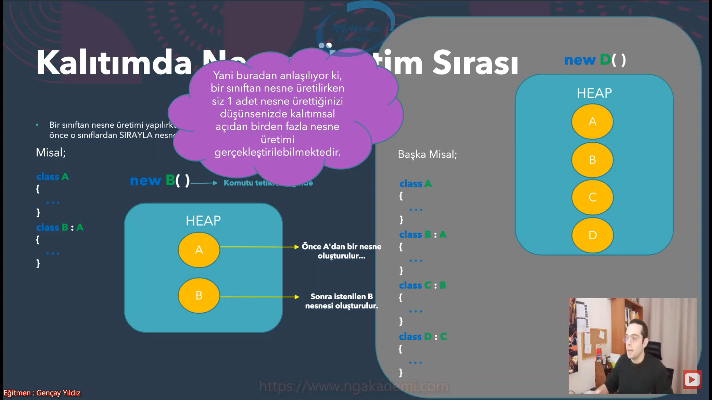

- `nameof` içerisine verilen sınıfın ismini metinsel olarak ilgili alana yazdıran/gönderen/aktaran bir keyword. 

- Siz belirli sınıfların isimlerini kod içerisinde kullanacaksanız metinsel olarak o sınıfın ismini kodun içerisine yazmak risk teşkil edecektir. Nihayetinde metinsel karakterlerde hata yapma ihtimalin var yeri gelecek sınıfı ismi değişecek yazmış olduğun metinsel alanda o sınıfın ismi öyle kalacak sana derleyici hata vermeyecek vs. Dolayısıyla `nameof` ile senin o ismi alıp yazdırman hani bir programcılık açısından daha doğru olacak.

- Ne olursa olsun compiler'da oluştursa bende oluştursam bir nesne oluşturulurken kim oluşturursa oluştursun kesinlikle constructor metot tetiklenecektir.

- Kalıtımda nesne oluşturma sırası atalardan başlar takır takır takır... ilgili talep ettiğiniz nesneden oluşturmaya kadar gelecektir. 

- Kalıtımı kullandığın operasyonlarda bil ki base class'tan ve atalardan da nesneler oluşturulacak ona göre biz yeri gelecek davranışlarımızı belirliyoruz ona göre yeri gelecek design patternlarda vs. buradaki davranışı kullanıyoruz.

```C#
public class A
{
    public A()
    {
        System.Console.WriteLine($"{nameof(A)}");
    }
}
public class B : A
{
    public B()
    {
        System.Console.WriteLine($"{nameof(B)}");
    }
}
public class C : B
{
    public C()
    {
        System.Console.WriteLine($"{nameof(C)}");
    }
}
public class D : C
{
    public D()
    {
        System.Console.WriteLine($"{nameof(D)}");
    }
}
```

## Bir Sınıftan Base Class Constructor'ına Ulaşım
- Madem ki, herhangi bir sınıftan nesne üretimi gerçekleştirilirken öncelikle base class'ından nesne üretiliyor, bu demektir ki önce base class'ın constructor'ı tetikleniyor.

- Haliyle bizler nesne üretimi esnasında base class'ta üretilecek olan nesnenin istediğimiz constructor'larını tetikleyebilmeli yahut varsa parametre bu değerleri verebilmeliyiz.

- İşte bunun için `base` Keyword'ü nü kullanmaktayız.

- `base` keyword'ü base class'a erişip base'le ilgili işlemler yapmanı sağlıyor.

- `base` keyword'ünün iki tane amacı vardır;
    1. base class'ın constructorlarına erişebilmemizi sağlayan bir niteliğidir.
    
    2. base class'ın o anki nesnesine erişip üzerindeki erişilebilir memberlara erişmemizi ve kullanmamızı sağlar. `this` keywordüne benzemektedir.

- Kalıtımsal bir ilişki var derived class'tan önce base class'ın nesnesi üretilecek ama ya base class'ın birden fazla constructor'ı varsa şimdi derived class'tan nesne üretilirken base class'taki hangi constructor'ın tetiklenmesini istiyorsan onu derived class üzerinden belirleyebilmeliyim. İşte bunu yapmanı sağlayacak olan keyword `base` keywordüdür.


- Bir sınıfta sen tanımlamasan default constructor vardır.

- Eğer ki base class'ın constructor'ı parametre alıyorsa derived class bu parametreyi base class'a yollamalıdır. Yoksa hata alınır. Çünkü derived class base class'ın parametresine ne verecek bilemez.

- Eğer ki base class'ın constructor'ı sadece parametre alan constructor ise derived class'larda o constructor'a bir değer GÖNDERMEK ZORUNDAYIZ. Bunuda `base` keywordüyle saplayabiliriz...

- Madem ki base class'tan bir nesne üretilecek onun constructor'ının parametresi var ne vereceğini compiler bilemez onun için seni/developer'ı zorlar. Der ki derived class'tan birgün nesne oluşturulursa bu derived class'ın constructor'ından base class'ın constructor'ına bir değer gönder ki ben onu baz alayım.

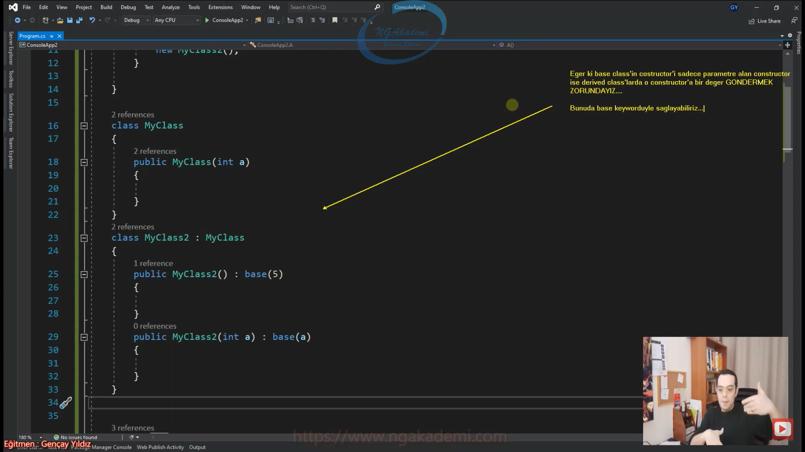

- Eğer ki base class'ta boş parametreli bir constructor varsa derived class'ta `base` ile bir bildirimde bulunmak zorunda değiliz.... Niçin? Çünkü varsayılan olarak kalıtımsal durumda base class'taki boş parametreli constructor tetiklenir

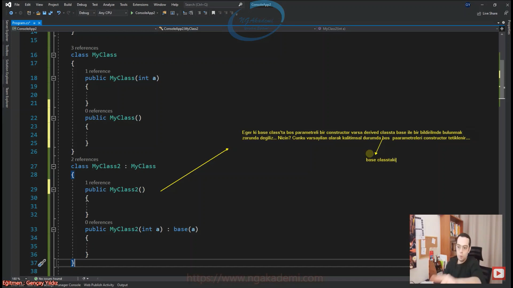

- Base class'ımızda birden fazla constructor olduğu durumda derived class'ta `base` keywordüyle istediğimiz constructor'ını tetikleyebiliriz.

- Bir class'ın constructor'ının yanında `: base(...)` keywordünü kullanırsak eğer o class'ın base class'ının tüm constructor'larını bize getirecektir. Haliyle ilgili sınıftan bir nesne üretilirken base class'tan nesne üretimi esnasında hangi constructor'ın tetikleneceğini bu şekilde belirleyebiliriz...


```C#
public class MyClass
{
    public MyClass(int a)
    {

    }
    public MyClass(string a)
    {

    }
    public MyClass(int a, string b)
    {

    }
    public MyClass()
    {

    }
}
public class MyClass2 : MyClass
{
    public MyClass2() : base(5, "afsafsafafasd")
    {

    }
    public MyClass2(int a) : base(a)
    {

    }
}
```

## base Keyword vs this Keyword
- `this`, bir sınıftaki constructor'lar arasında geçiş yapmamızı sağlar.

- `base`, bir sınıfın base class'ının constructor'larından hangisinin tetikleneceğini belirlememizi ve varsa parametrelerinin değerlerinin derived class'tan verilmesini sağlar.

- `this`i kullanıyorsam buradaki constructor'lar `base`i kullanıyorsam bir üst sınıftaki/base sınıftaki constructorlara erişebiliyorum.

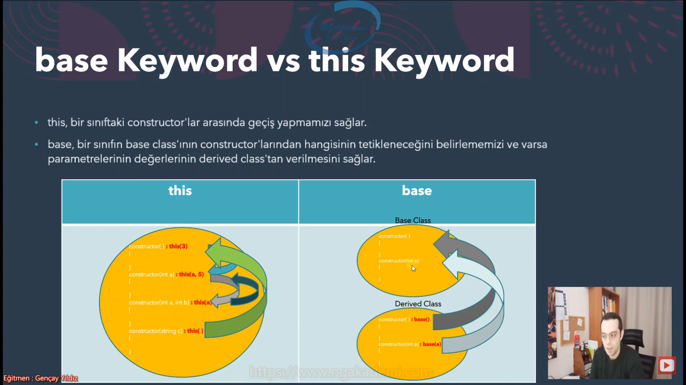

- Ayrıca nasıl ki this, ilgili sınıfta o anki nesnenin memberlarına erişebilmemizi sağlıyor, aynı şekilde base'de base class'da ki memberlara erişebilmemizi sağlamaktadır.

- Base Class'da erişilebilir olmayan member'lar base keywordüyle erişilemez!

- Base class'ta erişilebilir olmayanlar kalıtımsal olarak aktarılmaz. `private` olan bir member base class'tan derived class'a aktarılmayacağından dolayı `base` keywordü üzerinden erişilmeyecektir.

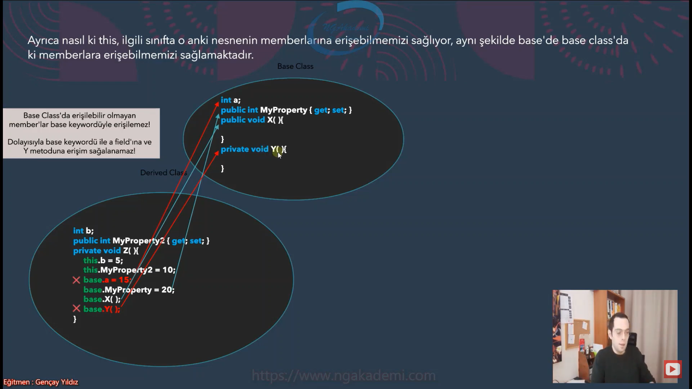

- Eğer ki derived class'tan direkt olarak/hiçbir keyword kullanmadan base class'taki bir member'a erişirsem compiler seviyesinde `base` keywordü eklenecektir.

- Base class'tan aktarılan nesneler o anki derived class'ta `this` keywordü üzerinden de erişilebilir.

- `this` keywordü ilgili sınıfın o anki nesnesi üzerindeki erişilebilir tüm memberları getirecektir. Aynı zamanda kalıtımsal olarak aktarılan memberlara da `this` keywordü üzerinden erişilebilir. 

- `base` keywordü ise sade ve sadece base class'ın memberlarını getirecektir.

## C# Examples
```C#
namespace inheritance;
class Program
{
    static void Main(string[] args)
    {
        new D();
        new MyClass2();
    }
}
// public class BuyukBaba
// {

// }
// public class Baba : BuyukBaba
// {

// }
// public class Anne : Baba
// {

// }
// public class Ogul : Anne
// {

// }
// public class A
// {
//     public A()
//     {
//         System.Console.WriteLine($"{nameof(A)} nesnesi oluşturulmuştur.");
//     }
// }
// public class B : A
// {
//     public B()
//     {
//         System.Console.WriteLine($"{nameof(B)} nesnesi oluşturulmuştur.");
//     }
// }
// public class C : B
// {
//     public C()
//     {
//         System.Console.WriteLine($"{nameof(C)} nesnesi oluşturulmuştur.");
//     }
// }
// public class D : C
// {
//     public D()
//     {
//         System.Console.WriteLine($"{nameof(D)} nesnesi oluşturulmuştur.");
//     }
// }

public class MyClass
{
    public MyClass(int a)
    {

    }
    public MyClass(string a)
    {

    }
    public MyClass(int a, string b)
    {

    }
    public MyClass()
    {

    }
}
public class MyClass2 : MyClass
{
    public MyClass2() : base(5, "afsafsafafasd")
    {

    }
    public MyClass2(int a) : base(a)
    {

    }
}

public class A
{
    int a;
    public int b;
    public int MyProperty { get; set; }
}
public class B : A
{
    int c;
    public void X()
    {
        MyProperty = 123;
    }
}
```

***
# Nesne Tabanlı Programlama #18 - Inheritance(Kalıtım) Nedir? 3. Bölüm
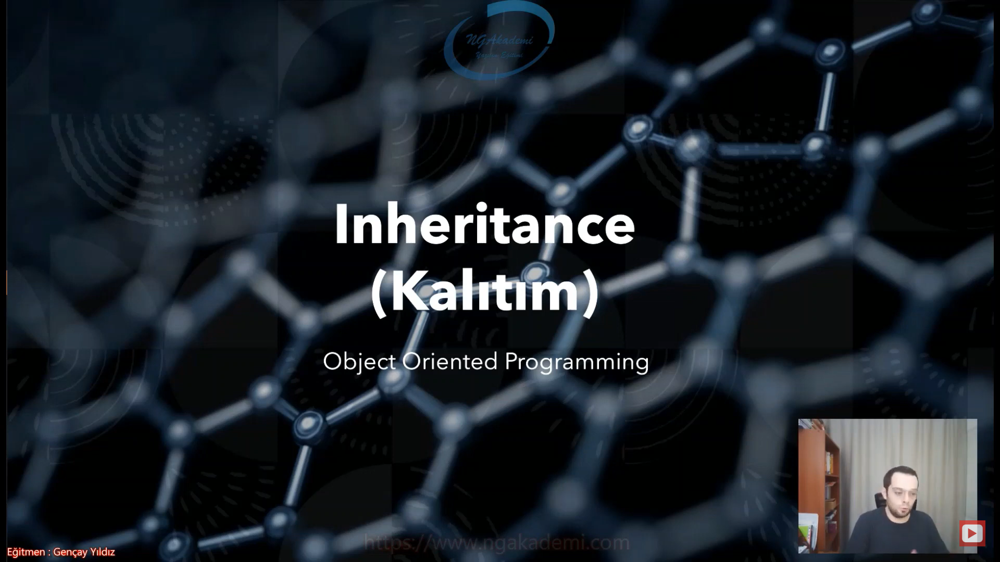

## Bir Nesnedeki ToString, Equals, GetHashCode ve GetType Metotları Nereden Gelmektedir?
- Bu metotlar kalıtımsal bir işlem neticesinde gelmektedir.


## Nesnelerin Atası/Ademi Object Sınıfı/Türü
- C# programlama dilinde tüm sınıflar istisnasız Object sınıfından türemektedir.

- C# programlama dilinde tüm sınıfların atası olan bir sınıf vardır. Biz bu sınıfa direkt Object türü demekteyiz.

- Şimdilik istisnasız çünkü biz ileride ileri düzey programlamada `delegate` dediğimiz yapılanmaları göreceğiz. `delegate`'lerde özünde bir nesnedir/objedir. Amma velakin onlar `Object` sınıfından türemezler. 

- Sen bir sınıfı oluşturduğunda bir sınıftan türese de türemese de bu sınıf `Object` sınıfından türeyecektir. Bir başka sınıftan türüyorsa o sınıftan türemiş olacak o sınıfta `Object`ten türeyeceği için dolaylı yoldan `Object`ten türemiş olacaktır.

- Sen bir sınıf oluşturduğunda compiler seviyesinde o sınıf otomatik olarak default olarak `Object` türetilecektir. Haliyle `Object` sınıfının içerisindeki kalıtımsal olarak aktarılabilecek bazı metotlar bazı memberlar ilgili sınıfa aktarılmış olacaktır.

- C# programlama dilinde herhangi bir sınıf oluşturdun oluşturur oluşturmaz bu sınıfın `Object`ten türediğini biliyorsun.

- `Object` sınıfı C# programlama dilinde atadır/ademdir.

- `object` herşeyi kapsayan bütün değerleri kapsayabilen bir özellik olmasının altında yatan sebep tüm değerlerin `Object`ten türemesidir.

- `Object`ten bütün nesnelerin türemesinden dolayı `object` bütün değerleri karşılayabilimektedir. Haliyle bütün değerleri karşılayabildiğinden dolayı temel C# programlamadaki boxing unboxing kavramına değindiğimiz `object` türü işte buradaki tüm değerlerin bundan türemesinden gelmektedir. 

- Bir sınıf kalıtım almasa da default olarak `Object` sınıfından türetilir.

- Eğer ki tanımlanan sınıf herhangi bir kalıtım almıyorsa default olarak `Object` sınıfından türetilecektir.

- Yok eğer herhangi bir sınıftan kalıtım alıyorsa, bir sınıfın aynı anda birden fazla sınıftan kalıtım alamama prensibinden yola çıkarak biryandan da Object sınıfından türemeyecek sadece kalıtım altığı sınıftan türeyecektir.

- Tabi burada kalıtım veren sınıf herhangi bir sınıftan türemiyorsa eğer enn nihayetinde Object'ten türeyeceği için dolaylı yoldan Insan sınıfı da Object'ten kalıtım almış olacaktır.

- Bir sınıf birden fazla sınıftan aynı anda türetilemeyeceğinden dolayı herhangi bir sınıftan türediği anda `Object`ten türemeyecektir. Ama o türediği sınıf yine `Object`'ten türeyeceği için dolaylı yoldan yine `Object`ten türemiş olacaktır. Yani `Object` atası olacaktır.

- Elinde hiyerarşik bir şekilde birbirlerinden türeyen sınıfların olduğunu düşün işte bu sınıflardan en baştaki ata hangisi ise bil ki o da `Object`ten türeyecektir. Haliyle bu hiyerarşik kalıtımsal yapılanmadaki bütün sınıflar dolaylı yoldan bir `Object` sınıfı olmuş olacaktır.


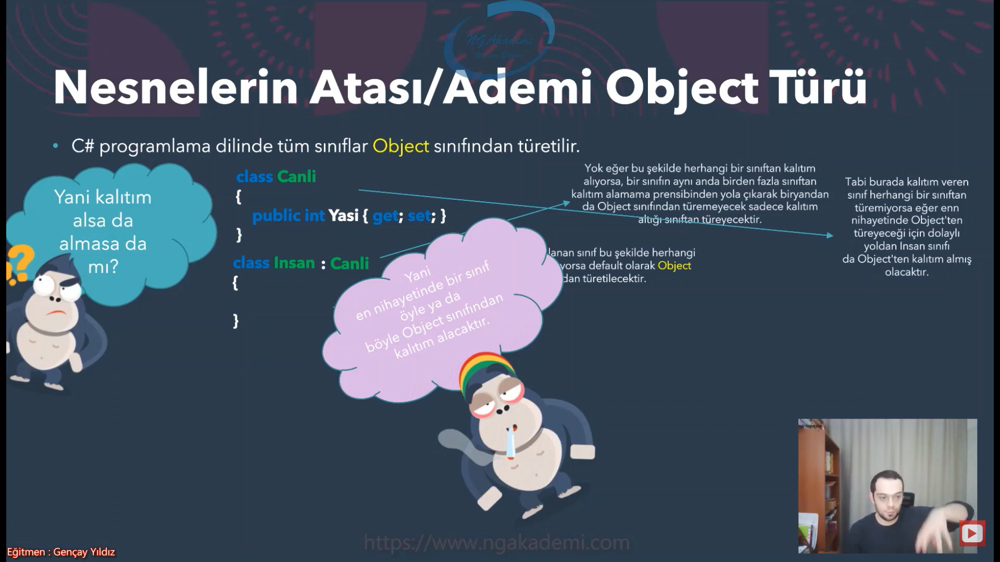
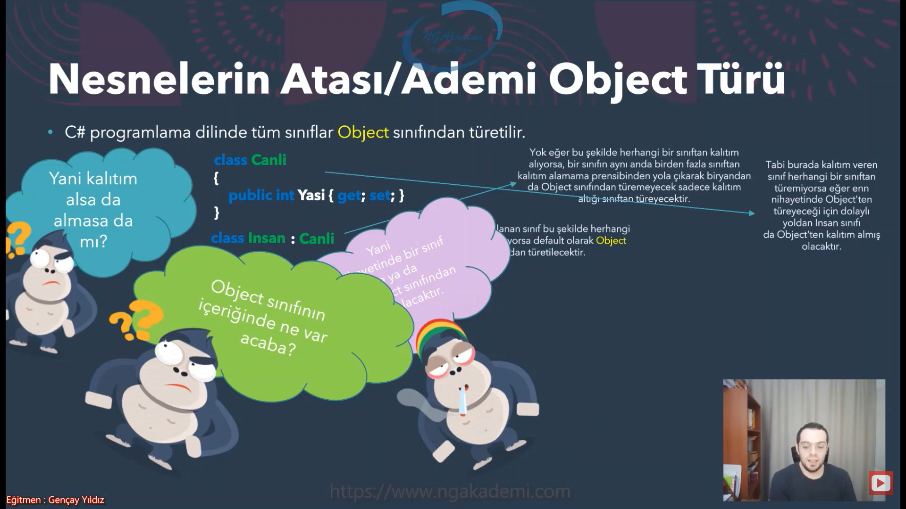

## Object Sınıfı Memberları
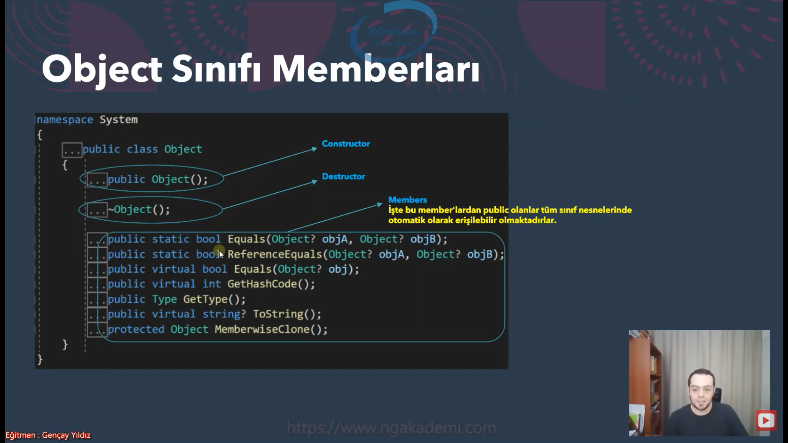

- Bir sınıftan bir nesne üretirsen bil ki ilk baş `Object`ten bir nesne üretecektir.

## İsim Saklama(Name Hiding) Sorunsalı
- Kalıtım durumlarında atalardakiherhangi bir member ile aynı isimde member'a sahip olan nesneler olabilmektedir.

- Hem base class'ta hem de derived class'ta aynı isimde member mevcutsa biz buradaki member'ın hangisinden geldiğini bilemeyiz işte bilememe durumuna name hiding(isim saklama) diyoruz.

- Ata sınıflardaki herhangi bir memberla bir sınıftaki bir member aynı isme sahipse biz bu duruma name hiding diyoruz.

- Atalardan gelecek olan member bu şekilde gizlemiş oluyorsun. Name hiding yapmış oluyorsun isim saklanmış oluyor.

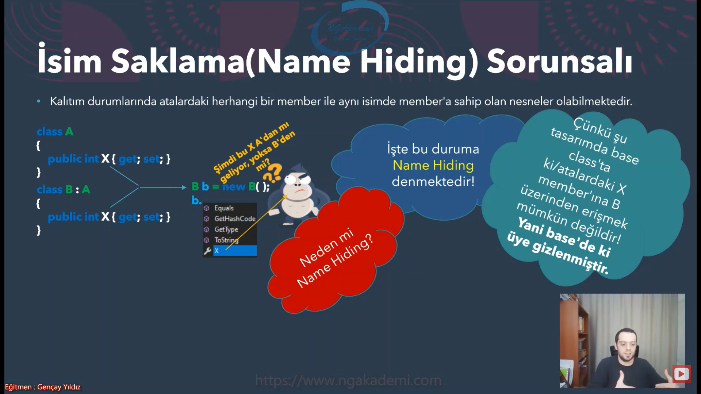

- Bu durumda derleyici bir hata vermez!

- Fakat bir warning/uyarı verecektir.


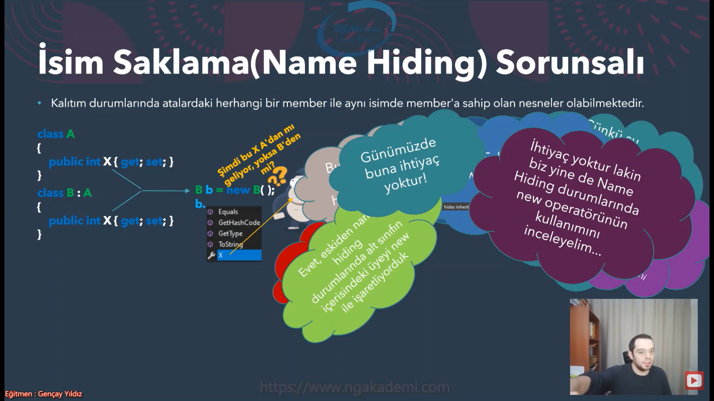

## Name Hiding Durumlarında new Operatörünün Kullanımı
- Eskiden name hiding söz konusu olsaydı derived class'larda/torunlarda bu member'ı `new` keywordüyle işaretlememiz gerekiyordu. Eskiden derleyiciye bildirmemiz gerekecekti. Atalardan gelen bu ismi ben torunlarda name hiding olacak şekilde tekrardan eziyorum bunu bil ve ben bunu bilinçli bir şekilde yapıyorum demenin yoluydu `new` keywordü. Günümüzde biz bunu yapmak zorunda değiliz.

- Atalardaki varolan memberla aynı isimde torunlarda bir member görüyorsanız biz buna direkt name hiding diyoruz.

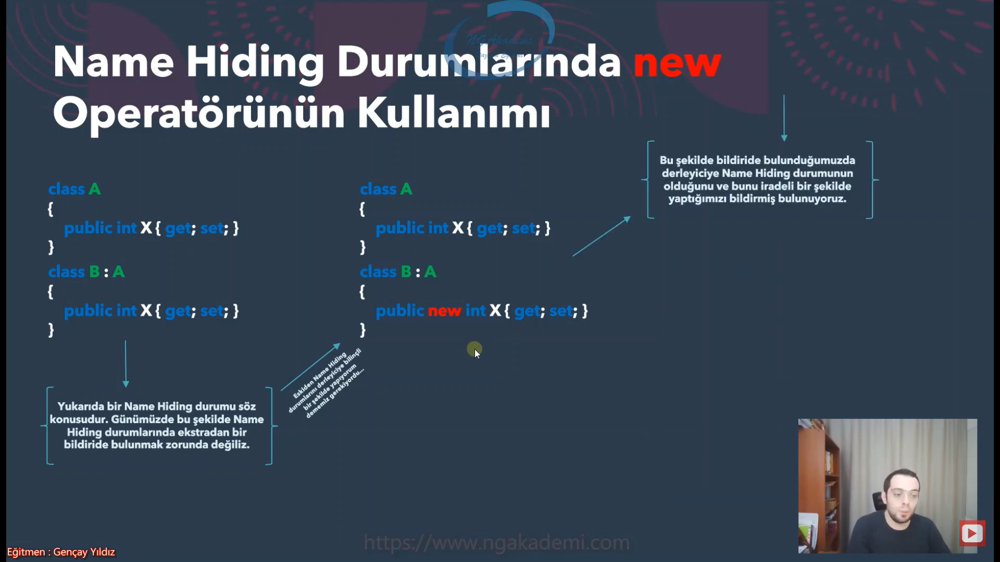


```C#
public class A
{
    public void X()
    {

    }
}
public class B : A
{

}
public class C : B
{

}
public class D : C
{
    public new int X()
    {
        return 0;
    }
}
```

## Record'lar da Kalıtım?
- Record'lar sade ve sadece Record'lar dan kalıtım alabilmektedirler.

- Class'lar dan kalıtım alamazlar yahut veremezler!

- Kalıtımın tüm temel kuralları record'lar için geçerlidir;
    * Bir record aynı anda birden fazla record'dan kalıtım alamaz!
    * Record'lar da temelde class oldukları için üretilir üretilmez otomatik olarak `Object`'ten türerler.
    * `base` ve `this` keywordleri aynı amaçla kullanılabilmektedir.
    * Name Hiding söz konusu olabilmektedir.
    * Ve aklıma gelmeyen diğer tüm durumlar da record'lar için geçerlidir.

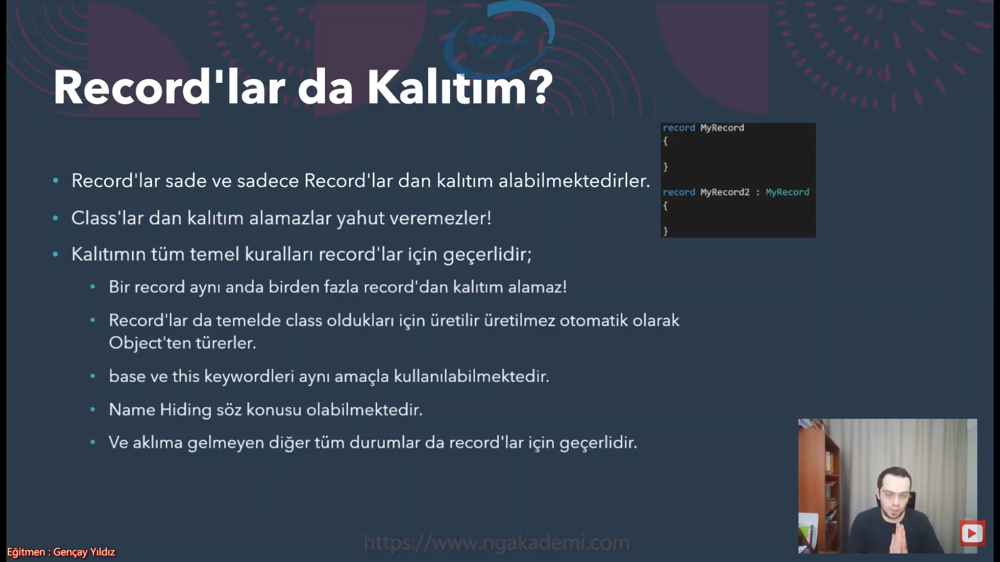

## C# Examples
```C#
using System;
namespace inheritance;
class Program
{
    static void Main(string[] args)
    {
        MyClass m = new MyClass();

    }
}
public class MyClass
{

}
public class A
{
    public void X()
    {

    }
}
public class B : A
{

}
public class C : B
{

}
public class D : C
{
    public new int X()
    {
        return 0;
    }
}
```
