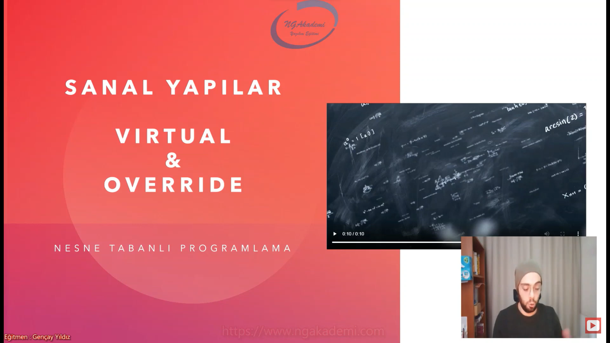
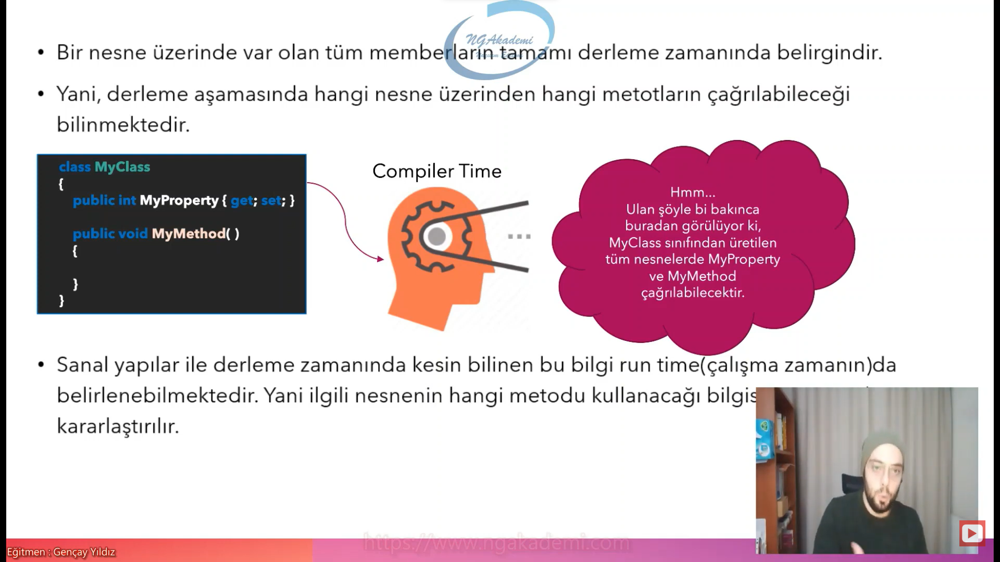
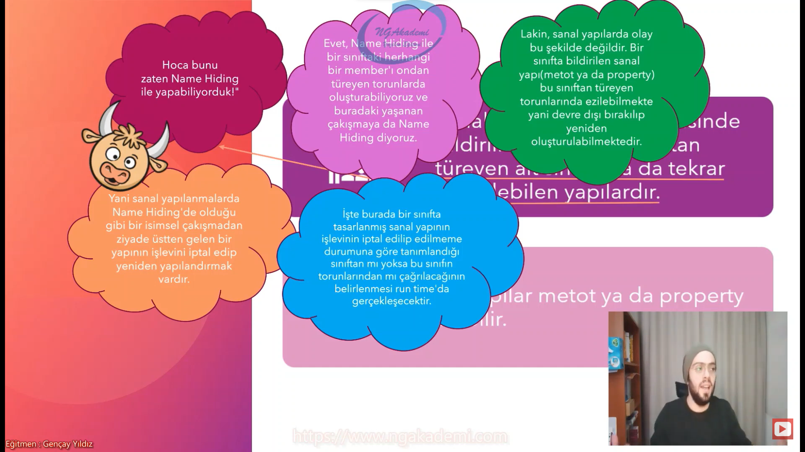
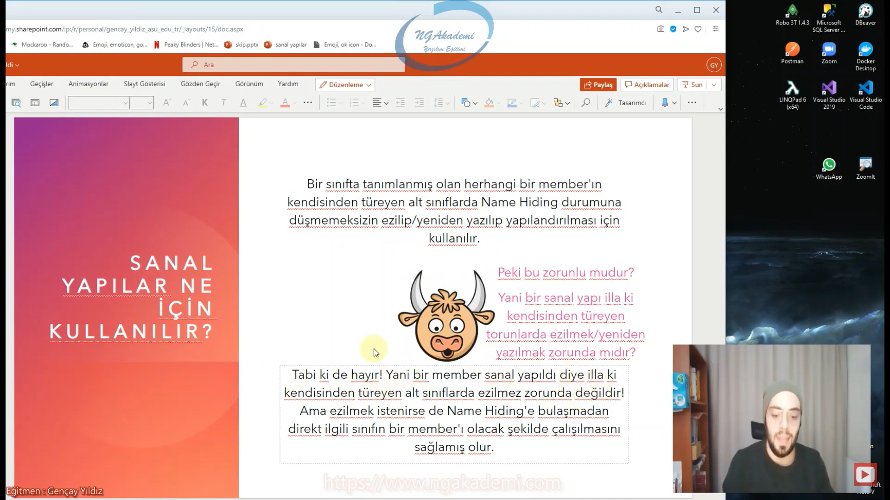
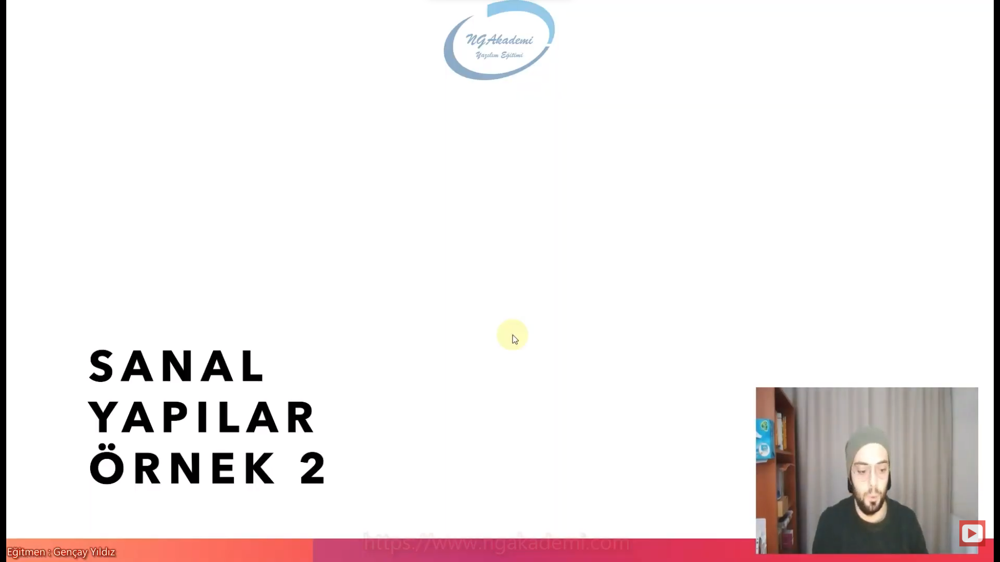
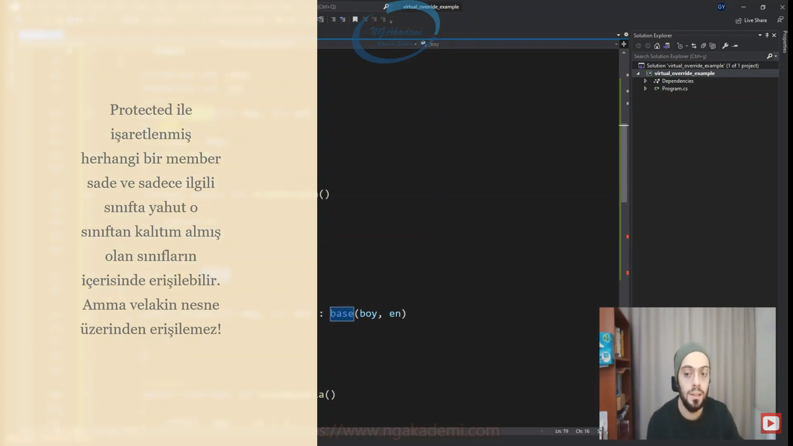

***
# Nesne Tabanlı Programlama #19 - Sanal Yapılar | virtual - override


- Bir nesne üzerinde var olan tüm memberların tamamı derleme zamanında belirgindir.

- Yani, derleme aşamasında hangi nesne üzerinden hangi metotların çağrılabileceği bilinmektedir.

- Sanal yapılar ile derleme zamanında kesin bilinenbu bilgi run time(çalışmazamanın)da belirlenebilmektedir. Yani ilgili nesnenin hangi metodu kullanacağı bilgisi run time'da kararlaştırılır.

- Elimizde bir tane sınıf olduğunu düşünelim bu sınıfın içinde bir tane property bir tane metot aklına ne geliyorsa koyduğunu düşün. Şimdi bu sınıftan bir nesne üreteceğim zaman bu sınıfın içerisinde hangi property'lerin metotların olacağını bilirim. Biz buna normal şartlarda derleme zamanında da belirginlik durumu diyoruz.

- Şu ana kadar bildiğimiz bir sınıf tasarımının içinde varolan memberlar neyse o sınıftan nesne üretirken o nesnenin içinde neler olabileceğini derleme zamanında bilebiliyoruz. 

- Bir member'ın bir sınıfın/nesnenin içerisinde olup olmayacağını runtime'da/çalışma zamanında belirlemek istiyorsan bunu biz sanal yapılanmalar sayesinde sağlıyoruz.




## Sanal Yapılar Nedir?
- Sanal yapılar bir sınıf içerisinde bildirilmiş olab ve o sınıftan türeyen alt sınıflarda da tekrar bildirilebilen yapılardır.

- Bu yapılar metot ya da property olabilir.

- Sanal dediğimiz yapı bir sınıf içinde bir member'dır ve bu sınıftan türeyen bir başka sınıfta tekrardan da bildirilebilir. İşte türeyende ya da türetilen sınıfta bildirilebildiği için derleme zamanında hangisinde olduğunu bilemeyeceğiz biz bunun işte runtime'da bunun farkına varılacak ondan dolayı sanal yapılanmalar deniliyor.

- Name hiding base class'ta tanımlanmış olan bir member'ın kendisinden türeyen sınıfların herhangi birinde tekrardan aynı isimle tanımlanmasıdır. Ama sanal yapılanmalar base class'ta tanımlanmış olan sanal yapılanmanın kendisinden türeyen soyundan gelen herhangi bir class'ta tekrar bildirilebilmesidir. Burada bir isim çakışması yok. Buradaki bildirme base class'taki bildirmeyi ezer.


- Evet, Name Hiding ile bir sınıftaki herhangi bir member'ı ondan türeyen torunlarda oluşturabiliyoruz ve buradaki yaşanan çakışmaya da Name Hiding diyoruz.

- Lakin, sanal yapılarda olay bu şekilde değildir. Bir sınıfta bildirilen sanal yapı(metot ya da property) bu sınıftan türeyen torunlarında ezilebilmekte yani devre dışı bırakılıp yeniden oluşturulabilmektedir.

- Yani sanal yapılanmalarda Name Hiding'de olduğu gibi bir isimsel çakışmadan ziyade üstten gelen bir yapının işlevini iptal edip yeniden yapılandırmak vardır.

- İşte burada bir sınıfta tasarlanmış sanal yapının işlevinin iptal edilip edilmeme durumuna göre tanımlandığı sınıftan mı yoksa bu sınıfın torunlarından mı çağrılacağının belirlenmesi run time'da gerçekleşecektir.

- Name Hiding durumunda varolan bir member aynı isimde kendisinden türeyen farklı bir sınıfta aynı isimde aynı imzada tanımlanıyorsa bu name hiding amma velakin sen varolan bir member'ı kendisinden türeyen herhangi bir sınıfta ezip içeriğini yeniden oluşturmak varolan algoritmasını varolan işlevselliğini davranışını yeniden şekillendirmek istiyorsan biz buna sanal yapılanma diyoruz. Çünkü biz buradaki yapılanmayı yani varolan yapılanmayı atalardan gelen bir özelliğin davranışını torunlarda herhangi bir noktada değiştirmek istiyorsak ondan sonra bu şekilde davranış sergilemesini istiyorsak biz bunu sanal yapılanmalarla sağlıyoruz.

- Name Hiding isim çakışmasıdır. Yani atalarda varolan aynı isimdeki member torunların herhaangi birinde de vardır. İkisininde davranışı farklı olabilir. Yani bu şu demek değildir. Torunlarda varolan member atalardaki member'ı eziyor ya da yeniden düzenliyor anlamına gelmiyor. Burada bir isim çakışması var.
 
- Atalardaki herhangi bir member'ın içeriğinin/algoritmasının/davranışının bilinçli bir şekilde torunlarda değiştirilmesi operasyonu sanal yapılanmalarla sağlıyoruz. Atalardaki bu özellik devre dışı bırakılıyor yani bir isim çakışmasından ziyade bir isim gizlenmesinden ziyade atadaki herhangi bir özelliğin bilinçli bir şekilde belirli bir torunda değiştirilmesi ve ondan sonra o değişiklikle devam etmesini sağlamak istiyorsanız sanal yapıları kullanmanız gerekiyor.

- Base class'ta bir member var torunlarda burada hiyerarşik olarak herhangi bir derecedeki torun olabilir önemli değil yani direkt derived class'ı da olabilir onun torunları da olabilir. Bunlardan herhangi birinde base class'taki yani atalardaki herhangi bir member eğer sanalsa bu sanal yapı bu atadan mı gelecek yoksa torunlardan herhangi birinden mi gelecek oradan mı çağıralacak nerden çağırılacağı derleme aşamasında bilinmez. Çünkü sanaldır. Derleme aşamasında sanal tanımlanmış bir member eğer ki kullanıldığı sınıfın nesnesinden mi gelecek yoksa bu member bu sınıfın torunlarının herhangi birinin nesnesinden mi gelecek oradan mı ya da buradan mı erişilebilecek işte bunun kararını derleme veremiyor Diyor ki ben bunun kararını versem versem runtime'da verebilirim. İşte sanal yapılanmalar ondan dolayı işte bu durumdan dolayı runtime'da belirlenebilen yapılanmalardır.



## Sanal Yapıları Gözlemleyelim
- member'lar sanal olmadığı durumda derleme zamanı hangi nesneden çağrılabilecekleri bilinmektedir.

Lakin member sanal olduğu için kendisinden miras alan torunlarında ezilip ezilmeme/iptal edilip yeniden yazılma durumuna göre ya Base class Objectin'ten çağrılacaktır ya da Derived class Object'tinden çağrılacaktır. İşte bu davranışın kararı ancak Run Time'da anlaşılacağı için Run Time'da verilmektedir!

- Eğer ki sanal member ezilmezse iptal edilmezse derived class'ın objectine miras edilecek lakin tanımlandığı base class'ın objectinden çağırılacaktır. 

- Yok eğer ezilir/iptal edilir ve yeniden yazılırsa artık bu işlemin yapıldığı torununun bir member'ı olacaktır/fiziksel bir member olacak/miras alınmayacak/orada yeniden ezilmiş yeniden tasarlanmış yeniden davranışı şekillendirilmiş olacak dolayısıyla derived class objectinden çağırılacaktır. 

- Elimizde 2 tane object'imiz olsun bu objectlerin içind 3 tane member var ve bu member'lardan bir tanesi sanal bir member. Bu object'lerden birbirinden kalıtım almaktadır. Yani birisi derived birisi base class nesnesi. Bu kalıtım durumunda base class'tan derived class'a kalıtım verdiğimiz durumda normal olan memberlar sanal olmadığı için derleme zamanında hangi nesneden çağırabilecekleri bilinmektedir.

- Base class'tan derived class nesnesine bütün memberlar kalıtımsal olarak aktarılmıştır. Şimdi buradaki aktarılan memberların ister base class'tan çağır ister derived class'tan çağır derleme aşamasında bu memberların nereden geleceği biliniyor. Derived class'ta bir memberı çağırdığın zaman bu member özünde base class'tan geldiğini biliyoruz. Yani derived class'tan bir nesne oluşturduğumda arka planda base class'tan da bir nesne oluşturuluyordu haliyle base class'taki memberlar derived class'tan erişilebilir olsada işte derived class'taki o memberlar base class'tan gelenleri çağırdığın zaman üretilen o base class'ın nesnesinde memberı tetikliyor. Dolayısıyla bu derleme zamanında hangi nesneden geleceği biliniyor.

- Eğer ki base class'tan gelen sanal member ezilmeden direkt derived class'a kalıtımsal olarak aktarılıyorsa bu şimdi sanal olduğu için derleyici bilemez runtime'da Base class'tan çağırılacağı bilinir. Yok eğer base class'taki bir sanal member derived class'ta eziliyorsa/iptal edilip yeniden yazılıyorsa runtime'da bunun derived class'tan geleceği kararlaştırılır. Çünkü artık ezilmiştir artık atalardaki gelen bu özellik iptal edilip burada yeniden bir anlam kazanmıştır. Haliyle bundan sonra artık nereden çağıralacağının kararı runtime'da verilecektir. 
 


- Sanal yapılarda çağrılan member'ın hangi türe ait olduğu Run Time'da belirlenir...

- Vee unutma! Metot ya da property farketmez! Bir sanal member'ın hangi türe ait olduğunun bu şekilde runtime'da belirlenmesine Geç Bağlama(Late Binding) denir!

- Eğer ki bir sınıfın içerisindeki herhangi bir member sanal membersa bunun o sınıftan mı yoksa o sınıftan türeyen herhangi bir sınıfın nesnesinden mi gelip gelmeyeceğinin kararı runtime'da verilir. 

- Bir memberın sanal olmasının anahtar noktası burasıdır. Runtime'da belirleniyor.


## Sanal Yapılar Ne İçin Kullanılır?
- Bir sınıfta tanımlanmış olan herhangi bir member'ın kendisinden türeyen alt sınıflarda Name Hiding durumuna düşmemeksizin ezilip/yeniden yazılıp yapılandırılması için kullanılır.

- Peki bu zorunlu mudur? Yani bir sanal yapı illa ki kendisinden türeyen torunlarda ezilmek/yeniden yazılmak zorunda mıdır?
    * Tabi ki de hayır! Yani bir member sanal yapıldı diye illa ki  kendisinden türeyen alt sınıflarda ezilmez zorunda değildir! Ama ezilmek istenirse de Name Hiding'e bulaşmadan direkt ilgili sınıfın bir member'ı olacak şekilde çalışılmasını sağlamış olur.

- Diyelim ki benim babamın bir huyu var çok sinirli/asabi bir adam. Biliyorsunuz bizim atalardan gelen bir sinir hastalığı var. Dolayısıyla bu miras bize geliyor geliyor geliyor... Ben atalardan gelen bu sinir hastalığı özelliğini/metodu/davranışı ben kendimde eziyorum diyorum ki ben artık sinir hastası olmayacağım mutlu mesut böyle hümanist bir insan olacağım diyorum. Bunu diyorsam eğer ben bu atalardan gelen bu member'ı burada ezmiş/iptal etmiş yeniden yazmış oluyorum. Babamlardan ta dedemlerden gelen bu özellik artık bende bambaşka bir davranış olarak sergileniyor. Bak bu kalıtımdan da öte bişey. Kalıtımsal olarak gelen bu niteliği ben alıp devam ettirebilirdim bu kalıtımdı ama kalıtımsal olarak gelecek olan bu niteliği ben kendimde değiştiriyorsam işte bu değişiklik hakkını bana veren özellik o member'ın/gelen özelliğin/o niteliğin sanal olması. Sanal ki ben burada ezebiliyorum. Sanal olmasaydı ezemezdim bende sinir hastası olarak devam ederdim.

- OOP ile ilgili bir tasarım yapıyorsun yapmış olduğun tasarımda bir sınıftaki herhangi bir member kendisinden sonra türeyecek olan diğer sınıflarda ihtiyaç doğrultusunda ezilmesi, davranışının/algoritmasının/içeriğinin/yapısının değiştirilmesi gerektiği durumlarda değiştirilebilir olmasını istiyorsanız bu member'ın sanal olması gerekiyor. 

- Benim atalarımdan gelen sinir hastalığı/niteliği illa ki bende sanal olsa dahi ezilmek zorunda değil. Amma velakin ben bunu sanalsa ezebilirim. Ezmek zorunda değilim. yani sanal olan memberlar normal member'dır. Artı olarak ezilebilen/override edilebilen/değiştirilebilen/konunlarda farklı olarak nitelendirilebilen memberlardır. Normal bir memberdan da aman aman bir farkı yoktur.

- Eğer ki sen atalardan gelecek olan sinir hastalığı rahatsızlığını ezmek istiyorsan o atalardaki bu özelliğin bende name hiding'e uğramaksızın direkt olarak ezilmesini/iptal edilmesini/olması gereken şekilde davranışının değişikliğe uğratılmasını sağlayacak olan bir özelliktir.

- Bir member ezilmek/davranışını değiştirilmesi isteniyorsa bu member kesinlikle sanal olmalıdır.

- Sen name hiding'te bunu yapıyormuşsun gibi olabilir ama name hiding olumsuz bir durumdur istenmeyen bir durumdur. OOP tasarımlarında name hiding'ten ziyade iradenle yönettiğin hani hangisinin ne durumlarda iptal edildiğinin kararını verdiğin bir tasarım istenir. Dolayısıyla name hiding'ten ziyade biz burada sanal yapılanmaları tercih edeceğiz. Name hiding kötü bişey mümkün mertebe ondan kaçıyoruz yapmıyoruz onu. Sanal yapılanmaları tercih ediyoruz.



## Bir Sınıfta Sanal Yapı Nasıl Oluşturulur? - Virtual Keywordü
- Bir sınıfta sanal yapı oluşturabilmek için ilgili member'ın(metot ya da property) imzasını `virtual` keywordü ile işaretlemek yeterlidir.

- Sen bir member'ı `virtual` ile işaretlersen bu artık sanal bir metottur. `virtual` bir member'a sahip olan class'tan türeyen tüm sınıflarda miras olarak aktarılabilir. Aktarılan bu sınıfların herhangi birinde ezilebilir bir başka deyişle iptal edilip yeniden yazılabilir. Yani algoritması/içeriği/davranışı değiştirilebilir ve bunu yaptığın zamanda name hiding olmaz gayet OOP tarafından desteklenen tasarımsal açıdan onaylanan bir tasarım olur.

- `virtual` member'ın derleme zamanında hangi sınıftan çağrılacağı belli değildir. Ya kendi alt sınıflarından birinde ezildiyse bunu derleme zamanında bilemiyoruz işte. Bunu bilebildiğimiz tek nokta runtime'dır.


## Sanal Yapılar Nasıl Ezilir? - Override Keywordü
- Bir class'ta `virtual` ile işaretlenerek sanal hale getirilmiş bir member(metot ya da property), bu class'tan miras alan torunlarında ezilmek/yeniden yazılmak isteniyorsa eğer ilgili class'ta imzası `override` keywordü işaretlenmiş bir vaziyette tekrardan aynı member oluşturulur.

- Base class'ta ya da atalarda `virtual` ile işaretlenerek sanallaştırılmış herhangi bir member torunlarda illa ki `override` ile ezilmek zorunda değildir!

- Ama bir torun class base class'ta ki herhangi bir member'ı `override` edecekse eğer o member'ın kesinlikle `virtual` ile işaretlenmiş olması gerekmektedir!

- `virtual` ile işaretlenmemiş bir member kesinlikle `override` EDİLEMEZ!

- `virtual` bir member'ın `override` ile ezilmesine direkt olarak `override etmek` diyeceğiz.

- `override` keywordünü ileride `Abstract Class`ların implementasyonunda da kullancağız. Şimdilik ne olduğunu salla :) Zamanı gelince konuşacağız. Öylesine not olsun çorba dolsun diye söyleyelim dedim...

- Ben atalardan gelen herhangi bir member'ı override edeceksem kesinlikle o member'ın `virtual`'la işaretlenmiş olması gerekiyor. `virtual` gelen herhangi bir member illaki bende override edilmek zorunda değil. Ama `override` edeceksem kesinlikle `virtual` olarak gelmiş olması lazım.


## Ara Örnek
- Kodun ilerleyiş sürecinde atalardan gelen herhangi bir özelliği ezip farklı bir davranış sergilemesini istiyorsanız sanal yapılanmalarla çalışmanı gerekiyor.

```C#
public class Obje
{
    public virtual void Bilgi()
    {
        System.Console.WriteLine("Ben bir objeyim...");
    }
}
public class Terlik : Obje
{
    public override void Bilgi()
    {
        System.Console.WriteLine("Ben bir terliğim...");
    }
}
public class Kalem : Obje
{
    public override void Bilgi()
    {
        System.Console.WriteLine("Ben bir kalemim...");
    }
}
```

## İkiden Çok Hiyerarşik Kalıtım Durumlarında Override Durumu
- Bir class'ta `virtual` ile işaretlenmiş herhangi bir member illa ki direkt o class'tan türeyen 1. dereceden class'lar da `override` edilmek mecburiyetinde değildir!

- İhtiyaca binaen alt seviyede ki torunlardan herhangi birinde `override` edilebilir.

- Lakin böyle bir durumda kritik bir durum vardır! O da ilgili soyut member'ın en son `override` edildiği Object'ten sonra geçerli olduğudur.

- Ve o object'ten sonra hiyerarşik olarak türetilen sınıflar varsa onlarda da `override` işlemi gerçekleştirilebilir.

- Her ne kadar `override` edilmiş olsada özünde `virtual` olduğu için kalıtımsal açıdan hiyerarşik olarak devamındaki class'lardan override edilebilmektedir.

- Babandan gelen herhangi bir nitelik illa ki bende direkt override edilmek zorunda değildir. Derece farkı gözetmeksizin atalardan gelen herhangi bir `virtual` elemanı member'ı siz istediğiniz herhangi bir torunda hiyerarşik olarak sıralaması/derecesi farketmeksizin `override` edebilirsiniz.

- Büyükdedemde ki herhangi bir özellik dedemde ya da babamda ezildiyse eğer bana ve benden sonrakilere babamdaki yeni ezilmiş özellik olarak aktarılacaktır. Birgün herhangi birimizde devamımızın herhangi birinde bu özellikte ezilirse eğer ondan sonraki nesle de en son ezilenden devam edilerek aktarılacaktır.


## Sanal Yapılar - Örnek 1


```C#
#region Örnek 1
Maymun m = new Maymun();
m.Konus();

Inek i = new Inek();
i.Konus();

#region Örnek 1
public class Memeli
{
    public virtual void Konus(){
        System.Console.WriteLine("Ben konuşmuyorum...");
    }
}
public class Maymun : Memeli
{
    public override void Konus(){
        System.Console.WriteLine("Ben maymunum...");
    }
}
public class Inek : Memeli
{
    public override void Konus(){
        System.Console.WriteLine("Ben ineğim...");
    }
}
```

## Sanal Yapılar - Örnek 2


- Protected ile işaretlenmiş herhangi bir member sade ve sadece ilgili sınıfta yahut o sınıftan kalıtım almış olan sınıfların içerisinde erişilebilir. Amma velakin nesne üzerinden erişilemez!



```C#
#region Örnek 2
Ucgen u = new Ucgen(3, 4);
System.Console.WriteLine(u.AlanHesapla());

Dortgen d = new Dortgen(3, 4);
System.Console.WriteLine(d.AlanHesapla());

#region Örnek 2
public class Sekil
{
    protected int _boy;
    protected int _en;
    public Sekil(int boy, int en)
    {
        _boy = boy;
        _en = en;
    }
    public virtual int AlanHesapla()
    {
        return 0;
    }
}
public class Ucgen : Sekil
{
    public Ucgen(int boy, int en) : base(boy, en)
    {

    }
     public override int AlanHesapla()
    {
        return _boy * _en / 2;
    }
}
public class Dortgen : Sekil
{
    public Dortgen(int boy, int en) : base(boy, en)
    {

    }

    public override int AlanHesapla()
    {
        return _boy * _en;
    }
}
public class Dikdortgen : Sekil
{
    public Dikdortgen(int boy, int en) : base(boy, en)
    {

    }
     public override int AlanHesapla()
    {
        return _boy * _en;
    }
}
```

## Sanal Yapılar Hakkında Özet
- Sanal yapılar OOP'de Polimorfizm(Çok Biçimlilik)'i uygulayan yapılardır.(İleride göreceğiz)

- Sanal yapıların en önemli özelliği Geç Bağlam(Late Binding)'dir.

- Eğer bir member sanal olarak bildirilmemişse, derleyici nesnelerin tür bilgisinden faydalanarak derleme zamanında hangi nesneden ilgili member'ın çağrılacağını bilir.

- Eğer bir member sanal olarak bildirilmişse, ilgili member'ın hangi nesne üzerinden çağrılacağırun time'da belirlenir.

- Hangi member'ın run time'da belirlenmesine Geç Bağlama(Late Binding) denir.

- Sanal yapı oluşturabilmek için ilgili member'ı `virtual` keywordü ile işaretlemeliyiz.

- Türeyen sınıflarda sanal yapıyı ezebilmek için `override` keywordü kullanılır.

- Türeyen sınıflar sanal yapıları `override` etmek zorunda değildir.

- Static yapılanmalar sanal olarak bildirilemezler! (İleride göreceğiz)

- Hangi nesnenin içerisinden ilgili member'ın geleceği runtime'da belli oluyor. Bu yüzden geç belli oluyor Late binding dediğimiz şekilde gerçekleşiyor.

- Normal memberların hangi nesneden çağıralabileceği kesindir nettir. Değişmez derlemeye göre çalışma zamanına göre değişmez. Amma velakin sanal memberın hangi nesne üzerinden çağırılacağının kararı runtime'da belirlenir. 

- Static yapılanmalarda OOP'yi tamamlayan ama çokta böyle objeyle alakalı olmayan yapılanmalardır.


## C# Examples
```C#
namespace virtual_override_example;
class Program
{
    static void Main(string[] args)
    {
        #region Örnek - Ek
        Terlik t = new Terlik();
        t.Bilgi();

        Kalem k = new Kalem();
        k.Bilgi();
        #endregion
        #region Örnek 1
        Maymun m = new Maymun();
        m.Konus();

        Inek i = new Inek();
        i.Konus();
        #endregion
        #region Örnek 2
        Ucgen u = new Ucgen(3, 4);
        System.Console.WriteLine(u.AlanHesapla());

        Dortgen d = new Dortgen(3, 4);
        System.Console.WriteLine(d.AlanHesapla());
        #endregion
    }
}
#region Örnek - Ek
public class Obje
{
    public virtual void Bilgi()
    {
        System.Console.WriteLine("Ben bir objeyim...");
    }
}
public class Terlik : Obje
{
    public override void Bilgi()
    {
        System.Console.WriteLine("Ben bir terliğim...");
    }
}
public class Kalem : Obje
{
    public override void Bilgi()
    {
        System.Console.WriteLine("Ben bir kalemim...");
    }
}
#endregion
#region Örnek 1
public class Memeli
{
    public virtual void Konus()
    {
        System.Console.WriteLine("Ben konuşmuyorum...");
    }
}
public class Maymun : Memeli
{
    public override void Konus()
    {
        System.Console.WriteLine("Ben maymunum...");
    }
}
public class Inek : Memeli
{
    public override void Konus()
    {
        System.Console.WriteLine("Ben ineğim...");
    }
}
#endregion
#region Örnek 2
public class Sekil
{
    protected int _boy;
    protected int _en;
    public Sekil(int boy, int en)
    {
        _boy = boy;
        _en = en;
    }
    public virtual int AlanHesapla()
    {
        return 0;
    }
}
public class Ucgen : Sekil
{
    public Ucgen(int boy, int en) : base(boy, en)
    {

    }
     public override int AlanHesapla()
    {
        return _boy * _en / 2;
    }
}
public class Dortgen : Sekil
{
    public Dortgen(int boy, int en) : base(boy, en)
    {

    }

    public override int AlanHesapla()
    {
        return _boy * _en;
    }
}
public class Dikdortgen : Sekil
{
    public Dikdortgen(int boy, int en) : base(boy, en)
    {

    }
     public override int AlanHesapla()
    {
        return _boy * _en;
    }
}
#endregion
```
