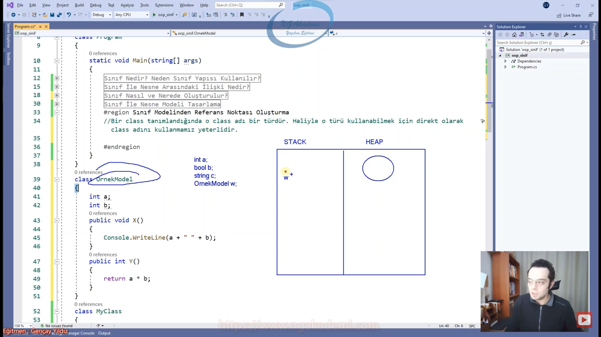

# Nesne Tabanlı Programlama #2 - Class Kavramı
- Nesne fıtrat olarak `class`tan üretilebilir bir yapıdır.

## Sınıf Nedir? Neden Sınıf Yapısı Kullanılır?
- OOP'de temel esas olan nesnedir.

- Benim bir object oluşturabilmem için öncelikle bunu modellemem gerekir.

- OOP'yi destekleyen herhangi bir programlama dilinde bir nesne oluşturabilmeniz için öncelikle o nesneyi modellemeniz lazım.

- Modellemek ilgili nesnenin önceden tanımlanmış arayüzü demektir.
    * Ben bir bina yapacam bu binayı ilk önce Autocad'de çiziyorum değil mi? Çizdiğim bu Autocad'deki modeli, gerçeği/somut hali ta kendisi oluyor. Dolayısıyla benim objem somut olan bu nesneyi oluşturabilmem için öncelikle bunu Autocad'de çizmem lazım gibi düşünün ya da kağıt üzerinde projesini çizmem lazım gibi düşünün. Haliyle onu çizmektir/onu modellemek/onu tasarlamak/onu oluşturmaktır.

- OOP'de bir object oluşturabilmek için öncelikle o objectin modellenmesi tanımlanması gerekmektedir.

- Bir objenin modelini/tanımını oluşturabilmek için `class` yapısı kullanılır.

- Programlama dillerindeki `class` dediğimiz yapılanma esasında bir nesnenin modelidir.

- `class` yapısı kendi içerisinde field dediğimiz ilgili nesnenin içerisinde hangi değerlerin tutulacağına dair o alanları tanımlamamızı sağlayan alanlar tutmamızı/tanımlamamızı sağlayabiliyor. Property yapılanmaları encapsulation yapılanmasını sağlayabiliyor. Indexer diyoruz işte dizilerde koleksiyonlarda ya da bunların dışında istediğiniz herhangi bir noktada Indexer operatörüyle işlem yapabilmemizi sağlayan belirli bir efektif syntax kazandırabiliyor. Metotlar tanımlayabiliyoruz. Metotlarla operasyonel olarak bir objenin içerisinde field'lardaki ya da dışarıdan gelen değerleri hangi işlemlere tabi tutabileceğimizi vs. bunları ayarlayabiliyoruz. 

- Sınıf bizim kodu yazdığımız kodu inşa ettiğimiz yerdir. Kod inşa edildi kod yazıldı artık bunu çalıştırmam lazım buradaki yazılan kod işlevselliğini göstersin dediğimde de Obje oluşturup bunu objede çalıştırıyoruz. Haliyle bizim için `class` dediğimiz yapılanma Objenin yani nesne tabanlı programlamanın temelidir.


## Sınıf İle Nesne Arasındaki İlişki Nedir?
- Sen bir `class` oluşturuyorsun bu `class`tan nesne üretilebiliyor.

- Sınıf bir nesne modelidir. Bu sınıf modelinden üretilen nesnelerde operasyonlar gerçekleştirebiliriz. Haliyle sınıfla nesne arasındaki ilişki bu davranış üzerinden kurulur.

- Sınıftan birden fazla nesne oluşturulabilir. İstediğin kadar nesne oluşturabilirsin. Yani tahsis edilen alanlarla belleği doldurana kadar oluşturabilirsin. Sınırın senin belleğin.

- `class`larda nesnelerdeki ortak alan tanımları yapılır.

- 80 milyonun cebindeki kimlik tek bir tane `class`tan türetildi. Aynı olan bu kimlik kartlarında senin kimliğinde senin adın benim kimliğimde benim adım yazmaktadır. Objeler aynı fıtrarlar aynı ama obje/nesne olarak farklı. İkisi de kimlik türünden farklı nesneler.

- `class` tekildir yani `class` bir tane tanımlarsın. Sadece bir modele karşı `class`ı bir kere tanımlarsın. Nesne ondan çoğul olarak türer. Yani bire çok vir ilişki vardır arada.
    * Ben bir insan diye `class` tanımlarım geriye kalan 8 milyar nesneyi bu insanlara bu `class`tan türetirim.


## Sınıf Nasıl ve Nerede Oluşturulur?
- C# syntax'inde ne var? C#'ta bişey oluşturacaksan öncelikle o şey ile ilgili bir keyword koyman lazım ortaya.
    * Örneğin `if` bloğu mu oluşturacaksın `if` yazarsın devamı gelir.
    * Örneğin `do while` bloğu mu oluşturacaksın `do while` yazarsın devamı gelir.
    * Örneğin `while` bloğu mu oluşturacaksın `while` yazarsın devamı gelir.
    * Örneğin `for` bloğu mu oluşturacaksın `for` yazarsın devamı gelir.
    * Örneğin `foreach` bloğu mu oluşturacaksın `foreach` yazarsın devamı gelir.

- C#'ın zaten genel semantiği bu şekilde.


- `class [isim]{}` Haliyle `class` mı oluşturacağım `class` yazıyorum diyorum ki ya kardeşim compiler bana bir tane `class` oluştur. Daha sonra bu `class`a isim vereceğim. Ardından da süslü parantezi açıp kapatıyoruz.

- Sen bir `class` oluşturdun yani nesne oluşturulabilir bir yapılanma oluşturdun.

- `class` oluşturduğum zaman RAM'de bundan nesne üretip yerleştirebiliyorum. Benim bu `class`ın türü neyse RAM'e yerleştirdiğim nesneninde türü o olur. İlgili nesneyi işaretleyebilmek içinde onun türünden bir referans gerekmektedir. Nesneyi RAM'e koymuş olduğum obje `class`ın adı neyse o türde.

- OOP'yi destekleyen tüm dillerde oluşturmuş olduğunuz `class` sizin için bir türdür. Bir referans türüdür. Nasıl ki `int` bir sayısal modele karşılık geliyor `bool` mantıksal değerlere karşılık geliyor `char` metinsel tek karakterli değerlere karşılık geliyor. Bunların hepsi tanımlanmış türler.
    * Diyelim ki ben geldim Ahmet diye bir `class` oluşturdum. Bu Ahmet türünden nesneyi karşılayacak. Ha işte Ahmet diye bir tür oluşturmuş oluyorsun. 

- Sen `class` oluşturduğunda bil ki yeni bir tür oluşturmuş oluyorsun. Bu şekilde de biz kendimize ait türlerimizi oluşturmuş oluyoruz.


- Sınıf 3 farklı yerde oluşturulur;
    * Namespace İçinde
    * Namespace Dışında
    * Class İçinde(Nested Type)

- Bir `class` tanımlamasında tanımlanan yerde(`namespace/dışı`,`class`) aynı isimde birden fazla `class` tanımlanamaz!

- Nasıl ki aynı scope içerisinde birden fazla değişken tanımlayamıyorsun aynı yerde nerede tanımlıyorsan artık aynı isimde birden fazla `class` tanımlayamazsın.

## Namespace İçerisinde Class Oluşturma
- `namespace` içerisinde birden fazla `class`, `struct`, `interface` gibi yapılanmaları barındıran esasında senin kütüphane mantığını oluşturmanı sağlayan yani genel anlamda kurmuş olduğun sistemde sınıflarını farklı `namespace`ler altında kategorize edip çağırılma esnasında hani o kategorizeler üstünden çağırmanı sağlayan bir yapılanma.

- Sınıf istiyorsan eğer `namespace` içerisinde oluşturulabilir. Zaten biz %99.9 bunu kullanacağız.

```C#
namespace oop_sinif
{
    class Program
    {
        static void Main(string[] args)
        {
            Console.WriteLine("Hello, World!");
        }
    }

    class MyClass
    {

    }
}
```

## Namespace Dışarısında Class Oluşturma
- Benzer mantıkla `namespace` dışında da `class` oluşturabiliyoruz.

- Aynı `namespace` altındaki `class`lar birbirlerine direkt ismi üzerinden erişebilirken farklı namespace altındaki `class`lar `namespace` ismi üzerinden birbirlerine erişebiliyorlar.

- Senle ben aynı evdeysek birbirimize çok rahat erişebiliyoruz. Ama sen karşı evdeysen ben bu evdeysem evim üstünden bana erişebiliyorsun.

- Eğer ki bir `class`ı `namespace`in üzerine koyarsan eğer `namespace`den bağımsız olur. Yani aynı evdeki ikimiz ikimize erişebiliyoruz. Farklı evlerde isimlerimizden ev isimleri üzerinden birbirimize erişebiliyoruz. Ama birimiz dışarıda. Dışarıdakine herkes erişebiliyor. 

- Yani bu `namespace`in altında tanımlanmayan `class`lara herhangi bir `namespace` ismi belirtmeksizin direkt erişebiliyoruz.
 
```C#
class MyClass2
{
    
}
namespace oop_sinif
{
    class Program
    {
        static void Main(string[] args)
        {
            Console.WriteLine("Hello, World!");
        }
    }
    class MyClass
    {

    }
}
```

## Class İçerisinde(Nested Type) Class Oluşturma
- Herhangi bir `class` içerisine `class` tanımlaması yapılabilir.

```C#
class MyClass
{
    class MyClass3
    {
        
    }
}
```

## Sınıf İle Nesne Modeli Tasarlama
- Sınıfla nasıl bir nesne modeli tasarlayabilirim Yani Autocad'de nasıl ben bu evi tasarlayabilirim konumuz.

- Sınıf ile nesne modeli tasarlayabilmek için yapmanız gereken ilk önce bir tane sınıf oluşturmak.

- Sınıf ile nesne modeli tasarlayabilmek için ihtiyacın;
    1. Bu nesnenin içerisinde değerler tutmam gerekebilir yani field dediğimiz değerler tutman gerekebilir.
    2. Bu nesnenin içerisinde operasyonel/eylemsel işlemler yapmam gerekebilir. Yani fonksiyonalite özelliği kazandırmam gerekebilir.

- 2 Tane özellik olması lazım. Biri alan koyacam bunun içerisine nesne üretildiği zaman o alanlara istediğim değerleri koyabileyim. İkincisi kah o alanlardaki değerler üzerinde işlemler yapabilecek fonksiyonlar oluşturmalıyım kah başka bir yerden dışarıdan gelen metotları vs. tanımlamalıyım.

- `class`ın içerisinde oluşturulan değişkenlere biz field deriz.

- Field bildiğin değişkenlerdir.


- `class`ın altında istediğin metodu tanımlayabilirsin.

- Yani temelde nesne varya işte o nesneyi kullanabileceğim sekilde bir sınıf burada tasarlıyorum tasarladığım sınıfı simüle ediyorum. Bunu böyle yaparsam bu böyle davranış sergiler. Şöyle olur böyle olur.


```C#
class OrnekModel
{
    int a;
    int b;
    public void X()
    {
        System.Console.WriteLine(a + " " + b);
    }
    public int Y()
    {
        return a * b;
    }
```
## Sınıf Modelinden Referans Noktası Oluşturma 
- Belleğimizde STACK ve HEAP denilen iki alan vardır.

- STACK'te neler tutuyorduk?;
    * Değişkenlerin kendileri
    * Değişkenlerin değerleri
    * Referans Türlü Değişkenlerin refaransları/kendileri

- HEAP'te neler tutuyorduk?
    * Nesneler

- Ben normalde STACK'e direkt erişebiliyorum. Developer olarak STACK'e direkt el uzatabiliyorum. Ama ne yazık ki HEAP'teki herhangi bir nesneyi elde edebilmek için developer olarak HEAP'e erişemiyorum. HEAP'e developer'ların erişimi direkt engellenmiş. Böyle bişeye müsaade edilmemiş. Dolayısıyla benim HEAP'teki nesneyi kullanabilmem için yapmam gereken işlem HEAP'e erişebilen bir aracı kullanmak. İşte bu aracı da STACK'teki referanslar oluyor.

- Referans STACK'te tutulan ve HEAP'teki herhangi bir nesneyi işaretleyebilme özelliğine sahip olan değişken türüdür. Biz buna değişken türü demiyoruz referans noktası diyoruz. Çünkü referans edebilme özelliğine sahip.


- Bir `class` tanımlandığında o `class` adı bir türdür. Haliyle o türü kullanabilmek için direkt olarak `class` adını kullanmamız yeterlidir.

- Yani bir nesne türüdür. Bir türe karşılık gelir.

- HEAP'teki herhangi bir nesneyi işaretleyebilmem için bunun işaretleyecek olan referansın türü nesnenin fıtratına/türüne uygun olmalıdır.
    * Birden fazla `class`ın olduğunu düşün biri erkek biri kadın. Nesne erkekse referansını türü erkek referansı olmalı. Kadınsa kadın referansı olmalı Yani nasıl ki normal değişkenlerde herhangi bir sayısal değeri tutarken sayısal türden bir değişken olması lazımken `bool` türdeki bir değişkeni `bool` dışında `char` ile tutamıyorsan işte bununla aynı mantık. 
    
- Türler eşleştirmeler birebir aynı olmalıdır.

- Referansın türünü belirlerken `class`ın ismini kullanmam yeterli olacaktır.



- Bir `class`ı değişken türüymüş gibi kullanabilmenin altında yatan şey esasında bu bir referans türlü bir değişken olmasıdır.

- Eğer ki bir referans noktasında herhangi bir nesne referans edilmiyorsa o referans noktası/referans `null` değere sahiptir...

- `null` değere sahip olabilmesi için nullable olması lazımdı. Referans türlü değişkenler özünde nullable olan değişkenlerdir.

- Referans eğer ki herhangi bir nesneyi işaretlemiyorsa bu default/varsayılan olarak `null`dır.


```C#
class Program
{
    static void Main(string[] args)
    {
        #region Sınıf Modelinden Referans Noktası Oluşturma
        //Bir `class` tanımlandığında o `class` adı bir türdür. Haliyle o türü kullanabilmek için direkt olarak `class` adını kullanmamız yeterlidir.
        OrnekModel w;
        
    }
}
class OrnekModel
{
    int a;
    int b;
    public void X()
    {
        System.Console.WriteLine(a + " " + b);
    }
    public int Y()
    {
        return a * b;
    }
}
```

```C#
class MyClass2
{

}
namespace oop_sinif
{
    class Program
    {
        static void Main(string[] args)
        {
            #region Sınıf Nedir? Neden Sınıf Yapısı Kullanılır?

            #endregion
            #region Sınıf İle Nesne Arasındaki İlişki Nedir?

            #endregion
            #region Sınıf Nasıl ve Nerede Oluşturulur?
            #region Namespace İçerisinde

            #endregion
            #region Namespace Dışarısında

            #endregion
            #region Class İçerisinde

            #endregion

            //Bir `class` tanımlasında tanımlanan yerde(`namespace`/dışı, `class`) aynı isimde birden fazla `class` tanımlanamaz!
            #endregion
            #region Sınıf İle Nesne Modeli Tasarlama
                
            #endregion
            #region Sınıf Modelinden Referans Noktası Oluşturma
            //Bir `class` tanımlandığında o `class` adı bir türdür. Haliyle o türü kullanabilmek için direkt olarak `class` adını kullanmamız yeterlidir.
            OrnekModel w;
            #endregion

        }
    }
    class OrnekModel
    {
        int a;
        int b;

        public void X()
        {
            System.Console.WriteLine(a + " " + b);
        }
        public int Y()
        {
            return a * b;
        }
    }
    class MyClass
    {
        class MyClass3
        {

        }
    }
}
```